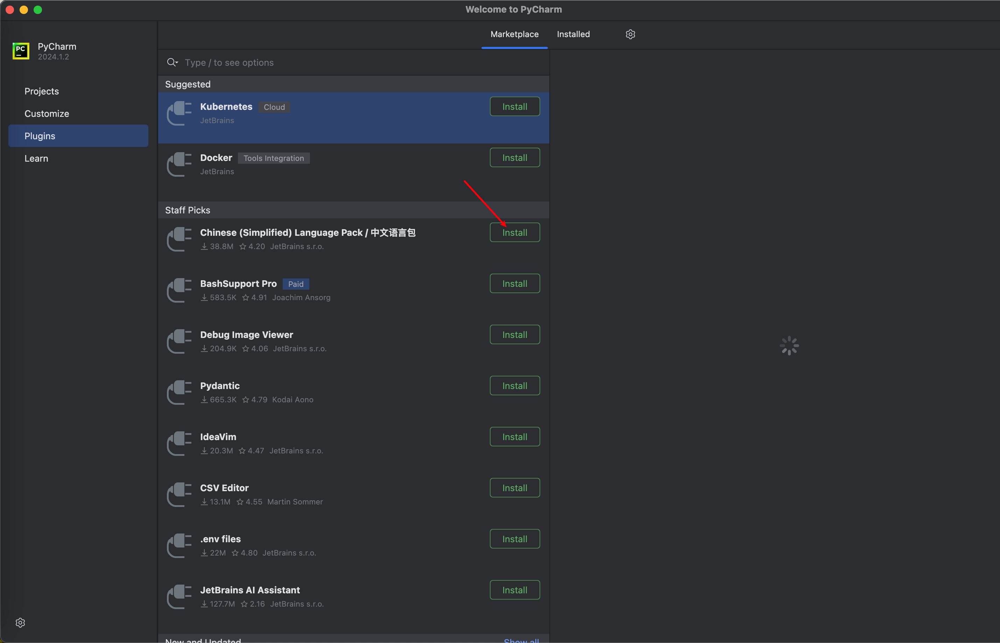
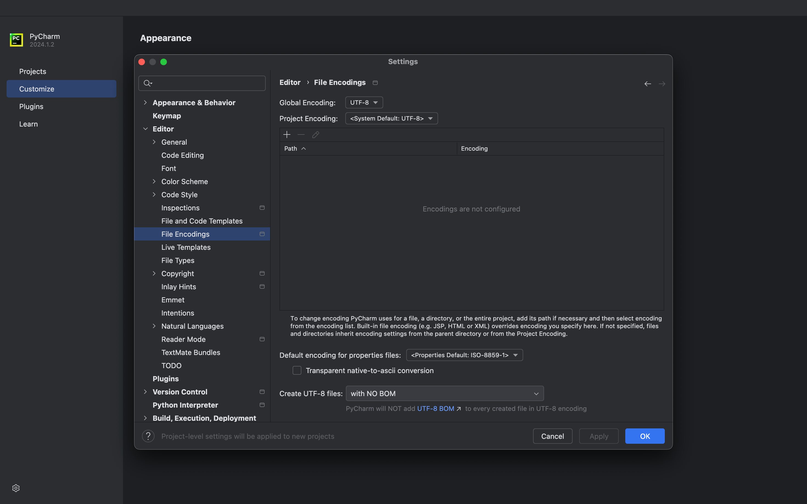
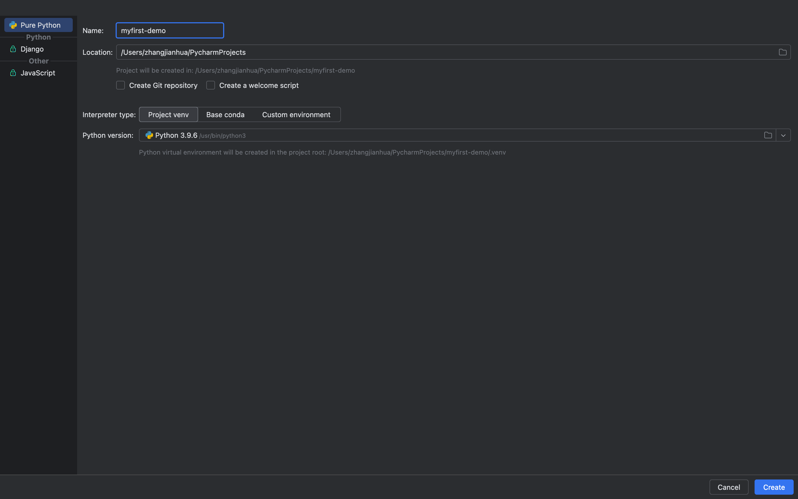
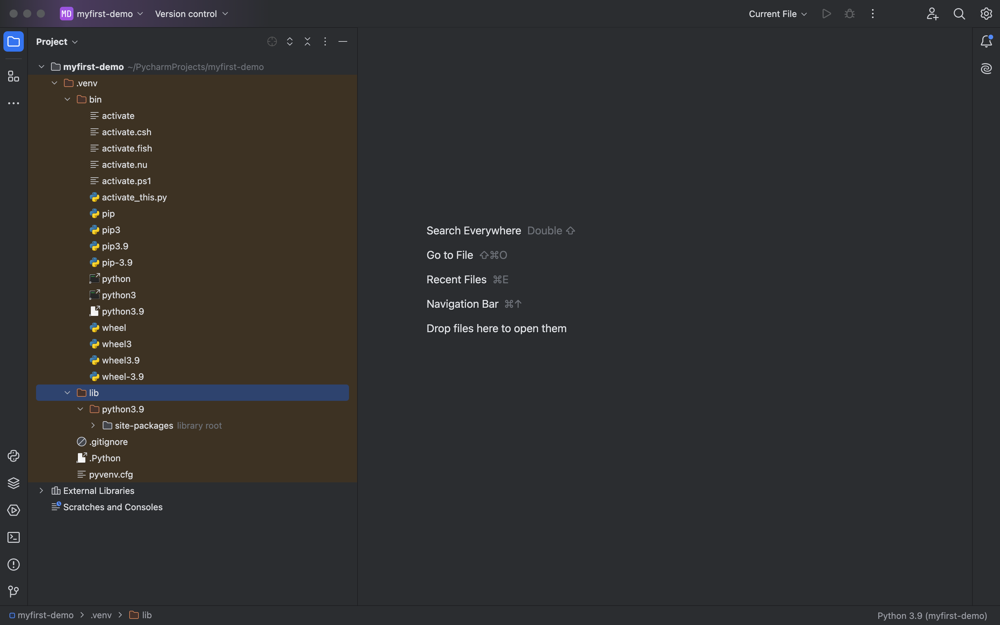
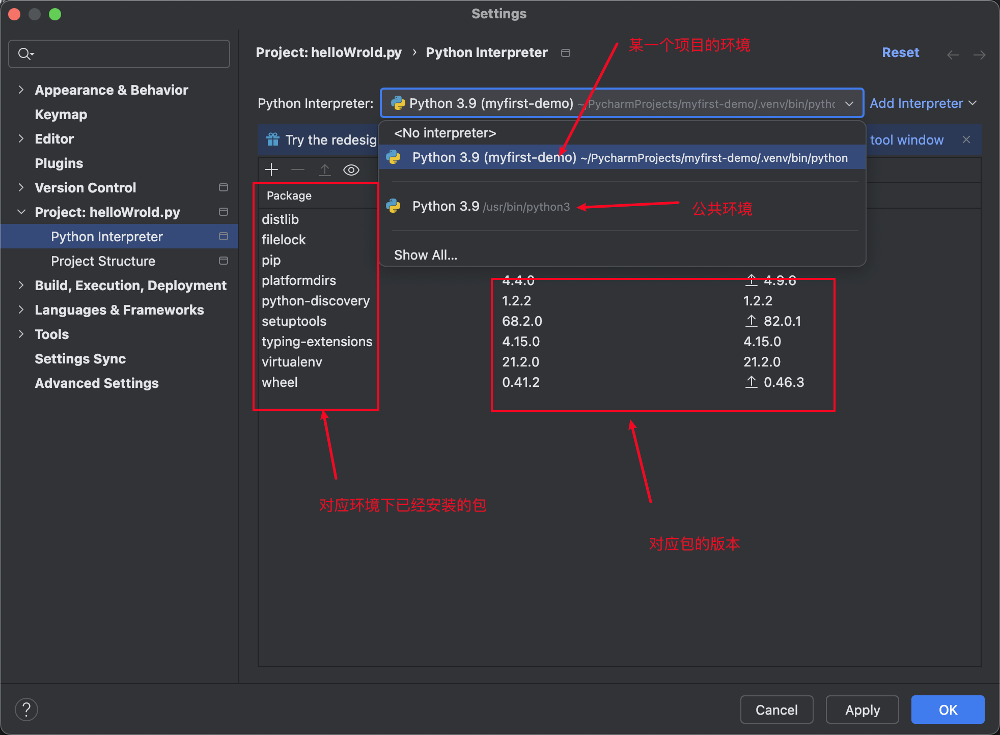
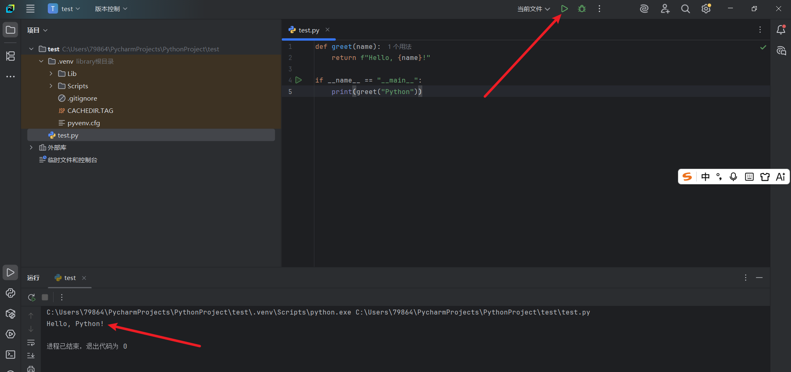
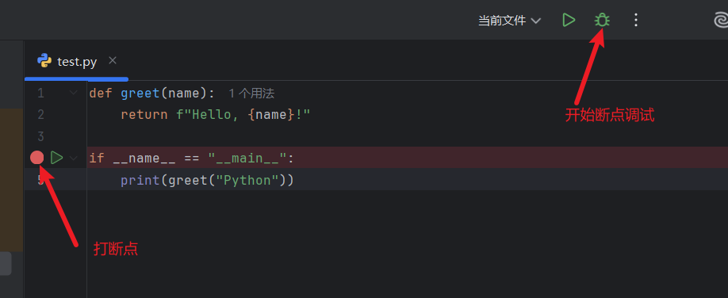
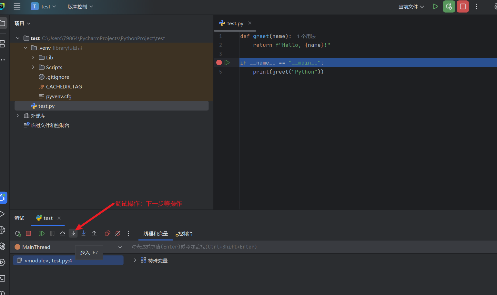
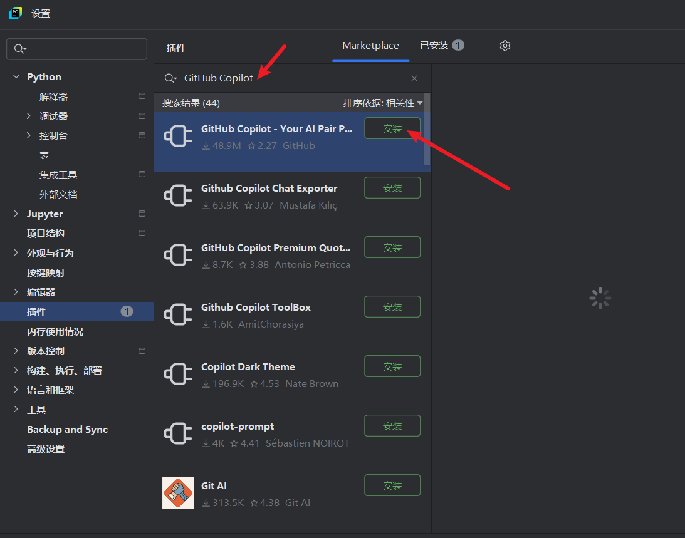

---
group:
  title: 【01】初识python
  order: 1
order: 2
title: PyCharm开发环境配置
nav:
  title: Python基础
  order: 1
---

## 1. 介绍

### 1.1 什么是 PyCharm

PyCharm 是由 JetBrains 公司开发的、专门面向 Python 的集成开发环境(Integrated Development Environment,IDE)。与通用的文本编辑器(如记事本、VS Code)不同,IDE 把编辑、运行、调试、项目管理、版本控制等功能集成在一个统一界面里,开箱即用,无需繁琐配置插件。PyCharm 因其对 Python 深度优化的智能提示、强大的调试器和友好的项目管理,成为 Python 开发者最常用的专业 IDE 之一。

**IDE 与编辑器的区别**:

- **编辑器**(如记事本、Sublime Text):本质是写代码的工具,装上插件后也能获得部分 IDE 功能,但需要自行配置。
- **IDE**(如 PyCharm):开箱即用,内置了写代码所需的大部分能力——语法高亮、智能补全、错误提示、跳转定义、调试、运行、Git 集成等,装好就能直接开发。

对于 Python 初学者,IDE 的好处尤为明显:它能帮你发现拼写错误、自动补全长函数名、一键运行和调试,大幅降低入门门槛。PyCharm 还能自动识别虚拟环境(venv/conda),让你不用手动配置解释器路径,这一点对新学完 Python 安装、刚接触虚拟环境的读者非常友好。

**PyCharm 的核心能力**:

1. **智能代码补全**:输入时自动提示变量名、函数名、模块成员,支持基于类型推断的精准补全。
2. **实时错误检查**:代码里的语法错误、未定义变量、类型不匹配等会在编辑时用波浪线标出,不必等运行才发现。
3. **一键运行与调试**:配置好解释器后,点运行按钮即可执行脚本;调试器支持断点、单步、变量查看。
4. **虚拟环境与解释器管理**:原生支持 venv、conda、pipenv、poetry 等环境,自动识别并切换。
5. **项目管理**:以"项目"为单位组织代码,一个项目对应一个根目录与一套解释器配置。
6. **Git 与版本控制集成**:内置 Git 客户口,可视化提交、分支、差异对比。
7. **重构工具**:重命名变量/函数时自动更新所有引用,安全改代码。
8. **内置终端与包管理**:在 IDE 内直接开终端、装包,不必切到外部命令行。

### 1.2 PyCharm 的版本

PyCharm 提供两个主要版本,初学者要分清:

| 版本 | 价格 | 功能 | 适用人群 |
|------|------|------|----------|
| **Community(社区版)** | 免费、开源 | Python 核心开发、调试、Git、虚拟环境 | 初学者、纯 Python 开发 |
| **Professional(专业版)** | 付费(有 30 天试用,学生可免费申请) | 社区版全部 + Web 框架(Django/Flask)、数据库工具、远程开发、科学工具 | Web 开发、数据工程、企业开发 |

**初学者建议直接用 Community 社区版**:它免费、功能足够覆盖日常 Python 学习与纯 Python 项目开发,包含智能补全、调试、虚拟环境管理、Git 等核心能力。专业版多出的 Web 框架支持、数据库工具等,等你确定要学 Django/Flask 或做数据工程时再考虑。下文除非特别说明,以社区版为准,涉及两者差异处会注明。

### 1.3 为什么用 PyCharm

相比 VS Code、Jupyter 等其他选择,PyCharm 的优势在于"开箱即用的深度":

- **零配置开箱即用**:VS Code 装完 Python 扩展还要配解释器、调试器、各种设置;PyCharm 装完新建项目就能写、能跑、能调试,对新手更省心。
- **Python 专属优化**:智能补全、类型推断、重构都针对 Python 深度优化,体验比通用编辑器加插件更顺滑。
- **调试强大**:断点、条件断点、变量监视、表达式求值一应俱全,排查问题效率高。
- **项目管理规范**:以项目为单位,自动管理 `.idea` 配置、解释器、运行配置,多项目互不干扰。

代价是 PyCharm 较重(启动慢、占内存),对超大型项目或低配机器可能吃力;但对学习和中小项目,这些代价远小于它省下的配置成本。

---

## 2. 核心内容

本章详尽讲解 PyCharm 的下载安装、项目创建、解释器与虚拟环境配置、运行调试、设置定制等,让读者照着把开发环境搭好并跑通第一个程序。

### 2.1 下载与安装

**下载**:

1. 访问 PyCharm 官网:https://www.jetbrains.com/pycharm/download/
2. 页面分 "Windows / macOS / Linux" 三个平台,选择你的平台。
3. 每个平台下又有 "Professional"(付费)和 "Community"(免费)两栏。初学者点 **Community** 下的 Download。
4. 下载完成后得到安装包:Windows 是 `.exe`,macOS 是 `.dmg`,Linux 是 `.tar.gz`。

**Windows 安装**:

1. 双击下载的 `.exe` 运行安装向导。
2. 选择安装目录(默认即可,或改到非系统盘)。
3. 安装选项勾选页:
   - **Create Desktop Shortcut**:创建桌面快捷方式,勾选。
   - **Add launchers dir to the PATH**:将启动器加入 PATH,建议勾选,后续可在命令行用 `pycharm` 启动。
   - **Add "Open Folder as Project"**:右键菜单加"用 PyCharm 打开文件夹",建议勾选。
   - **.py 关联**:勾选后双击 `.py` 文件用 PyCharm 打开。
4. 点 Install 等待完成,完成后可选立即启动。

**macOS 安装**:

1. 双击下载的 `.dmg` 挂载磁盘镜像。
2. 把 PyCharm 图标拖到 Applications(应用程序)文件夹。
3. 在启动台或 Applications 里打开 PyCharm。首次打开可能提示"从互联网下载的 App",点打开即可。

**Linux 安装**:

1. 解压下载的 `.tar.gz` 到某目录(如 `~/opt`):`tar -xzf pycharm-*.tar.gz -C ~/opt`。
2. 进入解压目录的 bin 子目录:运行 `./pycharm.sh` 启动。
3. 可创建桌面快捷方式或加到 PATH,方便以后启动。也可用发行版的包管理器装(snap/flatpak),如 `sudo snap install pycharm-community --classic`。

**首次启动设置**:首次打开 PyCharm 会问是否导入之前的设置(新装选"Do not import settings")、是否接受隐私协议,然后进入一个欢迎界面,在这里新建或打开项目。还会让你选择主题(Light/Dark)和一些 UI 设置,按喜好选即可,后续都能在设置里改。

首次打开时，建议按以下步骤配置：

- **中文界面**：进入 `File → Settings → Plugins`，搜索 “Chinese (Simplified) Language Pack” 并安装，界面就会变成简体中文。



- **文件编码**：建议统一使用 UTF-8，在 `Editor → File Encodings` 中将 `Global Encoding`、`Project Encoding` 和 `Default encoding for properties files` 都设置为 `UTF-8`。



### 2.2 新建项目与解释器配置

PyCharm 以"项目"为单位工作。新建第一个项目的流程（对照下图）：

1. 在欢迎界面点 **New Project**（或菜单 File → New Project）。
2. **Location（位置）**：项目存放路径，如 `D:\projects\hello_py`（Windows）或 `~/projects/hello_py`（macOS/Linux）。路径避免中文和空格。
3. **项目类型**：选择 **"纯 Python"**（Pure Python），其他选项（Django、Web 等）为专业版框架模板。
4. **解释器配置**（对应上图中的下拉选项）：
   - **解释器类型** 下拉框，PyCharm 提供三种选项：
     - **项目 venv**（推荐新手）：PyCharm 在项目根目录自动创建独立的虚拟环境，每个项目环境互不污染。下方 **Python 版本** 中需指定基础 Python（Base interpreter，即前一章装好的系统 Python）。
     - **基础 conda**：使用 Conda 环境管理器创建环境（需已安装 Anaconda/Miniconda）。
     - **自定义环境**：直接使用系统已装好的 Python 或已有虚拟环境，不新建环境。
   - **Python 版本**：当选择"项目 venv"或"基础 conda"时，在此下拉框中指定系统已安装的 Python 解释器路径（如上图中的 `Python 3.13（D:\python\python.exe）`）。
5. 可选勾选 **创建 Git 仓库**（推荐）和 **创建欢迎脚本**。
6. 点击 **Create**，PyCharm 创建项目并打开主界面，底部会提示虚拟环境创建位置（如下图所示）。


**推荐新手选"项目 venv"**：这样每个项目有独立虚拟环境，互不污染，与前一章 venv 的理念一致。PyCharm 会自动生成项目结构，并在右下角显示当前用的解释器。

**解释器配置界面说明**：如果之后要改解释器，进 File → Settings（Windows/Linux）或 PyCharm → Settings（macOS），找 **Project: 项目名 → Python Interpreter**。这里能看到当前项目用的解释器、已装包列表，点齿轮/下拉可添加或切换解释器（系统解释器、现有 venv、新建 venv 都行）。



**验证解释器配置成功**：在项目里新建一个 `.py` 文件，写 `print("hello")`，右键 Run。如果配置正确，底部会弹出运行窗口显示 `hello`；如果报"no Python interpreter"，说明解释器没配好，回 Settings 重新指定。

### 2.3 虚拟环境管理

PyCharm 原生支持虚拟环境,把第前一章命令行里的 venv 操作可视化:

**新建虚拟环境**:新建项目时选 Virtualenv(见 2.2),或在 Settings → Project → Python Interpreter 里点齿轮 → Add,选 Virtualenv,指定基础 Python 和位置,PyCharm 自动创建并应用。



**切换/查看已有虚拟环境**:Settings → Project → Python Interpreter 的下拉列表里列出所有 PyCharm 知道的解释器(含各项目的 venv、系统 Python、conda 环境),选一个 Apply 即切到该项目。

**在 PyCharm 里装包**:Settings → Project → Python Interpreter 界面有个包列表和 `+` 按钮,点 `+` 搜索包名(如 `requests`)→ Install Package,PyCharm 调用 pip 装到当前虚拟环境。也能看到已装包及版本,点 `-` 卸载。



**用内置终端装包**:PyCharm 底部有个 Terminal 标签,打开就是已激活当前虚拟环境的命令行(提示符前有 `(venv)`),可直接 `pip install requests`,与外部命令行操作一致,但因已自动激活,不用手动 `source activate`。这是最常用的装包方式。

**解释器与虚拟环境的关系**:一个虚拟环境本质上就是一个 Python 解释器(带独立 site-packages 的副本)。PyCharm 的"Python Interpreter"配置就是在选"用哪个虚拟环境的解释器"。理解这点,就不会混淆"解释器配置"和"虚拟环境"——它们是同一回事的不同视角。

### 2.4 创建与运行 Python 文件

**创建文件**:在左侧项目树右键项目文件夹 → New → Python File,输入文件名(如 `main`,无需 `.py` 后缀,PyCharm 自动加)。生成的 `main.py` 会有一个默认 `__main__` 模板(可自定义,见 2.8)。

写一段代码:

```python
def greet(name):
    return f"Hello, {name}!"

if __name__ == "__main__":
    print(greet("Python"))
```

**运行文件的三种方式**:

1. **右键 Run**:在代码编辑区右键 → Run 'main'(或文件树右键 → Run)。首次运行 PyCharm 会创建一个运行配置(Run Configuration),之后可直接用工具栏的绿色三角按钮。
2. **工具栏运行按钮**:顶部工具栏绿色三角运行当前文件,旁边绿色虫子图标是调试(Debug)。
3. **快捷键**:`Shift + F10`(Windows/Linux)或 `Ctrl + R`(macOS)运行当前配置。



运行后,底部 **Run 工具窗口**显示输出。如果代码有错误,这里也会显示异常堆栈。

**运行配置(Run Configuration)**:每个运行入口有一套配置(用哪个脚本、工作目录、环境变量、参数等)。进 Run → Edit Configurations 可查看/修改。例如要给脚本传命令行参数,在该配置的 **Parameters** 里填,脚本里用 `sys.argv` 接收(见 2.7)。

### 2.5 调试(Debug)

调试是 PyCharm 最有价值的功能之一。核心是**断点**:在代码行号左侧的灰色 gutter 上点一下,出现红点即设了断点。运行到断点处程序会暂停,你可以查看当时的变量状态、逐步执行。

**调试基本流程**:

1. 在想暂停的行左侧点一下设断点。例如在 `return f"Hello, {name}!"` 这行设断点。
2. 点工具栏**调试按钮**(绿色虫子,或 `Shift + F9`/macOS `Ctrl+D`)。
3. 程序运行到断点暂停,底部出现 Debug 工具窗口:
   - **Frames**:调用栈,显示当前停在哪一层函数。
   - **Variables**:当前作用域所有变量的值,可展开查看。
   - **Console**:可输入表达式实时求值(如输入 `name` 回车看值)。
4. 用工具栏按钮控制执行:
   - **Step Over(F8)**:执行当前行,不进入函数内部。
   - **Step Into(F7)**:进入函数内部逐步执行。
   - **Step Out(Shift+F8)**:跳出当前函数,回到调用处。
   - **Resume(F9)**:继续运行到下一个断点。
   - **Stop(Ctrl+F2)**:停止调试。



**条件断点**:右键断点红点,在弹窗里勾选 Condition 并填条件表达式(如 `name == "Python"`)。程序只有满足条件时才在该断点暂停,适合循环里只想看特定次的情形。



**相比 print 调试的优势**:`print` 调试要改代码、重新运行,且只能看预先想看的变量;断点调试能停下来交互查看任意表达式、改变量值、看调用栈,排查复杂问题高效得多。养成用断点调试的习惯,是进阶的关键一步。

### 2.6 代码编辑与智能提示

PyCharm 的编辑体验来自一系列智能特性:

**智能补全**:输入时弹出的补全列表,按 Tab 或回车选择。`Ctrl + Space`(基础补全)、`Ctrl + Shift + Space`(智能补全,基于类型推断更精准)。例如输入 `import os` 后敲 `os.` 会列出 `os` 的所有成员。

**实时错误检查**:代码里的语法错误、未定义名、未使用 import 等会用红/黄波浪线标出,鼠标悬停看提示。`name = "x" + 1` 会即时标红提示类型不兼容。

**快速修复(Quick Fix)**:有错误时,把光标放错误处按 `Alt + Enter`(macOS `Option + Enter`),PyCharm 给出修复建议(如 import 缺失的模块、加类型注解、改拼写)。这是最常用的快捷键之一。

**跳转定义**:按住 `Ctrl`(macOS `Cmd`)点函数/变量名,或光标在其上按 `Ctrl + B`/`Cmd + B`,跳到定义处。反向看哪里用了某函数用 `Alt + F7`(查找用法)。

**重构(重命名)**:光标在变量/函数名上按 `Shift + F6`,输入新名,PyCharm 自动更新所有引用。比手动全局替换安全得多,不会改到同名但无关的地方。

也可以使用ai插件：



### 2.7 命令行参数与环境变量

在 PyCharm 里给脚本传命令行参数或设置环境变量,通过运行配置:

**传命令行参数**:Run → Edit Configurations → 选中你的运行配置 → **Parameters** 字段填参数(如 `alice 25`)。脚本里用 `sys.argv` 接收:

```python
import sys
print("脚本:", sys.argv[0])
print("参数:", sys.argv[1:])    # 对应填的 alice 25
```

运行后 Run 窗口输出参数。改参数就改配置的 Parameters,不用改代码。

**设置环境变量**:同一界面的 **Environment variables** 字段,点右侧图标添加键值对(如 `API_KEY=xxx`)。脚本里 `os.environ["API_KEY"]` 读取。这样把密钥等配置从代码里分离,且不同运行配置可用不同环境变量。

**工作目录(Working directory)**:运行配置里的 Working directory 决定脚本运行时的"当前目录",影响相对路径。默认是项目根目录,如脚本读 `data.txt`,会在项目根找。改工作目录能控制相对路径基准。

### 2.8 设置与个性化

PyCharm 高度可定制,常用设置在 File → Settings(Windows/Linux)或 PyCharm → Settings(macOS,快捷键 `Cmd + ,`)。

**外观主题**:Settings → Appearance & Behavior → Appearance,Theme 选 Light/Darcula/High contrast,改整体明暗。

**字体大小**:Settings → Editor → Font,改 Size(编辑器字体);Settings → Editor → Color Scheme → Console Font 改控制台字体。

**代码模板(Live Templates)**:Settings → Editor → Live Templates,定义缩写快速插入代码。例如内置 `main` 缩写按 Tab 展开成:

```python
def main():
    pass

if __name__ == '__main__':
    main()
```

**文件模板**:Settings → Editor → File and Code Templates → Python Script,定义新建 `.py` 文件时的默认内容。例如加一行 `# -*- coding: utf-8 -*-` 或自定义注释头,之后每个新文件自动带上。

**行号显示**:Settings → Editor → General → Appearance,勾选 Show line numbers(默认通常已开)。

**自动导入**:Settings → Editor → General → Auto Import,勾选自动补 import, refer 未使用 import 时按 `Alt+Enter` 可自动加/删 import。

### 2.9 快捷键速查

熟练快捷键是高效编码的关键。常用(Windows/Linux,macOS 把 Ctrl 换 Cmd):

| 操作 | 快捷键(Windows/Linux) | 快捷键(macOS) |
|------|------------------------|---------------|
| 运行 | Shift + F10 | Ctrl + R |
| 调试 | Shift + F9 | Ctrl + D |
| 基本补全 | Ctrl + Space | Ctrl + Space |
| 智能补全 | Ctrl + Shift + Space | Ctrl + Shift + Space |
| 快速修复 | Alt + Enter | Option + Enter |
| 跳转定义 | Ctrl + B / Ctrl+点击 | Cmd + B / Cmd+点击 |
| 查找用法 | Alt + F7 | Option + F7 |
| 重命名 | Shift + F6 | Shift + F6 |
| 全局查找 | Ctrl + Shift + F | Cmd + Shift + F |
| 格式化代码 | Ctrl + Alt + L | Cmd + Alt + L |
| 注释切换 | Ctrl + / | Cmd + / |
| 复制当前行 | Ctrl + D | Cmd + D |
| 删除当前行 | Ctrl + Y | Cmd + Backspace |
| 在文件中查找 | Ctrl + F | Cmd + F |
| 打开终端 | Alt + F12 | Option + F12 |

不必一次背全,常用几个(运行、补全、快速修复、跳转定义)先熟,其余随用随记。完整列表在 Help → Keymap Reference 可查(PDF)。

### 2.10 版本控制集成

PyCharm 内置 Git,可视化操作版本控制:

**初始化/克隆**:新建项目时可选创 Git 仓库;或 VCS → Enable Version Control Integration → Git。克隆已有仓库用 File → New → Project from Version Control,填 Git URL。

**提交(Commit)**:左侧 Commit 标签(或 `Ctrl+K`/`Cmd+K`)打开提交面板,勾选要提交的文件,写提交信息,点 Commit。文件改动会以颜色区分(蓝=修改、绿=新增、红=删除)。

**差异对比**:双击改动文件或选 Show Diff,左右对比修改前后内容,清晰看到改了哪些行。

**分支与历史**:右下角状态栏点分支名可切换/新建分支;Git 标签里看提交历史(Git → Show History),可视化时间线。

**忽略文件**:`.idea` 目录(PyCharm 的项目配置)、`__pycache__`、`.venv` 等不应提交,加进 `.gitignore`。PyCharm 的 Ignore Files 功能也能可视化添加。

### 2.11 插件与扩展

Settings → Plugins 可装插件扩展 PyCharm 能力:

- **中文语言包**:官方中文插件,装后界面中文化,适合不习惯英文界面的新手。
- **.ignore**:方便编辑 `.gitignore`,提供各种语言模板。
- **Markdown**:更好的 Markdown 预览(社区版已内置基本支持)。
- **Key Promoter X**:操作时若用了鼠标而该操作有快捷键,会弹窗提示,帮你学快捷键。
- **Rainbow Brackets**:括号彩色配对,嵌套多时便于看清层级。

插件按需装,装太多会拖慢 IDE。新手装个中文包和 Key Promoter X 就够起步。

### 2.12 常见问题排查

**问题一:no Python interpreter configured**

新建文件运行报此错。解决:Settings → Project → Python Interpreter,选一个已装好的 Python 解释器或新建 venv,Apply。

**问题二:运行没反应/按钮灰色**

可能没选对运行配置或当前文件非可运行入口。确认顶部运行配置下拉选的是目标文件;或直接右键文件 → Run。

**问题三:智能补全失效**

确认文件被识别为 Python(右下角应显示 Python 解释器名);确认解释器配置正确(能 import 标准库才说明配好);偶尔需 File → Invalidate Caches / Restart 清缓存重建索引。

**问题四:终端没自动激活虚拟环境**

Settings → Tools → Terminal,确认 Shell path 正确(Windows 用 PowerShell/cmd,macOS 用 zsh);勾选 "Activate virtualenv"。或手动在终端激活。

**问题五:中文乱码**

文件编码问题。Settings → Editor → File Encodings,把 Global/Project Encoding 都设为 UTF-8,勾选 Transparent native-to-ascii conversion。运行输出乱码则在运行配置里加环境变量 `PYTHONIOENCODING=utf-8`。

**问题六:太卡/占内存**

关闭不用的插件;增大内存:Help → Edit Custom VM Options,改 `-Xmx`(如 `-Xmx2048m`),重启;项目大时可排除(exclude)不参与索引的大目录(右键目录 → Mark Directory as → Excluded)。

### 2.13 项目结构与文件组织

PyCharm 项目本质上是一个文件夹,PyCharm 只是在其中加了 `.idea` 配置目录。一个规范的 Python 项目结构大致如下:

```
myproject/
├── .idea/              # PyCharm 配置,不入 git
├── .venv/              # 虚拟环境,不入 git
├── .gitignore          # 忽略规则
├── main.py             # 入口脚本
├── requirements.txt    # 依赖清单
├── src/                # 源码包
│   ├── __init__.py
│   ├── utils.py
│   └── models.py
├── tests/              # 测试
│   └── test_utils.py
└── data/               # 数据文件
    └── sample.csv
```

在 PyCharm 里这样的结构主要通过在项目根目录右键 New → Directory / Python File / Python Package(包会自动建 `__init__.py`)搭建。把源码放 `src`、测试放 `tests`、数据放 `data`,职责清晰,后续做包发布或写测试都方便。

**标记目录用途**:右键目录 → Mark Directory as,可标记:

- **Sources Root**:该目录作为源码根,影响 import 路径(蓝色文件夹)。
- **Tests Root**:测试根,PyCharm 用测试运行配置(绿色)。
- **Resources Root**:资源根,放配置/数据。
- **Excluded**:排除,不参与索引(适合大目录、`.venv`,提速)。

合理标记能让 PyCharm 更准确识别项目结构与 import。

### 2.14 包管理与依赖同步

在 PyCharm 里维护依赖,推荐形成"装包 → 固化清单 → 复现"的闭环:

1. **装包**:内置终端 `pip install requests`,或在 Settings 包管理界面点 `+` 装。
2. **固化**:终端 `pip freeze > requirements.txt`,或 PyCharm 顶部菜单 File → Sync Python Requirements(若有)生成清单。
3. **复现**:别人拿到项目后,配置好解释器与 venv,终端 `pip install -r requirements.txt`。

PyCharm 还能在 Settings → Project → Python Interpreter 界面清晰看到当前环境装了哪些包及版本,与 `requirements.txt` 对比,方便发现遗漏或版本不一致。若装了某包但 PyCharm 仍报"unresolved reference",通常是装到了别的环境——检查右下角解释器是否正确,或 File → Invalidate Caches 重建索引。

### 2.15 运行配置详解

运行配置(Run Configuration)控制"怎么跑你的代码"。Run → Edit Configurations 打开,常见字段:

- **Script path / Module name**:指定要跑的脚本路径,或用 `-m` 跑模块(如 `pytest`)。
- **Parameters**:命令行参数,传给 `sys.argv`(见 2.7)。
- **Working directory**:工作目录,影响相对路径与 `sys.path[0]`。
- **Environment variables**:环境变量,通过 `os.environ` 读取。
- **Python interpreter**:该配置用哪个解释器(可与项目默认不同)。
- **Execute in Python console**:勾选后运行结果进交互控制台,可继续操作变量,适合探索。

**多运行配置**:一个项目可有多套运行配置(如跑 `main`、跑测试、跑不同参数),在 Edit Configurations 里用 `+` 添加,顶部下拉切换。例如同一脚本配两套:一套 Parameters 填 `--debug`,一套填 `--release`,一键切换测试模式。

**配置模板**:Edit Configurations → Edit configuration templates 可设默认值,如所有新 Python 配置默认勾选某环境变量,避免每次新建都重设。

### 2.16 代码检查与格式化

PyCharm 内置丰富的代码检查(Inspections)与格式化:

**检查等级**:右上角有一人头图标(Language Level)Suspicious,可调检查严格度。Editor → Inspections 里能逐项开关数百条检查规则(如未使用变量、命名规范、类型提示缺失)。

**自动格式化(Pylint/autopep8 等)**:`Ctrl + Alt + L`(macOS `Cmd + Alt + L`)按 PEP 8 格式化当前文件;`Ctrl + Alt + O` 优化 import(删未用、排序)。可配 Tools → Python Integrated Tools → Docstrings 用 Google/NumPy 风格。

**类型提示支持**:写类型注解(`def f(x: int) -> str:`)后,PyCharm 能据此做更精准的补全与检查,甚至在调用处提示参数类型不对。这与类型系统笔记呼应,在 PyCharm 里类型注解能获得实时反馈。

### 2.17 数据库与科学工具(专业版简述)

专业版相对社区版多出的常用能力,了解即可:

- **Database 工具**:内置 Database 面板,连接 MySQL/PostgreSQL/SQLite 等,可视化执行 SQL、浏览表结构,适合后端开发。
- **Django/Flask 支持**:新建项目可选 Django/Flask 模板,带路由跳转、模板补全。
- **Jupyter Notebook 集成**:在 IDE 内编辑运行 `.ipynb`,科学计算体验优于浏览器。
- **远程开发**:连接远程服务器/容器里的解释器,本地编辑远程执行。

社区版用不到这些时不必升级;当确定做 Web 后端或数据工程时,再评估专业版。学生可凭教育邮箱免费申请专业版授权。

### 2.18 完整实战:从零配置到调试一个项目

把各节串起来,演示一个完整流程:用 PyCharm 搭建一个小项目并调试。

1. **新建项目**:File → New Project,Location 填 `~/projects/calc`,解释器选 New environment using Virtualenv(Python 3.12),Create。PyCharm 建好项目并打开,右下角显示 Python 3.12 (calc)。

2. **建结构**:项目根右键 New → Python Package `core`,再 New → Python File `main`。结构:

```
calc/
├── .venv/
└── core/
    └── __init__.py
└── main.py
```

3. **写代码**:在 `core` 包右键 New Python File `calc`,写工具函数:

```python
def add(a, b):
    return a + b

def divide(a, b):
    return a / b
```

在 `main.py` 调用:

```python
from core.calc import add, divide

def main():
    x, y = 10, 0
    total = add(x, y)
    print(f"{x} + {y} = {total}")
    result = divide(x, y)     # 除零会出错
    print(f"{x} / {y} = {result}")

if __name__ == "__main__":
    main()
```

4. **运行**:右键 `main.py` → Run。Run 窗口输出 `10 + 0 = 10`,然后报 `ZeroDivisionError`,程序中断。

5. **调试**:在 `divide` 的 `return` 行设断点,右键 Run → Debug。程序运行到断点暂停,Variables 面板看到 `a=10, b=0`。在 Console 输入 `b` 回车确认是 0。发现是 `y=0` 导致除零。改 `main` 里 `y = 2`,Resume,输出 `10 / 2 = 5.0`。

6. **装依赖并固化**: suppose 要用 `requests`,开终端 `pip install requests`,再 `pip freeze > requirements.txt`。下次或别人复现:`pip install -r requirements.txt`。

7. **提交 git**:VCS → Enable Git,`Ctrl+K` 打开提交面板,勾选 `core/`、`main.py`、`requirements.txt`、`.gitignore`(内含 `.idea/`、`.venv/`),写提交信息 Commit。

这套流程覆盖了从建项目、写代码、运行、调试、装依赖到提交的完整闭环,是日常开发的标准节奏。

### 2.19 单元测试运行

PyCharm 原生支持 `unittest` 与 `pytest` 测试框架,能可视化运行测试并标红失败用例。

**编写测试**:在 `tests` 目录(Mark Directory as → Tests Root)新建 `test_calc.py`:

```python
import unittest
from core.calc import add, divide

class TestCalc(unittest.TestCase):
    def test_add(self):
        self.assertEqual(add(2, 3), 5)

    def test_divide(self):
        self.assertEqual(divide(10, 2), 5.0)

    def test_divide_by_zero(self):
        with self.assertRaises(ZeroDivisionError):
            divide(10, 0)
```

**运行测试**:在测试文件或类/方法旁的行首 gutter 会出现绿色播放按钮,点击即运行该测试;或右键 `tests` 目录 → Run Unittests 跑全部。Run 窗口以列表展示每个用例,绿勾通过、红叉失败,点失败项可跳到出错的断言。

**用 pytest**:Settings → Tools → Python Integrated Tools → Default test runner 选 pytest(需先 `pip install pytest`)。pytest 写法更简洁(普通函数 + `assert`),PyCharm 同样能用 gutter 按钮运行。

测试还是代码质量与重构的保障:有测试用例后,改代码运行测试即可知道有没有破坏既有功能,这是工程化的基础。

### 2.20 导航与搜索

大型项目里快速定位代码靠导航,务必熟:

- **Search Everywhere**:连按两次 `Shift`(macOS 也两次 Shift),弹全局搜索窗,能找类、文件、符号、设置、Action(任何菜单操作),是最常用的入口。
- **Class**:查找类定义(`Ctrl+N` / `Cmd+O`)。
- **文件**:按文件名找文件(`Ctrl+Shift+N` / `Cmd+Shift+O`)。
- **符号**:按函数/变量名找(`Ctrl+Shift+Alt+N` / `Cmd+Shift+Option+N`),跨文件定位最精细。
- **当前文件结构**:看当前文件有哪些函数/类(`Ctrl+F12` / `Cmd+F12`),弹出列表跳转。
- **近期文件**:最近打开文件(`Ctrl+E` / `Cmd+E`)、最近改动(`Ctrl+Shift+E`)。

**全局文本搜索**:`Ctrl+Shift+F`(/`Cmd+Shift+F`)在整个项目找文本,支持正则、过滤文件类型、指定目录,是改配置/重命名字符串时的利器。

### 2.21 多光标与列编辑

分处但相同的多处编辑,用多光标提升效率:

- **下一处相同**:光标在词上,`Alt + J`(macOS `Ctrl+G`)选中当前并加选下一处相同词,可连续按;`Shift+Alt+J` 减选。改完一处,所有选中处同步改。
- **列选择**:按住 `Alt`(macOS `Option`)拖动鼠标,或 `Ctrl+Shift+Alt` 拖动,选中方块区域,适合批量缩进/改对齐的多行。
- **全部相同**:`Ctrl+Shift+Alt+J` 一次选中文件里所有与当前词相同的位置。

这些在批量修改变量名、对齐表格数据时非常省时。

### 2.22 代码生成与意图

PyCharm 能根据上下文自动生成样板代码:

- **Generate**:代码区右键 → Generate(或 `Alt+Insert` / `Cmd+N`),可生成 `__init__`、`__str__`、属性、测试方法等,基于类字段自动写出 `__init__` 参数与赋值。
- **Surround With**:`Ctrl+Alt+T`(/`Cmd+Alt+T`)用 `if`/`try`/`for` 包裹选中代码。
- **Extract**:选中表达式 `Ctrl+Alt+V`(提取为变量)、`Ctrl+Alt+M`(提取为方法)、`Ctrl+Alt+F`(提取为字段),PyCharm 自动推断类型与参数。

这些"意图(Intention)"操作让重构与样板编写从手敲变成几键完成,是高效编码的核心。

### 2.23 Python Console 与 REPL

PyCharm 底部有 **Python Console** 标签,打开就是带当前项目解释器与 import 上下文的交互式环境(REPL)。它的优势:能直接 import 项目里的模块,用真实数据交互试代码,而不用先写文件再运行。

典型用法:写完一个函数后,在 Console 里 `from core.calc import add` 然后调用 `add(1,2)` 看结果,快速验证;或探索某库用法,一行行试。Debug 时,运行配置勾选 "Execute in Python console",运行结束停在 Console,当前所有变量还在,可继续交互探查。

Console 与编辑器配合:编辑器写正式代码,Console 试片段、探数据,各司其职。

### 2.24 Git 进阶操作

在 2.10 基础上,PyCharm 的 Git 还能可视化更复杂操作:

- **差异对比**:Git 标签 → 选文件 Show Diff,左右对比;按 `Ctrl+D` 查当前文件改动。Commit 面板里双击文件即看 diff。
- **暂存(Stash)**:有未提交改动又要切分支时,右下角 Git → Stash Changes 暂存,之后 Unstash 恢复,可视化操作。
- **解决冲突**:合并/拉取遇冲突,PyCharm 弹三栏合并器(本地/结果/远程),用箭头按钮选择保留哪边,比命令行解决冲突直观得多。
- **分支管理**:右下角点分支名 → New Branch / Checkout / Merge / Rebase,图形化操作分支。Git 标签的 Log 视图展示分支时间线与提交图。
- **Blame**:文件右键 → Git → Annotate(或行号区右键),每行显示最后修改人与提交,排查"这段谁改的"很有用。

这些进阶操作让版本控制在 IDE 内基本无需切到命令行。

### 2.25 远程与 Docker 开发(专业版/简述)

专业版支持把代码的执行放到远程或容器,本地只做编辑:

- **SSH 解释器**:Settings → Project → Python Interpreter → Add → SSH,填远程服务器地址与 Python 路径,本地代码自动同步到远程执行与调试。适合代码要跑在服务器(有 GPU、特殊依赖)但本地编辑的场景。
- **Docker 解释器**:Add → Docker,选一个容器或镜像里的 Python 作解释器,项目在容器环境运行,保证开发与部署一致。
- **WSL**(Windows):Windows 上可配 WSL 里的 Python 作解释器,享受 Linux 环境又用 Windows 桌面。

社区版不支持远程/Docker 解释器。若你的项目必须跑在服务器或容器,考虑专业版;纯本地学习社区版足够。

### 2.26 性能调优与索引

PyCharm 对大项目可能卡,几点调优:

- **增大内存**:Help → Edit Custom VM Options,把 `-Xmx` 提到 `2048m` 或 `4096m`(按物理内存),重启。这是最见效的一招。
- **排除大目录**:把 `node_modules`、`data`、日志、`.venv` 等大目录 Mark Directory as → Excluded,不参与索引,大幅减轻负担。
- **关闭用不到的插件**:Settings → Plugins,卸载不用的,减少启动开销。
- **降低检查强度**:Editor → Inspections,关闭耗时或无关的检查项。
- **重建索引**:改了依赖或提示失准,File → Invalidate Caches / Restart,清缓存重建。
- **Power Save 模式**:File → Power Save Mode,暂停后台检查与索引,临时省电(适合笔记本电池模式,但会降低智能提示)。

经过这些调整,中大项目的卡顿通常能明显改善。

### 2.27 调试进阶技巧

在 2.5 基础断点之上,几个进阶技巧能解决更刁钻的排查:

**断点静默与日志**:右键断点 → 取消勾选 "Suspend",改勾选 "Evaluate and log",填入表达式如 `"processing " + str(x)`。程序经过该行**不暂停**,只在控制台打印一行日志。这相当于在代码里插 `print` 但不改代码、可随时开关,适合想观察循环多次的值又不打断运行。

**异常断点**:Run → View Breakpoints → `+` → Python Exception Breakpoint,选某异常(如 `KeyError`)。程序**任何地方**抛出该异常都会自动暂停在抛出处,无需预先知道在哪设断点。排查"不知在哪抛的异常"极有用。

**监视表达式(Watches)**:Debug 窗口的 Watches 面板可添加任意表达式持续监视,如 `len(self.items)`、`x > threshold`。每次暂停/单步都刷新值,比 Variables 面板更灵活——能看派生量。

**运行到光标**:光标停在想在某行暂停处,按 `Alt+F9`(macOS `Option+F9`),程序直接运行到光标所在行(中间不停),省去提前设断点。

**Drop Frame**:Debug 工具栏的 "Drop Frame" 按钮能退回上一层函数调用,重新执行该函数。当你单步过头了,或者想带着已改的变量值重跑某函数,用它回退,不必重启调试。

**改变量值**:在 Variables/Watches 面板双击某变量,可输入新值覆盖(如把 `b` 从 0 改成 2),继续运行用新值。验证"换种输入会不会怎样"不用改代码重启。

这些技巧组合起来,几乎能应对任何调试场景:条件断点管循环、异常断点管未知错误、Watches 管派生量、Drop Frame 管走过头、改值管假设验证。

### 2.28 重构操作详解

重构(Refactoring)是 PyCharm 的强项,安全地改代码结构而不改行为。常用重构(选中目标后右键 → Refactor 或快捷键):

**重命名 Rename(Shift+F6)**:改变量/函数/类/文件名,PyCharm 更新所有引用。它比文本替换智能:只改同名但确为同一符号的引用,不动同名但无关的(如局部变量同名)。重命名函数时,连字符串里的引用(如 `getattr(obj, "func")`)都能一并提示处理。

**提取 Extract**:

- 变量(`Ctrl+Alt+V`/`Cmd+Alt+V`):把选中表达式提取成局部变量,自动推断类型。如选中 `x * 2 + 1` 提取为 `doubled_and_one`。
- 方法(`Ctrl+Alt+M`/`Cmd+Alt+M`):把一段代码块提炼成函数,自动确定参数与返回值,原处替换为调用。函数过长时用它拆分,显著提升可读性。
- 字段/常量(`Ctrl+Alt+F`/`Ctrl+Alt+C`):提取为类字段或模块常量。

**内联 Inline(`Ctrl+Alt+N`/`Cmd+Alt+N`)**:提取的反操作,把一个只被引用一次的变量/函数调用直接展开到使用处,消除冗余间接层。

**修改签名 Change Signature(`Ctrl+F6`/`Cmd+F6`)**:增删函数参数、改参数顺序,PyCharm 同步更新所有调用处实参,避免漏改。

**移动 Move(`F6`)**:把方法移动到另一个类,或把类移到别的模块,引用自动更新。

重构的共同前提是**有测试**——重构后跑一遍测试确认行为不变,才能放心。PyCharm 的重构大大降低了"改一处坏多处"的风险,但测试仍是安全网。

### 2.29 代码规范工具集成:black / ruff / mypy

把第三方代码规范工具接进 PyCharm,获得更强的格式化与检查:

**black(格式化)**:`pip install black`,Settings → Tools → Python Integrated Tools(或 File Watchers)配置,把格式化命令绑到 `Ctrl+Alt+L`。保存时自动按 black 风格格式化,团队风格自动统一。

**ruff(快速 linter)**:`pip install ruff`,可配为外部工具或装官方 Ruff 插件,实时按 ruff 规则检查并可在 Problems 面板批量修复。ruff 比 flake8 快数十倍,是当下的新选择。

**mypy(类型检查)**:`pip install mypy`,Settings → Languages & Frameworks → Python → 把 Type Checker 设为 mypy(或装 MyPyPlugin),PyCharm 在自身类型检查基础上叠加 mypy 的严格检查,与命令行 `mypy` 结果一致,适合严格类型化项目。

接这些工具的总体收益:编辑时实时反馈风格与类型问题,提交前批量自动修复,与 CI(命令行跑同一工具)行为一致,代码质量可控。

### 2.30 科学计算与 Jupyter 环境(专业版)

做数据分析、机器学习时,专业版的科学工具链很顺手:

- **Jupyter Notebook 编辑**:直接新建 `.ipynb` 文件,PyCharm 提供单元格编辑、运行、变量查看,体验类似浏览器但有 IDE 的补全与调试。可在单元格设断点单步调试,排查数据问题。
- **Scientific View**:Debug 时切换 Scientific View,变量以表格/图形式展示,DataFrame 能像 Excel 查行列,Pandas 调试体验远超纯文本。
- **SciView 面板**:科学模式下面板显示 matplotlib 图、变量表、历史,适合探索性数据分析。

科学计算的典型配置:装 Anaconda 或 Miniconda,PyCharm 解释器选 conda 环境(`conda create -n ml python=3.12` 后在 PyCharm 选该环境),再 `pip install numpy pandas matplotlib jupyter`,即可在 PyCharm 里写 notebooks 做分析。社区版无此可视化能力,做数据科学建议专业版。

### 2.31 项目管理与最近项目

PyCharm 一次开一个项目,但能方便地在多项目间切换:

- **最近项目**:File → Recent Projects(`Ctrl+Alt+,` 部分/`Cmd+Shift+,`),列表显示最近打开的项目,点选快速切换。也可在欢迎界面看到 Recent 列表。
- **附加目录**:当前项目里可 File → Open → 选另一目录 → Attach(附加而非新窗口),让多个目录在同一窗口管理,适合一个工程含多子项目。
- **关闭/移除**:File → Close Project 关闭当前;在 Recent 列表里右键某项目 → Remove from Recent(只移出列表,不删文件)。

**多窗口 vs 多项目同窗口**:默认每个项目开新窗口;若想一个窗口看多个项目,用 Attach 附加。一般保持一个项目一个窗口,避免混淆。

### 2.32 更新与配置同步

**更新 PyCharm**:Help → Check for Updates 检查更新;有新版本时提示下载安装。建议跟主线版本,获取新特性与修 bug。社区版更新免费,专业版更新需有效授权。可在 Settings → Appearance & Behavior → System Settings → Updates 关闭自动检查(若想手动控制)。

**配置同步(Settings Sync)**:登录 JetBrains 账号后,Settings → Settings Sync,把个人设置(主题、快捷键、Live Templates、代码风格)同步到云端,换电脑登录账号自动拉取,保持多机一致。这对多设备开发者很有用。

**导出/导入配置**:File → Manage IDE Settings → Export Settings 导出为 zip,别的机器 Import Settings 导入,适合不登录账号或在受限环境迁移设置。

### 2.33 PyCharm 与 VS Code 对比

读者常在两者间纠结,这里给出客观对比,帮你按需选择:

| 维度 | PyCharm(社区版) | VS Code + Python 扩展 |
|------|------------------|----------------------|
| 开箱即用 | 高,装完即用 | 中,需装扩展并配解释器 |
| 智能提示 | Python 深度优化,精准 | 装好 Pylance 后也很好 |
| 调试器 | 强大,断点/条件/异常/Watch 齐全 | 够用,断点调试体验略简 |
| 启动速度/资源占用 | 较重,启动慢、占内存 | 轻量,启动快 |
| 多语言支持 | 专注 Python(专业版支持更多) | 通吃几乎所有语言 |
| 价格 | 社区版免费,专业版付费 | 完全免费 |
| 远程/容器 | 专业版支持 | 官方 Remote 扩展免费支持 |

**选择建议**:纯学 Python、想要零配置开箱即用、重视调试体验 → PyCharm 社区版;既写 Python 又写前端/多语言、机器资源有限、需要远程开发 → VS Code。两者不互斥,可都装,不同项目用不同工具。新手前期专注一个,避免在工具选择上耗费过多精力——工具是手段,学好 Python 本身才是目的。

### 2.34 学习 PyCharm 的路径建议

面对 PyCharm 庞多的功能,新手容易无所适从。建议分阶段掌握:

**第一阶段(能用)**:装好 → 建项目(配 venv)→ 新建文件 → 写 print → 右键运行。这一步只要能写出代码并跑起来,就跨过了入门门槛,对应本文 2.1–2.4。

**第二阶段(能调)**:学会设断点、单步、查看变量,逐步替代 print 调试。再熟悉运行配置传参数/环境变量。对应 2.5、2.7、2.15。

**第三阶段(高效)**:掌握智能补全、快速修复(Alt+Enter)、跳转定义、重命名重构,以及一二十个高频快捷键。这一阶段效率显著提升。对应 2.6、2.9、2.22、2.28。

**第四阶段(规范协作)**:接 black/ruff/mypy、配 git 工作流、写测试运行,把个人开发升级为工程化协作。对应 2.10、2.19、2.29。

**第五阶段(进阶)**:按需探索远程/Docker、科学计算、数据库等专业版能力,以及调试进阶、性能调优。对应 2.25、2.26、2.27、2.30。

不必一次学全,每个阶段用熟了再进下一阶段。最忌一开始就想把所有功能都搞懂,反而因信息过载而放弃。先用起来,在解决问题中自然学会更多功能。

### 2.35 初学者常见误区

**误区一:把 PyCharm 当高级记事本只用**。只写代码、点运行,从不碰调试、补全、重构,浪费了 IDE 九成能力。克服:刻意要求自己排查 bug 用断点而非 print,遇波浪线用 Alt+Enter。

**误区二:一个虚拟环境装所有项目的包**。以为方便,实则版本冲突地雷。克服:每个新项目必建独立 venv,你的工具(PyCharm)和习惯(venv)都支持。

**误区三:把 `.idea`/`.venv` 提交到 git**。仓库膨胀、别人拉下来一堆无关文件与环境冲突。克服:`.gitignore` 第一时间加这两项,只提交源码与依赖清单。

**误区四:路径用中文或空格**。看似能跑,某些终端/工具/打包环节会莫名报错,排查极痛苦。克服:项目与文件名一律英文下划线,从第一行就养成习惯。

**误区五:盲目开所有插件**。插件越多越卡,且某些插件互相冲突。克服:只装确有用的,装了不用就卸,保持 IDE 精简。

**误区六:卡顿就换工具而非调优**。一卡就放弃 PyCharm 换别处,其实多数卡顿可通过增内存(2.26 第一条)解决。克服:卡了先按 2.26 调优,而非立刻弃用。

识别这些误区能少走弯路,把 PyCharm 真正当作趁手工具用起来。

---

## 3. 最佳实践

### 3.1 一个项目一个虚拟环境

让 PyCharm 为每个项目建独立 venv(新建项目时选 Virtualenv),不要多个项目共用一个环境,避免依赖冲突。这也与前一章 venv 隔离的理念一致。

### 3.2 路径避免中文与空格

项目路径、文件名用英文和下划线,避免中文和空格(如不要 `D:\我的 项目`)。某些工具链、终端对含空格/中文路径处理不当,会引发莫名错误。

### 3.3 用内置终端装包,确保装对环境

在 PyCharm 底部 Terminal 装包(它已自动激活当前 venv),或用 Settings 里的包管理界面。避免在系统终端裸 `pip install`,可能装到系统 Python 而不是项目 venv。

### 3.4 优先断点调试而非 print

排查问题时优先设断点用 Debug,而非到处加 `print`。断点能交互查看、不污染代码、可条件暂停,效率高得多。`print` 只用于临时快速看一眼。

### 3.5 善用 Alt+Enter 快速修复

遇到波浪线、红线、警告,把光标放上去按 `Alt + Enter`(macOS `Option + Enter`)看 PyCharm 的修复建议,往往一键解决。这是效率最高的快捷键之一。

### 3.6 `.idea` 与 `.venv` 不入 git

PyCharm 的 `.idea` 目录(项目配置)与虚拟环境 `.venv` 都不应提交。`:gitignore` 里加:

```
.idea/
.venv/
__pycache__/
```

只提交源码与 `requirements.txt`,别人用各自的 PyCharm 打开即可。

### 3.7 统一 UTF-8 编码

Settings → Editor → File Encodings 把编码设为 UTF-8,避免中文注释/字符串乱码,也与前一章"统一 UTF-8"一致。

### 3.8 配置文件模板提效

在 File and Code Templates 设好新建 `.py` 的默认内容(如 `# -*- coding: utf-8 -*-`、作者注释、`__main__` 块),每个新文件自动带上,省去重复手写。

### 3.9 学会几个核心快捷键起步

不必背全表,先熟:运行(Shift+F10)、调试(Shift+F9)、补全(Ctrl+Space)、快速修复(Alt+Enter)、跳转定义(Ctrl+B)、全局查找(Ctrl+Shift+F)。这六个能覆盖大部分日常操作。

### 3.10 定期清缓存重建索引

若智能提示变慢或失效,File → Invalidate Caches / Restart,清缓存重建索引,常能解决莫名问题。大项目可定期做一次。

### 3.11 用 .editorconfig 团队统一风格

团队协作时,个人 PyCharm 设置各异会导致缩进、换行、编码不一致。在项目根放一份 `.editorconfig`,声明统一的缩进/换行符/编码规则,PyCharm(及多数编辑器)会自动读取并应用,无需每人手动配。示例:

```
root = true

[*]
charset = utf-8
end_of_line = lf
insert_final_newline = true
trim_trailing_whitespace = true

[*.py]
indent_style = space
indent_size = 4
```

把它随源码提交,全团队风格即统一,且不依赖各人 IDE 设置。这是跨编辑器协作的轻量规范,比要求"大家都用同一 IDE 并导出同一份设置"现实得多。

### 3.12 学生授权与团队协作

专业版付费,但有两类常见免费途径:**学生授权**——凭 `.edu` 教育邮箱在 JetBrains 官网申请,免费获得专业版及全家桶一年授权,可续;**开源项目**——维护符合规定的开源项目可申请开源授权。团队场景下,企业购买商业授权,通过 JetBrains 账号管理席位。

协作上,把**项目级设置**(代码风格、运行配置模板、`.editorconfig`、`.gitignore`、`requirements.txt`)随源码提交共享,把**个人级设置**(主题、字体、Live Templates)用 Settings Sync 各自同步,既保证项目规范一致,又尊重个人偏好,这是成熟的团队协作分工。

### 3.13 从一个项目起步,避免功能焦虑

新手最容易陷入"PyCharm 功能太多学不完"的焦虑。对策:固定一个练手项目(如实现一个小工具),在解决真实问题的过程中按需学习功能——遇到 bug 学调试,要改名学重构,要多人协作学 git。脱离具体项目的"功能学习"既记不住也用不上。让需求驱动学习,PyCharm 的庞多功能会自然地在过程中被掌握一部分,够用即可,其余随用随查。

---

## 4. 总结

### 4.1 本文内容回顾

- **PyCharm 定位**:JetBrains 出品的 Python 专业 IDE,开箱即用,集成编辑运行调试、虚拟环境管理、Git 等;与编辑器需自行配插件不同。
- **版本**:Community(免费,够新手/纯 Python)与 Professional(付费,多 Web 框架/数据库/远程);初学者用 Community。
- **与 Python 环境关系**:PyCharm 不自带 Python,需配置前一章装好的解释器;PyCharm 是驾驶舱,解释器是引擎。
- **下载安装**:Windows/macOS/Linux 安装步骤与首次启动设置。
- **新建项目与解释器配置**:New Project 流程,推荐 New environment using Virtualenv,Settings 里管理解释器。
- **虚拟环境管理**:新建/切换/装包的可视化操作,内置终端已自动激活 venv。
- **运行文件**:右键 Run/工具栏/快捷键三种方式,运行配置管理脚本参数与环境变量。
- **调试**:断点、Step Over/Into/Out、Resume、条件断点、变量查看,优于 print 之处。
- **编辑与智能提示**:补全、实时检查、快速修复(Alt+Enter)、跳转定义、重构重命名。
- **命令行参数与环境变量**:通过运行配置的 Parameters/Environment variables 传入。
- **设置与个性化**:主题、字体、Live Templates、文件模板、编码设置。
- **快捷键**:运行/调试/补全/快速修复/跳转/查找等核心快捷键速查表。
- **版本控制集成**:Git 提交、差异、分支、历史的可视化操作。
- **项目结构**:规范目录布局与 Mark Directory as(Sources/Tests/Excluded)用法。
- **包管理闭环**:装包 → `pip freeze > requirements.txt` → 复现,及在 Settings 查看已装包排查 unresolved reference。
- **运行配置详解**:Script path/Parameters/Working directory/Environment variables/多配置切换/模板。
- **检查与格式化**:Inspections 等级、`Ctrl+Alt+L` 格式化、`Ctrl+Alt+O` 优化 import、类型提示反馈。
- **专业版能力**:Database、Django/Flask、Jupyter、远程开发(了解即可,按需升级)。
- **完整实战**:从新建项目、写代码、运行、调试除零错误、装依赖固化到 git 提交的全流程。
- **插件**:中文包、Key Promoter X 等按需安装。
- **调试进阶**:断点静默日志、异常断点、Watches、运行到光标、Drop Frame、运行时改变量值。
- **重构**:Rename、Extract(变量/方法/字段)、Inline、Change Signature、Move,及"有测试再重构"原则。
- **规范工具集成**:black 格式化、ruff 检查、mypy 类型检查接入 PyCharm,与 CI 一致。
- **科学计算环境(专业版)**:Jupyter 编辑、Scientific View、SciView、conda 环境配置。
- **项目管理**:最近项目切换、Attach 附加目录、多窗口策略。
- **更新与配置同步**:Check for Updates、Settings Sync 云同步、导出导入配置。
- **常见问题**:no interpreter、补全失效、终端不激活、中文乱码、卡顿的排查方法。

### 4.2 读完本文你应能掌握

- 说明 PyCharm 作为 IDE 与编辑器的区别,以及 Community 与 Professional 版的取舍。
- 在 Windows/macOS/Linux 上安装 PyCharm,并完成首次启动设置。
- 新建项目时正确配置 Python 解释器,优先让 PyCharm 创建 Virtualenv 虚拟环境。
- 在 Settings 里查看/切换解释器、用内置终端或包管理界面安装第三方包。
- 创建 Python 文件并用三种方式运行,通过运行配置传入命令行参数与环境变量。
- 用断点、单步、条件断点、变量查看调试程序,说明其优于 print 调试之处。
- 运用智能补全、快速修复(Alt+Enter)、跳转定义、重构重命名提升编码效率。
- 配置主题、字体、文件模板、UTF-8 编码等个性化设置。
- 使用核心快捷键运行、调试、补全、跳转、查找。
- 用内置 Git 完成提交、差异查看、分支切换,并将 `.idea`/`.venv` 加入忽略。
- 排查 no interpreter、补全失效、终端未激活、中文乱码、卡顿等常见问题。