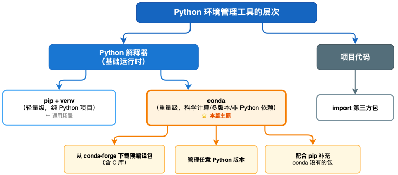
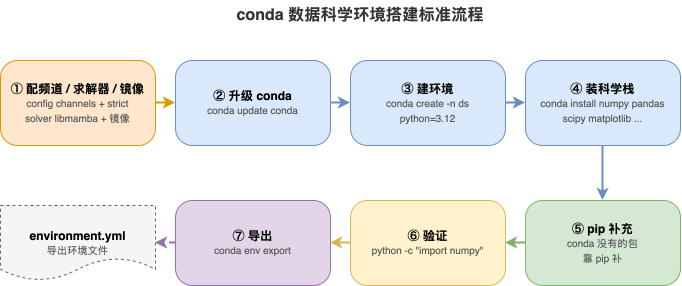

---
group:
  title: 【01】初识python
  order: 1
order: 5
title: conda环境管理
nav:
  title: Python基础
  order: 1
---

# conda环境管理

## 1. 介绍

### 1.1 什么是 conda

`conda` 是一个跨平台的**包管理与环境管理工具**，最初为科学计算（尤其是 Python 数据科学栈）而设计，由 Anaconda 公司开发。它能管理 Python 包，也能管理**非 Python 的依赖**（如 C/C++ 库、系统级二进制、其他语言如 R 的包），还能管理 Python 解释器本身的不同版本——这是它与 `pip` + `venv` 体系最本质的区别。

理解 conda，关键抓住"它管的比 pip 多"：

- **pip + venv**：pip 管 Python 包（纯 Python 或带编译的），venv 管隔离的装包目录。但 venv **不能装新 Python 版本**（依赖系统已有的 Python），pip 装**含 C 扩展的包**（如 numpy、psycopg2）时若没有预编译 wheel 就要本地编译，经常因缺编译器/系统库而失败。
- **conda**：一次性管"Python 解释器版本 + Python 包 + 非 Python 依赖（系统库等）"。`conda create -n myenv python=3.12 numpy` 一条命令，conda 帮你装好 Python 3.12、numpy 及 numpy 依赖的底层 C 库（BLAS 等），无需本地编译，适合科学计算那种"依赖一堆本地编译的数值库"的场景。

### 1.2 conda 与两个常见名词的关系

`conda` 与两个常见名词关联：

- **Anaconda**：一个**发行版**，把 conda + Python + 几百个数据科学常用包（numpy、pandas、scipy、jupyter 等）打包成一个大安装包（几个 GB）。装了 Anaconda 就有了 conda 和一堆现成的包，适合数据科学入门或离线环境。缺点是体积大、装的包可能非最新。
- **Miniconda**：Anaconda 的**精简版**，只含 conda + Python + 少量必需包（几十 MB）。装好后按需 `conda install` 装包，体积小、干净，是开发者的首选。两者的 conda 是同一个，差别只在预装包多寡。

### 1.3 conda 与 pip/venv 的对比

conda 和 pip+venv 是两套并存的体系，理解差异才能正确选型：

| 维度 | conda | pip + venv |
|------|-------|------------|
| 管理范围 | Python 包 + 非 Python 依赖 + Python 版本 | 仅 Python 包 |
| 装 Python 版本 | 能（`conda create -n env python=3.12`） | 不能（venv 复用系统 Python） |
| 含 C 扩展的包 | 多为预编译二进制，装得顺 | 无 wheel 时本地编译，易失败 |
| 包来源 | conda 仓库（conda-forge 等） | PyPI |
| 包数量 | 比 PyPI 少 | PyPI 最全（40 万+） |
| 速度 | 较慢（依赖解析繁琐） | 较快 |
| 商业许可 | Anaconda defaults 频道大规模商用需付费；conda-forge 免费 | 完全免费 |
| 标准库自带 | 否（需单独装 Miniconda/Anaconda） | Python 自带 pip、venv |

**核心取舍**：

- conda 的优势：能装/管 Python 版本本身、能装非 Python 依赖、含 C 扩展包装得顺。这让它在科学计算/ML 场景特别顺手。
- pip+venv 的优势：轻量（无需装 Miniconda）、PyPI 包最全、纯 Python 项目足够、生态标准。日常 Web 开发、脚本、API 服务，pip+venv 更轻更快。

### 1.4 何时该用 conda

不是所有项目都该用 conda。判断标准：

**适合用 conda**：

- 数据科学、机器学习、深度学习项目（依赖 numpy/pandas/torch 等 C 扩展栈）。
- 需要频繁切换不同 Python 版本（`conda create -n env python=x` 比 pyenv+venv 方便）。
- 项目依赖非 Python 二进制（C 库、系统工具如 ffmpeg/GDAL）。
- Windows 上装 Python 科学栈（Windows 编译环境难配，conda 预编译尤其省心）。

**不必用 conda（pip+venv 足够）**：

- 纯 Python 的 Web/API/脚本（用 flask、requests、fastapi 等）。
- 一般工具开发、自动化、爬虫（纯 Python 包）。
- 追求轻量、不装额外大工具。

简单原则：**遇到"装某包装不上要编译""要管多个 Python 版本""要装非 Python 依赖"这三种痛点之一，上 conda；否则 pip+venv 更轻**。

### 1.5 conda 的环境模型

conda 的"环境"概念与 venv 类似（都是隔离的包目录），但范围更大。一个 conda 环境包含：

- 一份**独立的 Python 解释器**（conda 自己装的某版本，不依赖系统）。
- 独立的**包目录**（site-packages 及 conda 装的非 Python 文件）。
- 独立的**依赖二进制**（C 库等，放在环境的 lib 下）。

所以 conda 环境比 venv"重"——它有自己的 Python 副本和 C 库副本，占空间大（一个科学计算环境常 GB 级），但**完全自包含、可指定任意 Python 版本、含全部底层依赖**。这是 conda 的设计权衡：用空间换"开箱即用、跨平台一致"。

```text
conda 环境结构 vs venv 环境结构

conda 环境（~/miniconda3/envs/myenv/）
├── bin/python           ← conda 自己装的真实 Python 二进制（非符号链接）
├── lib/python3.12/
│   └── site-packages/   ← Python 包
├── lib/                 ← 非 Python 二进制库（MKL、libgcc 等）
├── conda-meta/          ← 环境元数据（conda list 数据源）
└── ...

venv 环境（.venv/）
├── bin/python           ← 符号链接到系统 Python
├── lib/python3.12/
│   └── site-packages/   ← Python 包（无非 Python 库）
└── ...
```

conda 有一个特殊的 **base 环境**——安装 Miniconda/Anaconda 后默认存在的环境，含 conda 本身和基础 Python。一般**不在 base 环境里做项目开发**，而是为每个项目建独立环境，保持 base 干净。

### 1.6 conda 在开发流程中的定位

在 Python 开发生态中，conda 处于**科学计算环境管理层**——它连接 conda 仓库（conda-forge 等）与本地 Python 环境，专为需要复杂二进制依赖的场景提供一站式管理：



conda 在实际开发中的典型用途：

- **数据科学/机器学习环境**：numpy、pandas、scipy、scikit-learn、pytorch/tensorflow 等含大量 C/Fortran 扩展的包，conda 装预编译版，免去本地编译地狱。
- **多 Python 版本共存**：`conda create -n py310 python=3.10`、`conda create -n py312 python=3.12`，一键创建不同 Python 版本的环境。
- **非 Python 依赖管理**：如某库依赖 ffmpeg、GDAL、某些 C 库，conda 能一并装上。
- **R / 多语言项目**：conda 也管 R、Julia 等的包，适合多语言混合科研环境。

---

## 2. 安装与配置

### 2.1 前提条件

使用 conda 需要满足以下前提：

1. **操作系统**：macOS、Linux、Windows 均可，conda 跨平台。
2. **磁盘空间**：Miniconda 约 200 MB，后续每个 conda 环境约 500MB-3GB（科学计算环境更大）。
3. **网络访问**：默认从 conda 仓库下载包，国内用户建议配置清华镜像（见 2.5）。
4. **可选择不装 Python**：如果系统没有 Python，Miniconda 安装时自带 Python；如果已有 Python，conda 不冲突（它装自己的独立 Python）。

### 2.2 安装 Miniconda / Anaconda

**Miniconda（推荐开发者）**：精简，只含 conda + Python。

**第一步：下载安装脚本**

从官网 `https://docs.conda.io/projects/miniconda/` 下载对应平台的安装脚本。国内用户可用清华镜像加速：`https://mirrors.tuna.tsinghua.edu.cn/anaconda/miniconda/`。

| 平台 | 文件名示例 | 安装方式 |
|------|----------|---------|
| macOS (Intel) | `Miniconda3-latest-MacOSX-x86_64.sh` | `bash Miniconda3-latest-MacOSX-x86_64.sh` |
| macOS (Apple Silicon) | `Miniconda3-latest-MacOSX-arm64.sh` | `bash Miniconda3-latest-MacOSX-arm64.sh` |
| Linux | `Miniconda3-latest-Linux-x86_64.sh` | `bash Miniconda3-latest-Linux-x86_64.sh` |
| Windows | `Miniconda3-latest-Windows-x86_64.exe` | 双击运行安装向导 |

**第二步：运行安装**

```bash
# macOS / Linux
bash Miniconda3-latest-Linux-x86_64.sh
# 按提示操作：阅读许可协议 → 选择安装目录 → 是否初始化 conda
```

Windows 用户双击 `.exe`，建议勾选 "Add Miniconda to PATH" 或之后用开始菜单的 "Anaconda Prompt"。

**第三步：验证安装**

```bash
conda --version
```

**预期输出**：

```text
conda 24.5.0
```

**Anaconda（推荐数据科学入门/离线）**：从 `https://www.anaconda.com/download` 下载，装后含几百个数据科学包，几个 GB。适合不想后续频繁装包、或离线机器。

### 2.3 初始化 shell

安装后若 `conda` 命令不识别（尤其 Linux/macOS），需要初始化 shell：

```bash
conda init bash        # 或 zsh: conda init zsh
```

安装后重启终端或 `source ~/.bashrc` 生效。`conda init` 把 conda 的初始化代码写进 shell 配置，使 `conda` 命令和新开终端默认进 base 环境可用。

**关闭 base 自动激活**（不希望新开终端总带 `(base)` 提示符）：

```bash
conda config --set auto_activate_base false
```

之后新终端默认不在任何 conda 环境，需要时手动 `conda activate`。

**验证 shell 初始化成功**：

```bash
conda info
```

**预期输出**（关键部分）：

```text
     active environment : base
    active env location : /home/user/miniconda3
            shell level : 1
       user config file : /home/user/.condarc
 populated config files : /home/user/.condarc
          conda version : 24.5.0
    ...
```

### 2.4 频道配置

conda 包分布在多个**频道（channel）**，频道是包的来源仓库。常用频道对比：

| 频道 | 维护方 | 特点 | 商业许可 |
|------|--------|------|---------|
| conda-forge | 社区 | 包最全、更新最快，**首选** | 完全免费 |
| defaults / main | Anaconda 公司 | 稳定但更新慢 | 大规模商用需付费 |
| bioconda | 社区 | 生物信息学包 | 免费 |
| 自定义/私有 | 企业 | 内部包 | 取决于组织 |

**建议安装后第一时间配置 conda-forge 频道和严格优先级**：

```bash
conda config --add channels conda-forge
conda config --set channel_priority strict
```

`channel_priority strict` 让 conda 严格按频道优先级选包，优先用 conda-forge 的版本，避免不同频道混装导致冲突。这是 conda 社区推荐配置。

### 2.5 镜像源配置（国内加速）

conda 默认源在国内慢，配国内镜像（清华源最常用）大幅加速。

**配置命令**：

```bash
conda config --add channels https://mirrors.tuna.tsinghua.edu.cn/anaconda/pkgs/main/
conda config --add channels https://mirrors.tuna.tsinghua.edu.cn/anaconda/pkgs/free/
conda config --add channels https://mirrors.tuna.tsinghua.edu.cn/anaconda/cloud/conda-forge/
conda config --set show_channel_urls yes
```

或直接编辑 `~/.condarc` 文件：

```yaml
channels:
  - defaults
show_channel_urls: true
default_channels:
  - https://mirrors.tuna.tsinghua.edu.cn/anaconda/pkgs/main
  - https://mirrors.tuna.tsinghua.edu.cn/anaconda/pkgs/free
custom_channels:
  conda-forge: https://mirrors.tuna.tsinghua.edu.cn/anaconda/cloud
```

配置后 `conda install` 走清华镜像，下载快。遇到镜像同步滞后（某包最新版镜像还没）时，可临时 `-c defaults` 用官方源。

### 2.6 启用 libmamba 求解器提速

conda 默认依赖解析器在复杂依赖时很慢（"Solving environment" 长等待）。新版 conda（23.10+）已内置 libmamba 求解器，启用后速度快十倍以上：

```bash
conda update conda
conda config --set solver libmamba
```

**验证求解器设置**：

```bash
conda config --show solver
```

**预期输出**：

```text
solver: libmamba
```

### 2.7 安装常见问题排查

| 问题 | 原因 | 解决方案 |
|------|------|---------|
| `conda: command not found` | 安装后没 `conda init` 或 PATH 未含 conda | `conda init <shell>` 并重启终端；或用安装目录下 `bin/conda` 全路径 |
| `CondaError: ... locale` / 中文乱码 | 环境变量 locale 问题 | `export LC_ALL=en_US.UTF-8` 或 `export LANG=en_US.UTF-8` 后重试 |
| 装包极慢或失败 | 默认源慢 | 配国内镜像（2.5）；`channel_priority` 设 strict；`conda config --set remote_max_retries 5` 增加重试 |
| `Solving environment` 卡很久 | 默认求解器慢 | 启用 libmamba：`conda config --set solver libmamba`；或安装 mamba 替代 |
| 新终端总自动进 base 环境 | `auto_activate_base` 默认为 true | `conda config --set auto_activate_base false` |
| `CondaSSLError` / SSL 证书问题 | 网络问题或镜像证书 | 换镜像源；`conda config --set ssl_verify false`（仅临时排查用） |
| 磁盘空间不足 | conda 缓存和环境膨胀 | `conda clean --all` 清缓存；删除不用的环境 |

---

## 3. 核心命令与参数

### 3.1 命令速查表

下表列出 conda 最常用的命令与核心参数，供日常速查：

| 命令 | 作用 | 常用参数/示例 |
|------|------|-------------|
| `conda create` | 创建环境 | `-n` 环境名；`python=` 指定版本；`-c` 指定频道 |
| `conda activate` | 激活环境 | 环境名 |
| `conda deactivate` | 退出环境 | 无参数 |
| `conda env list` | 列出所有环境 | 或 `conda info --envs` |
| `conda env remove` | 删除环境 | `-n` 环境名 |
| `conda install` | 安装包 | `=` 指定版本；`-c` 指定频道；`-n` 装到指定环境 |
| `conda remove` | 卸载包 | 包名 |
| `conda update` | 升级包 | `--all` 升级全部 |
| `conda list` | 列出已装包 | 包名过滤；`-n` 指定环境 |
| `conda search` | 搜索可用包 | 包名 |
| `conda env export` | 导出环境 | `--from-history` 只导出显式安装的包 |
| `conda env create` | 从文件创建环境 | `-f environment.yml` |
| `conda config` | 管理配置 | `--add`/`--set`/`--show`/`--remove` |
| `conda clean` | 清理缓存 | `--all`/`-t`/`-p`/`-i` |
| `conda info` | 查看 conda 信息 | 环境信息 |

### 3.2 创建环境：conda create

用 `conda create` 创建环境，`-n` 指定环境名，`python=` 指定 Python 版本（这是 conda 比 venv 强的地方——它自己装这个版本的 Python）：

```bash
# 创建环境，Python 3.12
conda create -n myenv python=3.12

# 创建时顺便装包
conda create -n myenv python=3.12 numpy pandas

# 创建 Python 3.10 环境
conda create -n py310 python=3.10

# 指定频道创建
conda create -n myenv -c conda-forge python=3.12
```

**命名约定**：环境名简短、表达用途，如 `ml`（机器学习）、`webdev`、`py310`（按 Python 版本）。环境实际存在 `~/miniconda3/envs/<名字>/` 下。

**指定 Python 版本的意义**：`python=3.12` 让 conda 下载并装一份 Python 3.12 到这个环境，完全不依赖系统 Python。一台机器用 conda 可同时有 3.8/3.10/3.11/3.12 多个环境，各自独立 Python。

### 3.3 激活与退出环境

```bash
# 激活环境，提示符变 (myenv)
conda activate myenv

# 退出环境，回到 base 或无环境
conda deactivate
```

激活后验证当前环境：

```bash
# 确认 python 指向当前环境的版本
which python
python --version
```

**预期输出**：

```text
/home/user/miniconda3/envs/myenv/bin/python
Python 3.12.0
```

**注意**：conda 激活用的是 `conda activate`（不是 venv 的 `source activate`）。conda 4.6+ 起，`conda activate` 在所有平台都能用。前提是已 `conda init` 当前 shell。

退出 `conda deactivate` 后，若 `auto_activate_base=true`（默认），会回到 base 环境；若设了 false，则回到无 conda 状态。退出不删除环境，环境与里面的包都还在。

### 3.4 列出与删除环境

**列出所有环境**：

```bash
conda env list
```

**预期输出**：

```text
# conda environments:
#
base                  *  /home/user/miniconda3
myenv                    /home/user/miniconda3/envs/myenv
py310                    /home/user/miniconda3/envs/py310
```

`*` 标记当前激活的环境。`base` 是默认的 base 环境。也可以用 `conda info --envs` 达到同样效果。

**删除环境**：

```bash
# 删除环境前先退出
conda deactivate
conda env remove -n myenv

# 等价写法
conda remove -n myenv --all
```

删除后环境目录消失，包都没了。与 venv 一样，conda 环境"可抛弃"，靠导出的环境文件（3.9）复现。

### 3.5 安装与卸载包

**安装**：

```bash
# 装最新版
conda install numpy

# 装指定版本（单等号）
conda install numpy=1.26.0

# 版本范围
conda install "numpy>=1.25"

# 装多个
conda install numpy pandas scipy

# 装到指定环境（不必先激活）
conda install -n myenv numpy

# 指定频道
conda install -c conda-forge numpy
```

conda 装包时，**连同该包依赖的非 Python 库一起装**（如 numpy 依赖的 MKL/BLAS），且都是预编译二进制，无需本地编译。这是 conda 在科学计算场景的核心优势。

**查看已装包**：

```bash
# 当前环境所有包（含 Python、非 Python）
conda list

# 看某包
conda list numpy

# 看指定环境的包
conda list -n myenv
```

**预期输出**（`conda list` 节选）：

```text
# Name                    Version                   Build  Channel
numpy                     1.26.0          py312h...          conda-forge
pandas                    2.1.0           py312h...          conda-forge
python                    3.12.0          hef1ce0c_0         conda-forge
```

`conda list` 输出比 `pip list` 更全——它列出环境里**所有**东西，包括 Python 解释器、C 库（MKL、libgcc 等），因为 conda 把这些都当"包"管。

**卸载与升级**：

```bash
# 卸载
conda remove numpy

# 升级到最新
conda update numpy

# 升级环境里所有包
conda update --all

# 升级 conda 自身（重要）
conda update conda
```

### 3.6 搜索可用包

在安装前搜索某包在 conda 仓库有哪些版本：

```bash
conda search numpy
```

**预期输出**（节选）：

```text
Loading channels: done
# Name                       Version           Build  Channel
numpy                         1.25.0  py311h...  conda-forge
numpy                         1.26.0  py312h...  conda-forge
numpy                         1.26.2  py312h...  conda-forge
```

搜索帮助确认包名拼写和可用版本，避免安装时才发现"包不存在"或"版本不存在"。

### 3.7 conda 与 pip 协作

conda 环境里也能用 pip 装 PyPI 的包——conda 仓库没有的包靠 pip 补：

```bash
conda activate myenv
conda install numpy pandas          # 科学计算栈用 conda
pip install some-niche-package      # conda 没有的小众包用 pip
```

**协作注意事项**：

| 原则 | 说明 | 原因 |
|------|------|------|
| 先 conda 后 pip | 先用 conda 装能用 conda 装的所有包，再用 pip 补 | 避免先 pip 装了某包，又 conda 装依赖它的包，版本可能冲突 |
| 别对同一包两处装 | 某包别既 `conda install` 又 `pip install` | 会冲突或覆盖，导出环境时也混乱 |
| pip 也被 conda 管 | conda 环境里的 pip 本身是 conda 装的 | `conda update pip` 升级它；混装前确保 pip 最新 |
| 导出环境含 pip 包 | `conda env export` 会记录 pip 包 | pip 装的包在 `pip:` 段下 |

经验法则：**能用 conda 装的尽量 conda 装**（依赖解析更全局、二进制统一），conda 没有的再用 pip 补。

### 3.8 环境导出与复现

conda 环境可导出为 `environment.yml` 文件，在别处复现：

**导出**：

```bash
# 导出当前环境（含精确版本与构建号）
conda env export > environment.yml

# 只导出显式指定的包（更简洁、可移植）
conda env export --from-history > environment.yml
```

`environment.yml` 示例：

```yaml
name: myenv
channels:
  - conda-forge
dependencies:
  - python=3.12
  - numpy=1.26.0
  - pandas=2.1.0
  - pip:
    - some-pypi-package==1.0
```

注意它同时记录 conda 包和 pip 包（`pip:` 段），这是 conda 导出比 `pip freeze` 全面之处。

**复现**：

```bash
conda env create -f environment.yml
```

**跨平台注意**：`conda env export` 导出的含平台特定的"构建号"（如 `numpy=1.26.0=py312h...`），在 Windows 导出的拿到 Linux 复现可能失败。解决：用 `--from-history` 只导出显式指定的包（无构建号，可移植），让目标平台 conda 重新解析适配平台的版本。

### 3.9 克隆环境

有时想基于某环境复制一份（如把生产环境复制到测试环境改）：

```bash
conda create -n newenv --clone oldenv
```

克隆复制 oldenv 的所有包到新环境 newenv，二者之后独立。比从 environment.yml 重建快（直接拷贝，不重新解析下载），适合本地快速复制。但克隆的环境绑定同一平台，不可跨机器/平台直接拷贝（要用 environment.yml）。

### 3.10 conda clean 清理

conda 会缓存下载的包文件在 `pkgs/` 目录，时间一长占巨量空间。定期清理：

| 命令 | 作用 |
|------|------|
| `conda clean --all` | 清所有缓存：未用的包、tarball、索引 |
| `conda clean -t` | 只清 tarball（`.tar.bz2`/`.conda`） |
| `conda clean -p` | 清未使用的包 |
| `conda clean -i` | 清索引缓存 |

```bash
conda clean --all
```

`conda clean --all` 常能清出几 GB 到几十 GB，是磁盘紧张时的急救。它只删缓存，不影响已建环境里的包（环境里的包是独立副本）。

### 3.11 conda 配置管理

conda 的配置存于 `~/.condarc`（用户级），可用 `conda config` 命令或手编辑。常用操作：

| 命令 | 作用 | 示例 |
|------|------|------|
| `conda config --show` | 查看所有配置 | `conda config --show` |
| `conda config --show channels` | 查看某项 | `conda config --show channels` |
| `conda config --add channels <ch>` | 添加频道 | `conda config --add channels conda-forge` |
| `conda config --set <key> <value>` | 设置配置 | `conda config --set channel_priority strict` |
| `conda config --remove channels <url>` | 移除频道 | `conda config --remove channels defaults` |

**常用配置项速查**：

| 配置项 | 作用 | 推荐值 |
|-------|------|-------|
| `channels` | 频道列表 | conda-forge + defaults |
| `channel_priority` | 频道优先级模式 | `strict` |
| `solver` | 依赖求解器 | `libmamba` |
| `auto_activate_base` | 是否自动进 base | `false`（按需） |
| `show_channel_urls` | 显示下载 URL | `yes` |
| `remote_max_retries` | 下载重试次数 | `5` |

### 3.12 mamba 与 micromamba（提速替代）

conda 的依赖解析慢是公认痛点，社区有更快替代：

| 工具 | 定位 | 安装方式 | 适用场景 |
|------|------|---------|---------|
| **mamba** | conda 的 C++ 重写，命令几乎一致 | `conda install -n base -c conda-forge mamba` | 日常替代 conda，求解快十倍 |
| **micromamba** | 单文件极简版，无需 base Python | 从 GitHub 下载单二进制 | CI 和容器 |
| **libmamba 求解器** | 新版 conda 内置 | `conda config --set solver libmamba` | 让 conda 本身变快 |

实践：**先升级 conda 并启用 libmamba 求解器**，多数情况就够快；极复杂环境再考虑 mamba。

---

## 4. 实战工作流与 FAQ

### 4.1 完整实战：搭建一个数据科学环境

把各节串起来，演示从零搭建一个数据分析/ML 环境的全流程：

```bash
# 1. 配置 conda-forge 频道与求解器
conda config --add channels conda-forge
conda config --set channel_priority strict
conda config --set solver libmamba

# 2. 升级 conda
conda update conda

# 3. 建数据科学环境
conda create -n ds python=3.12
conda activate ds

# 4. 装科学计算栈（conda 装，享受预编译）
conda install numpy pandas scipy matplotlib scikit-learn jupyter

# 5. 装 PyPI 上的额外包（conda 没有或要最新）
pip install seaborn plotly
```

**验证环境就绪**：

```bash
python -c "import numpy, pandas, sklearn; print('环境就绪')"
```

**预期输出**：

```text
环境就绪
```

**导出环境（跨平台用 from-history）**：

```bash
conda env export --from-history > environment.yml
```

**别人复现**：

```bash
conda env create -f environment.yml
conda activate ds
```

**完整流程图解**：



### 4.2 实战对比：conda vs pip+venv 装 PyTorch

用一个具体场景直观对比两者差异：装 `pytorch`（GPU 深度学习框架，含大量 CUDA C 扩展）。

**用 pip+venv（可能踩坑）**：

```bash
python -m venv .venv && source .venv/bin/activate
pip install torch
```

可能的问题：下载巨大源码包本地编译，缺 CUDA toolkit 报错；或装到 CPU 版而非 GPU 版，需手动指定 `+cu118` 等索引；需自己确保系统有匹配的 CUDA 驱动/toolkit。

**用 conda（顺畅）**：

```bash
conda create -n torch python=3.12
conda activate torch
conda install -c pytorch pytorch pytorch-cuda=12.1
```

conda 一并装好 pytorch + 匹配的 CUDA 运行库（cudatoolkit/cuda-cudnn），无需本地编译、无需手动配 CUDA 版本，直接可用 GPU。

差异清晰：conda 把 CUDA 运行库这些**非 Python 依赖**也管了，一条命令齐活；pip 只管 Python 包，CUDA 等要你自己折腾系统环境。反之，装个纯 Python 的 `flask`，两者都简单，pip+venv 还更轻。

### 4.3 最佳实践速查

| 序号 | 最佳实践 | 说明 |
|------|---------|------|
| 1 | 用 Miniconda 而非 Anaconda | Miniconda 精简干净，按需装包；Anaconda 预装几百个包占巨量空间 |
| 2 | 首选 conda-forge + strict 优先级 | conda-forge 包全、更新快、免费无商用限制 |
| 3 | 启用 libmamba 求解器 | 依赖解析快十倍以上，告别"Solving environment"长等待 |
| 4 | 每个项目一个独立 conda 环境 | 不在 base 环境做项目开发，保持 base 干净 |
| 5 | 先 conda 后 pip，避免双重安装 | 能用 conda 装的尽量 conda，conda 没有的再 pip 补 |
| 6 | 跨平台共享用 `--from-history` 导出 | 无平台构建号，跨 Windows/macOS/Linux 可移植 |
| 7 | 国内配清华镜像 | 设好 `~/.condarc` 长期生效 |
| 8 | 定期 `conda clean --all` | 半年清一次常省几 GB 到几十 GB |
| 9 | conda 与 pip+venv 按场景选 | 纯 Python 项目用 pip+venv 轻量够；科学计算用 conda |
| 10 | 升级 conda 自身保持新 | 新版 conda 修 bug、加速、改善求解 |
| 11 | 删环境前先 deactivate | 避免占用导致删除异常 |
| 12 | 商业项目规避 defaults 频道 | conda-forge 完全免费，defaults 大规模商用需付费 |

### 4.4 常见问题 FAQ

| 问题 | 原因 | 解决方案 |
|------|------|---------|
| `conda: command not found` | 安装后没 `conda init` 当前 shell，或 PATH 未含 conda | 运行 `conda init <shell>` 并重启终端；或用安装目录下 `bin/conda` 全路径；Windows 用 "Anaconda Prompt" |
| `CondaError: ... locale` / 中文乱码 | 环境变量 locale 问题 | `export LC_ALL=en_US.UTF-8` 或 `export LANG=en_US.UTF-8` 后重试 |
| 装包极慢或失败 | 默认源慢；频道解析繁琐 | 配国内镜像（2.5）；`channel_priority` 设 strict；`conda config --set remote_max_retries 5`；镜像同步滞后时临时换官方源 |
| `Solving environment` 卡很久 | 默认求解器慢（尤其多频道、复杂依赖） | 启用 libmamba：`conda config --set solver libmamba`；或安装 mamba 替代；用 conda-forge + strict 优先级减少解析复杂度 |
| conda 与 pip 装的包冲突 | 某包 conda 和 pip 都装了 | `conda list` 看是否有重复；统一用一种方式装该包；重建干净环境 |
| 环境占空间太大 | conda 环境含独立 Python 和 C 库副本 | 定期 `conda env list` 删不用环境；`conda clean --all` 清缓存；用 `--clone` 复用基础包 |
| 新终端总自动进 base | `auto_activate_base` 默认为 true | `conda config --set auto_activate_base false` |
| `conda env export` 导出的环境在别的平台装不上 | 含平台特定的构建号（build string） | 用 `--from-history` 只导出显式指定的包，让目标平台重新解析 |
| conda 装的包不如 PyPI 全 | conda 仓库包数量远少于 PyPI | 冷门/小众/新出的包用 pip 补充 |
| `conda update --all` 后环境异常 | 批量升级可能引入不兼容版本 | 谨慎用 `--all`；优先只升级需要的包；升级前可先 `conda env export` 备份 |

### 4.5 conda 的限制与边界

conda 不是万能的，知道它的边界：

| 限制 | 说明 | 应对 |
|------|------|------|
| 包不如 PyPI 全 | conda 仓库的包数量远少于 PyPI | 冷门/小众包用 pip 补充 |
| 占空间大 | 每个 conda 环境含独立 Python+C 库副本 | 定期 `conda clean --all`，删不用环境 |
| 求解较慢 | 默认求解器在复杂依赖时慢 | 启用 libmamba 求解器 |
| defaults 频道商业许可 | Anaconda 默认频道大规模商用需付费 | 优先用 conda-forge，从 `.condarc` 移除 defaults |
| 不取代系统包管理 | conda 装的 C 库在其环境内，不替代 apt/brew | 某些场景仍需系统包管理器配合 |
| 学习成本较高 | channel/优先级/求解器等概念比 pip+venv 多 | 纯 Python 项目用 pip+venv 更轻 |

### 4.6 conda 与 Docker 的关系

conda 环境和 Docker 容器都做"可复现环境"，层次不同：

| 维度 | conda | Docker |
|------|-------|--------|
| 隔离级别 | 环境级——隔离 Python+包+C 库 | 系统级——整个 OS 打包 |
| 共享内核 | 是（跑在宿主操作系统上） | 否（容器有自己的 OS） |
| 跨平台一致 | 部分（不同 OS 二进制可能不同） | 完全一致（镜像跨机器同） |
| 适用场景 | 开发环境管理 | 部署/生产一致性 |

科学计算部署常见组合：**用 conda 管理环境，Docker 打包部署**。Dockerfile 里 `conda env create -f environment.yml` 装好环境，镜像在任何机器跑出一致结果。

### 4.7 初学者常见误区

**误区一：在 base 环境里装所有项目包**

base 环境污染，多项目冲突，且 base 坏了 conda 都没法用。正确做法：每项目建独立环境，base 保持干净只跑 conda 命令。

**误区二：conda 和 pip 乱混**

对同一包两边都装，或顺序混乱，环境一团乱、导出不准确。正确做法：先 conda 装 conda 有的，pip 仅补 conda 没有，绝不双重装。

**误区三：用 defaults 频道且不知商业限制**

企业大规模用 defaults 有许可风险。正确做法：配 conda-forge 为首选，避开 defaults 的商业许可问题。

**误区四：导出完整 environment.yml 跨平台用**

含构建号的完整导出跨平台会失败。正确做法：跨平台共享用 `--from-history`。

**误区五：不 clean 导致磁盘爆满**

conda 缓存和环境副本膨胀惊人，久不清几十上百 GB。正确做法：定期 `conda clean --all`，删不用环境。

**误区六：纯 Python 项目也上 conda**

引入 channel/求解器等复杂度，却没享受 conda 的二进制优势。正确做法：纯 Python 项目用 pip+venv 更轻，把 conda 留给真正需要它的科学计算场景。

**误区七：不升级 conda、不用 libmamba，抱怨求解慢**

新版 conda + libmamba 快很多。正确做法：`conda update conda` + `conda config --set solver libmamba`，再谈速度。

---

## 5. 总结

本文围绕 conda 环境管理展开，主要介绍了以下内容：

- **conda 定位**：跨平台包+环境管理工具，能管 Python 包、非 Python 依赖（C 库等）、Python 解释器版本本身；与 Anaconda（发行版）/Miniconda（精简版）的关系。
- **与 pip+venv 对比**：conda 管得广（含 Python 版本、非 Python 依赖、预编译二进制）、装 C 扩展包顺；pip+venv 轻量、PyPI 包最全、纯 Python 够用。核心差异在管理范围。
- **何时用 conda**：数据科学/ML、需多 Python 版本、依赖非 Python 二进制、Windows 科学栈；纯 Python 项目用 pip+venv 即可。
- **安装与配置**：Miniconda（推荐）/Anaconda 安装、`conda init` 初始化 shell、关闭 base 自动激活、conda-forge 频道 + strict 优先级、libmamba 求解器、国内清华镜像配置。
- **核心命令**：`conda create`（创建环境+指定 Python 版本）、`conda activate`/`deactivate`（激活退出）、`conda env list`/`env remove`（列出删除）、`conda install`/`remove`/`update`（装卸升级包）、`conda list`/`search`（查看搜索）、`conda env export`/`env create`（导出复现）、`conda clean`（清缓存）、`conda config`（配置管理）。
- **频道管理**：conda-forge（首选，全且免费）、defaults、bioconda；`channel_priority strict` 避免冲突。
- **与 pip 协作**：conda 环境可 pip 补包，先 conda 后 pip，别对同包双重装。
- **环境导出复现**：`conda env export` / `--from-history`、`environment.yml` 含 conda+pip 包；跨平台用 `--from-history`。
- **镜像源**：清华镜像配置（`~/.condarc`），加速国内下载。
- **mamba/micromamba/libmamba**：提速 conda 求解的方案。
- **常见问题**：command not found、locale、装包慢、Solving 卡顿、conda/pip 冲突、空间膨胀等问题的排查与解决。
- **实战工作流**：从零搭建数据科学环境的标准流程——配频道/求解器/镜像→升 conda→建环境→装科学栈→pip 补充→验证→导出。
- **最佳实践**：Miniconda+conda-forge+每项目一环境+定期 clean+场景化选型。
- **限制与边界**：包不如 PyPI 全、占空间大、defaults 商业许可、求解较慢、学习成本较高。
- **常见误区**：base 装项目包、conda/pip 乱混、defaults 许可、跨平台用完整 yml、不清缓存、纯 Python 上 conda、不升级求解慢。
