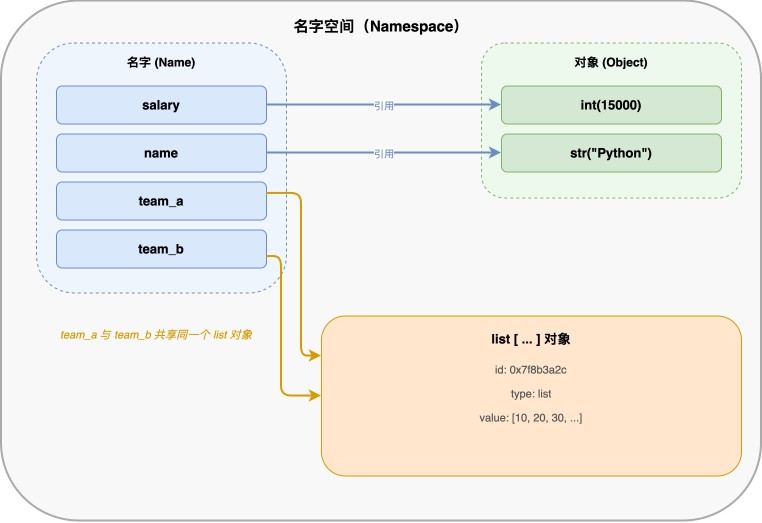
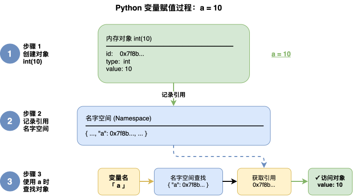
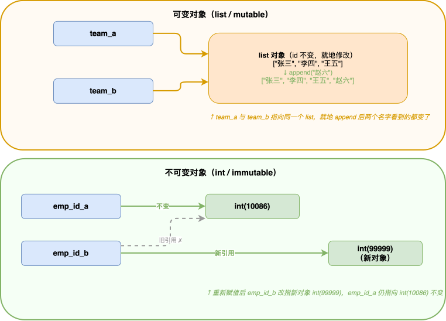
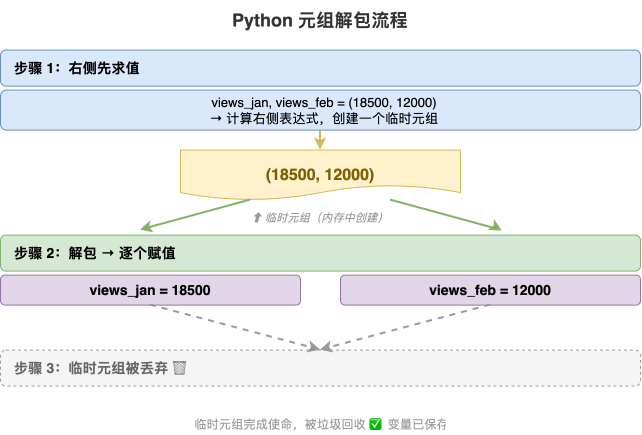
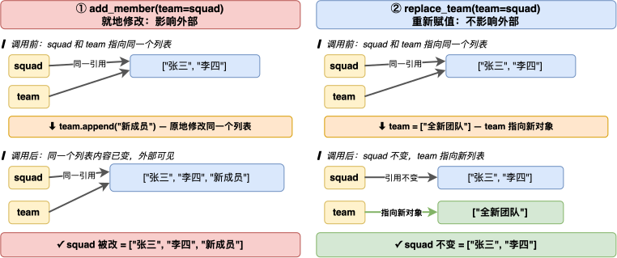
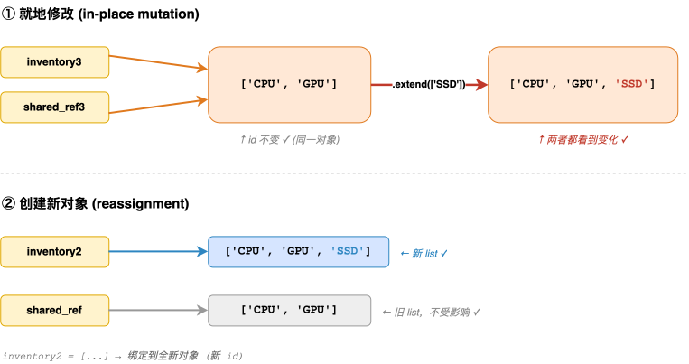
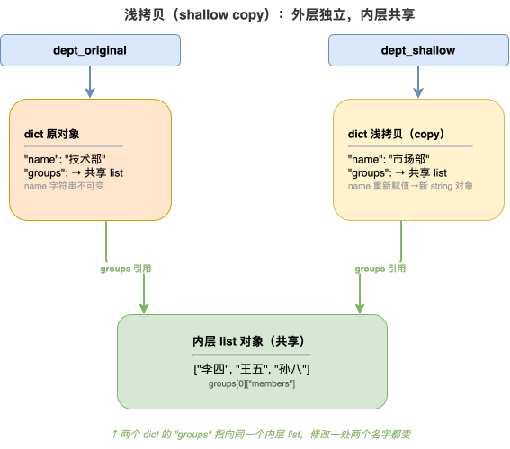
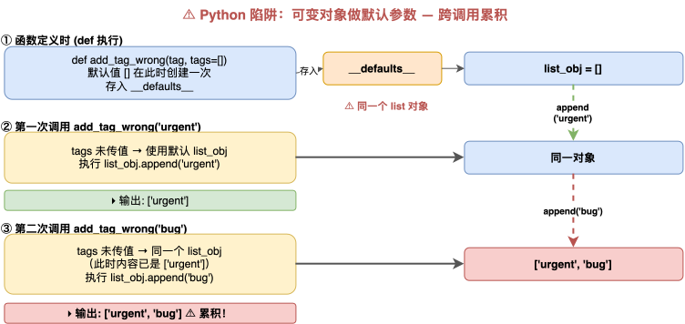

---
group:
  title: 【01】初识python
  order: 1
order: 9
title: 变量赋值机制
nav:
  title: Python基础
  order: 1
---

# 变量赋值机制

## 1. 介绍

### 1.1 要理解什么

Python 的变量赋值机制与 C/C++、Java 有本质不同。在 C 语言中，变量是一个"盒子"——`int a = 10;` 会在内存中划出一块 4 字节空间，把 10 塞进去，`a` 就是这块空间的代名词。而在 Python 中，变量不是盒子，而是一张**便利贴**——`a = 10` 做的事情是：先创建一个整数对象 `10`，然后把名字 `a` 贴在这个对象上。

理解 Python 的变量赋值机制，核心就是理解这句话：

> **Python 变量是名字（name），不是容器（container）。赋值 = 把名字贴到对象上。**

这句话的推论贯穿了 Python 的诸多行为：

- `a = b` 不是把 `b` 的值复制一份给 `a`，而是让 `a` 和 `b` 贴同一个对象
- 函数传参传的是对象引用，不是值拷贝
- `==` 比较的是值，`is` 比较的是身份（是否同一个对象）
- 浅拷贝只复制外层引用，深拷贝才递归复制所有层

### 1.2 为什么需要理解它

如果你不理解赋值机制，以下代码会让你百思不解：

```python
team_a = ["张三", "李四"]
team_b = team_a
team_b.append("王五")
print(team_a)  # ['张三', '李四', '王五'] —— 为什么 team_a 也变了？
```

在实际开发中，不理解赋值机制会导致：

- **共享引用 bug**：多个变量指向同一个可变对象，改一个全变
- **函数副作用**：传可变对象进函数，函数内修改后调用方数据被改
- **默认参数陷阱**：用可变对象做默认参数，多次调用共享同一个对象
- **拷贝选择错误**：该用深拷贝时用了浅拷贝，内层数据仍被共享
- **比较运算误用**：用 `is` 比较值应该用 `==`，或反过来

理解赋值机制，你才能写出正确、可预测的 Python 代码。

---

## 2. 整体架构

### 2.1 Python 的变量模型：名字 → 对象

Python 中一切皆对象。整数是对象，字符串是对象，列表是对象，函数是对象，类也是对象。变量名只是指向这些对象的一个**引用标签**。

整体模型如下：



关键要点：

- 名字空间本质是一个字典（`dict`），键是变量名，值是对象的引用（内存地址）
- 多个名字可以指向同一个对象（`team_a` 和 `team_b` 都指向同一个 list）
- 一个名字同一时间只能指向一个对象（重新赋值就是揭下标签贴到新对象上）

### 2.2 对象三件套：id、type、value

Python 中每个对象都有三个核心属性，称为"对象三件套"：

| 属性 | 含义 | 获取方式 | 类比 |
|------|------|---------|------|
| **id（身份）** | 对象在内存中的唯一标识 | `id(obj)` | 身份证号 |
| **type（类型）** | 对象的类别，决定了能做什么操作 | `type(obj)` | 物种 |
| **value（值）** | 对象承载的实际数据 | 直接访问或打印 | 长什么样 |

用一个例子来看这三件套：

```python
salary = 15000  # 某员工月薪
print(f"值: {salary}")
print(f"类型: {type(salary)}")
print(f"身份(id): {id(salary)}")
```

运行结果：

```text
值: 15000
类型: <class 'int'>
身份(id): 4305821584
```

`id()` 返回的是对象在内存中的地址（CPython 中是该对象的 C 指针值）。两个对象的 `id` 相同，说明它们就是同一个对象。

名字空间本质上是字典，可以用 `globals()` 来直接查看和操作：

```python
# 名字空间就是 dict，赋值 = 名字空间写入
globals()['_demo_name'] = "蚂蚁集团"
print(f"通过 globals() 取值: {globals()['_demo_name']}")
```

运行结果：

```text
通过 globals() 取值: 蚂蚁集团
```

这说明 `salary = 15000` 等价于在 `globals()` 字典中写入键值对 `"salary" → <int object 15000>`。

### 2.3 赋值操作的本质

当你写 `a = 10` 时，Python 解释器做了以下事情：




赋值操作**不创建对象的副本**。`b = a` 只是让 `b` 也指向 `a` 当前指向的对象：

```text
a ──→ int(10) ←── b      （两个名字，一个对象）
```

如果之后 `b = 20`，则 `b` 重新指向新对象 `int(20)`，`a` 不受影响：

```text
a ──→ int(10)           （a 不变）
b ──→ int(20)           （b 指向新对象）
```

---

## 3. 关键机制拆解

### 3.1 赋值即贴标签：可变对象的共享陷阱

`a = b` 让 `a` 和 `b` 指向同一个对象。对于不可变对象（int、str、tuple 等），这不产生问题——因为不可变对象不能被修改，你只能重新赋值指向新对象。但对于可变对象（list、dict、set 等），共享引用会导致"改一个全变"的陷阱。

```python
team_a = ["张三", "李四", "王五"]
team_b = team_a  # 贴标签，team_b 和 team_a 指向同一个 list

print(f"team_a is team_b: {team_a is team_b}")

team_b.append("赵六")  # 就地修改共享对象
print(f"team_a: {team_a}")  # team_a 也变了
print(f"team_b: {team_b}")
```

运行结果：

```text
team_a is team_b: True
team_a: ['张三', '李四', '王五', '赵六']
team_b: ['张三', '李四', '王五', '赵六']
```

`team_a is team_b` 返回 `True`，说明它们确实是同一个对象。`team_b.append("赵六")` 就地修改了这个 list，而 `team_a` 也指向同一个 list，所以 `team_a` 也变了。

**对比不可变对象**——重新赋值只改名字指向，不影响原对象：

```python
emp_id_a = 10086
emp_id_b = emp_id_a
emp_id_b = 99999  # 重新赋值，改指新对象
print(f"emp_id_a: {emp_id_a}")  # 不受影响
```

运行结果：

```text
emp_id_a: 10086
```

`emp_id_b = 99999` 不是修改了 `int(10086)` 这个对象（int 是不可变的），而是让 `emp_id_b` 重新指向了新对象 `int(99999)`。`emp_id_a` 仍然指向 `int(10086)`，不受影响。

内存模型对比：



### 3.2 多重赋值与解包机制

Python 支持多种赋值语法，它们的底层机制都基于"右侧先求值成元组，再解包给左侧"。

**元组解包交换**：

```python
views_jan, views_feb = 12000, 18500
views_jan, views_feb = views_feb, views_jan
print(f"交换后: 1月={views_jan}, 2月={views_feb}")
```

运行结果：

```text
交换后: 1月=18500, 2月=12000
```

`views_jan, views_feb = views_feb, views_jan` 的执行过程：



这与 C 语言中需要临时变量的交换完全不同——Python 的元组解包在一步内完成，且是原子操作。

**星号解包**——处理不定长序列：

```python
first_sale, *rest_sales = [150, 230, 410, 89, 1200]
print(f"首单: {first_sale}, 其余: {rest_sales}")
```

运行结果：

```text
首单: 150, 其余: [230, 410, 89, 1200]
```

`*rest_sales` 将剩余所有元素收集为一个 list。星号解包在处理不定长数据时非常实用。

**嵌套解包**——从结构化数据中按层级取值：

```python
employee = ("A001", ("张三", 28), "研发部")
emp_no, (name, age), dept = employee
print(f"工号={emp_no}, 姓名={name}, 年龄={age}, 部门={dept}")
```

运行结果：

```text
工号=A001, 姓名=张三, 年龄=28, 部门=研发部
```

嵌套解包按结构层级展开——`(name, age)` 解包了元组中的第二个元素 `("张三", 28)`。

### 3.3 函数传参：传对象引用

Python 的函数参数传递既不是"按值传递"也不是"按引用传递"，而是**传对象引用**（pass by object reference）。函数参数接收到的是对象的引用，函数内对这个引用的操作有两种截然不同的效果：

| 操作 | 效果 | 影响外部？ |
|------|------|-----------|
| 就地修改（mutate） | 改的是对象本身 | **是** |
| 重新赋值（rebind） | 改的是局部名字指向 | **否** |

```python
def add_member(team):
    """就地修改：影响外部"""
    team.append("新成员")


def replace_team(team):
    """重新赋值：不影响外部"""
    team = ["全新团队"]
    print(f"  函数内 team: {team}")


squad = ["张三", "李四"]
add_member(squad)
print(f"add_member 后: {squad}")  # 被改了

squad = ["张三", "李四"]
replace_team(squad)
print(f"replace_team 后: {squad}")  # 外部不变
```

运行结果：

```text
add_member 后: ['张三', '李四', '新成员']
  函数内 team: ['全新团队']
replace_team 后: ['张三', '李四']
```

数据流图解：



**记忆口诀**：传进来的是引用，就地改影响外部，重新绑不影响外部。

### 3.4 增量赋值：+= 与 + 的本质差异

`+=` 和 `+` 看似等价，但对可变对象来说，它们的内存行为完全不同：

| 操作 | 可变对象行为 | id 是否变化 | 影响共享引用？ |
|------|------------|-----------|-------------|
| `a += b` | 就地修改（等价 `a.extend(b)`） | 不变 | **是** |
| `a = a + b` | 创建新对象 | 变 | 否 |

```python
# 可变对象 += 就地修改，id 不变
inventory = ["CPU", "GPU"]
inv_id_before = id(inventory)
inventory += ["SSD"]  # 等价于 inventory.extend(["SSD"])
inv_id_after = id(inventory)
print(f"+= 后 id 不变: {inv_id_before == inv_id_after}")
print(f"inventory: {inventory}")
```

运行结果：

```text
+= 后 id 不变: True
inventory: ['CPU', 'GPU', 'SSD']
```

`+` 创建新对象，id 变化，且不影响共享引用：

```python
inventory2 = ["CPU", "GPU"]
inv2_id_before = id(inventory2)
shared_ref = inventory2  # 共享引用
inventory2 = inventory2 + ["SSD"]  # 新建 list
inv2_id_after = id(inventory2)
print(f"+ 后 id 变了: {inv2_id_before != inv2_id_after}")
print(f"shared_ref 不受影响: {shared_ref}")  # 仍是 ["CPU", "GPU"]
```

运行结果：

```text
+ 后 id 变了: True
shared_ref 不受影响: ['CPU', 'GPU']
```

**对比：+= 会影响共享者**：

```python
inventory3 = ["CPU", "GPU"]
shared_ref3 = inventory3
inventory3 += ["SSD"]
print(f"+= 影响共享者: shared_ref3 = {shared_ref3}")  # 也变了
```

运行结果：

```text
+= 影响共享者: shared_ref3 = ['CPU', 'GPU', 'SSD']
```

内存模型对比：



**关键结论**：当有共享引用时，`+=` 会"意外"修改共享者，`+` 不会。在不确定时，使用 `+` 更安全但更慢（有内存分配）。

### 3.5 浅拷贝与深拷贝

当需要独立副本时，赋值（贴标签）显然不够——需要拷贝。拷贝分两种深度：

| 拷贝方式 | 外层 | 内层 | 适用场景 |
|---------|------|------|---------|
| **浅拷贝**（`copy.copy`） | 独立 | 共享 | 内层无需修改的场景 |
| **深拷贝**（`copy.deepcopy`） | 独立 | 独立 | 内层也需要独立修改的场景 |

浅拷贝创建一个新的外层容器，但内层元素仍然指向原对象的内层元素。用一个嵌套结构来演示：

```python
import copy

dept_original = {
    "name": "技术部",
    "groups": [
        {"leader": "张三", "members": ["李四", "王五"]},
        {"leader": "赵六", "members": ["钱七"]},
    ],
}

# 浅拷贝：外层独立，内层共享
dept_shallow = copy.copy(dept_original)
dept_shallow["name"] = "市场部"  # 改外层，不影响原
print(f"浅拷贝-改外层后 原名: {dept_original['name']}")  # 不受影响

dept_shallow["groups"][0]["members"].append("孙八")  # 改内层，影响原！
print(f"浅拷贝-改内层后 原成员: {dept_original['groups'][0]['members']}")  # 也变了
```

运行结果：

```text
浅拷贝-改外层后 原名: 技术部
浅拷贝-改内层后 原成员: ['李四', '王五', '孙八']
```

浅拷贝的内存模型：



深拷贝递归复制所有层级，内外全独立：

```python
dept_original2 = {
    "name": "技术部",
    "groups": [
        {"leader": "张三", "members": ["李四", "王五"]},
    ],
}
dept_deep = copy.deepcopy(dept_original2)
dept_deep["groups"][0]["members"].append("孙八")
print(f"深拷贝-改内层后 原成员: {dept_original2['groups'][0]['members']}")  # 不受影响
print(f"深拷贝-改内层后 副本成员: {dept_deep['groups'][0]['members']}")
```

运行结果：

```text
深拷贝-改内层后 原成员: ['李四', '王五']
深拷贝-改内层后 副本成员: ['李四', '王五', '孙八']
```

除了 `copy.copy` / `copy.deepcopy`，还有一些创建浅拷贝的快捷方式：

```python
# 以下都创建 list 的浅拷贝
a = [1, 2, 3]
b = a.copy()
c = list(a)
d = a[:]
e = [*a]
```

这些方式只复制外层 list，内层元素仍然共享。如果内层有可变对象（如嵌套 list），修改内层会影响原对象——这与 `copy.copy` 行为一致。

### 3.6 值比较与身份比较

Python 有两种相等性比较：

| 运算符 | 名称 | 比较什么 | 实际调用 |
|-------|------|---------|---------|
| `==` | 值相等 | 两个对象的值是否相同 | `__eq__()` 方法 |
| `is` | 身份相同 | 两个引用是否指向同一个对象 | 比较 `id()` 是否相等 |

```python
config_a = {"host": "127.0.0.1", "port": 8080}
config_b = {"host": "127.0.0.1", "port": 8080}
print(f"值相等 config_a == config_b: {config_a == config_b}")  # True
print(f"不同对象 config_a is config_b: {config_a is config_b}")  # False

config_c = config_a
print(f"同一对象 config_a is config_c: {config_a is config_c}")  # True
```

运行结果：

```text
值相等 config_a == config_b: True
不同对象 config_a is config_b: False
同一对象 config_a is config_c: True
```

`config_a` 和 `config_b` 值相同但不是同一个对象（两个 dict 字面量分别在内存中创建）。`config_c = config_a` 让 `config_c` 指向 `config_a` 的对象，所以 `is` 返回 `True`。

**小整数缓存**——CPython 对 `-5` 到 `256` 的整数做了缓存优化：

```python
a_cached, b_cached = 256, 256
print(f"小整数 256 is: {a_cached is b_cached}")  # True（缓存）

a_large, b_large = 1000000, 1000000
print(f"大整数 1000000 is: {a_large is b_large}")  # 不保证 True
```

运行结果：

```text
小整数 256 is: True
大整数 1000000 is: True
```

注意：大整数的 `is` 结果**不保证**为 `True`——这取决于 Python 实现是否做了缓存优化。在某些环境下可能是 `True`（恰好缓存了），但不应依赖此行为。小整数 `-5~256` 的缓存是 CPython 规范保证的行为。

使用建议：

| 场景 | 推荐 | 原因 |
|------|------|------|
| 比较两个值是否相等 | `==` | 语义正确 |
| 判断是否为 `None` | `is None` | `None` 是单例，PEP 8 推荐 |
| 判断是否为 `True`/`False` | `if x:` 或 `is` | `True`/`False` 也是单例 |
| 比较两个可变对象是否同一个 | `is` | 确认身份 |

```python
# is 的正当用法：判断 None
result = None
print(f"result is None: {result is None}")  # True，规范用法
```

运行结果：

```text
result is None: True
```

### 3.7 del 与引用计数

`del` 语句在 Python 中容易引起误解——它**删除的是名字，不是对象**。对象的生命周期由**引用计数**管理。

Python 的垃圾回收主要依赖引用计数机制：每个对象内部维护一个引用计数器，记录有多少个名字指向它。当引用计数降为 0 时，对象占用的内存会被立即回收。

```python
import sys

cart = ["商品A", "商品B"]
cart_ref = cart  # 两个名字指向同一 list
print(f"引用计数(sys.getrefcount 会有额外+1): {sys.getrefcount(cart)}")

del cart  # 删除名字 cart，但 cart_ref 仍指向对象，对象不会被回收
print(f"del cart 后 cart_ref 仍可用: {cart_ref}")

# del 删容器元素
orders = [1001, 1002, 1003]
del orders[1]
print(f"del orders[1] 后: {orders}")
```

运行结果：

```text
引用计数(sys.getrefcount 会有额外+1): 3
del cart 后 cart_ref 仍可用: ['商品A', '商品B']
del orders[1] 后: [1001, 1003]
```

`sys.getrefcount()` 返回 3——因为 `cart` 指向 1 个引用、`cart_ref` 指向 1 个引用、传参给 `getrefcount` 时产生 1 个临时引用。`del cart` 只是删除了名字空间中 `cart` 这个键，引用计数从 3 降到 2，对象仍然存活（`cart_ref` 还指向它）。

`del` 的两种用法：

```text
1. del 变量名        → 删除名字空间中的条目，引用计数 -1
2. del 容器[索引]    → 从容器中移除元素，引用计数 -1
```

引用计数机制的流程：

```text
a = [1, 2, 3]          refcount = 1
b = a                  refcount = 2
c = a                  refcount = 3
del a                  refcount = 2   （a 的名字被删，但对象还在）
del b                  refcount = 1   （b 的名字被删，但对象还在）
del c                  refcount = 0   → 对象被回收，内存释放
```

### 3.8 作用域与赋值

Python 的赋值默认创建**局部变量**。函数内部对变量赋值，不会修改外部变量——而是在函数的局部名字空间中创建新条目。`global` 和 `nonlocal` 关键字可以改变这一默认行为。

```python
counter = 0


def increment_broken():
    counter = 1  # 创建局部变量，不改全局
    print(f"  函数内 counter: {counter}")


increment_broken()
print(f"broken 后全局 counter: {counter}")  # 仍 0
```

运行结果：

```text
  函数内 counter: 1
broken 后全局 counter: 0
```

`counter = 1` 在函数内部被解析为"在局部名字空间中创建 `counter`"，而不是"修改全局 `counter`"。函数结束后局部名字空间销毁，全局 `counter` 仍为 0。

使用 `global` 声明后，赋值会修改全局变量：

```python
def increment_global():
    global counter
    counter = 10


increment_global()
print(f"global 后全局 counter: {counter}")  # 被改了
```

运行结果：

```text
global 后全局 counter: 10
```

`global counter` 告诉 Python："这个函数里的 `counter` 指的是全局的那个 `counter`"，所以 `counter = 10` 改的是全局变量。

`nonlocal` 用于闭包场景——修改外层函数的变量：

```python
def make_counter():
    count = 0

    def step():
        nonlocal count
        count += 1
        return count

    return step


step_counter = make_counter()
print(f"闭包计数: {step_counter()}, {step_counter()}, {step_counter()}")
```

运行结果：

```text
闭包计数: 1, 2, 3
```

`nonlocal count` 告诉内层函数 `step`：`count` 是外层函数 `make_counter` 的变量，不是新创建的局部变量。每次调用 `step()` 都修改同一个 `count`，实现了计数器效果。

作用域与赋值的规则总结：

| 关键字 | 作用域层级 | 赋值行为 |
|--------|-----------|---------|
| 无声明 | 函数局部 | 创建局部变量 |
| `global x` | 模块全局 | 修改全局变量 |
| `nonlocal x` | 外层函数 | 修改闭包变量 |

LEGB 规则（变量查找顺序）：

```text
Local（当前函数）→ Enclosing（外层函数）→ Global（模块）→ Built-in（内置）
```

赋值时，Python 在 Local 层创建变量，除非用 `global`/`nonlocal` 明确声明。

### 3.9 海象运算符

Python 3.8 引入了海象运算符 `:=`（walrus operator），它是一个在表达式内部进行赋值的运算符。它的核心价值在于**减少重复计算和重复调用**。

海象运算符的语法：

```text
(变量名 := 表达式)
```

它在求值表达式的同时把结果赋给变量名，返回表达式的值。

**场景一：while 循环中读取并判断**

传统写法需要先赋值再判断：

```python
# 传统写法：调用两次
line = read_line()
while line is not None:
    process(line)
    line = read_line()
```

用海象运算符一步到位：

```python
# 模拟从消息队列读取：条件里赋值并判断
message_queue = ["msg1", "msg2", "msg3", None]
index = 0

while (msg := message_queue[index]) is not None:
    print(f"  处理消息: {msg}")
    index += 1
```

运行结果：

```text
  处理消息: msg1
  处理消息: msg2
  处理消息: msg3
```

`(msg := message_queue[index])` 做了两件事：取值赋给 `msg`、返回值参与 `is not None` 判断。

**场景二：条件判断后复用结果**

避免在 `if` 里调用一次，在代码块里还要再调用一次：

```python
metrics = {"cpu": 92, "memory": 78, "disk": 45}
if (high_usage := metrics.get("cpu", 0)) > 90:
    print(f"  CPU 告警! 使用率 {high_usage}%")
```

运行结果：

```text
  CPU 告警! 使用率 92%
```

`high_usage` 在 `if` 条件中被赋值，在代码块中直接复用，避免了 `metrics.get("cpu", 0)` 调用两次。

### 3.10 默认参数陷阱：可变对象做默认值

这是 Python 中最经典的"赋值机制"陷阱之一。函数的默认参数在**函数定义时**求值一次，而不是每次调用时重新创建。

**错误写法**——可变对象做默认参数：

```python
def add_tag_wrong(tag, tags=[]):
    tags.append(tag)
    return tags


print(f"第一次调用: {add_tag_wrong('urgent')}")
print(f"第二次调用: {add_tag_wrong('bug')}")  # 不是 ['bug']，而是累积！
print(f"第三次调用: {add_tag_wrong('feature')}")
```

运行结果：

```text
第一次调用: ['urgent']
第二次调用: ['urgent', 'bug']
第三次调用: ['urgent', 'bug', 'feature']
```

为什么？因为 `tags=[]` 中的 `[]` 在函数定义时创建了一次，之后每次调用都共享同一个 list 对象。`tags.append(tag)` 就地修改这个 list，导致跨调用累积。

机制图解：



**正确写法**——用 `None` 哨兵值：

```python
def add_tag_correct(tag, tags=None):
    if tags is None:
        tags = []
    tags.append(tag)
    return tags


print(f"正确-第一次: {add_tag_correct('urgent')}")
print(f"正确-第二次: {add_tag_correct('bug')}")  # 每次独立
```

运行结果：

```text
正确-第一次: ['urgent']
正确-第二次: ['bug']
```

`None` 是不可变对象，本身没有共享修改的风险。每次调用时检查 `tags is None`，是则创建新 list，保证每次调用独立。

| 写法 | 默认参数 | 行为 | 问题 |
|------|---------|------|------|
| 可变对象默认值 | `tags=[]` | 多次调用共享同一 list | 跨调用累积 |
| None 哨兵 | `tags=None` | 每次调用创建新 list | 安全 |

---

## 4. 设计决策与权衡

### 4.1 为什么 Python 选择"变量是引用"而非"变量是盒子"

Python 的赋值机制与 C/C++ 有根本区别，这不是偶然的设计，而是有意为之。

| 维度 | C/C++（盒子模型） | Python（引用模型） |
|------|------------------|-------------------|
| 变量含义 | 内存块的名字 | 对象的引用标签 |
| 赋值操作 | 拷贝值到内存块 | 绑定名字到对象 |
| 传参方式 | 值拷贝（或指针/引用） | 传对象引用 |
| 内存管理 | 手动或 RAII | 引用计数 + 垃圾回收 |
| 动态类型 | 不支持（类型固定） | 天然支持 |

Python 选择引用模型的核心理由：

1. **动态类型需要引用语义**——Python 变量没有固定类型，同一个名字可以先指向 `int` 再指向 `str`。如果是盒子模型，盒子有固定大小和类型，无法容纳不同类型的值。
2. **一切皆对象**——Python 中所有值都是对象，对象有 `id`、`type`、`value`。变量只是指向对象的引用，与对象的类型解耦。
3. **简化内存管理**——引用计数 + 垃圾回收让程序员无需手动管理内存，引用模型天然适配这种方案。

代价是：共享引用带来意外行为。C 程序员转 Python 时容易踩坑——`a = b` 在 C 中是值拷贝，在 Python 中是引用共享。

### 4.2 小整数缓存的设计

CPython 缓存了 `-5` 到 `256` 之间的整数对象，这是一个性能优化决策。

| 维度 | 缓存小整数 | 不缓存小整数 |
|------|-----------|-------------|
| 内存开销 | 固定 512 个 int 对象 | 按需创建 |
| 创建速度 | O(1)，直接返回缓存对象 | O(n)，每次 new |
| `is` 行为 | 小整数 `is` 可靠为 `True` | 不保证 |
| 陷阱风险 | 低（边界明确） | 无 |

缓存范围选择 `-5~256` 的理由：这些整数在实际程序中使用频率极高（循环计数、索引、状态码等），缓存的收益远大于 512 个 int 对象的固定内存开销。

这是一个**实现细节**而非语言规范——你不应该依赖大整数的 `is` 行为，但小整数的缓存是 CPython 的一致行为。

### 4.3 可变对象 vs 不可变对象的设计哲学

Python 将对象分为可变（mutable）和不可变（immutable）两类，这与赋值机制深度耦合：

| 类型 | 可变/不可变 | 示例 | 重新赋值行为 | 就地修改行为 |
|------|-----------|------|------------|------------|
| `int` | 不可变 | `a = 10` | 改指向新对象 | 不支持 |
| `str` | 不可变 | `s = "hi"` | 改指向新对象 | 不支持 |
| `tuple` | 不可变 | `t = (1, 2)` | 改指向新对象 | 不支持 |
| `list` | 可变 | `l = [1, 2]` | 改指向新对象 | 原地修改，id 不变 |
| `dict` | 可变 | `d = {}` | 改指向新对象 | 原地修改，id 不变 |
| `set` | 可变 | `s = set()` | 改指向新对象 | 原地修改，id 不变 |

不可变对象的优势：

- **线程安全**：不可变对象天然线程安全，无需加锁
- **可哈希**：不可变对象可以作为 dict 的键或 set 的元素
- **安全共享**：多个引用指向同一不可变对象，不会互相干扰

可变对象的优势：

- **高效修改**：就地修改无需创建新对象，内存效率高
- **灵活**：支持 append、pop、update 等丰富操作

理解可变性对赋值机制的影响是关键：对于不可变对象，赋值共享不会出问题（因为无法就修改）；对于可变对象，赋值共享可能导致意外修改。

---

## 5. 总结

本文深入讲解了 Python 的变量赋值机制：

- **核心模型**：Python 变量是名字（便利贴），不是容器（盒子）。赋值 = 把名字贴到对象上。每个对象有 id、type、value 三件套
- **赋值即贴标签**：`a = b` 让两个名字指向同一对象。可变对象共享引用会导致"改一个全变"的陷阱；不可变对象因不能就地修改，不受影响
- **多重赋值与解包**：右侧先求值成元组，再解包给左侧。支持星号解包和嵌套解包
- **函数传参是传对象引用**：就地修改影响外部，重新赋值不影响外部。这是理解 Python 参数传递的关键
- **增量赋值差异**：`+=` 对可变对象就地修改（id 不变，影响共享者），`+` 创建新对象（id 变，不影响共享者）
- **浅拷贝与深拷贝**：浅拷贝外层独立内层共享，深拷贝内外全独立。嵌套可变结构需要深拷贝才能保证完全独立
- **值比较与身份比较**：`==` 比较值，`is` 比较身份。小整数 `-5~256` 被 CPython 缓存。`is None` 是判断 None 的规范写法
- **del 与引用计数**：`del` 删名字不删对象，对象由引用计数管理。计数降为 0 时回收
- **作用域与赋值**：函数内赋值默认创建局部变量，`global` 和 `nonlocal` 可改变绑定目标
- **海象运算符**：`:=` 在表达式内部赋值，减少重复计算和重复调用
- **默认参数陷阱**：可变对象做默认参数在函数定义时求值一次，多次调用共享同一对象。用 `None` 哨兵值避免此陷阱
- **设计哲学**：Python 选择引用模型以支持动态类型和一切皆对象；可变/不可变区分与赋值机制深度耦合，不可变对象天然安全共享