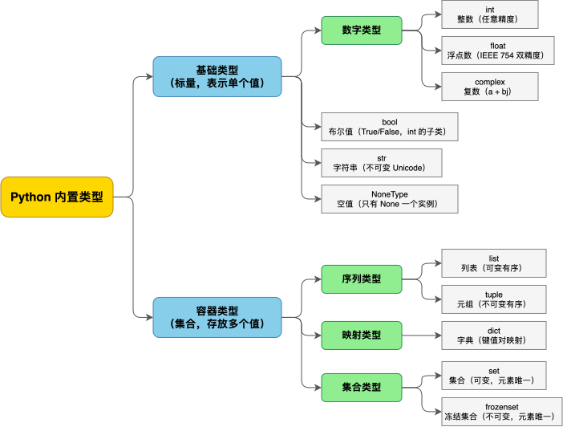

---
group:
  title: 【02】基础数据类型和类型系统
  order: 2
order: 1
title: 基础数据类型汇总
nav:
  title: Python基础
  order: 1
---

# 基础数据类型汇总

## 1. 介绍

### 1.1 什么是数据类型

数据类型（data type）是编程语言对"数据能做什么操作、占多少内存、能取什么值"的归类。在 Python 中，一切皆对象——每个值都是一个对象，而对象所属的"类（class）"就是它的类型。`10` 是一个 `int` 对象，`3.14` 是一个 `float` 对象，`"hello"` 是一个 `str` 对象。类型决定了这个对象能做什么：`int` 能做整除 `//`，`str` 不能；`str` 能做 `.upper()`，`int` 不能。

与 C/Java 这类静态类型语言不同，Python 是**动态类型**的：变量没有类型，对象才有类型。同一个名字可以先后绑定到不同类型的对象上，`x = 10` 之后 `x = "hello"` 完全合法——`x` 只是一个引用标签，类型随着它指向的对象走。

```python
x = 10
print(type(x))       # <class 'int'>

x = "hello"
print(type(x))       # <class 'str'> —— 同一个变量，类型变了

x = [1, 2, 3]
print(type(x))       # <class 'list'>
```

这意味着你不需要（也无法）在赋值时声明类型——这是 Python 与 C/Java 最大的书写差异之一。动态类型带来灵活，也意味着你可能在期望 `int` 的地方意外传入了 `str`，直到运行时才报错。Python 3.5+ 引入的类型注解（type hints）可以缓解这个问题，但这属于"类型系统"专题的内容，本篇聚焦于运行时实际存在的基础类型本身。

### 1.2 什么是基础数据类型

所谓"基础数据类型"，指的是 Python 语言**内置（built-in）、开箱即用、无需 import** 的一组核心类型。它们是日常编码中最常用的数据载体，也是后续所有高级类型（标准库类型、第三方类型、自定义类）的基石。

在 Python 的内置类型中，可以按照"表示单个值 vs 存放多个值"这一维度，划分为两大类：

- **基础类型（标量类型）**：表示单个原子值，是数据的"最小单元"。包括 `int`（整数）、`float`（浮点数）、`complex`（复数）、`bool`（布尔值）、`str`（字符串）、`bytes`（字节串）、`NoneType`（空值）。这些是真正意义上的"基础数据类型"，本篇会逐一做简要介绍。

- **容器类型（集合类型）**：用于存放多个对象，是数据的"组织方式"。包括 `list`（列表）、`tuple`（元组）、`dict`（字典）、`set`（集合）、`frozenset`（冻结集合）。严格来说，它们并非"基础数据类型"，而是建立在基础类型之上的容器结构。本篇将它们作为补充项在后面简要说明。

打个比方：基础类型就像积木的"单个零件"——一块红砖、一块蓝砖；容器类型就像"装积木的盒子"——盒子里装的是一个个基础类型的对象。你先得有零件，才能往盒子里装。

本篇作为整个"基础数据类型与类型系统"大章节的入门，负责给出全貌与每个类型的核心特征。至于各类型的深度细节（如 `int` 的位运算、`float` 的精度问题、`str` 的编码、`dict` 的底层哈希表），会在后续的专题笔记中逐一展开。

### 1.3 Python 类型系统概览

Python 的内置类型构成了一个层次分明的体系，可以用下面的分类图概览：



需要说明的是，`bool` 虽然在语义上是独立的布尔类型，但在 Python 的实现中它是 `int` 的子类（`True == 1`，`False == 0`），因此它既可以归入数字类型，也可以单独列出。本篇将其单独列出，以突出其语义独立性。

### 1.4 如何观察对象的类型

在进入具体类型前，先建立"如何观察一个对象类型"的统一工具。Python 提供了三个内置函数来查看对象的类型信息：

| 函数 | 作用 | 示例 |
|------|------|------|
| `type(obj)` | 返回对象的类型（即它的类） | `type(10)` → `<class 'int'>` |
| `isinstance(obj, cls)` | 判断对象是否属于某类型（含父类/子类） | `isinstance(True, int)` → `True` |
| `id(obj)` | 返回对象的身份（内存地址） | `id(10)` → 某个整数 |

```python
x = 10
print(type(x))              # <class 'int'>
print(isinstance(x, int))   # True
print(id(x))                # 某个内存地址，如 4305234992

s = "hello"
print(type(s))              # <class 'str'>
print(isinstance(s, str))   # True
```

判断类型时，推荐用 `isinstance()` 而非 `type(x) is int`。原因在于 Python 有继承关系——`bool` 是 `int` 的子类，所以 `isinstance(True, int)` 返回 `True`（这正是我们期望的"True 也是一种 int"的语义），而 `type(True) is int` 返回 `False`（因为 `True` 的精确类型是 `bool`）。`isinstance` 尊重继承链，是判断类型的首选方式。

另一个值得了解的点：类型本身也是对象。`int`、`str` 这些类自身也是对象，它们的类型是 `type`（元类）：

```python
print(type(10))     # <class 'int'>   —— 10 的类型是 int
print(type(int))    # <class 'type'>  —— int 这个类的类型是 type
print(type(str))    # <class 'type'>
```

这一点现在只需有个印象，等学到面向对象时会彻底讲清。此处建立的认知是——值有类型，类型本身也是对象。

---

## 2. 核心内容

本节逐一介绍各基础数据类型的核心特征。每个类型只做简要介绍——包括它能存什么、怎么写字面量、关键特性——更深入的细节会在各自的专题笔记中展开。

### 2.1 基础类型的分类

在学习具体类型之前，先从两个重要维度对基础类型进行分类，这有助于建立全局认知。

**按数据性质分类**：

| 分类 | 类型 | 说明 |
|------|------|------|
| 数字类型 | `int`、`float`、`complex` | 表示数值，支持算术运算 |
| 布尔类型 | `bool` | 表示真值（True/False），是 int 的子类 |
| 文本类型 | `str` | 表示 Unicode 字符序列 |
| 二进制类型 | `bytes` | 表示不可变的字节序列（0-255 的整数） |
| 空值类型 | `NoneType` | 表示"没有值"，只有 None 一个实例 |

**按可变性分类**：

可变性（mutability）是指对象创建后，其值能否被就地修改。这个维度很重要，因为它决定了对象能否被安全共享、能否做 `dict` 的键。

| 分类 | 类型 | 说明 |
|------|------|------|
| 不可变 | `int`、`float`、`complex`、`bool`、`str`、`bytes`、`NoneType` | "修改"操作返回新对象，原对象不变 |
| 可变 | （容器类型中的 `list`、`dict`、`set`、`bytearray`） | 可就地增删改，id 不变 |

可以看到，**所有基础类型都是不可变的**。这意味着对基础类型的任何"修改"操作（如 `s.upper()`、`x + 1`）都会产生一个新对象，原对象在生命周期内值永不变。不可变对象可以被多个名字安全共享——谁都无法"偷偷改"它。

与可变性紧密相关的是**可哈希性**（hashability）：不可变对象的值在生命周期内不变，哈希值稳定，因此可哈希，能做 `dict` 的键或 `set` 的元素。所有基础类型都是可哈希的。

### 2.2 数字类型：int

`int` 表示整数，是 Python 中最常用的数字类型。

**核心特征**：Python 的 `int` 是**任意精度**的，没有大小上限——只要内存够用，可以表示任意大的整数。这与 C/Java 的 32 位或 64 位定长整数不同，不会发生溢出。

```python
a = 10
b = -5
big = 10 ** 100          # 10 的 100 次方，一个 101 位的整数，完全不溢出

print(big)
# 输出：1000000000...0（共 101 位）

print(type(a))            # <class 'int'>
```

字面量支持多种进制，用前缀区分：

```python
print(0b1010)      # 二进制，前缀 0b → 10
print(0o17)        # 八进制，前缀 0o → 15
print(0xFF)        # 十六进制，前缀 0x → 255
print(1_000_000)   # 下划线分隔，提高可读性 → 1000000（Python 3.6+）
```

下划线分隔符 `1_000_000` 是个实用的小特性，在写大数字（金额、时间戳）时显著提升可读性，等价于 `1000000`。

常用运算：

```python
print(7 / 2)       # 3.5    —— / 永远返回 float，即使能整除
print(7 // 2)      # 3      —— // 整除，丢弃小数部分
print(7 % 2)       # 1      —— % 取余
print(2 ** 10)     # 1024   —— ** 幂运算
print(divmod(7, 2))  # (3, 1) —— 同时返回商和余数
```

其中 `/` 与 `//` 的区别是新手常踩的点：`/` 是"真除法"，无论操作数是否整数都返回 `float`；`//` 是"地板除"，向下取整。注意负数的地板除是向**负无穷**取整，不是向零：

```python
print(-7 // 2)     # -4（不是 -3！）向负无穷取整
print(-7 % 2)      # 1（余数与除数同号）
```

这条规则与 C/Java 的"向零取整"不同，但对数学一致性（余数总与除数同号）是有意为之的。

**一句话总结**：`int` 就是整数，无大小限制，支持多种进制字面量，是计数、索引、位运算的基础类型。更多细节见《int 类型详解》。

### 2.3 数字类型：float

`float` 表示浮点数（小数），底层是 IEEE 754 双精度（64 位）。

**核心特征**：浮点数无法精确表示大多数十进制小数，会产生微小的舍入误差。这是所有使用 IEEE 754 的语言（C/Java/JS 等）的共性，不是 Python 的 bug。

```python
print(0.1 + 0.2)           # 0.30000000000000004 —— 不是 0.3
print(0.1 + 0.2 == 0.3)    # False
```

`0.1`、`0.2` 在二进制下是无限循环小数，存储时被截断，累加后暴露误差。这意味着涉及金额等精度敏感的场景，应避免直接用 `float`，改用 `int` 存"分"或用 `decimal.Decimal` 做精确十进制运算。

字面量多种写法：

```python
print(3.14)          # 3.14
print(.5)            # 0.5（整数部分可省略）
print(2e3)           # 2000.0（科学计数法，2 × 10³）
print(1.5e-3)        # 0.0015
print(float('inf'))  # inf，正无穷
print(float('nan'))  # nan，非数（Not a Number）
```

常用运算：

```python
print(round(3.14159, 2))   # 3.14 —— 四舍五入到 2 位
print(round(2.5))           # 2 —— 银行家舍入，向最近偶数舍入，不是 3
print(abs(-3.5))            # 3.5 —— 绝对值
```

`round` 有个反直觉细节：它采用"银行家舍入"（round half to even），即 `.5` 时向最近的偶数舍入，而非向上。`round(2.5) → 2`、`round(3.5) → 4`。

**一句话总结**：`float` 就是小数，有精度误差，科学计数法是常见写法，精度敏感场景需谨慎。更多细节见《float 类型与精度问题》。

### 2.4 数字类型：complex

`complex` 表示复数，形式为 `a + bj`，其中 `a` 是实部、`b` 是虚部、`j` 是虚数单位。

**核心特征**：复数在日常业务编码中很少用到，但在信号处理、电气工程、量子计算、科学计算领域是基础数据类型，Python 将其作为内置类型原生支持。

```python
z = 3 + 4j
print(type(z))         # <class 'complex'>
print(z.real)          # 3.0 —— 实部（总是 float）
print(z.imag)          # 4.0 —— 虚部
print(abs(z))          # 5.0 —— 模长 √(3² + 4²)
print(z.conjugate())   # (3-4j) —— 共轭复数
```

复数的实部和虚部都是 `float`，即便你写整数 `3`，`.real` 也返回 `3.0`。支持算术运算，符合复数运算法则：

```python
print((1 + 2j) + (3 - 1j))   # (4+1j)
print((1 + 2j) * (3 - 1j))   # (5+5j)
```

**一句话总结**：`complex` 就是复数 `a+bj`，实虚部都是 float，主要用在科学计算领域，一般业务代码用不到。更多细节见《complex 复数类型》。

### 2.5 布尔类型：bool

`bool` 表示真值，只有两个实例：`True` 和 `False`（注意首字母大写，`true`/`false` 是错的）。

**核心特征**：`bool` 是 `int` 的子类，`True` 等于 1、`False` 等于 0。这意味着 `bool` 可以直接参与整数运算，也是理解许多 Python 行为的钥匙。

```python
print(type(True))             # <class 'bool'>
print(isinstance(True, int))  # True —— bool 是 int 子类
print(True + True)            # 2 —— 可当整数参与运算
print(True == 1)              # True
print(False == 0)             # True
```

因为 `bool` 继承 `int`，任何接受 `int` 的地方都能传 `bool`。也正因此，`isinstance(True, int)` 返回 `True`，而 `type(True) is int` 返回 `False`——这正是推荐用 `isinstance` 判断类型的原因。

**真值测试（truthiness）**：在 Python 中，任何对象都能在布尔语境（`if`/`while`/`and`/`or`）中被判定真假。规则是：以下值判定为"假"（falsy），其余全部判定为"真"（truthy）：

| 判定为假的值 | 说明 |
|-------------|------|
| `False` | 布尔假值 |
| `None` | 空值 |
| `0`、`0.0`、`0j` | 数值零 |
| `''`、`[]`、`{}`、`()`、`set()` | 空容器 |

```python
print(bool(0))        # False
print(bool(0.0))      # False
print(bool(''))       # False —— 空字符串
print(bool([]))       # False —— 空列表
print(bool('hello'))  # True
print(bool([0]))      # True —— 非空容器为真，哪怕元素是 0
```

特别注意 `bool([0])` 是 `True`：只要容器非空就为真，不看元素内容。

**一句话总结**：`bool` 只有 True/False 两个值，本质是 int 的子类，任何对象都能做真值测试。更多细节见《bool 类型与短路逻辑》。

### 2.6 字符串类型：str

`str` 表示不可变的 Unicode 字符序列，是 Python 中使用最频繁的类型之一——日志、用户输入、配置、JSON、HTML，几乎所有文本都是 `str`。

**核心特征**：`str` 是**不可变**的——任何"修改"操作（如 `upper()`、`replace()`）都返回一个新字符串，原字符串不变。

字面量四种写法：

```python
s1 = 'hello'           # 单引号
s2 = "hello"           # 双引号（与单引号等价，按需选用以避免转义）
s3 = '''多行
字符串'''              # 三引号，可跨行
s4 = r'C:\new\folder'  # 原始字符串，反斜杠不转义 → C:\new\folder
s5 = f'值是 {s1}'       # f-string（Python 3.6+），插值
```

单引号和双引号在 Python 里完全等价，选择哪个取决于字符串里含哪种引号以避免转义——含单引号用双引号包、含双引号用单引号包。原始字符串 `r''` 在写正则、Windows 路径时非常实用，`\n` 不被当成换行。

常用操作：

```python
s = "Hello, World"
print(len(s))                   # 12 —— 长度
print(s[0])                     # 'H' —— 索引（0 起，负数从末尾）
print(s[-1])                    # 'd'
print(s[0:5])                   # 'Hello' —— 切片[起:止)
print(s.upper())               # 'HELLO, WORLD'
print(s.lower())               # 'hello, world'
print(s.split(', '))           # ['Hello', 'World'] —— 按分隔符切分
print(', '.join(['a', 'b']))   # 'a, b' —— 拼接
print(s.replace('World', 'Python'))  # 'Hello, Python'
print('  hi  '.strip())        # 'hi' —— 去首尾空白
print(s.startswith('Hello'))   # True
print('World' in s)            # True —— 成员判断
```

**一句话总结**：`str` 是不可变 Unicode 文本，支持多种字面量写法（含原始字符串、f-string），是处理文本的基础类型。更多细节见《字符串深度剖析》大章节。

**str 与 bytes 的关系**：`str` 存的是 Unicode 字符，而 `bytes` 存的是原始字节。两者通过编码（encode）和解码（decode）互相转换——这是新手最容易混淆的概念之一，此处先建立基本认知，2.8 节会展开 `bytes`：

```python
s = "你好"
b = s.encode("utf-8")       # str → bytes（编码），b = b'\xe4\xbd\xa0\xe5\xa5\xbd'
s2 = b.decode("utf-8")     # bytes → str（解码），s2 = '你好'
```

### 2.7 空值类型：NoneType

`NoneType` 只有一个实例 `None`，表示"没有值"或"空"。

**核心特征**：`None` 是 Python 中的"空值"概念，常作函数的默认返回值（无 `return` 或 `return` 不带值时返回 `None`）、函数默认参数的哨兵、变量"尚未赋值"的占位。

```python
x = None
print(type(x))          # <class 'NoneType'>
print(None == None)     # True
```

判断是否为 `None`，**必须用 `is`**，不要用 `==`：

```python
if x is None:           # 正确
    print("x 是空")
# 不推荐：if x == None
```

这是因为 `None` 是单例（全解释器只有一个 `None` 对象），`is` 判断身份最直接可靠。`==` 会调用对象的 `__eq__` 方法，某些自定义类可能把 `__eq__` 实现成异常行为，导致 `x == None` 不可控；`is None` 永远只判身份，可靠。

`None` 在布尔语境里为假，但**不要用 `if x:` 代替 `if x is None:`**——前者把 `0`、`''`、`[]` 等也判为假，语义不同。当且仅当你要判"是否为假值"用 `if not x:`；要判"是否为 None"用 `if x is None:`。

**一句话总结**：`NoneType` 只有 `None` 一个值，表示"没有值"，判断 None 用 `is None`。更多细节见《None 类型详解》。

### 2.8 二进制类型：bytes

`bytes` 表示**不可变的字节序列**——每个元素是一个 0~255 的整数（一个字节），是 `str` 在二进制世界的对应物。文件 I/O、网络传输、加密、压缩等场景处理的都是 `bytes` 而非 `str`。

**核心特征**：`bytes` 是**不可变**的，和 `str` 一样。任何"修改"操作都返回新对象。它的可变对应物是 `bytearray`（见第 3 节）。

字面量三种写法：

```python
b1 = b'hello'              # b 前缀，ASCII 字符直接映射为字节
b2 = b'\x41\x42\x43'       # 十六进制转义 → b'ABC'
b3 = bytes([72, 101, 108, 108, 111])  # 从整数列表构造 → b'Hello'

print(type(b1))            # <class 'bytes'>
print(b1)                  # b'hello'
print(b1[0])               # 104 —— 注意！取元素返回 int，不是 b'h'
print(b1[0:3])             # b'hel' —— 切片返回 bytes
```

⚠️ 易错点：`bytes` 取单个元素返回的是 `int`（0~255），不是单字节 `bytes`；切片才返回 `bytes`。这与 `str` 取元素返回单字符 `str` 不同。

**str 与 bytes 的转换（编码与解码）**：

这是最常见的操作。`str` 是 Unicode 字符，`bytes` 是字节序列，两者通过编码（`str → bytes`）和解码（`bytes → str`）转换：

```python
# 编码：str → bytes
s = "你好"
b = s.encode("utf-8")       # b'\xe4\xbd\xa0\xe5\xa5\xbd'（每个中文字符占 3 字节）
print(len(s))               # 2 —— 2 个字符
print(len(b))               # 6 —— 6 个字节

# 解码：bytes → str
s2 = b.decode("utf-8")     # '你好'
print(s == s2)              # True
```

编码/解码时必须指定相同的编码（常用 `utf-8`），否则会乱码或报 `UnicodeDecodeError`：

```python
b = "你好".encode("utf-8")
# b.decode("ascii")        # UnicodeDecodeError: ascii 搞不定中文
b.decode("gbk")             # 乱码：'浣犲ソ'（编码不匹配）
```

**bytes 常用操作**：

```python
b = b'Hello, World'
print(len(b))                    # 12
print(b.split(b', '))            # [b'Hello', b'World']  —— 注意分隔符也是 bytes
print(b.upper())                 # b'HELLO, WORLD'
print(b.replace(b'World', b'Python'))  # b'Hello, Python'
print(b.startswith(b'Hello'))    # True
```

`bytes` 的大部分方法与 `str` 同名，但参数和返回值都是 `bytes` 而非 `str`——比如 `split` 的分隔符要写 `b', '` 而非 `', '`。

**什么时候用 bytes 而不是 str？**

- **文件 I/O**：以 `'rb'`/`'wb'` 模式打开文件时，读写的是 `bytes`；`'r'`/`'w'` 模式才是 `str`（会自动编解码）
- **网络传输**：HTTP 报文、TCP/UDP 数据都是原始字节
- **加密/哈希**：`hashlib.md5()`、`hmac` 等接收 `bytes`
- **二进制协议**：图片、视频、压缩包等非文本数据

```python
# 读二进制文件
with open('photo.jpg', 'rb') as f:     # rb = read binary
    data = f.read()                      # data 是 bytes
print(type(data))                        # <class 'bytes'>
```

**一句话总结**：`bytes` 是不可变的字节序列，是 `str` 的二进制对应物，通过 `encode`/`decode` 互转，用于文件 I/O、网络、加密等二进制场景。更多细节见《bytes 与编码详解》。

### 2.9 基础类型速查表

下表汇总全部基础类型的核心信息。其中"可变性"决定了对象能否被就地修改，"可哈希"决定了能否做 `dict` 的键或 `set` 的元素。

| 类型 | 字面量示例 | 用途 | 可变性 | 可哈希 |
|------|-----------|------|--------|--------|
| `int` | `10` `-5` `0xFF` `1_000` | 整数（任意精度） | 不可变 | 是 |
| `float` | `3.14` `.5` `2e3` | 浮点数 | 不可变 | 是 |
| `complex` | `1+2j` | 复数 | 不可变 | 是 |
| `bool` | `True` `False` | 布尔值（int 子类） | 不可变 | 是 |
| `str` | `"abc"` `'x'` `r''` `f''` | 字符串（Unicode） | 不可变 | 是 |
| `bytes` | `b'hello'` `b'\x41'` | 字节串（二进制序列） | 不可变 | 是 |
| `NoneType` | `None` | 空值（单例） | 不可变 | 是 |

可以看到，**所有基础类型都是不可变且可哈希的**。不可变意味着对象创建后值不能被修改（"修改"会创建新对象），可哈希意味着可以做 `dict` 的键或 `set` 的元素。这两个特性是基础类型的共同特征，也是它们与容器类型（`list`/`dict`/`set` 等可变类型）的关键区别。

---

## 3. 补充：其他内置类型

以下类型虽然也是 Python 内置的，但它们属于**容器类型**——用于组织和存放多个对象，严格来说并非"基础数据类型"。本节作为补充，简要介绍每种容器类型的用途和核心特征，更深入的内容会在各自的专题笔记中展开。

### 3.1 列表：list

`list` 是**可变、有序**的序列，能容纳任意类型的元素，是 Python 最常用的容器类型。用方括号 `[]` 创建：

```python
nums = [1, 2, 3, 4, 5]
mixed = [1, "a", True, [2, 3]]   # 元素类型可混合
empty = []

# 索引与切片
print(nums[0])            # 1 —— 索引（0 起）
print(nums[-1])           # 5 —— 负索引从末尾
print(nums[1:4])          # [2, 3, 4] —— 切片
```

可变性体现在可就地增删改：

```python
lst = [1, 2, 3]
lst.append(4)             # 末尾追加 → [1, 2, 3, 4]
lst.insert(0, 0)          # 指定位置插入 → [0, 1, 2, 3, 4]
lst[0] = 99               # 索引赋值 → [99, 1, 2, 3, 4]
del lst[0]                # 删除索引 → [1, 2, 3, 4]
print(lst)
```

`append` vs `extend` 是经典区分点：`append` 把整个参数作为一个元素追加，`extend` 把可迭代对象的元素逐个并入：

```python
a = [1]
a.append([2, 3])    # [1, [2, 3]] —— append 把 [2,3] 当一个元素

b = [1]
b.extend([2, 3])    # [1, 2, 3] —— extend 展开并入
```

排序：

```python
lst = [3, 1, 4, 1, 5, 9, 2, 6]
lst.sort()                # 就地升序 → [1, 1, 2, 3, 4, 5, 6, 9]
print(sorted([3, 1, 2]))  # [1, 2, 3] —— 返回新列表，不改原列表
```

`sort()` 就地改原列表返回 `None`，`sorted()` 返回新列表——后者对所有可迭代对象都可用。

**核心特征**：可变（能就地增删改）、有序（保持插入顺序）、可含混合类型、不可哈希（不能做 `dict` 键）。更多细节见《列表深度剖析》。

### 3.2 元组：tuple

`tuple` 是**不可变、有序**的序列，功能上像"不可变的 list"，但语义上常用于表示固定结构的记录（如坐标 `(x, y)`、RGB `(r, g, b)`、数据库行）。

```python
point = (10, 20)          # 坐标
rgb = (255, 128, 0)       # 颜色
single = (5,)             # 单元素元组，逗号必须有！
not_a_tuple = (5)         # 这只是整数 5，加了括号而已

print(type(single))            # <class 'tuple'>
print(type(not_a_tuple))       # <class 'int'>
```

`(5,)` 这条规则极易踩坑：单元素元组必须带尾逗号，否则 `(5)` 被解释成"加了括号的整数 5"。函数返回多值时用的就是元组——`return x, y` 实际返回 `(x, y)`，此时括号可省略。

元组不可变，不能增删元素，但支持索引、切片和解包：

```python
t = (1, 2, 3)
print(t[0])              # 1
print(t.count(2))        # 1
a, b, c = t             # 解包：a=1, b=2, c=3
```

元组最大优势是**可哈希**（元素都可哈希时可做 `dict` 键），且作为记录解包优雅：

```python
# 用元组做 dict 的键（列表不行）
grid = {}
grid[(0, 0)] = "起点"   # 元组键，合法
# grid[[0, 0]] = "起点"  # TypeError: unhashable type: 'list'
```

**核心特征**：不可变、有序、可哈希（元素都可哈希时）、解包优雅。更多细节见《元组深度剖析》。

### 3.3 字典：dict

`dict` 是**键值对映射**，通过键（key）高效查找值（value）。键必须可哈希（不可变类型），值无限制。底层是哈希表，查找/插入/删除平均 O(1)。

```python
person = {"name": "Alice", "age": 30, "city": "杭州"}
print(person["name"])        # 'Alice' —— 按键取值
person["age"] = 31           # 修改
person["email"] = "a@x.com"  # 新增
del person["city"]           # 删除
print(len(person))           # 3
```

`d[key]` 在键不存在时会 `KeyError`，更安全的方式是用 `.get()`：

```python
d = {"a": 1}
print(d.get("a"))       # 1
print(d.get("b"))       # None —— 键不存在不报错
print(d.get("b", 0))    # 0 —— 自定义默认值
```

遍历的三种方式：

```python
d = {"a": 1, "b": 2}
for k in d:                 # 遍历键
    print(k)
for k, v in d.items():      # 遍历键值对 —— 最常用
    print(k, v)
for v in d.values():        # 遍历值
    print(v)
```

**核心特征**：可变、键值映射、键必须可哈希、查找平均 O(1)、Python 3.7+ 保持插入顺序。更多细节见《字典深度剖析》。

### 3.4 集合：set 与 frozenset

`set` 是**无序、元素唯一**的可变集合，核心用途是去重、成员判断（O(1)）、集合运算。元素必须可哈希。

```python
s = {1, 2, 3, 2, 1}     # 字面量，重复自动去重
print(s)                 # {1, 2, 3}

# 从列表去重
nums = [1, 2, 2, 3, 3, 3]
print(list(set(nums)))   # [1, 2, 3]（顺序不保证）
```

成员判断——`set` 相比 `list` 的核心优势（O(1) vs O(n)）：

```python
big_set = set(range(1000000))
print(999999 in big_set)   # True —— O(1)，极快
```

集合运算：

```python
a = {1, 2, 3, 4}
b = {3, 4, 5, 6}
print(a | b)    # {1,2,3,4,5,6} —— 并集
print(a & b)    # {3, 4}        —— 交集
print(a - b)    # {1, 2}        —— 差集
print(a ^ b)    # {1, 2, 5, 6}  —— 对称差
```

`frozenset` 是不可变集合——创建后不能增删，因此可哈希，可做 `dict` 键或 `set` 元素：

```python
fs = frozenset([1, 2, 3])
d = {fs: "value"}   # 合法！frozenset 可做键
```

注意：`{}` 创建的是空 `dict` 而非空 `set`，空集合必须写 `set()`：

```python
print(type({}))      # <class 'dict'> —— 注意！
empty_set = set()    # 这才是空集合
```

**核心特征**：`set` 可变、无序、元素唯一、O(1) 成员判断；`frozenset` 不可变、可哈希。更多细节见《集合深度剖析》。

### 3.5 字节数组：bytearray

`bytearray` 是 `bytes` 的**可变**版本——和 `bytes` 一样存字节序列，但可以就地增删改。它本质上就是"可变的 bytes"，就像 `list` 之于 `tuple` 的关系。

```python
ba = bytearray(b'hello')
print(type(ba))            # <class 'bytearray'>
print(ba)                  # bytearray(b'hello')

# 就地修改（bytes 做不到）
ba[0] = 72                 # 修改单个字节 → bytearray(b'Hello')
ba.append(33)              # 追加一个字节 → bytearray(b'Hello!')
ba.extend(b'!!')           # 追加多个字节 → bytearray(b'Hello!!!')
print(ba)                  # bytearray(b'Hello!!!')
del ba[0]                  # 删除字节
print(ba)                  # bytearray(b'ello!!!')
```

`bytes` vs `bytearray` 的关系，完全对应 `tuple` vs `list`：

| 对比 | 不可变版本 | 可变版本 |
|------|-----------|---------|
| 通用序列 | `tuple` | `list` |
| 二进制序列 | `bytes` | `bytearray` |

两者互相转换很方便：

```python
ba = bytearray(b'hello')
b = bytes(ba)              # bytearray → bytes
ba2 = bytearray(b)         # bytes → bytearray
```

**什么时候用 bytearray?** 当你需要就地对二进制数据做修改时——比如构建可变的二进制缓冲区、拼接大量字节数据（比反复 `bytes + bytes` 更高效，因为后者每次创建新对象）。

**核心特征**：可变、有序、二进制序列、不可哈希。更多细节见《bytes 与编码详解》。

### 3.6 容器类型速查表

| 类型 | 字面量示例 | 用途 | 可变性 | 可哈希 |
|------|-----------|------|--------|--------|
| `list` | `[1,2,3]` | 有序可变序列 | 可变 | 否 |
| `tuple` | `(1,2,3)` | 有序不可变序列 | 不可变 | 是（元素都可哈希时） |
| `dict` | `{"a":1}` | 键值映射 | 可变 | 否 |
| `set` | `{1,2,3}` | 无序唯一集合 | 可变 | 否 |
| `frozenset` | `frozenset({1,2})` | 不可变集合 | 不可变 | 是 |
| `bytearray` | `bytearray(b'hi')` | 可变二进制序列 | 可变 | 否 |

可以看到，容器类型的可变/不可变、可哈希/不可哈希关系与基础类型遵循同一条规则：**不可变的可哈希，可变的不可哈希**。这条规则贯穿所有内置类型——`list`/`dict`/`set` 是可变的故不可哈希（不能做 `dict` 键），`tuple`/`frozenset` 是不可变的故可哈希（可做 `dict` 键）。

---

## 4. 类型之间的转换

基础类型之间可通过内置构造函数相互转换。这是日常编码的高频需求——外部输入（如 `input()` 返回 `str`）、JSON 解析、配置读取，几乎都需要做类型转换。

**数字与字符串之间**：

```python
print(int("42"))        # 42 —— str → int
print(int("0xff", 16))  # 255 —— 按进制解析
print(float("3.14"))    # 3.14 —— str → float
print(str(42))          # '42' —— int → str
print(str(3.14))        # '3.14'
```

**int 与 float 之间**：

```python
print(int(3.9))         # 3 —— 截断小数（向零），不是四舍五入
print(int(-3.9))        # -3
print(float(5))         # 5.0
```

注意 `int(3.9)` 直接截断为 3，不是四舍五入到 4。要四舍五入用 `round()`。

**容器之间转换**：

```python
print(list("abc"))               # ['a', 'b', 'c'] —— str → list
print(list((1, 2, 3)))           # [1, 2, 3] —— tuple → list
print(tuple([1, 2, 3]))          # (1, 2, 3) —— list → tuple
print(set([1, 2, 2, 3]))         # {1, 2, 3} —— list → set（去重）
print(dict([("a", 1), ("b", 2)]))  # {'a': 1, 'b': 2} —— 键值对序列 → dict
print(''.join(['a', 'b']))       # 'ab' —— list → str
```

转换不合法时会抛 `ValueError`：

```python
print(int("abc"))       # ValueError: 无法转为 int
print(int("12.5"))      # ValueError: 含小数点无法直接转 int
print(int(float("12.5")))  # 12 —— 先转 float 再截断
```

更多细节见《显式类型转换》和《隐式类型转换》。

---

## 5. 总结

本文围绕 Python 基础数据类型展开，主要介绍了以下内容：

- **基础数据类型定义**：Python 一切皆对象，类型是对象的类；基础数据类型是内置、开箱即用的核心类型集合，按"表示单个值 vs 存放多个值"分为基础类型（标量）和容器类型（集合）两大类。
- **类型分类**：基础类型按数据性质分为数字（`int`/`float`/`complex`）、布尔（`bool`）、文本（`str`）、二进制（`bytes`）、空值（`NoneType`）；所有基础类型都是不可变且可哈希的。
- **int**：任意精度整数，无溢出，支持多种进制字面量和下划线分隔，`/` 返回 float、`//` 整除（负数向负无穷取整）。
- **float**：IEEE 754 双精度浮点数，有精度误差（`0.1+0.2!=0.3`），支持科学计数法，`round` 采用银行家舍入。
- **complex**：复数 `a+bj`，实虚部为 float，科学计算领域使用。
- **bool**：只有 True/False，是 int 的子类（`True==1`），任何对象可做真值测试（空/零为假）。
- **str**：不可变 Unicode 字符串，支持单/双/三引号、原始字符串 `r''`、f-string，与 `bytes` 通过 `encode`/`decode` 转换。
- **bytes**：不可变字节序列，是 `str` 的二进制对应物，取元素返回 `int`、切片返回 `bytes`，用于文件 I/O、网络、加密等二进制场景。
- **NoneType**：只有 None 单例，表示"没有值"，判断用 `is None`，常作函数默认返回值和参数哨兵。
- **容器类型**（补充）：`list` 可变有序序列（`append`/`extend` 区分）、`tuple` 不可变有序序列（可做 dict 键、解包优雅）、`dict` 键值映射 O(1) 查找、`set`/`frozenset` 无序唯一集合（去重、集合运算）、`bytearray` 可变二进制序列（`bytes` 的可变版本）。
- **可变性与可哈希性**：不可变 → 可哈希（可做 dict 键/set 元素），可变 → 不可哈希。这条规则贯穿所有内置类型。
- **类型转换**：通过构造函数（`int()`/`float()`/`str()`/`list()` 等）在类型间转换，失败抛 `ValueError`。
- **类型观察工具**：`type()` 查看类型、`isinstance()` 判断类型（推荐）、`id()` 查看身份。
