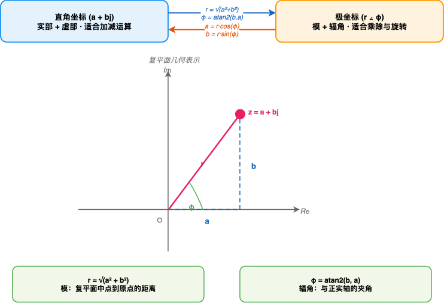
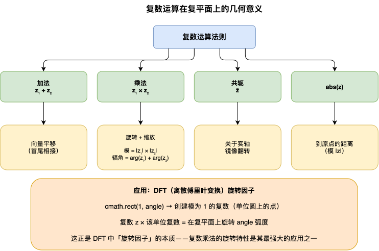

---
group:
  title: 【02】基础数据类型和类型系统
  order: 2
order: 7
title: complex复数类型
nav:
  title: Python基础
  order: 1
---

# complex复数类型

## 1. 介绍

### 1.1 什么是复数

复数（Complex Number）是数学中的一个基本概念，由实部和虚部两部分组成，写作 `a + bj`，其中 `a` 是实部、`b` 是虚部、`j` 是虚数单位（满足 `j² = -1`）。在数学中虚数单位通常写成 `i`，但 Python 沿用了工程学惯例使用 `j`（因为在电气工程中 `i` 已经被用来表示电流）。

你可以在脑海中把复数想象成一个二维坐标点：实部是 x 轴坐标，虚部是 y 轴坐标。`3 + 4j` 就是坐标 (3, 4)，而 `3 - 4j` 则是 (3, -4)。复数的各种运算在这个二维平面上都有直观的几何意义——加法是向量平移，乘法是旋转加缩放。

在 Python 的类型体系中，`complex` 是内置的数值类型之一。`int`、`float`、`bool` 都属于"一维"数值（只有一个分量），而 `complex` 是"二维"数值——这也是为什么 `int` 和 `float` 之间可以隐式转换（一维到一维），但从 `complex` 转回 `int`/`float` 需要显式取舍（丢掉一个维度）。

**最简示例**

```python
z = 3 + 4j
print(z)          # (3+4j)
print(type(z))    # <class 'complex'>
```

运行结果：

```text
(3+4j)
<class 'complex'>
```

这就是 Python 中创建复数最直接的方式——直接写字面量。`3` 是实部，`4j` 是虚部，`j` 标记这是一个虚数。

### 1.2 complex 解决什么问题

在日常编程中，复数并不像 `int` 和 `float` 那样常见，但在以下领域它是不可或缺的：

| 领域 | 复数的作用 | 典型场景 |
|------|-----------|---------|
| 信号处理 | IQ 采样、傅里叶变换 | 复数乘法 = 旋转 + 缩放 |
| 电气工程 | 交流电路阻抗、相量分析 | 阻抗串联 = 复数加法 |
| 量子计算 | 量子态、概率幅 | 态叠加用复数线性组合 |
| 控制理论 | 传递函数、极点分析 | 极点位置决定系统稳定性 |
| 科学计算 | 复数微分方程、波动力学 | 复指数表示正弦波 |

如果没有 `complex` 类型，你需要用两个 `float` 变量手动管理实部和虚部，并在每次运算时手写分量公式——这既繁琐又容易出错。Python 把复数做成了内置类型，让你可以直接写 `z1 + z2` 而不是 `(a1+a2) + (b1+b2)j`。

## 2. 核心内容

### 2.1 complex 的创建方式

#### 2.1.1 字面量创建

Python 支持直接在代码中写复数字面量，格式为 `a + bj`，其中 `j`（或大写 `J`）是虚数单位后缀：

```python
z1 = 3 + 4j
print(z1)                # (3+4j)
print(type(z1))          # <class 'complex'>

# 虚部可以是浮点数
z2 = 1.5 + 2.5j
print(z2)                # (1.5+2.5j)

# 纯虚数：实部为 0 时可省略实部
print(3j)                # 3j
print(type(3j))          # <class 'complex'>

# j 大小写均可
print(2j)                # 2j
print(2J)                # 2j

# 虚部为 1 时必须写 1j，不能只写 j
print(1j)                # 1j
# print(j)   # NameError: name 'j' is not defined
```

运行结果：

```text
(3+4j)
<class 'complex'>
(1.5+2.5j)
3j
<class 'complex'>
2j
2j
1j
```

**关键细节**：`1j` 是一个合法的复数字面量，但 `j` 不是——单独的 `j` 会被 Python 当作变量名。必须写成 `1j`、`2j` 等带有数字前缀的形式。

#### 2.1.2 complex() 构造函数

`complex()` 内置函数提供了更灵活的创建方式，支持从数字、字符串等多种来源构造复数。

```python
# complex(real) —— 只传实部，虚部默认为 0
print(complex(3))        # (3+0j)
print(complex(3.5))      # (3.5+0j)

# complex(real, imag) —— 分别指定实部和虚部
print(complex(3, 4))     # (3+4j)
print(complex(1.5, -2))  # (1.5-2j)

# 从 bool 构造
print(complex(True))     # (1+0j)
print(complex(False))    # (0+0j)
```

运行结果：

```text
(3+0j)
(3.5+0j)
(3+4j)
(1.5-2j)
(1+0j)
(0+0j)
```

**实际场景**：从传感器读数构造复数——例如通信系统中从 I（同相）和 Q（正交）两路通道生成复数采样：

```python
i_channel = [0.8, 0.3, -0.5, -0.9]
q_channel = [0.1, 0.7, 0.6, -0.2]
iq_samples = [complex(i, q) for i, q in zip(i_channel, q_channel)]
print(f"IQ 采样: {iq_samples}")
```

运行结果：

```text
IQ 采样: [(0.8+0.1j), (0.3+0.7j), (-0.5+0.6j), (-0.9-0.2j)]
```

#### 2.1.3 从字符串构造

`complex()` 还可以解析字符串形式的复数：

```python
print(complex("3+4j"))      # (3+4j)
print(complex("3-4j"))      # (3-4j)
print(complex("-1.5+2.5j")) # (-1.5+2.5j)
print(complex("1e2+3j"))    # (100+3j) —— 支持科学计数法
print(complex("3+4J"))      # (3+4j) —— J 大小写均可
print(complex("4j"))        # 4j —— 纯虚数
print(complex("3"))         # (3+0j) —— 纯实数
```

运行结果：

```text
(3+4j)
(3-4j)
(-1.5+2.5j)
(100+3j)
(3+4j)
4j
(3+0j)
```

**注意**：字符串中 `+` 或 `-` 两侧不能有空格，否则会抛出 `ValueError`：

```python
# print(complex("3 + 4j"))  # ValueError: complex() arg is a malformed string
```

### 2.2 complex 的属性与方法

#### 2.2.1 real 和 imag 属性

`complex` 对象有两个只读属性 `.real` 和 `.imag`，分别返回实部和虚部。返回值类型始终为 `float`，即使你创建时用的是整数。

```python
z = 3 + 4j
print(f"实部 real = {z.real}")    # 3.0
print(f"虚部 imag = {z.imag}")    # 4.0
print(f"real 类型: {type(z.real)}")  # <class 'float'>

# 即使用整数创建，real/imag 仍返回 float
z_int = 1 + 2j
print(f"real={z_int.real}, imag={z_int.imag}")  # 1.0, 2.0

# real 和 imag 是只读的
# z.real = 5   # AttributeError: readonly attribute
```

运行结果：

```text
实部 real = 3.0
虚部 imag = 4.0
real 类型: <class 'float'>
real=1.0, imag=2.0
```

#### 2.2.2 conjugate() 方法

`.conjugate()` 返回共轭复数——实部不变，虚部取反。数学上 `z̄ = a - bj`。

```python
z = 3 + 4j
z_bar = z.conjugate()
print(f"共轭复数: {z_bar}")   # (3-4j)
```

运行结果：

```text
共轭复数: (3-4j)
```

共轭复数在实际中非常有用。一个重要公式是：复数的模可通过 `z * z̄` 的平方根计算。

```python
# |z|² = z × z̄ = a² + b²
z = 3 + 4j
magnitude_sq = z * z.conjugate()
print(f"z × z̄ = {magnitude_sq}")   # (25+0j)
print(f"|z| = {abs(z)}")            # 5.0
```

运行结果：

```text
z × z̄ = (25+0j)
|z| = 5.0
```

**实际场景**：通信信号中计算信号功率——复基带信号的功率等于模的平方，即 `z * z̄` 的实部：

```python
signal = 0.7 + 0.2j
power = signal * signal.conjugate()
print(f"信号功率 = {power.real:.4f} W")  # 0.5300
```

运行结果：

```text
信号功率 = 0.5300 W
```

#### 2.2.3 属性速查表

| 属性/方法 | 返回类型 | 说明 | 示例 |
|----------|---------|------|------|
| `.real` | `float` | 实部（只读） | `(3+4j).real` → `3.0` |
| `.imag` | `float` | 虚部（只读） | `(3+4j).imag` → `4.0` |
| `.conjugate()` | `complex` | 共轭复数 | `(3+4j).conjugate()` → `(3-4j)` |

### 2.3 complex 的算术运算

#### 2.3.1 四则运算

`complex` 支持完整的四则运算，运算规则遵循复数运算法则：

```python
z1 = 3 + 4j
z2 = 1 + 2j

# 加法：对应分量相加
print(f"{z1} + {z2} = {z1 + z2}")   # (4+6j)

# 减法
print(f"{z1} - {z2} = {z1 - z2}")   # (2+2j)

# 乘法：(a+bj)(c+dj) = (ac-bd) + (ad+bc)j
print(f"{z1} * {z2} = {z1 * z2}")   # (-5+10j)

# 除法：分母有理化，乘以共轭
print(f"{z1} / {z2} = {z1 / z2}")   # (2.2-0.4j)
```

运行结果：

```text
(3+4j) + (1+2j) = (4+6j)
(3+4j) - (1+2j) = (2+2j)
(3+4j) * (1+2j) = (-5+10j)
(3+4j) / (1+2j) = (2.2-0.4j)
```

复数乘法的几何意义是"旋转 + 缩放"。两个复数相乘时，结果的模等于两个模的乘积，结果的辐角等于两个辐角之和。这就是为什么在信号处理中，复数乘法常被用来表示信号的相位旋转。

#### 2.3.2 幂运算

```python
z = 3 + 4j

# 正整数幂
print(f"{z} ** 2 = {z ** 2}")     # (-7+24j)

# 负整数幂
print(f"{z} ** -1 = {z ** -1}")   # (0.12-0.16j)
```

运行结果：

```text
(3+4j) ** 2 = (-7+24j)
(3+4j) ** -1 = (0.12-0.16j)
```

#### 2.3.3 与 int/float 的混合运算

`complex` 与 `int`/`float` 混合运算时，标量被视为虚部为 0 的复数，类型自动提升为 `complex`：

```python
z = 3 + 4j
print(f"{z} + 2 = {z + 2}")       # (5+4j)
print(f"{z} * 2.0 = {z * 2.0}")   # (6+8j)
print(f"{z} / 2 = {z / 2}")       # (1.5+2j)
```

运行结果：

```text
(3+4j) + 2 = (5+4j)
(3+4j) * 2.0 = (6+8j)
(3+4j) / 2 = (1.5+2j)
```

#### 2.3.4 一元运算符与 abs()

```python
z = 3 + 4j

# 正号（无变化）
print(f"+{z} = {+z}")     # (3+4j)

# 负号（取反）
print(f"-{z} = {-z}")     # (-3-4j)

# abs() 返回模（浮点数），不是复数
print(f"abs({z}) = {abs(z)}")           # 5.0
print(f"abs 类型: {type(abs(z))}")       # <class 'float'>
```

运行结果：

```text
+(3+4j) = (3+4j)
-(3+4j) = (-3-4j)
abs((3+4j)) = 5.0
abs 类型: <class 'float'>
```

**关键点**：`abs()` 作用于复数时返回的是模（`float` 类型），而非复数本身。模的几何意义是复数在复平面上到原点的距离——对 `3 + 4j` 来说就是直角三角形的斜边 `√(3² + 4²) = 5`。

#### 2.3.5 实际场景：交流电路阻抗计算

```python
# 交流电路中阻抗串联直接相加，并联用积除以和
Z1 = 100 + 50j      # 电阻 100Ω，感抗 50Ω
Z2 = 80 - 30j       # 电阻 80Ω，容抗 30Ω

# 串联总阻抗 = Z1 + Z2
Z_series = Z1 + Z2
print(f"串联总阻抗: {Z_series} Ω")   # (180+20j)

# 并联总阻抗 = (Z1 * Z2) / (Z1 + Z2)
Z_parallel = (Z1 * Z2) / (Z1 + Z2)
print(f"并联总阻抗: {Z_parallel:.2f} Ω")  # (55.91+4.27j)
```

运行结果：

```text
串联总阻抗: (180+20j) Ω
并联总阻抗: (55.91+4.27j) Ω
```

### 2.4 cmath 复数数学函数

#### 2.4.1 为什么需要 cmath

Python 的 `math` 模块只处理实数——对复数操作会报错。`cmath` 模块是 `math` 的复数版本，支持复数定义域。

```python
import math, cmath

# math.sqrt 对负数报错
# math.sqrt(-1)   # ValueError: math domain error

# cmath.sqrt 对负数返回虚数
print(cmath.sqrt(-1))    # 1j
print(cmath.sqrt(-4))    # 2j

# 对正数也返回复数形式
print(cmath.sqrt(4))     # (2+0j)
```

运行结果：

```text
1j
2j
(2+0j)
```

#### 2.4.2 cmath 核心函数

```python
import cmath, math

# 指数：欧拉公式 e^(jθ) = cosθ + j·sinθ
z = 1j * math.pi / 2
print(f"e^(jπ/2) = {cmath.exp(z):.4f}")    # ≈ (0+1j)

# 对数
print(f"cmath.log(-1) = {cmath.log(-1):.4f}")  # ≈ 3.1416j

# 三角函数
z = 2 + 3j
print(f"cmath.sin({z}) = {cmath.sin(z):.4f}")
print(f"cmath.cos({z}) = {cmath.cos(z):.4f}")

# 反三角函数（能处理实数函数中"无定义"的域）
print(f"cmath.asin(2) = {cmath.asin(2):.4f}")  # 实数 asin(2) 无定义，复数有结果
```

运行结果：

```text
e^(jπ/2) = (0.0000+1.0000j)
cmath.log(-1) = 0.0000+3.1416j
cmath.sin((2+3j)) = (9.1545-4.1689j)
cmath.cos((2+3j)) = (-4.1896-9.1092j)
cmath.asin(2) = (1.5708-1.3170j)
```

#### 2.4.3 cmath 函数速查表

| 函数 | 说明 | 输入 | 输出 |
|------|------|------|------|
| `cmath.sqrt(z)` | 平方根 | 复数/实数 | 复数 |
| `cmath.exp(z)` | 指数 e^z | 复数 | 复数 |
| `cmath.log(z)` | 自然对数 | 复数 | 复数 |
| `cmath.log10(z)` | 常用对数 | 复数 | 复数 |
| `cmath.sin(z)` / `cos(z)` / `tan(z)` | 三角函数 | 复数 | 复数 |
| `cmath.asin(z)` / `acos(z)` / `atan(z)` | 反三角函数 | 复数 | 复数 |
| `cmath.sinh(z)` / `cosh(z)` / `tanh(z)` | 双曲函数 | 复数 | 复数 |
| `cmath.polar(z)` | 转极坐标 → `(r, phi)` | 复数 | 元组 |
| `cmath.rect(r, phi)` | 极坐标转复数 | 浮点 + 浮点 | 复数 |
| `cmath.phase(z)` | 取辐角 | 复数 | 浮点 |

#### 2.4.4 cmath 常量

```python
import cmath

print(cmath.pi)       # 3.141592653589793
print(cmath.e)        # 2.718281828459045
print(cmath.infj)     # infj
print(cmath.nanj)     # nanj
```

运行结果：

```text
3.141592653589793
2.718281828459045
infj
nanj
```

`cmath.infj` 和 `cmath.nanj` 是复数特有的无穷大和 NaN（虚部为 inf/nan，实部为 0），用于特殊值处理。

#### 2.4.5 实际场景：求解一元二次方程（复数根）

```python
import cmath

def solve_quadratic(a, b, c):
    """求解一元二次方程 ax² + bx + c = 0，返回两个根。"""
    discriminant = b ** 2 - 4 * a * c
    sqrt_d = cmath.sqrt(discriminant)  # 用 cmath 确保负判别式不报错
    x1 = (-b + sqrt_d) / (2 * a)
    x2 = (-b - sqrt_d) / (2 * a)
    return x1, x2

# x² + 1 = 0 → 根为 ±j
print(solve_quadratic(1, 0, 1))    # (1j, -1j)

# x² - 2x + 5 = 0 → 根为 1±2j
print(solve_quadratic(1, -2, 5))   # ((1+2j), (1-2j))

# 实根方程也正常
print(solve_quadratic(1, -5, 6))   # ((3+0j), (2+0j))
```

运行结果：

```text
(1j, (-0-1j))
((1+2j), (1-2j))
((3+0j), (2+0j))
```

使用 `cmath.sqrt` 而非 `math.sqrt`，代码无需判断判别式正负，统一处理实数根和复数根。

### 2.5 极坐标与相位

#### 2.5.1 直角坐标与极坐标

复数有两种等价的表示方式：

- **直角坐标**：`a + bj`（实部 + 虚部）—— 适合加减运算
- **极坐标**：`r∠φ`（模 + 辐角）—— 适合乘除运算和旋转



Python 通过 `cmath.polar()` 和 `cmath.rect()` 在两种表示之间转换：

```python
import cmath, math

z = 1 + 1j

# polar: 直角坐标 → 极坐标，返回 (模, 辐角)
r, phi = cmath.polar(z)
print(f"polar({z}) = ({r:.4f}, {phi:.4f} rad)")  # (1.4142, 0.7854)
print(f"辐角换算角度: {math.degrees(phi):.1f}°")   # 45.0°

# rect: 极坐标 → 直角坐标（复数）
z_recovered = cmath.rect(r, phi)
print(f"rect({r:.4f}, {phi:.4f}) = {z_recovered}")  # ≈ (1+1j)
```

运行结果：

```text
polar((1+1j)) = (1.4142, 0.7854 rad)
辐角换算角度: 45.0°
rect(1.4142, 0.7854) = (1+1j)
```

#### 2.5.2 phase() 与 abs()

如果你只需要辐角或只需要模，可以使用更直接的函数：

```python
import cmath, math

z = 1 + 1j

# cmath.phase(z) 只取辐角，等价于 polar(z)[1]
print(f"phase({z}) = {cmath.phase(z):.4f} rad")  # 0.7854

# abs(z) 只取模，等价于 polar(z)[0]
print(f"abs({z}) = {abs(z):.4f}")  # 1.4142
```

运行结果：

```text
phase((1+1j)) = 0.7854 rad
abs((1+1j)) = 1.4142
```

#### 2.5.3 各象限复数的极坐标

```python
import cmath, math

points = [
    (1, 1,    "第一象限"),
    (-1, 1,   "第二象限"),
    (-1, -1,  "第三象限"),
    (1, -1,   "第四象限"),
    (1, 0,    "正实轴"),
    (-1, 0,   "负实轴"),
    (0, 1,    "正虚轴"),
    (0, -1,   "负虚轴"),
]

for real, imag, desc in points:
    z = complex(real, imag)
    r, phi = cmath.polar(z)
    print(f"  {desc:6s}: z={z}, 模={r:.4f}, 辐角={math.degrees(phi):.1f}°")
```

运行结果：

```text
  第一象限: z=(1+1j), 模=1.4142, 辐角=45.0°
  第二象限: z=(-1+1j), 模=1.4142, 辐角=135.0°
  第三象限: z=(-1-1j), 模=1.4142, 辐角=-135.0°
  第四象限: z=(1-1j), 模=1.4142, 辐角=-45.0°
  正实轴: z=(1+0j), 模=1.0000, 辐角=0.0°
  负实轴: z=(-1+0j), 模=1.0000, 辐角=180.0°
  正虚轴: z=1j, 模=1.0000, 辐角=90.0°
  负虚轴: z=(-0-1j), 模=1.0000, 辐角=-90.0°
```

辐角范围为 `(-π, π]`，由 `atan2(imag, real)` 决定。`atan2` 能正确处理各象限的符号，比 `atan(b/a)` 更可靠（后者在 `a < 0` 时会丢失象限信息）。

#### 2.5.4 实际场景：相量法分析交流电路

```python
import cmath, math

# 电压相量 V = Vm∠φ_v，电流相量 I = Im∠φ_i
# 阻抗 Z = V / I
V = cmath.rect(220, math.radians(30))     # 220V，初相 30°
I = cmath.rect(10, math.radians(-15))     # 10A，初相 -15°
Z = V / I
r_z, phi_z = cmath.polar(Z)
print(f"电压相量 V = {V:.2f}")
print(f"电流相量 I = {I:.2f}")
print(f"阻抗 |Z| = {r_z:.2f} Ω, 相角 = {math.degrees(phi_z):.1f}°")
```

运行结果：

```text
电压相量 V = 190.53+110.00j
电流相量 I = 9.66-2.59j
阻抗 |Z| = 22.00 Ω, 相角 = 45.0°
```

极坐标形式直接表达了"模 = 幅值比、辐角 = 相位差"的物理含义。

### 2.6 complex 与其他类型的转换

#### 2.6.1 int/float → complex（隐式提升）

在算术运算中，`int`/`float` 会自动提升为 `complex`，无需显式转换：

```python
z = 3 + 4j
print(f"2 + {z} = {2 + z}")         # (5+4j)
print(f"2.5 * {z} = {2.5 * z}")     # (7.5+10j)
```

也可以用 `complex()` 显式转换：

```python
print(complex(5))       # (5+0j)
print(complex(5.0))     # (5+0j)
print(complex(True))    # (1+0j)
print(complex(False))   # (0+0j)
```

#### 2.6.2 complex → int/float（必须显式取舍）

复数是"二维"的，不能直接转换为"一维"的 `int`/`float`——必须先决定取实部、虚部还是模：

```python
z = 3 + 4j

# 直接转换会报错
# int(z)    # TypeError: can't convert complex to int
# float(z)  # TypeError: can't convert complex to float

# 正确做法：先取 real/imag，再转
print(int(z.real))      # 3
print(float(z.real))    # 3.0
print(float(z.imag))    # 4.0
print(int(abs(z)))      # 5 —— 模值转 int
```

运行结果：

```text
3
3.0
4.0
5
```

#### 2.6.3 bool(complex)

`complex` 的布尔规则：只有 `(0+0j)` 为 `False`，其余全为 `True`（只要实部或虚部非零即为真）：

```python
print(bool(0 + 0j))     # False
print(bool(0 + 1j))     # True —— 虚部非零
print(bool(1 + 0j))     # True —— 实部非零
print(bool(complex(0, 0)))  # False
```

运行结果：

```text
False
True
True
False
```

#### 2.6.4 complex → str 与格式化

`str()` 和 `repr()` 都会输出 Python 复数字面量格式：

```python
z = 3 + 4j
print(str(z))    # (3+4j)
print(repr(z))   # (3+4j)

# 控制精度：分别取 real/imag 后格式化
print(f"{z.real:.2f} + {z.imag:.2f}j")   # 3.00 + 4.00j
```

**注意**：`f"{z:.2f}"` 对复数也可以使用（Python 3.6+），但分别格式化 `real` 和 `imag` 更灵活。

#### 2.6.5 str → complex

`complex()` 可解析纯数字字符串（含正负号、指数）：

```python
print(complex("3+4j"))       # (3+4j)
print(complex("-1.5+2.5j"))  # (-1.5+2.5j)
print(complex("1e2+3j"))     # (100+3j) —— 科学计数法
print(complex("3+4J"))       # (3+4j) —— J 大小写均可
```

**注意**：字符串中运算符两侧不能有空格：

```python
# print(complex("3 + 4j"))  # ValueError
```

#### 2.6.6 转换速查表

| 源类型 → 目标类型 | 方式 | 说明 |
|-------------------|------|------|
| int → complex | `complex(x)` 或隐式提升 | 虚部为 0 |
| float → complex | `complex(x)` 或隐式提升 | 虚部为 0 |
| bool → complex | `complex(x)` | True→(1+0j), False→(0+0j) |
| str → complex | `complex(s)` | 必须是合法复数字符串 |
| complex → int | `int(z.real)` 或 `int(abs(z))` | 必须显式取一维 |
| complex → float | `float(z.real)` 或 `float(z.imag)` | 必须显式取一维 |
| complex → bool | `bool(z)` | 仅 (0+0j) 为 False |
| complex → str | `str(z)` | 输出 "(a+bj)" 格式 |
| complex → tuple | `(z.real, z.imag)` | 返回 (float, float) |

## 3. 最佳实践

### 3.1 推荐 vs 不推荐写法对比

| 场景 | 推荐 | 不推荐 | 原因 |
|------|------|--------|------|
| 创建纯虚数 | `3j` | `complex(0, 3)` | 字面量更简洁 |
| 创建一般复数 | `3 + 4j` | `complex(3, 4)` | 字面量直观 |
| 从变量创建 | `complex(a, b)` | `a + b*1j` | `complex()` 更清晰 |
| 求模 | `abs(z)` | `math.sqrt(z.real**2 + z.imag**2)` | 内置更高效 |
| 求辐角 | `cmath.phase(z)` | `math.atan2(z.imag, z.real)` | 语义更明确 |
| 输入负数开方 | `cmath.sqrt(-1)` | `math.sqrt(-1)` | `math` 会对负数报错 |
| 字符串解析 | `complex("3+4j")` | 手动解析字符串 | 内置解析更可靠 |

### 3.2 math 与 cmath 的选择

| 特征 | math | cmath |
|------|------|-------|
| 输入类型 | `int`/`float` | `int`/`float`/`complex` |
| 对负数开方 | `ValueError` | 返回虚数 |
| 返回类型 | `int`/`float` | 通常为 `complex` |
| 常量 | `math.pi`, `math.e` | `cmath.pi`, `cmath.e`（相同值） |
| 特殊值 | `math.inf`, `math.nan` | `cmath.infj`, `cmath.nanj` |

**选择原则**：如果你的输入可能是复数，或定义域可能超出实数范围（如对负数开方），用 `cmath`；如果只处理实数，用 `math` 更直观（返回类型明确为 `float`）。

### 3.3 常见错误模式及修正

**错误模式 1：对复数用 math 函数**

```python
import math

z = 3 + 4j
# math.sqrt(z)  # TypeError: can't convert complex to float

# 修正：用 cmath
import cmath
print(cmath.sqrt(z))   # (2+1j)
```

**错误模式 2：直接将 complex 转为 int/float**

```python
z = 3 + 4j
# int(z)    # TypeError: can't convert complex to int
# float(z)  # TypeError: can't convert complex to float

# 修正：先取 real/imag
print(int(z.real))   # 3
```

**错误模式 3：混淆 abs() 对复数和实数的行为**

```python
z = 3 + 4j
print(abs(z))         # 5.0 —— 模，不是复数本身
print(abs(z).type)    # <class 'float'>，不是 complex

# 如果需要保留复数形式的"绝对值"概念，用模的平方
print(z * z.conjugate())  # (25+0j) —— 模的平方，仍为复数
```

**错误模式 4：字符串解析时空格使用不当**

```python
# print(complex("3 + 4j"))   # ValueError
# print(complex("3+ 4j"))    # ValueError
print(complex("3+4j"))      # (3+4j) —— 正确：运算符两侧无空格
```

## 4. 原理

### 4.1 为什么 complex.real/imag 返回 float 而非 int

Python 中 `complex` 的实部和虚部统一使用 `float` 存储，即使创建时用的是整数。这是 CPython 的设计选择：

```python
z = 1 + 2j
print(type(z.real))   # <class 'float'>
print(type(z.imag))   # <class 'float'>
```

原因在于 `complex` 的底层实现是两个 C 语言的 `double`。统一用 `double` 可以避免 `int` + `float` 混合时的类型判断开销，也使得复数运算的实现更简洁。代价是整数复数会有浮点表示的精度问题（虽然对 `real`/`imag` 来说通常不影响）。

### 4.2 复数运算的底层机制

CPython 中 `complex` 的运算由 C 层面直接实现，不需要像自定义类那样经过 `__add__` 等方法的 Python 层调度。这意味着：

- `z1 + z2` 在 C 层面就是 `(a1+a2, b1+b2)` 的两个 `double` 加法
- `z1 * z2` 就是 `(a1*a2-b1*b2, a1*b2+a1*b2)` 的四个 `double` 乘加
- `abs(z)` 就是 `hypot(real, imag)`，调用 C 标准库的 `hypot` 函数避免溢出

这也解释了为什么 `abs(z)` 返回 `float` 而非 `complex`——模是一个标量值，在 C 层面就是 `hypot` 返回的 `double`。

### 4.3 复数在复平面上的几何意义

复数的各种运算在复平面上有直观的几何解释，理解这些几何意义能帮助你更好地使用 `complex`：



复数乘法的"旋转"特性是其最强大的应用之一。在信号处理中，`cmath.rect(1, angle)` 创建一个模为 1 的复数（单位圆上的点），乘以这个复数就等于在复平面上旋转 `angle` 弧度——这就是 DFT（离散傅里叶变换）中"旋转因子"的本质。

### 4.4 为什么 Python 用 j 而不是 i

数学中虚数单位是 `i`，但 Python 用 `j`。这沿用了电气工程的惯例：在电路分析中，`i` 已经被用来表示交流电流，为了避免冲突，工程师们改用 `j` 表示虚数单位。Python 的这个选择使得在工程领域的代码更自然，但对于数学背景的用户可能需要适应。

## 5. 总结

本文围绕 Python 的 `complex` 复数类型展开，主要介绍了以下内容：

- `complex` 是 Python 内置数值类型，由 `real`（实部）和 `imag`（虚部）组成，虚数单位用 `j` 表示
- 创建方式包括字面量（`3 + 4j`）、`complex()` 构造函数（`complex(3, 4)`）和字符串解析（`complex("3+4j")`）
- 核心属性：`.real` 和 `.imag` 返回 `float` 类型的实部虚部（只读），`.conjugate()` 返回共轭复数
- 算术运算：四则运算遵循复数运算法则，乘法几何意义为"旋转 + 缩放"，`abs()` 返回模（`float`），支持与 `int`/`float` 混合运算
- `cmath` 模块提供复数定义域的数学函数（`sqrt`、`exp`、`log`、`sin` 等），`math` 模块对复数会报错
- 极坐标与直角坐标的互换：`cmath.polar()` / `cmath.rect()` / `cmath.phase()` / `abs()`，辐角范围为 `(-π, π]`
- 类型转换：`int`/`float` 可隐式提升为 `complex`；`complex` 转 `int`/`float` 必须显式取 `real`/`imag`/`abs`；`bool(complex)` 仅 `(0+0j)` 为 `False`
- `math` 与 `cmath` 的选择原则：处理复数或负数开方用 `cmath`，只处理实数用 `math`
- 复数运算在 CPython 中由 C 层面直接实现（两个 `double`），`abs(z)` 调用 C 标准库 `hypot` 函数
- Python 用 `j` 而非 `i` 表示虚数单位，沿用电气工程惯例（`i` 在电路中表示电流）
