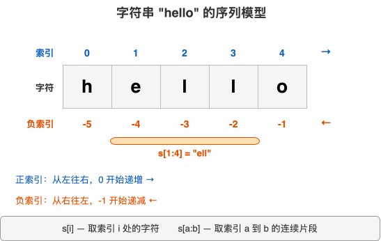
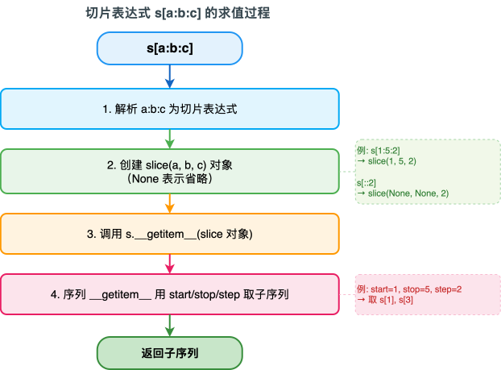
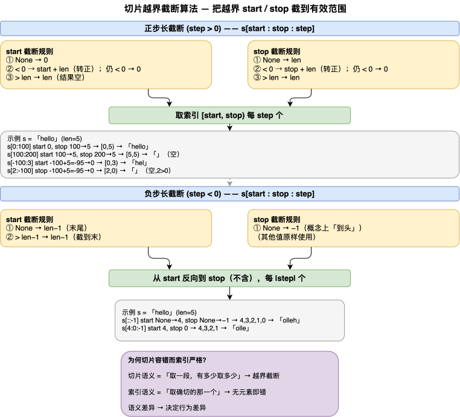

---
group:
  title: 【03】字符串介绍
  order: 3
order: 2
title: 字符串索引与切片
nav:
  title: Python基础
  order: 1
---

# 字符串索引与切片

## 1. 介绍

### 1.1 什么是索引与切片

索引（indexing）和切片（slicing）是 Python 序列类型最核心的取值操作。索引取单个元素，切片取一段子序列。字符串作为序列类型，天然支持这两种操作。

**索引**：用 `s[i]` 取第 i 个字符（正索引从 0 起，负索引从 -1 起）。索引取单个，越界报错。

```python
s = "hello"
print(s[0])     # h —— 正索引，第一个
print(s[-1])    # o —— 负索引，最后一个
print(s[4])     # o —— 正索引，第五个
# s[10]        # IndexError! 越界报错
```

**切片**：用 `s[start:stop:step]` 取一段子串。切片取一段，越界自动截断不报错。

```python
s = "hello world"
print(s[0:5])    # hello —— 从索引 0 到 4（含 0 不含 5）
print(s[6:])     # world —— 从 6 到末尾
print(s[::-1])   # dlrow olleh —— 反转
```

索引和切片是所有 Python 序列的通用语法——`str`、`list`、`tuple` 用法完全一致。掌握字符串的索引切片，也就掌握了 list/tuple 的索引切片。本篇以字符串为例讲解，差异之处会注明。

### 1.2 索引与切片的核心区别

| 维度 | 索引 `s[i]` | 切片 `s[a:b]` |
|------|------------|--------------|
| 取什么 | 单个元素（一个字符） | 一段子序列（子字符串） |
| 越界行为 | IndexError（报错） | 自动截断（不报错，可能返回空） |
| 返回类型 | str（单字符字符串） | str（子串，可能是空串） |
| 语法 | `s[i]` | `s[start:stop:step]` |

理解这个区别是本篇的关键——索引"取确切的一个"，越界即错；切片"取一段，有多少取多少"，越界截断。

### 1.3 字符串的序列模型

字符串是不可变的 Unicode 字符序列。可以把它想象成一排字符格子，每个格子有编号（索引）：



每个字符占一个位置，正索引从 0 开始递增，负索引从 -1 开始递减。`s[i]` 取该位置的字符，`s[a:b]` 取 a 到 b 之间的连续段。

---

## 2. 核心内容

### 2.1 索引：正索引与负索引

**正索引**从 0 开始，最左边的字符是 `s[0]`：

```python
s = "hello"
print(s[0])    # h
print(s[1])    # e
print(s[2])    # l
print(s[3])    # l
print(s[4])    # o
```

**负索引**从 -1 开始，最右边的字符是 `s[-1]`，等价于 `s[len(s)-1]`：

```python
print(s[-1])   # o（最后一个）
print(s[-2])   # l（倒数第二）
print(s[-5])   # h（倒数第五 = 第一个）
```

正索引和负索引可以互相换算：负索引 `i` 等价于正索引 `len(s) + i`。`s[-1]` = `s[4]`，`s[-3]` = `s[2]`。

**越界报错**：索引超出范围（正索引 ≥ len 或负索引 < -len）抛 `IndexError`：

```python
# s[5]      # IndexError: string index out of range（>= len 5）
# s[-6]     # IndexError（< -len -5）
# s[100]    # IndexError
```

**实用场景**——取首尾字符、取倒数第 N 个：

```python
# 取首尾字符
filename = "report.csv"
print(filename[0])    # r（首字符）
print(filename[-1])   # v（末字符）

# 取倒数第 N 个（不需计算长度）
print(filename[-4])   # t（倒数第 4 个）
```

负索引取末尾字符的最大优势是**不需求长度**——`s[-1]` 总是最后一个，`s[-3]` 总是倒数第三个，无论字符串多长。

### 2.2 切片基础：左闭右开

切片语法 `s[start:stop]`，取索引 `start` 到 `stop-1` 的连续段——**包含 start，不包含 stop**（左闭右开 `[start, stop)`）：

```python
s = "hello world"   # 索引 0-10
print(s[0:5])     # hello —— 索引 0,1,2,3,4（含 0 不含 5）
print(s[6:11])    # world —— 索引 6,7,8,9,10
print(s[0:1])     # h —— 只取索引 0
print(s[0:0])     # '' —— start==stop，空串
```

**左闭右开的设计优势**：让 `s[a:b] + s[b:c] == s[a:c]`——切片拼接复原，边界值 b 复用不重叠不遗漏：

```python
part1 = s[0:5]     # hello
part2 = s[5:11]    # world
print(part1 + part2 == s[0:11])   # True（拼接复原）
```

**切片长度** = `stop - start`（正步长时）：

```python
print(len(s[0:5]))     # 5（5-0=5）
print(len(s[6:11]))    # 5（11-6=5）
print(len(s[0:3]))     # 3（3-0=3）
```

**start >= stop 时结果为空**（正步长下，无元素满足"start ≤ index < stop"）：

```python
print(s[3:3])     # ''（start==stop）
print(s[5:2])     # ''（start>stop，正向无元素）
print(s[5:0])     # ''（同上）
```

要"反向取"需用负步长（见 2.4 节）。

### 2.3 切片的省略与默认值

切片三参数 `start:stop:step` 都可省略，省略时取默认值。这是切片灵活性的来源。

**省略 start（默认 0）**：

```python
s = "hello world"
print(s[:5])     # hello —— start 省略，等价 s[0:5]
print(s[:11])    # hello world —— 等价 s[0:11]
print(s[:])      # hello world —— start/stop 都省，取全部
```

` s[:]` 省略 start 和 stop，取整个序列。这在 list 中常用于创建浅拷贝副本。

**省略 stop（默认到末尾 len）**：

```python
print(s[6:])     # world —— stop 省略，等价 s[6:11]
print(s[0:])     # hello world —— 等价 s[0:11]
```

` s[start:]` 常用于"取后缀"，如取文件扩展名 `filename[-3:]`。

**省略 step（默认 1）**：

```python
print(s[0:5])     # hello —— step 省略，默认 1
print(s[0:5:1])   # hello —— 显式 step 1，等价
```

**三参数都省 `s[::]`**：

```python
print(s[::])     # hello world —— 全省，等价 s[:]
```

**越界自动截断**——省略的"默认到头/尾"配合"越界截断"，让切片极宽容：

```python
s = "hello"   # 长度 5
print(s[:100])    # hello（stop 100 越界，截到 5）
print(s[2:100])   # llo（从 2 截到 5）
print(s[100:])    # ''（start 100 越界，空）
print(s[-100:3])  # hel（start -100 截到 0，到 3）
```

切片越界（start/stop 超出范围）**自动截断到有效范围，不报错**。这让"取前 N 个" `s[:N]`、"取后 N 个" `s[-N:]` 安全——不需要先判断长度：

```python
# 取前 N 个（无需判长度，N 超长自动截断取全部）
print(s[:3])      # hel（前 3）
print(s[:100])    # hello（N=100 超长，自动取全部，不报错）
# 对比索引:s[100] 会 IndexError，而 s[:100] 不会
```

### 2.4 步长 step：隔行取与反转

步长是切片第三参数，控制"每 step 个取一个"，让切片能"隔行取"甚至"反向取"。

**正步长（隔行取）**：

```python
s = "hello world"
print(s[::2])     # hlowrd —— step 2，每隔一个取（索引 0,2,4,6,8,10）
print(s[::3])     # hlwl —— step 3（索引 0,3,6,9）
print(s[1::2])    # el ol —— 从 1 开始 step 2（索引 1,3,5,7,9）
print(s[0:11:2])  # hlowrd —— start:stop:step 全显式
```

`step=2` 每隔一个取一个（取索引 0,2,4,...），`step=n` 每 n 个取一个。常用于隔行采样、取偶/奇位。

**负步长（反向取）**：

```python
s = "hello"
print(s[::-1])    # olleh —— step -1，从尾到头（经典反转）
print(s[::-2])    # olh —— step -2，反向每隔一个（索引 4,2,0）
print(s[4:0:-1])  # olle —— 从 4 反向到 1（含 4 不含 0，步长 -1）
print(s[-1:-6:-1])# olleh —— 负索引 + 负步长，反转
```

负步长时，**start 应大于 stop**（从大索引往小索引走）。若 step 为负但 start < stop，得空：

```python
print(s[0:4:-1])  # ''（step 负但 start<stop，方向矛盾，空）
print(s[4:0:-1])  # olle（start 4 > stop 0，反向取）
```

`[::-1]` 是经典反转写法——start/stop 都省（负步长时默认 start=len-1、stop=开头），step -1 反向逐个，得反转序列。这是 Python 反转字符串/列表最优雅的写法。

**`[::-1]` vs `.reverse()` vs `reversed()`**——三种反转方式对比：

```python
# [::-1]：创建反转副本（新对象，不改原），适用 str/list/tuple
s = "hello"
r = s[::-1]        # olleh（s 不变）

# .reverse()：list 方法，就地反转（改原，返回 None）
lst = [1, 2, 3]
lst.reverse()      # lst 变 [3,2,1]，返回 None

# reversed()：内置函数，返回反转迭代器（惰性，不改原）
lst = [1, 2, 3]
print(list(reversed(lst)))   # [3, 2, 1]（lst 不变）
```

三种反转按需选：`[::-1]`（新副本，通用）、`.reverse()`（list 就地改原）、`reversed()`（迭代器惰性）。不可变 str 只能用 `[::-1]` 或 `reversed()`。

**步长的常见用法**：

```python
s = "abcdef"
# 取偶数位（索引 0,2,4,...）
print(s[::2])    # ace
# 取奇数位（索引 1,3,5,...）
print(s[1::2])   # bdf
# 反转
print(s[::-1])   # fedcba
# 反向隔行
print(s[::-2])   # fdb
# 去首尾（中间段）
print(s[1:-1])   # bcde
```

**step 不能为 0**：

```python
# s[::0]   # ValueError: slice step cannot be zero
```

step 为 0 抛 `ValueError`（无意义，禁止）。step 必须非 0（正或负）。

### 2.5 负索引切片

切片的 start/stop 都支持负索引，且可与正索引混用：

```python
s = "hello world"   # 长度 11
print(s[-5:])      # world —— 后 5 个（stop 省略，默认末尾）
print(s[-5:-1])    # worl —— 索引 -5 到 -2（含 -5 不含 -1）
print(s[-5:11])    # world —— 负 start 正 stop 混用
print(s[6:-1])     # worl —— 正 start 负 stop 混用
print(s[:-1])      # hello worl —— 去末尾（从头到倒数第 2）
print(s[:-6])      # hello —— 去后 6 个
```

**实用场景**——取后 N 个、去末尾、文件扩展名：

```python
# 取后 N 个（不需长度）
filename = "report.csv"
print(filename[-3:])   # csv（后 3，扩展名）

# 去末尾字符（如去换行符）
line = "hello\n"
print(line[:-1])       # hello（去末尾 \n）

# 去首尾
text = "  hello  "
print(text[1:-1])      # "  hello "（去首尾各一个字符）
```

### 2.6 越界容错：切片 vs 索引

切片的 start/stop 越界时**自动截断到有效边界，不报错**；索引越界则**报 IndexError**。这是两者的核心行为差异。

**切片越界截断规则**：超出范围的 start/stop 被"夹"到有效区间 `[0, len]`，然后取。

```python
s = "hello"   # 长度 5

# stop 越界（>len）：截到 len
print(s[0:100])    # hello（stop 100 → 5）
print(s[3:100])    # lo（stop 100 → 5）

# start 越界（>len）：空
print(s[100:200])  # ''（start 100 → 5，stop 200 → 5，[5,5) 空）
print(s[100:])     # ''

# start 负越界（<-len）：截到 0
print(s[-100:3])   # hel（start -100 → 0，取 [0,3)）
print(s[-100:])    # hello（start -100 → 0，取全部）

# stop 负越界：截到 0
print(s[2:-100])   # ''（stop -100 → 0，取 [2,0) 正向空）
```

**索引 vs 切片越界对比**：

```python
s = "hello"

# 索引越界：报错
try:
    s[10]
except IndexError as e:
    print(f"索引越界: {e}")    # string index out of range

# 切片越界：截断（不报错）
print(s[10:])    # ''（空）
print(s[:10])    # hello（截断到全部）
```

**实际简化**——"取前 N"用切片更安全（不怕超长）：

```python
# 取前 3 个，即使字符串短于 3 也安全
short = "hi"
print(short[:3])    # hi（不够 3 个，自动取全部，不报错）
# 对比索引:
# short[2]   # IndexError
```

### 2.7 字符串不可变：切片不能赋值

字符串不可变，索引赋值和切片赋值都报 `TypeError`。这与 list（可变）形成对比。

**字符串赋值报错**：

```python
s = "hello"
# s[0] = "H"      # TypeError: 'str' object does not support item assignment
# s[0:1] = "H"    # TypeError
```

要"改"字符串只能**新建**——切片 + 拼接：

```python
# 模拟替换首字符
s = "hello"
new = "H" + s[1:]   # Hello（新建新字符串）

# 模拟删除首尾
s2 = s[1:-1]         # ell（切片新建）

# 模拟替换一段
s3 = s[:2] + "XX" + s[4:]   # heXXo（拼接新建）
```

**list 的切片赋值**（对比，体现可变序列的强大）：

```python
lst = [1, 2, 3, 4, 5]

# 索引赋值：替换单个，长度不变
lst[0] = 99         # [99, 2, 3, 4, 5]

# 切片赋值：替换一段，长度可变！
lst[1:3] = [20, 30, 40]   # [99, 20, 30, 40, 4, 5]（替换 2 个为 3 个，变长）
lst[1:3] = []             # [99, 40, 4, 5]（赋空 = 删除）
lst[1:1] = [0, 0]         # [99, 0, 0, 40, 4, 5]（空段赋值 = 插入）
```

list 切片赋值统一了"替换/删除/插入一段"操作，但字符串不支持——这是不可变性的直接体现。

### 2.8 slice 对象

切片 `s[a:b:c]` 在内部创建一个 `slice` 对象，传给序列的 `__getitem__` 方法。理解 `slice` 对象，能动态构造切片、参数化传递。

**`slice` 对象基础**：

```python
s = "hello world"

# s[2:8:2] 等价 s[slice(2, 8, 2)]
sl = slice(2, 8, 2)
print(s[sl])      # loo（等价 s[2:8:2]）
print(sl.start, sl.stop, sl.step)   # 2 8 2（三属性）
```

`slice(start, stop, step)` 创建切片对象，有 `.start`/`.stop`/`.step` 属性。省略的参数为 `None`：

```python
sl = slice(None, 4, None)    # s[:4] 的 slice
print(sl.start)    # None（省略）
```

**slice 对象用于参数化切片**——把切片规则作参数传递/存储：

```python
# 根据模式选不同切片
def get_part(data, mode):
    if mode == "head":
        sl = slice(0, 3)       # 前 3
    elif mode == "tail":
        sl = slice(-3, None)   # 后 3
    else:
        sl = slice(None)        # 全部
    return data[sl]

print(get_part("hello world", "head"))   # hel
print(get_part("hello world", "tail"))    # rld
```

**`.indices(length)` 方法**——把 slice 针对 length 解析为具体 (start, stop, step)：

```python
sl = slice(None, None, -1)    # [::-1] 的 slice
print(sl.indices(5))          # (4, -1, -1)（长度 5：start=4, stop=-1, step=-1）

sl2 = slice(-3, 100, 2)
print(sl2.indices(5))         # (2, 5, 2)（start-3→2, stop100截5, step2）
```

`.indices(length)` 把省略/负值规范化为具体值，并处理越界截断。自定义类实现切片时可用它规范化边界。

### 2.9 切片常用模式速查

以下汇总字符串切片中最常用的模式，日常编码高频出现：

```python
s = "Hello, World!"

# === 取头尾 ===
print(s[:3])        # Hel（前 3）
print(s[-3:])       # ld!（后 3）

# === 去头尾 ===
print(s[1:])        # ello, World!（去首字符）
print(s[:-1])       # Hello, World（去末字符）
print(s[1:-1])       # ello, World（去首尾）

# === 步长取样 ===
print(s[::2])        # Hlo ol!（隔行）
print(s[1::2])       # el,Wrd（奇数位）

# === 反转 ===
print(s[::-1])       # !dlroW ,olleH

# === 越界安全 ===
print(s[:100])       # Hello, World!（截断）
print(s[100:])       # ''（空）

# === 负索引区间 ===
print(s[-5:-2])      # orl

# === 切片拼接复原（左闭右开优势）===
part1 = s[0:5]       # Hello
part2 = s[5:]        # , World!
print(part1 + part2 == s)   # True
```

---

## 3. 最佳实践

### 3.1 取末元素/后 N 个用负索引，不需求长度

```python
s = "hello"
# 推荐：负索引
last = s[-1]          # o（不需求 len）
tail3 = s[-3:]        # llo（后 3）
# 不推荐：正索引 + len
# last = s[len(s)-1]
# tail3 = s[len(s)-3:]
```

负索引取末尾字符简洁、不需求长度。文件扩展名 `filename[-3:]`、去换行 `line[:-1]` 等场景用负索引最自然。

### 3.2 取前 N 个用切片 [:N]，越界安全

```python
s = "hello"
# 推荐：切片取前 N（越界截断，安全）
head3 = s[:3]         # hel
head100 = s[:100]     # hello（N 超长自动截断，不报错）
# 避免：索引取前 N（越界报错）
# s[2]   # OK，但 s[100] IndexError
```

"取前 N 个"用切片 `s[:N]`，N 超长自动截断不报错，比索引 `s[N-1]` 安全。取后 N 同理 `s[-N:]`。

### 3.3 反转用 [::-1]，不改原

```python
# 推荐：[::-1] 创建反转副本（不改原，适用 str/list/tuple）
rev = s[::-1]

# list 就地反转用 .reverse()（改原，返回 None）
# lst.reverse()

# 需迭代反转（惰性）用 reversed()
# for x in reversed(lst): ...
```

三种反转按需选：`[::-1]`（新副本，通用）、`.reverse()`（list 就地改原）、`reversed()`（迭代器惰性）。不可变 str 只能 `[::-1]` 或 `reversed()`。

### 3.4 字符串不可变，"修改"用切片+拼接新建

```python
s = "hello"
# 字符串不可变，不能 s[0]='H'
# 改首字符：切片+拼接
s = "H" + s[1:]      # Hello
# 删首尾：s[1:-1]
# 替换一段：s[:a] + new + s[b:]
# 大量"修改"用 list 缓冲或 StringIO
```

字符串不可变，索引/切片赋值都 TypeError。"修改"靠切片+拼接新建。大量修改用 `list(s)` 后改 list 元素再 `"".join()`。

### 3.5 大量修改字符串转 list 处理

```python
# 避免：大量字符串"修改"（每次新建，O(n²)）
# s = ""
# for chunk in chunks:
#     s = s + chunk

# 推荐：str → list（可变）→ 改 → join 回 str
s = "hello"
chars = list(s)        # ['h','e','l','l','o']（可变）
chars[0] = "H"         # O(1) 改 list
chars.append("!")
result = "".join(chars)   # Hello!
```

字符串每次"修改"都新建 O(n)。转 list 后逐个改是 O(1)，最后 join 回 str。大量修改时性能差距巨大。

### 3.6 切片结果是新对象（浅拷贝），改切片不影响原

```python
lst = [1, 2, 3, 4, 5]
sub = lst[1:4]      # [2, 3, 4]（新 list 对象）
sub[0] = 99
print(lst)           # [1, 2, 3, 4, 5]（原未变，sub 独立）
```

切片是浅拷贝（新容器）。改切片的元素引用不影响原序列。但若元素是可变对象，改元素内部会影响原（浅拷贝共享元素引用）。str 不可变无此问题。

### 3.7 负步长注意方向：start 应大于 stop

```python
# 正步长：start < stop
s[0:5]      # 正向
s[::2]      # 正向隔行

# 负步长：start > stop（从大到小）
s[4:0:-1]   # 反向（4 到 1）→ "olle"
s[::-1]     # 全反转（省略时负步长默认从尾到头）

# 负步长但 start < stop → 空
# s[0:4:-1]   # ''（方向矛盾，空）
```

负步长时 start 必须大于 stop（从大索引往小走），否则空。`[::-1]` 全反转（省略时负步长默认 start=len-1, stop=开头）。

### 3.8 用 slice 对象参数化切片

```python
# 切片规则作参数：用 slice 对象
def process(data, region):
    return data[region]

head = slice(0, 5)
print(process("hello world", head))   # hello
# 比传 (start, stop, step) 三参数清晰，slice 对象直接 data[sl]
```

切片规则需作参数/存储时，用 `slice` 对象（直接 `data[sl]`），比传三参数 (start, stop, step) 清晰。

### 3.9 索引可能越界用 try/except，切片不用

```python
s = "hello"
# 索引可能越界：try/except 或先判长度
try:
    c = s[10]
except IndexError:
    c = ""

# 切片越界自动截断，无需判
sub = s[10:]   # ''（空，不报错）
sub = s[:10]   # hello（截断）
```

索引可能越界时需 try/except 或先判长度。切片越界自动截断不报错——"取前/后 N 可能超长"用切片更安全简洁。

### 3.10 左闭右开用于拼接复原

```python
s = "hello world"
# 左闭右开让切分拼接复原
part1 = s[0:5]    # hello
part2 = s[5:11]   # world
print(part1 + part2 == s[0:11])   # True（拼接复原）
# 利用：按字段切分，边界复用不重叠不遗漏
```

左闭右开让 `s[a:b] + s[b:c] == s[a:c]`（边界 b 复用）。按字段切分时边界值复用，拼接复原——这是左闭右开的设计优势。

---

## 4. 原理

本章讲清索引与切片的底层机制：序列协议（`__getitem__`/`__len__`）、slice 对象的创建与传递、切片越界截断的算法、切片为何创建新对象（浅拷贝）、字符串切片的不可变新建、步长切片的取元素算法。

### 4.1 序列协议与 __getitem__

索引与切片的底层是 Python 的**序列协议**——序列类型实现 `__getitem__` 和 `__len__`，解释器据此支持 `s[i]`/`s[a:b]` 语法。

**`__getitem__` 接收 int 或 slice**：

```python
# s[i] 内部：调 s.__getitem__(i)
# s[a:b:c] 内部：先创建 slice(a,b,c)，再调 s.__getitem__(slice对象)
s = "hello"
print(s.__getitem__(0))        # h（等价 s[0]）
sl = slice(1, 4)
print(s.__getitem__(sl))       # ell（等价 s[1:4]）
```

`s[i]` 调用 `s.__getitem__(i)`（i 是 int）；`s[a:b:c]` 先把 `a:b:c` 包装成 `slice(a,b,c)` 对象，再调 `s.__getitem__(slice对象)`。序列的 `__getitem__` 据参数类型（int/slice）分别处理：

- **int**：取单元素，越界 IndexError
- **slice**：取子序列，越界截断

```python
# 自定义 __getitem__ 示意
class MySeq:
    def __init__(self, data):
        self.data = data

    def __getitem__(self, key):
        if isinstance(key, int):
            return self.data[key]      # 索引
        elif isinstance(key, slice):
            return self.data[key]      # 切片（委托给底层）
```

序列通过 `__getitem__` 统一处理索引与切片。这是 Python 序列协议的关键——索引和切片是同一协议的两种参数形式。

`__len__` 提供长度，索引越界检查依赖它：`s[i]` 若 `i >= len(s)` 或 `i < -len(s)` 抛 IndexError。

### 4.2 slice 对象的创建与传递

切片表达式 `s[a:b:c]` 的求值过程：



```python
# s[1:4] 的求值
# 1. 创建 slice(1, 4, None)（step 省略为 None）
# 2. 调 s.__getitem__(slice(1,4,None))
sl = slice(1, 4, None)
print(sl.start, sl.stop, sl.step)   # 1 4 None
print("hello"[sl])                  # ell
```

省略的参数在 slice 对象中为 `None`，序列的 `__getitem__` 把 None 解释为默认值（start→0, stop→len, step→1）。

**`.indices(length)` 规范化**：把 slice（含 None/负值）针对指定长度解析为具体 (start, stop, step)，都已规范化、无越界：

```python
sl = slice(None, None, -1)    # [::-1]
print(sl.indices(5))          # (4, -1, -1)

sl2 = slice(-3, 100, 2)
print(sl2.indices(5))         # (2, 5, 2)（负索引转正、越界截断）
```

### 4.3 越界截断的算法

切片越界截断的算法——如何把越界的 start/stop 截到有效范围。



**正步长截断（step > 0）**：

```text
对 s[start:stop:step]（step > 0）：

1. start 若 None → 0
   若 < 0 → start + len（转正）
   若仍 < 0 → 0（负越界截到 0）
   若 > len → len（正越界截到 len，结果空）

2. stop 若 None → len
   若 < 0 → stop + len（转正）
   若仍 < 0 → 0
   若 > len → len

3. 取索引 start 到 stop-1，每 step 个
```

```python
s = "hello"   # len 5
# s[0:100]:  start 0, stop 100→5, 取 [0,5) → "hello"
# s[100:200]: start 100→5, stop 200→5, 取 [5,5) → ""（空）
# s[-100:3]: start -100+5=-95→仍负→0, 取 [0,3) → "hel"
# s[2:-100]: stop -100+5=-95→仍负→0, 取 [2,0) → ""（空，2>0）
```

**负步长截断（step < 0）**：

```text
对 s[start:stop:step]（step < 0）：

1. start 若 None → len-1（末尾）
   若 > len-1 → len-1（截到末）
2. stop 若 None → "到头"（概念上 -1）
3. 从 start 反向到 stop（不含 stop），每 |step| 个
```

```python
s = "hello"   # len 5
# s[::-1]:  step -1, start None→4, stop None→-1, 取 4,3,2,1,0 → "olleh"
# s[4:0:-1]: start 4, stop 0, 取 4,3,2,1 → "olle"
```

**为何切片容错而索引严格**：切片语义是"取一段，有多少取多少"，越界截断符合语义。索引语义是"取确切的那一个"，无元素即错。语义差异决定行为差异。

### 4.4 切片为何创建新对象（浅拷贝）

切片总返回**新对象**（同类型子序列），而非原序列的视图。这与 NumPy 的"视图切片"不同。

**切片创建新对象**：

```python
lst = [1, 2, 3, 4, 5]
sub = lst[1:4]      # [2, 3, 4]（新 list）
print(sub is lst)   # False（不同对象）
sub[0] = 99
print(lst)          # [1,2,3,4,5]（原未变）
```

**浅拷贝特性**——外层独立，内层共享：

```python
lst = [[1, 2], [3, 4], [5, 6]]
sub = lst[0:2]      # [[1,2],[3,4]]（新 list，元素是引用）
sub[0][0] = 99      # 改 sub[0] 内部（sub[0] 与 lst[0] 同对象）
print(lst)          # [[99,2],[3,4],[5,6]]（lst[0] 内部被改！浅拷贝共享）
```

切片是浅拷贝——外层容器独立，但元素引用共享。改"引用"（sub[0]=x）不影响原，改"内部"（sub[0][0]=x）影响原。深独立用 `copy.deepcopy`。

**为何切片是拷贝而非视图**：

- **简单性**：拷贝语义直观（切片是新序列，改它不影响原）。视图语义复杂（改切片影响原）。
- **不可变序列无视图意义**：str/tuple 不可变，切片必须新建。为统一，str/list/tuple 切片都拷贝。
- **性能取舍**：list 切片拷贝有 O(k) 开销，但保证简单语义。NumPy 为性能用视图（大数据不拷贝），但增加共享复杂度。

### 4.5 字符串切片的不可变新建

字符串切片与 list 切片机制相似（创建新 str），但因 str 不可变，有特殊性。

**字符串切片新建 str**：

```python
s = "hello"
sub = s[1:4]      # "ell"（新 str 对象）
print(sub is s)   # False（不同对象）
```

字符串切片创建新 str（子串）。因 str 不可变，新 str 也不可变，无"改切片影响原"问题。

**字符串"修改"为何必须新建**：str 不可变，索引/切片赋值都 TypeError。"修改"靠切片+拼接新建，每次 O(n)：

```python
s = "hello"
new = "H" + s[1:]   # Hello（新对象，O(n)）
```

大量修改应转 list（可变，O(1) 改元素），最后 join 回 str：

```python
s = "hello"
chars = list(s)        # ['h','e','l','l','o']
chars[0] = "H"         # O(1)
chars.append("!")
result = "".join(chars)   # Hello!（一次 O(n) 拼接）
```

### 4.6 步长切片的取元素算法

步长切片按 step 间隔取索引，与 `range(start, stop, step)` 同构。

**正步长**：取索引 `start, start+step, start+2*step, ...`，直到 `< stop`：

```python
s = "abcdefgh"   # 索引 0-7
# s[::2]:  索引 0,2,4,6 → "aceg"
# s[1::3]: 索引 1,4,7 → "beh"
print(s[1:7:2])   # bdf（索引 1,3,5，3 个元素）
print(len(range(1, 7, 2)))   # 3（切片元素数 == range 长度）
```

**负步长**：取索引 `start, start+step`（减小），直到 `> stop`：

```python
s = "hello"   # 索引 0-4
# s[::-1]:  索引 4,3,2,1,0 → "olleh"
# s[4:0:-1]: 索引 4,3,2,1 → "olle"
```

**方向匹配规则**：

| step | start/stop 关系 | 结果 |
|------|----------------|------|
| 正 | start < stop | 非空（正向取） |
| 正 | start >= stop | 空 |
| 负 | start > stop | 非空（反向取） |
| 负 | start <= stop | 空 |

```python
s = "hello"
print(s[0:4:1])   # hell（step 正, start<stop, 非空）
print(s[0:4:-1])  # ''（step 负, start<stop, 空）
print(s[4:0:-1])  # olle（step 负, start>stop, 非空）
print(s[4:0:1])   # ''（step 正, start>stop, 空）
```

切片元素数 = `len(range(start, stop, step))`——切片与 range 同构，按 range 的索引取元素。这揭示了切片与 range 的本质联系。

---

## 5. 总结

本文围绕 Python 字符串的索引与切片展开，主要介绍了以下内容：

- **索引与切片定义**：索引取单个字符（越界 IndexError），切片取一段子串（越界截断不报错）；序列通用语法，str/list/tuple 一致。
- **索引**：正索引从 0 起，负索引从 -1 起（等价 `len+i`）；越界报 IndexError；负索引取末/后 N 方便（不需求 len）。
- **切片基础**：左闭右开 `[start,stop)`（含 start 不含 stop，拼接友好 `s[a:b]+s[b:c]==s[a:c]`）；长度 `stop-start`；start>=stop 正向空。
- **省略与默认**：start 省→0、stop 省→len、step 省→1；`[:]` 取全部（浅拷贝惯用法）；越界自动截断（夹到 [0,len]，不报错）。
- **步长 step**：正步长隔行取（`[::2]`），负步长反向（`[::-1]` 反转，负步长需 start>stop）；step 不能 0；三种反转对比（`[::-1]` 副本/`.reverse()` 就地/`reversed()` 迭代器）。
- **负索引切片与越界容错**：切片支持负索引（`s[-N:]` 后 N、`s[:-1]` 去尾）；越界截断（取前 N `s[:N]` 安全），切片宽容 vs 索引严格。
- **字符串不可变**：索引/切片赋值 TypeError；"修改"用切片+拼接新建；list 切片赋值可变长替换/删除/插入，str 不支持。
- **slice 对象**：切片创建 `slice(start,stop,step)` 传 `__getitem__`；省略为 None；可复用/参数化；`.indices(len)` 规范化。
- **原理**：序列协议（`__getitem__` 收 int/slice、`__len__` 越界检查）；slice 对象创建与传递（省略为 None）；越界截断算法（start/stop 夹到 [0,len]、正负步长方向、切片容错 vs 索引严格的语义根源）；切片浅拷贝（新容器、元素引用共享、NumPy 视图对比）；字符串不可变新建（修改靠新建、大量修改转 list）；步长算法（按 step 取索引、与 range 同构、方向匹配决定非空）。
- **最佳实践**：取末/后 N 用负索引、取前 N 用切片安全、反转 `[::-1]` 不改原、str 修改用切片拼接、大量修改转 list、切片浅拷贝注意内层共享、负步长方向、slice 对象参数化、索引越界 try/except 切片不用、左闭右开拼接复原。
