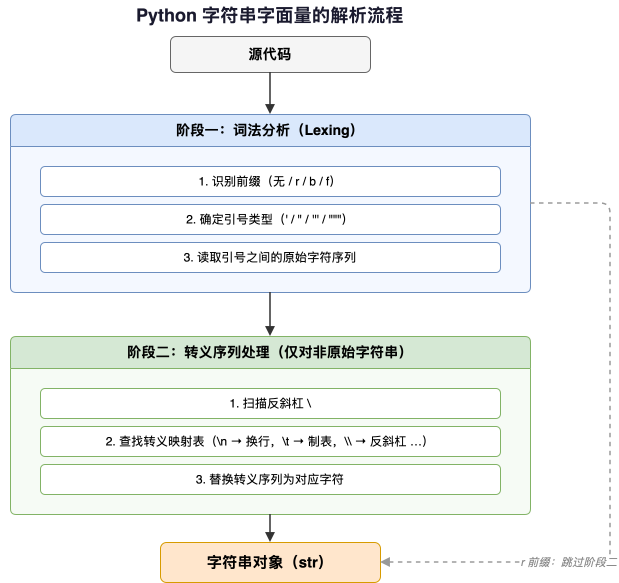
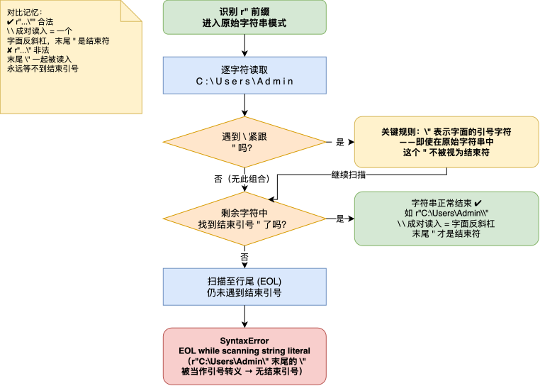
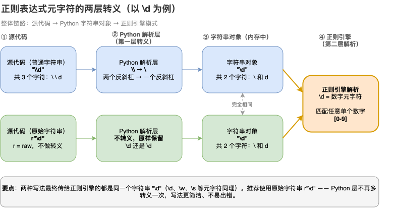

---
group:
  title: 【03】字符串介绍
  order: 3
order: 4
title: 原始字符串
nav:
  title: Python基础
  order: 1
---

# 原始字符串

## 1. 介绍

### 1.1 什么是原始字符串

原始字符串（Raw String）是 Python 中一种特殊的字符串字面量形式，它以 `r` 或 `R` 为前缀（例如 `r"..."` 或 `R'...'`）。在原始字符串中，**反斜杠字符不再被解释为转义引导符**，而是作为普通字符原样保留。这使得原始字符串成为处理反斜杠密集型文本的理想工具。

原始字符串的核心价值：**减少转义，提高可读性**。当字符串内容中包含大量反斜杠时（如文件路径、正则表达式），普通字符串需要将每个反斜杠写成双反斜杠（`\\`），不仅繁琐，还大大降低了代码可读性。原始字符串让开发者"所写即所得"——在代码中看到什么，字符串中就包含什么。

```python
# 普通字符串：反斜杠需要转义
path1 = "C:\\Users\\Admin\\Documents"
print(path1)  # C:\Users\Admin\Documents

# 原始字符串：反斜杠保持原样
path2 = r"C:\Users\Admin\Documents"
print(path2)  # C:\Users\Admin\Documents

# 效果完全一致，但后者可读性更好
print(path1 == path2)  # True
```

上面这段代码清晰展示了原始字符串的核心优势：当你需要表示 Windows 文件路径 `C:\Users\Admin\Documents` 时，普通字符串需要写成 `"C:\\Users\\Admin\\Documents"`（每个 `\` 都要双写），而原始字符串只需写成 `r"C:\Users\Admin\Documents"`，与路径的自然写法几乎一致。

原始字符串虽然以"原始"命名，但它并不是一种全新的数据类型——**它在运行时仍然是普通的 Python 字符串对象**（`str` 类型），只是"在字面量层面上关闭了转义序列解析"。理解这一点有助于后续理解其实现原理。

### 1.2 原始字符串与转义字符的关系

原始字符串与转义字符是"相反"的关系。转义字符让反斜杠 `\` 加上特定字符表示特殊含义（如 `\n` 表示换行），原始字符串则"屏蔽"这种转义机制，让反斜杠回归其字面意义。

```python
# 普通字符串：\n 被解释为换行符（1 个字符）
s1 = "hello\nworld"
print(len(s1))    # 11（\n 是单个字符）
print(repr(s1))   # 'hello\nworld'

# 原始字符串：\n 是两个字符（反斜杠 + n）
s2 = r"hello\nworld"
print(len(s2))    # 12（\ 和 n 分开计算）
print(repr(s2))   # 'hello\\nworld'
```

这种差异在处理特定文本时尤为重要。当你需要表示字面字符串 `\n`（而非换行符）时，原始字符串是更自然的选择：

```python
# 需要表示字面的 "hello\nworld"（不是两行，就是反斜杠+n）
# 普通字符串：需要双重转义
s1 = "hello\\nworld"

# 原始字符串：直接写
s2 = r"hello\nworld"

print(s1 == s2)  # True
```

### 1.3 原始字符串的典型应用场景

原始字符串主要有两大应用场景，都涉及反斜杠的高频使用。

**场景一：Windows 文件路径**

```python
# 普通字符串
config_path = "C:\\Users\\Admin\\config\\settings.ini"

# 原始字符串
config_path = r"C:\Users\Admin\config\settings.ini"
```

Windows 使用反斜杠作为路径分隔符，而反斜杠在 Python 字符串中又是转义引导符——这造成了"双重转义"的不便。原始字符串完美解决了这个问题。

**场景二：正则表达式**

```python
import re

# 普通字符串：每个反斜杠都要双写
pattern1 = "\\d{4}-\\d{2}-\\d{2}"  # 匹配日期

# 原始字符串：所见即所得
pattern2 = r"\d{4}-\d{2}-\d{2}"

# 两者等价，但后者可读性更好
print(pattern1 == pattern2)  # True

# 实际使用
text = "今天是2024-01-15"
result = re.search(r"\d{4}-\d{2}-\d{2}", text)
print(result.group())  # 2024-01-15
```

正则表达式是"反斜杠大本营"：`\d`（数字）、`\w`（单词字符）、`\s`（空白）、`\b`（单词边界）等元字符都离不开反斜杠。**在 Python 社区，编写正则表达式时使用原始字符串是标准惯例和最佳实践**。

### 1.4 原始字符串与其他字符串字面量的关系

Python 有多种字符串字面量形式，它们各有特点：

| 类型 | 前缀 | 特点 | 类型 |
|------|------|------|------|
| 普通字符串 | 无 | 支持转义序列（如 `\n`） | `str` |
| 原始字符串 | `r`/`R` | 不解释转义序列，反斜杠保持原样 | `str` |
| 字节字符串 | `b`/`B` | 存储字节序列 | `bytes` |
| 格式化字符串 | `f`/`F` | 支持表达式插值 | `str` |
| 三引号字符串 | `"""`/`'''` | 可包含换行，支持多行文本 | `str` |

这些前缀可以组合使用（如 `rb"..."` 表示原始字节字符串）。但原始字符串 `r"..."` 仍然是普通的 `str` 类型对象，只是其字面量的解析方式不同。

```python
# 类型验证
s1 = "hello"
s2 = r"hello"
s3 = b"hello"

print(type(s1), type(s2), type(s3))
# <class 'str'> <class 'str'> <class 'bytes'>
print(isinstance(s2, str))  # True（原始字符串是 str 类型）
```

## 2. 核心内容

### 2.1 原始字符串的基本语法

#### 2.1.1 语法形式

原始字符串的语法非常简单：在字符串引号前加上 `r` 或 `R` 前缀即可。

```python
# 单引号原始字符串
s1 = r'hello\nworld'
print(s1)  # hello\nworld（字面输出，而非换行）

# 双引号原始字符串
s2 = r"hello\nworld"
print(s2)  # hello\nworld

# 大写 R（效果相同）
s3 = R"hello\nworld"
print(s3)  # hello\nworld
```

引号的选择（单引号或双引号）不影响原始字符串的行为，选择哪种取决于字符串内容本身是否包含该种引号——与普通字符串的选择原则相同。

```python
# 字符串内容包含单引号，用双引号包围
path = r"C:\Users\Admin's folder"

# 字符串内容包含双引号，用单引号包围
msg = r'He said: "Hello"'

# 两种引号都有时，选一种转义
text = r"He said: \"Hello\""  # 原始字符串中 \" 仍转义引号（见 2.3.2 详解）
```

#### 2.1.2 与普通字符串的等价性

原始字符串在运行时与经过"手动转义"处理的普通字符串是等价的。它们在内存中的表示完全相同，区别仅在于代码的书写方式。

```python
# 原始字符串
raw = r"hello\nworld"

# 等价的普通字符串（手动双重转义）
normal = "hello\\nworld"

# 两者完全等价
print(raw == normal)  # True
print(repr(raw))       # 'hello\\nworld'
print(repr(normal))    # 'hello\\nworld'
```

这种等价性是理解原始字符串工作原理的关键：`r"hello\nworld"` 在运行时会变成与 `"hello\\nworld"` 完全相同的 Unicode 字符串。

### 2.2 原始字符串的详细用法

#### 2.2.1 处理 Windows 文件路径

这是原始字符串最常见的用途。Windows 路径使用反斜杠作为分隔符，如果不使用原始字符串，代码会充满 `\\`：

```python
# 普通字符串：反斜杠需要双重转义
path_old = "C:\\Users\\Admin\\Documents\\project.py"
print(path_old)  # C:\Users\Admin\Documents\project.py

# 原始字符串：所见即所得
path_new = r"C:\Users\Admin\Documents\project.py"
print(path_new)  # C:\Users\Admin\Documents\project.py

# 验证等价
print(path_old == path_new)  # True
```

**一个实际的项目示例**：配置文件路径管理：

```python
# 配置文件路径
config_file = r"C:\Program Files\MyApp\config\app.ini"
log_file = r"C:\Program Files\MyApp\logs\app.log"
data_file = r"C:\ProgramData\MyApp\data\users.json"

print(f"配置文件: {config_file}")
print(f"日志文件: {log_file}")
print(f"数据文件: {data_file}")
```

使用原始字符串，代码就像在纸上书写路径一样直观。

#### 2.2.2 处理正则表达式

正则表达式是原始字符串的另一个"主战场"。几乎所有使用正则表达式的 Python 代码都会使用 `r` 前缀。

```python
import re

# 不使用原始字符串：反斜杠的双重转义让代码难以阅读
pattern_date = "\\d{4}-\\d{2}-\\d{2}"          # 日期格式
pattern_email = "[a-zA-Z0-9._%+-]+@[a-zA-Z0-9.-]+\\.[a-zA-Z]{2,}"  # 邮箱
pattern_ip = "\\d{1,3}\\.\\d{1,3}\\.\\d{1,3}\\.\\d{1,3}"  # IP 地址

# 使用原始字符串：清晰直观
pattern_date = r"\d{4}-\d{2}-\d{2}"
pattern_email = r"[a-zA-Z0-9._%+-]+@[a-zA-Z0-9.-]+\.[a-zA-Z]{2,}"
pattern_ip = r"\d{1,3}\.\d{1,3}\.\d{1,3}\.\d{1,3}"

# 实际使用
text = "联系邮箱: user@example.com, 日期: 2024-01-15, IP: 192.168.1.100"

print(re.search(pattern_email, text).group())   # user@example.com
print(re.search(pattern_date, text).group())    # 2024-01-15
print(re.search(pattern_ip, text).group())      # 192.168.1.100
```

**正则表达式中反斜杠的语义需要特别注意**：
- 在正则引擎中，`\d` 表示"数字字符"（等价于 `[0-9]`）
- 在普通字符串中，`\\d` 才能存储反斜杠+d 两个字符，供正则引擎解释为"数字"元字符
- 在原始字符串中，`\d` 直接就是反斜杠+d 两个字符，正则引擎解释为"数字"元字符

这个区别是原始字符串在正则中不可替代的根本原因——它消除了"Python 转义层"和"正则引擎转义层"的双重转义问题。

#### 2.2.3 处理包含反斜杠的其他文本

当你需要处理本身就包含反斜杠的文本数据时，原始字符串同样有用：

```python
# 场景：处理 Windows 注册表路径
registry_path = r"HKEY_LOCAL_MACHINE\SOFTWARE\Microsoft\Windows\CurrentVersion"
print(registry_path)
# HKEY_LOCAL_MACHINE\SOFTWARE\Microsoft\Windows\CurrentVersion

# 场景：处理 LaTeX 公式（LaTeX 使用反斜杠作为命令前缀）
latex_formula = r"\frac{a}{b} + \sqrt{x^2 + y^2}"
print(latex_formula)
# \frac{a}{b} + \sqrt{x^2 + y^2}

# 场景：处理配置文件内容（三引号 + r 前缀）
ini_content = r"""[Section1]
key1=value1
key2=value2

[Section2]
path=C:\Program Files\App"""
print(ini_content)
```

#### 2.2.4 原始字符串与字符串方法的交互

原始字符串虽然不"解析"转义序列，但它**仍然是普通的 Python 字符串**，所有字符串方法都可以正常使用：

```python
s = r"hello\nworld"

# 字符串方法仍然有效
print(s.replace("\\n", "\n"))  # 将字面 \n 转换为换行符 → hello(换行)world
print(s.split("\\n"))          # 按字面 \n 分割 → ['hello', 'world']
print(s.upper())               # HELLO\NWORLD（所有字符大写）

# 长度统计（包含字面的反斜杠+n，共 12 个字符）
print(len(s))                  # 12
```

原始字符串的"原始"仅限于**字面量定义阶段**。一旦字符串对象被创建，它就与普通字符串无异，所有字符串方法都按预期工作。

### 2.3 原始字符串的注意事项

#### 2.3.1 原始字符串不能以单个反斜杠结尾

这是使用原始字符串时最常见的"坑"：

```python
# 错误写法：SyntaxError
# path = r"C:\Users\Admin\"
# 报错：EOL while scanning string literal

# 正确写法 1：字符串拼接
path = r"C:\Users\Admin" + "\\"

# 正确写法 2：用正斜杠
path = "C:/Users/Admin/"

# 正确写法 3：双反斜杠（但不再是原始字符串的写法了）
path = "C:\\Users\\Admin\\"
```

**为什么会这样**？因为原始字符串的语法规则是：`r"..."` 中的最后一个字符不能是单个反斜杠。当 Python 解析器看到 `r"C:\Users\Admin\"` 时：

1. 识别到 `r"` 前缀，开始解析原始字符串
2. 读取 `C:\Users\Admin` 内容
3. 遇到最后一个反斜杠 `\` 和结束引号 `"`
4. 因为在字符串字面量语法中，反斜杠 + 引号的组合 `\"` 表示"字面的引号字符"——这个规则即使在原始字符串中也保留
5. 所以 `\` 不会让字符串结束，而是被视为引号的转义前缀
6. 解释器继续等待结束引号，导致语法错误

**关键细节**：原始字符串中，反斜杠虽然"不解释转义序列"，但**反斜杠仍然会"吃掉"后面紧跟的引号**——即 `\"` 在原始字符串中表示字面的双引号字符，而非字符串结束符。这就是为什么原始字符串中可以包含引号而无需外层换用另一种引号。

```python
# 原始字符串中 \" 表示字面双引号（而非字符串结束）
s = r"He said \"Hello\""
print(s)  # He said \"Hello\"（字面的反斜杠+引号）
print(len(s))  # 18（包含两个反斜杠和两个引号）
```

但代价是：原始字符串**不能以单个反斜杠结尾**，因为结尾的 `\"` 会被解释为引号的转义，而非字符串结束。如果需要以反斜杠结尾，必须用拼接或其他方式绕过。

#### 2.3.2 原始字符串不是"raw"类型

再次强调：原始字符串返回的对象类型是 `str`，不是某种特殊的"raw string"类型。

```python
s = r"hello"
print(type(s))           # <class 'str'>
print(isinstance(s, str))  # True

# 类型提示只能标注 str，无法区分输入是否来自原始字符串
def process_path(path: str) -> str:
    return path
```

#### 2.3.3 三引号原始字符串

原始字符串可以与三引号字符串结合使用，支持多行文本且不转义反斜杠：

```python
# 三引号原始字符串：多行 + 反斜杠保持原样
multi_line = r"""line1\nline2
C:\Users\Admin
\d{4}-\d{2}-\d{2}"""
print(multi_line)

# 注意：三引号原始字符串同样不能以单个反斜杠结尾
# s = r"""hello\"""  # SyntaxError
```

### 2.4 原始字符串的进阶用法

#### 2.4.1 原始 f-string（`rf` 前缀）

Python 3.8+ 支持将 `r` 和 `f` 前缀组合使用：`rf"..."` 或 `fr"..."`。这创建了一个既不转义反斜杠又支持表达式插值的字符串。

```python
name = "Alice"
age = 30

# 普通 f-string：\n 被解释为换行
s1 = f"Hello {name}, you are {age}.\n"
print(repr(s1))  # 'Hello Alice, you are 30.\n'

# 原始 f-string：\n 保持原样
s2 = rf"Hello {name}, you are {age}.\n"
print(repr(s2))  # 'Hello Alice, you are 30.\\n'

# 验证差异
print(len(s1), len(s2))  # 24 vs 25
```

**典型用途**：在需要展示或处理带有反斜杠的格式化字符串时，例如动态构建正则表达式模板：

```python
import re

# 动态构建正则表达式，变量替换正常，反斜杠保持原样
target = "phone"
pattern = rf"\d{{3}}-\d{{4}}"  # \d{3}-\d{4}
print(pattern)  # \d{3}-\d{4}

# 匹配测试
result = re.search(pattern, "Phone: 138-1234")
print(result.group())  # 138-1234
```

**注意**：在原始 f-string 中，大括号 `{}` 仍遵循 f-string 语法——单 `{` 表示表达式插值，`{{` 表示字面大括号。这与原始字符串不转义反斜杠的规则互不干扰。

#### 2.4.2 原始字节字符串（`rb` 前缀）

`b` 前缀表示字节字符串（`bytes` 类型），可以与 `r` 组合：`rb"..."` 或 `br"..."`。

```python
# 原始字节字符串
b1 = rb"hello\nworld"
b2 = br"hello\nworld"

print(type(b1), type(b2))  # <class 'bytes'> <class 'bytes'>
print(b1 == b2)  # True

# bytes 中 \n 是两个字节（反斜杠和 n），而非换行符
print(len(b1))   # 12
print(b1)        # b'hello\\nworld'
```

原始字节字符串主要用于处理二进制数据时保持反斜杠的原样——例如处理网络协议数据或二进制文件内容。

### 2.5 综合示例

**示例一：批量文件路径处理**

```python
import os

# 定义项目目录结构（全部使用原始字符串）
project_paths = [
    r"C:\Projects\MyApp\src\main.py",
    r"C:\Projects\MyApp\src\utils\helpers.py",
    r"C:\Projects\MyApp\tests\test_main.py",
    r"C:\Projects\MyApp\config\settings.ini",
    r"C:\Projects\MyApp\data\output\results.csv",
]

# 打印所有路径
print("=== 项目文件结构 ===")
for path in project_paths:
    directory = os.path.dirname(path)
    filename = os.path.basename(path)
    print(f"  文件: {filename}")
    print(f"  目录: {directory}")
    print()

# 验证路径格式
print("=== 验证路径格式 ===")
for path in project_paths:
    has_drive = path.startswith("C:")
    has_backslash = "\\" in path
    print(f"  {os.path.basename(path):25s} | 驱动器: {has_drive} | 反斜杠: {has_backslash}")
```

**运行结果**：

```text
=== 项目文件结构 ===
  文件: main.py
  目录: C:\Projects\MyApp\src

  文件: helpers.py
  目录: C:\Projects\MyApp\src\utils

  文件: test_main.py
  目录: C:\Projects\MyApp\tests

  文件: settings.ini
  目录: C:\Projects\MyApp\config

  文件: results.csv
  目录: C:\Projects\MyApp\data\output

=== 验证路径格式 ===
  main.py                   | 驱动器: True | 反斜杠: True
  helpers.py                | 驱动器: True | 反斜杠: True
  test_main.py              | 驱动器: True | 反斜杠: True
  settings.ini              | 驱动器: True | 反斜杠: True
  results.csv               | 驱动器: True | 反斜杠: True
```

**示例二：正则表达式模式匹配**

```python
import re

# 定义多个正则表达式模式（使用原始字符串）
patterns = {
    "date":  r"\d{4}-\d{2}-\d{2}",
    "time":  r"\d{2}:\d{2}:\d{2}",
    "email": r"[a-zA-Z0-9._%+-]+@[a-zA-Z0-9.-]+\.[a-zA-Z]{2,}",
    "ip":    r"\d{1,3}\.\d{1,3}\.\d{1,3}\.\d{1,3}",
    "url":   r"https?://[^\s]+",
    "phone": r"\+?86\d{10}|\d{3,4}-\d{7,8}",
}

# 测试文本
test_text = """
系统日志 - 2024-01-15 08:30:45
用户: user@example.com
IP地址: 192.168.1.100
访问URL: https://api.example.com/v1/data
联系电话: 138-12345678 或 +8613812345678
"""

# 逐一匹配
print("=== 正则表达式匹配结果 ===")
for name, pattern in patterns.items():
    matches = re.findall(pattern, test_text)
    print(f"  {name:8s}: {matches}")

# 复杂场景：提取结构化日志信息
print("\n=== 提取结构化日志信息 ===")
log_pattern = r"(\d{4}-\d{2}-\d{2})\s+(\d{2}:\d{2}:\d{2})"
match = re.search(log_pattern, test_text)
if match:
    date, time = match.groups()
    print(f"  日期: {date}")  # 2024-01-15
    print(f"  时间: {time}")  # 08:30:45
```

**运行结果**：

```text
=== 正则表达式匹配结果 ===
  date    : ['2024-01-15']
  time    : ['08:30:45']
  email   : ['user@example.com']
  ip      : ['192.168.1.100']
  url     : ['https://api.example.com/v1/data']
  phone   : ['138-12345678', '+8613812345678']

=== 提取结构化日志信息 ===
  日期: 2024-01-15
  时间: 08:30:45
```

这个示例展示了正则表达式在实际文本处理中的应用。由于使用了原始字符串，正则表达式的可读性大大提高。

**示例三：动态生成正则表达式**

```python
import re

def build_pattern(prefix: str, suffix: str, content: str) -> str:
    """动态构建正则表达式，使用原始 f-string 确保反斜杠不被转义"""
    return rf"{prefix}{content}{suffix}"

# 构建不同的正则模式
patterns = [
    build_pattern(r"^", r"$", r"\d+"),           # 纯数字
    build_pattern(r"^", r"$", r"[a-zA-Z]+"),     # 纯字母
    build_pattern(r"",  r"",  r"hello\s+world"),  # 包含 hello world
]

test_strings = ["123", "abc", "hello world", "test"]

print("=== 动态正则匹配测试 ===")
for test in test_strings:
    matched = []
    for i, pattern in enumerate(patterns):
        if re.search(pattern, test):
            matched.append(f"P{i+1}")
    print(f"  {test:20s} -> {', '.join(matched) if matched else '无匹配'}")
```

**运行结果**：

```text
=== 动态正则匹配测试 ===
  123                  -> P1
  abc                  -> P2
  hello world          -> P3
  test                 -> 无匹配
```

## 3. 最佳实践

### 3.1 编写正则表达式时始终使用原始字符串

这是 Python 社区最广泛接受的惯例。编写任何正则表达式模式时，无论是否包含反斜杠，**都应该使用原始字符串前缀 `r`**。

```python
import re

# 推荐：始终使用 r 前缀
pattern1 = r"\d{4}-\d{2}-\d{2}"
pattern2 = r"hello"
pattern3 = r"[a-z]+"

# 虽然简单模式不用 r 也能工作，但保持一致是更好的风格
# 不用 r（可行但不推荐）：
# pattern1 = "\\d{4}-\\d{2}-\\d{2}"
```

统一使用 `r` 前缀的好处：
- 统一风格，减少犯错概率
- 当模式变复杂时，不需要临时"升级"为原始字符串
- 团队其他成员看到 `r"..."` 就知道这是正则表达式模式

### 3.2 处理 Windows 路径时优先使用原始字符串或正斜杠

```python
# 推荐：原始字符串
config_path = r"C:\Program Files\App\config.ini"

# 推荐：正斜杠（Python 在 Windows 上也能识别）
config_path = "C:/Program Files/App/config.ini"

# 避免：普通字符串的双重转义
# config_path = "C:\\Program Files\\App\\config.ini"

# 更推荐：os.path.join 自动处理路径分隔符
import os
config_path = os.path.join("C:", "Program Files", "App", "config.ini")
```

### 3.3 正确处理尾部反斜杠

当字符串必须以反斜杠结尾时，有几种处理方式：

```python
# 场景：需要表示路径 C:\Users\Admin\（末尾有反斜杠）

# 方法 1：字符串拼接（推荐）
path = r"C:\Users\Admin" + "\\"

# 方法 2：使用正斜杠（跨平台兼容性好）
path = r"C:\Users\Admin" + "/"

# 方法 3：os.path.join
import os
path = os.path.join(r"C:\Users\Admin", "")
```

### 3.4 区分"需要转义"和"需要原始"的场景

不是所有包含反斜杠的场景都需要原始字符串。理解两者的区别很重要：

```python
# 场景 1：需要转义字符的特殊含义（如换行、制表）→ 用普通字符串
message = "Hello\tWorld\nWelcome!"
print(message)  # 输出有缩进和换行

# 场景 2：需要反斜杠的字面意义（路径、正则）→ 用原始字符串
path = r"C:\Windows\System32"
pattern = r"\d+\.\d+"
```

**判断方法**：如果反斜杠在文本中有特殊意义（作为转义引导符），用普通字符串；如果反斜杠就是字面字符，用原始字符串。

### 3.5 使用 `repr()` 调试原始字符串

当你不确定字符串中实际包含了什么时，使用 `repr()` 显示真实内容：

```python
# 调试原始字符串
s = r"hello\nworld"
print(s)        # hello\nworld
print(repr(s))  # 'hello\\nworld'（可以看到真实的 \n 两个字符）

# 对比：普通字符串
s2 = "hello\nworld"
print(s2)        # 两行显示
print(repr(s2))  # 'hello\nworld'（真正的换行符）
```

`repr()` 是排查原始字符串相关 bug 的必备技巧——它让不可见的字符差异变得可见。

### 3.6 推荐 vs 不推荐写法汇总

| 场景 | 推荐写法 | 不推荐写法 | 原因 |
|------|---------|-----------|------|
| 正则表达式 | `r"\d+"` | `"\\d+"` | 双重转义可读性差 |
| Windows 路径 | `r"C:\Users"` | `"C:\\Users"` | 双重转义易出错 |
| 跨平台路径 | `"C:/Users"` 或 `os.path.join()` | 手动拼接 `\\` | 跨平台兼容性 |
| 需要换行符 | `"line1\nline2"` | `r"line1\nline2"` 后手动 replace | 原始字符串中 \n 不是换行 |
| 正则中需要字面反斜杠 | `r"\\d"` (正则匹配 `\d`) | `"\\\\d"` | 四重反斜杠不可读 |
| 调试字符串内容 | `repr(s)` | `print(s)` | 不可见字符看不见 |
| 动态正则表达式 | `rf"\d{{{n}}}"` | `f"\\d{{{n}}}"` | rf 前缀更清晰 |
| 路径以反斜杠结尾 | `r"path" + "\\"` | `r"path\"` | 语法错误 |

## 4. 原理

### 4.1 Python 字符串字面量的解析过程

理解原始字符串原理的关键在于理解 Python 如何解析字符串字面量。当解释器遇到一个字符串字面量时，它会经历两个阶段：



**关键区别**：
- 普通字符串：两个阶段都执行，反斜杠触发转义替换
- 原始字符串：只执行阶段一，跳过阶段二的转义替换

```python
# 普通字符串的解析
s = "hello\nworld"
# 阶段一：读取字面字符 h-e-l-l-o-\-n-w-o-r-l-d
# 阶段二：发现 \n，替换为换行符 (ASCII 10)
# 结果：h-e-l-l-o-[LF]-w-o-r-l-d（11 个字符）

# 原始字符串的解析
s = r"hello\nworld"
# 阶段一：读取字面字符 h-e-l-l-o-\-n-w-o-r-l-d
# 阶段二：跳过（r 前缀禁用）
# 结果：h-e-l-l-o-\-n-w-o-r-l-d（12 个字符）
```

### 4.2 原始字符串的内部实现

原始字符串在 Python 内部的处理远比看起来简单：**它只是一种"语法糖"，在编译阶段决定是否启用转义序列解析，之后就没有任何特殊之处了**。

**实现要点**：

1. **编译时处理**：原始字符串的特殊之处仅存在于源代码编译阶段。Python 编译器在解析 `r"..."` 时，会跳过转义序列的处理，直接将字符内容转换为字符串对象。
2. **运行时等价**：一旦字符串对象被创建，原始字符串与普通字符串完全相同。类型都是 `str`，支持相同的操作。
3. **没有内部标记**：Python 的 `str` 对象内部没有标记来区分"原始创建"还是"普通创建"。区分仅存在于源代码层面。

```python
# 验证：原始字符串和普通字符串运行时完全等价
s1 = r"hello\nworld"
s2 = "hello\\nworld"

print(s1 == s2)      # True（值相等）
print(type(s1))      # <class 'str'>
print(type(s2))      # <class 'str'>

# 完全相同的对象行为
print(dir(s1) == dir(s2))  # True（方法列表完全相同）
```

### 4.3 原始字符串的语法限制详解

原始字符串"不能以单个反斜杠结尾"这一限制有其深刻原因——这与 Python 字符串字面量的词法分析规则有关。

**语法解析的关键规则**：在 Python 字符串字面量中，反斜杠后跟引号的组合（如 `\"` 或 `\'`）即使在原始字符串中也表示"字面的引号字符"——而非字符串结束符。这个规则是为了允许字符串中包含与外层相同的引号。



这就是为什么 `r"C:\Users\Admin\\"` 是合法的（两个反斜杠表示一个字面反斜杠，后面的 `"` 是结束符），而 `r"C:\Users\Admin\"` 非法（最后的 `\"` 被视为引号转义，而非字符串结束）。

```python
# 合法：双反斜杠 + 结束引号
s1 = r"hello\\"
print(repr(s1))  # 'hello\\\\'（存储两个反斜杠字符）
print(len(s1))    # 7（hello + 两个反斜杠）

# 非法：单反斜杠 + 结束引号
# s2 = r"hello\"  # SyntaxError
```

### 4.4 原始字符串与正则表达式的交互

正则表达式的元字符（如 `\d`、`\w`、`\s`）本质上是反斜杠加上特定字符。当这些模式在 Python 代码中表示时，涉及两层"转义"：



两层转义的结果完全相同，但原始字符串消除了 Python 层的转义，让源代码与正则引擎接收的模式保持一致：

```python
import re

# 源代码层面
s1 = "\\d"      # 需要双写，可读性差
s2 = r"\d"      # 直接写，可读性好

# 运行时层面（完全等价）
print(repr(s1), repr(s2))  # '\\d' '\\d'
print(s1 == s2)            # True

# 正则引擎接收到的模式完全相同
print(re.search(s1, "abc123"))  # 匹配成功
print(re.search(s2, "abc123"))  # 匹配成功
```

如果正则模式中需要匹配字面反斜杠（如 `\\` 在正则中表示一个反斜杠字符），则两类字符串的差异更加明显：

```python
# 在正则中匹配字面反斜杠需要 \\\\（正则层 \\ → 一个 \）
# 普通字符串：需要四个反斜杠
pattern1 = "\\\\d"  # Python: \\d → 正则: \d → 但这不是匹配反斜杠+d
pattern1_literal = "\\\\\\\\d"  # Python: \\\\d → 正则: \\d → 匹配 \d

# 原始字符串：需要两个反斜杠
pattern2 = r"\\d"  # Python: \\d → 正则: \\d → 匹配 \d

print(repr(pattern1_literal))  # '\\\\d'
print(repr(pattern2))          # '\\\\d'
print(pattern1_literal == pattern2)  # True
```

这就是为什么 Python 社区强烈推荐在正则中使用原始字符串——它去掉了一层"视觉噪音"，让正则模式的书写与正则引擎的接收保持一致。

## 5. 总结

本文围绕原始字符串展开，主要介绍了以下内容：

- **原始字符串定义**：以 `r` 或 `R` 为前缀的字符串字面量，反斜杠不进行转义解析，保持字面意义。运行时是普通 `str` 对象，不是特殊类型
- **核心用途**：Windows 文件路径处理（避免双重转义）、正则表达式编写（消除 Python 层转义，提高可读性）、包含反斜杠的文本数据（LaTeX、注册表路径等）
- **语法细节**：单引号或双引号均可；可与三引号结合支持多行；与 f-string 组合为 `rf"..."`（Python 3.8+）；与 `b` 组合为 `rb"..."`（原始字节字符串）
- **重要限制**：不能以单个反斜杠结尾（因为 `\"` 在原始字符串中仍表示字面引号，导致找不到结束符），需要尾部反斜杠时用拼接或正斜杠绕过
- **注意事项**：原始字符串运行时是普通 `str`，所有字符串方法均可正常使用；原始字符串中 `\"` 仍转义引号
- **最佳实践**：正则表达式始终用 `r` 前缀、Windows 路径优先用原始字符串或正斜杠、用 `repr()` 调试字符串内容、区分"需要转义"和"需要原始"的场景
- **实现原理**：原始字符串仅在编译阶段（字面量解析时）禁用转义处理，运行时与普通字符串完全等价；与正则表达式配合时消除了 Python 转义层，让源代码与正则引擎模式保持一致
