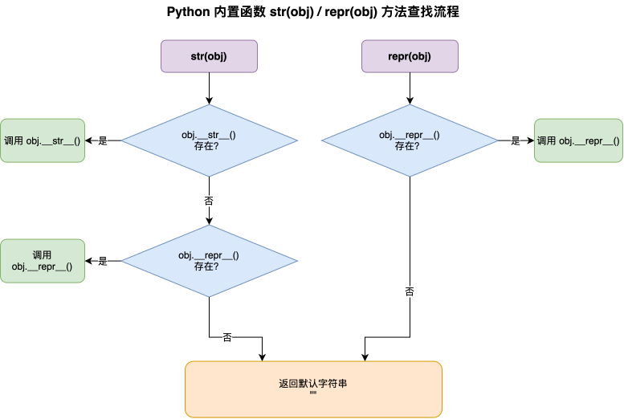
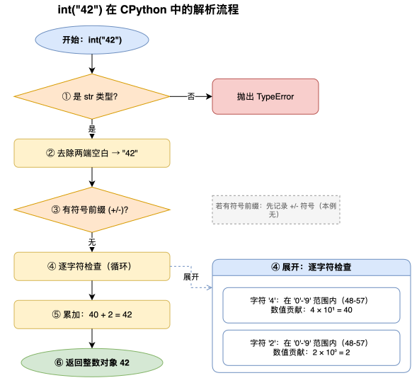
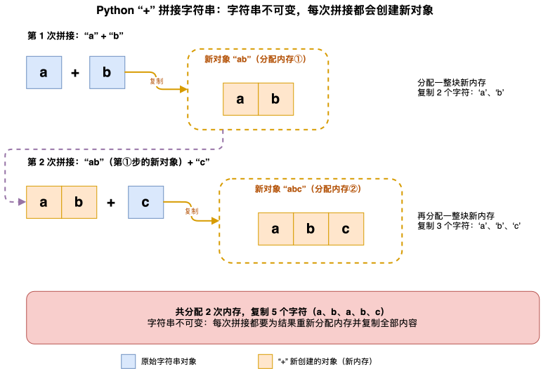
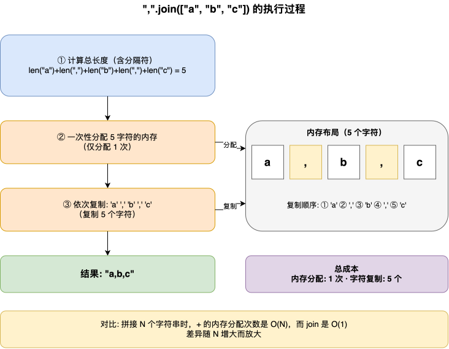
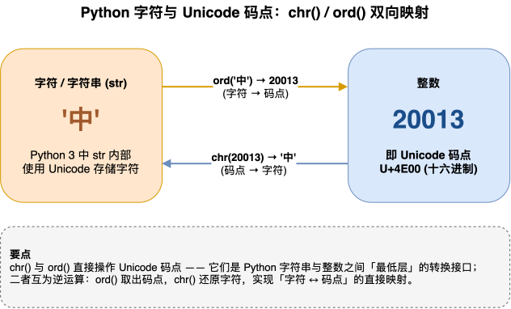

---
group:
  title: 【03】字符串介绍
  order: 3
order: 6
title: 字符串与类型转换
nav:
  title: Python基础
  order: 1
---

# 字符串与类型转换

## 1. 介绍

### 1.1 什么是字符串与类型转换

字符串与类型转换是 Python 中字符串（`str`）与其他数据类型之间的双向转换操作。在实际开发中，数据在输入、处理、输出各环节经常以字符串形式存在（用户输入、文件读取、网络请求），而计算时需要数字、列表等类型。掌握字符串与其他类型的互转方法，是数据处理的基础能力。

Python 提供了一整套类型转换工具，覆盖了日常开发的各个方向：

| 转换方向 | 主要函数/方法 | 典型场景 |
|---------|-------------|---------|
| 其他类型 → 字符串 | `str()` | 输出展示、字符串拼接 |
| 字符串 → 整数 | `int()` | 解析用户输入、配置读取 |
| 字符串 → 浮点数 | `float()` | 解析价格、分数、坐标 |
| 字符串 ↔ 字符列表 | `list()` / `str.join()` | 逐字符处理、字符串拼接 |
| 字符 ↔ 码点 | `chr()` / `ord()` | 编码处理、字符运算 |
| 对象 → 字符串 | `str()` / `repr()` | 显示 vs 调试 |

### 1.2 最简示例

```python
# 其他类型 → 字符串
print(str(42))        # '42'
print(str(3.14))       # '3.14'
print(str(True))       # 'True'

# 字符串 → 数字
print(int("42"))       # 42
print(float("3.14"))   # 3.14

# 字符串 ↔ 列表
chars = list("hello")
print(chars)           # ['h', 'e', 'l', 'l', 'o']
print("".join(chars))  # hello

# 字符 ↔ 码点
print(ord('A'))       # 65
print(chr(65))         # 'A'

# str() vs repr()
s = "Hello\nWorld"
print(str(s))          # 原样显示（含换行）
print(repr(s))         # 'Hello\nWorld'（带转义符）
```

这些转换函数构成了 Python 数据处理的"核心工具箱"——从用户输入解析到文件读取、从数据序列化到调试输出，都离不开它们。

## 2. 核心内容

### 2.1 `str()` 将各种类型转为字符串

#### 2.1.1 基本类型转字符串

`str()` 是最通用的"转字符串"函数——它可以接收任何 Python 对象，返回其字符串表示。对于基本类型，转换行为直观明了：

```python
# 整数 → 字符串
n = 42
s = str(n)
print(type(s), s)  # <class 'str'> 42

# 浮点数 → 字符串
f = 3.14159
s = str(f)
print(s)  # 3.14159

# 布尔 → 字符串
print(str(True))   # True
print(str(False))  # False

# None → 字符串
print(str(None))   # None
```

#### 2.1.2 容器类型转字符串

容器类型（列表、字典、元组等）的 `str()` 返回的是它们的"字面量表示"——和 `print()` 直接打印它们的效果一致：

```python
# 列表 → 字符串
lst = [1, 2, 3]
print(str(lst))  # [1, 2, 3]

# 字典 → 字符串
d = {"name": "Alice", "age": 30}
print(str(d))  # {'name': 'Alice', 'age': 30}

# 元组 → 字符串
t = (1, "hello", True)
print(str(t))  # (1, 'hello', True)
```

注意 `str()` 转换容器类型得到的是一个完整的字符串（如 `"[1, 2, 3]"`），而不是把列表元素拼接在一起。如果需要拼接列表元素为字符串，应该用 `join()`。

#### 2.1.3 `str()` 与 `print()` 的关系

`print()` 内部会自动调用 `str()` 将参数转为字符串后再输出。因此 `str(x)` 返回的内容就是 `print(x)` 打印出来的文本：

```python
print(42)         # print 内部执行 str(42)，输出: 42
print(str(42))    # 显式调用 str(42)，输出: 42

# 两者输出相同，因为 print 本质就是 print(str(x))
```

#### 2.1.4 实际应用——字符串拼接

`str()` 最常见的用途之一是将非字符串数据拼接进字符串。在 f-string 出现之前，这是唯一的拼接方式：

```python
# 用 str() 手动拼接
count = 5
price = 9.99
total = count * price
msg = "买了 " + str(count) + " 件商品，总价 " + str(total) + " 元"
print(msg)
# 买了 5 件商品，总价 49.95 元

# f-string 内部自动调用 __format__ 方法，效果相同但更简洁
msg2 = f"买了 {count} 件商品，总价 {total} 元"
print(msg2)
# 买了 5 件商品，总价 49.95 元
```

在现代 Python 代码中，f-string 已基本替代了 `str()` 拼接场景。但 `str()` 在需要显式类型转换的场景仍然不可替代——比如将表单数据统一转为字符串存储：

```python
def normalize_form(data):
    """将表单字段的值统一转为字符串"""
    result = {}
    for key, value in data.items():
        if value is None:
            result[key] = ""
        else:
            result[key] = str(value).strip()
    return result

form = {"name": "Alice", "age": 30, "vip": True, "memo": None}
clean = normalize_form(form)
for k, v in clean.items():
    print(f"  {k}: {v!r}")

# 输出:
#   name: 'Alice'
#   age: '30'
#   vip: 'True'
#   memo: ''
```

### 2.2 `int()` / `float()` 将字符串解析为数字

#### 2.2.1 `int()` 基本用法

`int()` 将字符串解析为整数。要求字符串内容是合法的整数表示（可带正负号和两端空白）：

```python
# 纯数字字符串 → 整数
print(int("42"))     # 42

# 负数字符串
print(int("-100"))   # -100

# 自动去除两端空白
print(int("  42  "))  # 42
```

#### 2.2.2 `int()` 的进制参数

`int(string, base)` 可以将指定进制的字符串转为整数。`base` 范围是 2~36：

```python
# 二进制
print(int("1010", 2))  # 10

# 八进制
print(int("17", 8))    # 15

# 十六进制
print(int("FF", 16))   # 255
```

`base=0` 是一个特殊值——它会让 `int()` 根据字符串前缀自动判断进制：`0x` 开头是十六进制，`0b` 开头是二进制，`0o` 开头是八进制，否则是十进制：

```python
print(int("0xFF", 0))   # 255  ← 十六进制
print(int("0b1010", 0)) # 10   ← 二进制
print(int("0o17", 0))   # 15   ← 八进制
print(int("42", 0))     # 42   ← 十进制
```

#### 2.2.3 `int()` 解析失败的异常处理

`int()` 对字符串格式有严格要求——含有非整数字符（小数点、字母等）的字符串会抛出 `ValueError`：

```python
def safe_int(s):
    """安全转换字符串为整数，失败返回 None"""
    try:
        return int(s)
    except ValueError:
        return None

test_values = ["42", "3.14", "hello", "12abc", "", "  100  "]
for v in test_values:
    result = safe_int(v)
    print(f"  int({v!r:<12}) → {result}")

# 输出:
#   int('42'         ) → 42
#   int('3.14'       ) → None  ← 浮点字符串不能直接转 int
#   int('hello'      ) → None
#   int('12abc'      ) → None
#   int(''           ) → None
#   int('  100  '    ) → 100
```

注意 `"3.14"` 不能直接用 `int()` 转换——它是一个浮点字符串，需要先经过 `float()` 再转 `int()`。

#### 2.2.4 `float()` 基本用法

`float()` 将字符串解析为浮点数，支持小数点和科学记数法：

```python
# 普通浮点数
print(float("3.14"))  # 3.14

# 整数字符串也能转 float
print(float("42"))    # 42.0

# 科学记数法
print(float("1.5e3"))  # 1500.0
print(float("2.5E-2")) # 0.025

# 特殊浮点值
print(float("inf"))   # inf
print(float("-inf"))  # -inf
print(float("nan"))   # nan

# 自动去除两端空白
print(float("  3.14  "))  # 3.14
```

#### 2.2.5 `float()` 解析失败处理

```python
def safe_float(s):
    """安全转换字符串为浮点数，失败返回 None"""
    try:
        return float(s)
    except ValueError:
        return None

float_tests = ["3.14", "42", "1e5", "hello", "3.14.15", ""]
for v in float_tests:
    result = safe_float(v)
    print(f"  float({v!r:<12}) → {result}")

# 输出:
#   float('3.14'      ) → 3.14
#   float('42'        ) → 42.0
#   float('1e5'       ) → 100000.0
#   float('hello'     ) → None
#   float('3.14.15'   ) → None  ← 两个小数点
#   float(''          ) → None
```

#### 2.2.6 字符串 → float → int 的链式转换

浮点字符串不能直接用 `int()` 转换，需要先经过 `float()`：

```python
price_str = "29.99"
# int(price_str)  # ValueError!
price_cents = int(float(price_str) * 100)
print(f"价格 {price_str} → {price_cents} 分")
# 价格 29.99 → 2999 分
```

#### 2.2.7 `int()` 与 `float()` 的关键差异

| 维度 | `int()` | `float()` |
|------|---------|-----------|
| 接受的小数点 | 不接受 | 接受 |
| 接受科学记数法 | 不接受 | 接受 |
| 整数字符串 | 可以 | 可以（返回 `.0`） |
| 浮点字符串 | 不行（报错） | 可以 |
| 进制参数 | 支持 `base` | 不支持 |
| 特殊值 | 无 | `inf`/`nan` |

**记住**：`int()` 要求字符串是纯整数表示，`float()` 要求字符串是合法的浮点表示。浮点字符串要转整数，必须先 `float()` 再 `int()`。

#### 2.2.8 实际应用——表单数据类型转换

```python
def parse_form_numbers(form_data):
    """将表单中的数值字段从字符串转为数字"""
    parsed = {}
    for key, value in form_data.items():
        parsed[key] = value  # 保留原值

        # 先尝试转整数
        try:
            parsed[key] = int(value)
            continue
        except (ValueError, TypeError):
            pass

        # 再尝试转浮点数
        try:
            parsed[key] = float(value)
            continue
        except (ValueError, TypeError):
            pass

    return parsed

form = {"name": "Alice", "age": "25", "score": "95.5", "count": "3"}
result = parse_form_numbers(form)
for k, v in result.items():
    print(f"  {k}: {v!r} (type={type(v).__name__})")

# 输出:
#   name: 'Alice' (type=str)
#   age: 25 (type=int)
#   score: 95.5 (type=float)
#   count: 3 (type=int)
```

### 2.3 字符串与列表互转：`list()` / `join()`

#### 2.3.1 `list()` 将字符串转为字符列表

`list()` 将字符串拆解为字符列表——每个字符变成列表的一个独立元素：

```python
# 英文字符串
chars = list("hello")
print(chars)
# ['h', 'e', 'l', 'l', 'o']

# 中文字符串（也是逐字符拆分）
cn = list("你好世界")
print(cn)
# ['你', '好', '世', '界']

# 空字符串 → 空列表
print(list(""))
# []
```

#### 2.3.2 `str.join()` 将列表拼回字符串

`join()` 是 `list()` 的逆操作——将字符串列表用指定的分隔符连接成一个字符串：

```python
# 用 "-" 连接
words = ["Python", "is", "awesome"]
print("-".join(words))
# Python-is-awesome

# 无分隔符拼接
print("".join(["H", "e", "l", "l", "o"]))
# Hello

# 空格拼接
print(" ".join(["2024", "01", "15"]))
# 2024 01 15
```

#### 2.3.3 `list()` → `join()` 往返转换

`list()` 拆字符后修改，再用 `join()` 拼回来——这是字符串"可变操作"的惯用模式：

```python
text = "hello"
chars = list(text)
# 修改第 0 个字符
chars[0] = "H"
# 拼回字符串
new_text = "".join(chars)
print(f"原: {text} → 改: {new_text}")
# 原: hello → 改: Hello
```

经典应用——反转字符串：

```python
text = "Hello Python"
reversed_text = "".join(reversed(list(text)))
print(f"反转: {reversed_text}")
# 反转: nohtyP olleH
```

#### 2.3.4 `join()` 只能拼接字符串元素

`join()` 要求列表中的每个元素都是字符串类型。如果列表含非字符串元素（如整数），需要先转换：

```python
# 列表含整数时直接 join 会报错
numbers = [1, 2, 3]
# "-".join(numbers)  # TypeError!

# 需要先转为字符串
result = "-".join(str(n) for n in numbers)
print(result)
# 1-2-3
```

#### 2.3.5 `split()` 与 `join()` 的互逆关系

`split()` 将字符串按分隔符拆成列表，`join()` 将列表按分隔符拼成字符串——两者互为逆操作：

```python
csv_line = "apple,banana,cherry"

# split 拆
parts = csv_line.split(",")
print(f"拆分: {parts}")
# 拆分: ['apple', 'banana', 'cherry']

# join 拼
restored = ",".join(parts)
print(f"还原: {restored}")
# 还原: apple,banana,cherry

# 往返一致性
print(f"往返一致: {restored == csv_line}")
# 往返一致: True
```

不过这里需要注意，下面这种写法是会报错的：

```python
test = '123456'
print(test.split(''))
# Traceback (most recent call last):
#   File "/Users/mac/PyCharmMiscProject/test.py", line 2, in <module>
#     print(test.split(''))
#           ^^^^^^^^^^^^^^
# ValueError: empty separator

# 进程已结束，退出代码为 1
```

原因是：split() 的参数是“分隔符”，不能是空字符串 ''。因为空字符串没法定义“从哪里切开”。如果想把每个字符拆开，应该用下面这些方式：

```python
test = '123456'

# 方式1：直接转成 list
print(list(test))
# ['1', '2', '3', '4', '5', '6']

# 方式2：解包
print([*test])
# ['1', '2', '3', '4', '5', '6']

# 方式3：列表推导式
print([c for c in test])
# ['1', '2', '3', '4', '5', '6']
```

如果只是想按某个字符分割，就可以直接使用split。

#### 2.3.6 `join()` 的性能优势

`join()` 在拼接大量字符串时性能远优于 `+` 拼接——`join()` 一次性分配所需内存并填充，而 `+` 每次拼接都创建新的字符串对象：

```python
import time

parts = [str(i) for i in range(10000)]

# + 拼接（每次创建新对象）
start = time.perf_counter()
result_plus = ""
for p in parts:
    result_plus += p + ","
result_plus = result_plus.rstrip(",")
plus_time = time.perf_counter() - start

# join 拼接（一次创建）
start = time.perf_counter()
result_join = ",".join(parts)
join_time = time.perf_counter() - start

print(f"+ 拼接 10000 个元素: {plus_time:.6f}s")
print(f"join 拼接 10000 个元素: {join_time:.6f}s")
print(f"join 快了约 {plus_time / join_time:.0f} 倍")
```

**运行结果**：

```text
+ 拼接 10000 个元素: 0.004216s
join 拼接 10000 个元素: 0.000068s
join 快了约 62 倍
```

#### 2.3.7 实际应用——CSV 行生成

```python
def list_to_csv_row(fields, delimiter=","):
    """将字段列表转为 CSV 行，自动处理含分隔符的字段"""
    escaped = []
    for field in fields:
        field = str(field)
        # 字段包含分隔符或引号时，用引号包裹并转义内部引号
        if delimiter in field or '"' in field:
            field = '"' + field.replace('"', '""') + '"'
        escaped.append(field)
    return delimiter.join(escaped)

rows = [
    ["Alice", "30", "alice@test.com"],
    ["Bob, Jr.", "25", "bob@test.com"],
    ['Charlie "Chuck"', "35", "charlie@test.com"],
]

for row in rows:
    print(list_to_csv_row(row))

# 输出:
# Alice,30,alice@test.com
# "Bob, Jr.",25,bob@test.com
# "Charlie ""Chuck""",35,charlie@test.com
```

### 2.4 `chr()` / `ord()` 字符与码点互转

#### 2.4.1 `ord()` 字符 → 码点

`ord()` 返回单个字符的 Unicode 码点（一个整数）：

```python
print(ord('A'))   # 65
print(ord('a'))    # 97
print(ord('0'))    # 48
print(ord(' '))    # 32

# 中文字符
print(ord('中'))   # 20013
print(ord('文'))    # 25991
```

#### 2.4.2 `chr()` 码点 → 字符

`chr()` 是 `ord()` 的逆函数——将 Unicode 码点转为对应的字符：

```python
print(chr(65))       # 'A'
print(chr(97))        # 'a'
print(chr(48))        # '0'

# 中文
print(chr(20013))    # '中'
print(chr(25991))     # '文'
```

#### 2.4.3 `chr()` / `ord()` 的互逆关系

```python
# ord 然后 chr 可还原
print(chr(ord('A')))   # 'A'
print(ord(chr(65)))     # 65
```

#### 2.4.4 ASCII 码值速查

ASCII 字符的码点范围非常有用，是许多字符操作的基础：

```python
# 常用 ASCII 码值范围
print(f"数字 '0'-'9':  码点 {ord('0')}~{ord('9')}，共 {ord('9') - ord('0') + 1} 个")
print(f"大写 'A'-'Z':  码点 {ord('A')}~{ord('Z')}，共 {ord('Z') - ord('A') + 1} 个")
print(f"小写 'a'-'z':  码点 {ord('a')}~{ord('z')}，共 {ord('z') - ord('a') + 1} 个")
# 数字 '0'-'9':  码点 48~57，共 10 个
# 大写 'A'-'Z':  码点 65~90，共 26 个
# 小写 'a'-'z':  码点 97~122，共 26 个
```

大小写字母的码点差值固定为 32——大写字母码点 + 32 = 对应小写字母码点。这就是 Python 内置 `upper()`/`lower()` 方法的底层原理：

```python
def to_upper_manual(s):
    """手动将小写字母转大写"""
    result = []
    for ch in s:
        code = ord(ch)
        # 小写 a~z (97~122) → 大写 A~Z (65~90)，差值 32
        if 97 <= code <= 122:
            result.append(chr(code - 32))
        else:
            result.append(ch)
    return "".join(result)

print(to_upper_manual("Hello World"))
# HELLO WORLD
```

#### 2.4.5 凯撒密码

`chr()` 和 `ord()` 是实现各种字符级加密算法的基础。凯撒密码是最简单的加密方式——每个字母在字母表中位移固定位数：

```python
def caesar_encrypt(text, shift=3):
    """凯撒加密：每个字母位移 shift 位"""
    result = []
    for ch in text:
        if ch.isalpha():
            base = ord('A') if ch.isupper() else ord('a')
            # 位移后在 26 个字母内循环
            shifted = (ord(ch) - base + shift) % 26 + base
            result.append(chr(shifted))
        else:
            result.append(ch)
    return "".join(result)

def caesar_decrypt(text, shift=3):
    """凯撒解密：反向位移"""
    return caesar_encrypt(text, -shift)

message = "Hello Python 2024"
encrypted = caesar_encrypt(message)
decrypted = caesar_decrypt(encrypted)

print(f"原文:   {message}")
print(f"加密后: {encrypted}")
print(f"解密后: {decrypted}")
# 原文:   Hello Python 2024
# 加密后: Khoor Sbwkrq 2024
# 解密后: Hello Python 2024
```

#### 2.4.6 生成连续字符序列

`chr()` 配合 `range()` 可以生成字母表等连续字符序列：

```python
uppercase = [chr(i) for i in range(65, 91)]
lowercase = [chr(i) for i in range(97, 123)]
digits = [chr(i) for i in range(48, 58)]

print("".join(uppercase))  # ABCDEFGHIJKLMNOPQRSTUVWXYZ
print("".join(lowercase))  # abcdefghijklmnopqrstuvwxyz
print("".join(digits))     # 0123456789
```

#### 2.4.7 Unicode 表探索

`chr()` 和 `ord()` 不限于 ASCII——它们覆盖整个 Unicode 范围：

```python
# CJK 统一汉字（常用区: U+4E00 ~ U+9FFF）
for code in range(0x4E00, 0x4E05):
    print(f"  U+{code:04X} → {chr(code)}")

# 输出:
#   U+4E00 → 一
#   U+4E01 → 丁
#   U+4E02 → 丂
#   U+4E03 → 七
#   U+4E04 → 丄

# Emoji 表情符号（U+1F600 ~ U+1F64F）
for code in range(0x1F600, 0x1F605):
    print(f"  U+{code:04X} → {chr(code)}")

# 输出:
#   U+1F600 → 😀
#   U+1F601 → 😁
#   U+1F602 → 😂
#   U+1F603 → 😃
#   U+1F604 → 😄
```

### 2.5 `repr()` vs `str()`

#### 2.5.1 两者的设计目标差异

`str()` 和 `repr()` 都返回对象的字符串表示，但设计目标截然不同：

- **`str()`**：给**人**看——返回人类可读的字符串，关注"看起来怎么样"
- **`repr()`**：给**程序**看——返回可重新构造对象的合法 Python 表达式，关注"准确还原"

```python
s = "Hello\nWorld"

print(f"str(s):  {str(s)}")
print(f"repr(s): {repr(s)}")

# str(s):  Hello
# World        ← 多行显示，人看到的文本
# repr(s): 'Hello\nWorld'  ← 单行带转义符，可 eval 还原
```

#### 2.5.2 内置类型的 `str` vs `repr`

```python
# 字符串：repr 带引号，str 不带
text = "It's a test"
print(str(text))   # It's a test
print(repr(text))  # "It's a test"

# 浮点数：repr 保留完整精度
pi = 3.141592653589793
print(str(pi))    # 3.141592653589793
print(repr(pi))   # 3.141592653589793  ← 大部分情况一致

# 列表：str 和 repr 基本相同
lst = [1, "hello", True]
print(str(lst))   # [1, 'hello', True]
print(repr(lst))  # [1, 'hello', True]
```

#### 2.5.3 `repr()` 的可求值特性

`repr()` 的核心设计目标之一是：对于内置类型，`eval(repr(x))` 应该能还原 `x`：

```python
s = "Hello 'World'"
r = repr(s)

print(f"repr(s) = {r}")
print(f"eval(repr(s)) = {eval(r)!r}")
print(f"eval(repr(s)) == s: {eval(r) == s}")

# repr(s) = "Hello 'World'"
# eval(repr(s)) = "Hello 'World'"
# eval(repr(s)) == s: True
```

这意味着 `repr()` 可以用作简单对象的序列化方式——将对象转为字符串存储，之后用 `eval()` 还原。

#### 2.5.4 自定义类的 `__str__` 和 `__repr__`

自定义类可以通过 `__str__` 和 `__repr__` 魔术方法分别控制 `str()` 和 `repr()` 的行为：

```python
class Temperature:
    def __init__(self, celsius):
        self.celsius = celsius

    def __str__(self):
        """给用户看：友好的显示"""
        return f"{self.celsius}°C"

    def __repr__(self):
        """给开发者看：可重新构造的表达式"""
        return f"Temperature(celsius={self.celsius})"

t = Temperature(25.5)

print(f"str(t):   {str(t)}")     # 25.5°C
print(f"repr(t):  {repr(t)}")    # Temperature(celsius=25.5)
print(f"print(t): {t}")          # print 默认调用 __str__
print(f"[t]:      {[t]}")        # 容器中显示用 __repr__
```

**关键规则**：当对象被放入列表、字典等容器中时，容器会使用 `__repr__` 来显示元素——即使你 `print` 一个列表，列表中的元素也会用 `repr` 而非 `str` 显示。

#### 2.5.5 `repr()` 在调试中的作用

`repr()` 在调试时极有价值——它能区分看起来相同的不同类型值，并显示字符串中的转义字符：

```python
mixed_list = ["hello", 42, "world\n", True, None]
print(f"调试信息: {mixed_list!r}")
# ['hello', 42, 'world\n', True, None]
# ↑ 可以看到 'world\n' 中的 \n 是转义符，而非真正的换行
# ↑ 还能区分 'hello'(字符串) 和 hello(变量名)
```

f-string 中的 `!r` 后缀可以直接在格式化中调用 `repr()`：

```python
name = "Alice"
age = 30
print(f"name={name!r}, age={age!r}")
# name='Alice', age=30
```

f-string 支持 `!s` 和 `!r` 两个后缀，分别强制使用 `str()` 和 `repr()`：

```python
text = "Hello\nWorld"

print(f"默认:  {text}")     # 使用 __format__
print(f"!s:    {text!s}")   # 使用 __str__
print(f"!r:    {text!r}")   # 使用 __repr__

# 默认:  Hello
# World
# !s:    Hello
# World
# !r:    'Hello\nWorld'
```

#### 2.5.6 `str()` vs `repr()` 对比总结

| 维度 | `str()` | `repr()` |
|------|---------|---------|
| 设计目标 | 给人看（人类可读） | 给程序看（可重新构造） |
| 字符串 | 原样显示 | 带引号和转义符 |
| 浮点数 | 截断或简化 | 保留完整精度 |
| 自定义对象 | 调用 `__str__` | 调用 `__repr__` |
| `print()` | 默认使用 | 需显式使用 |
| 容器内 | 不使用 | 列表/字典中显示用 `repr` |
| 可 `eval()` | 不一定 | 通常 `eval(repr(x)) == x` |

#### 2.5.7 实际应用——数据序列化

`repr()` 和 `eval()` 配合，可以实现简单对象的序列化和反序列化：

```python
# 序列化
data = [1, "hello", 3.14, True, None]
serialized = repr(data)
print(f"序列化: {serialized}")

# 反序列化
restored = eval(serialized)
print(f"还原:   {restored}")
print(f"一致:   {restored == data}")

# 序列化: [1, 'hello', 3.14, True, None]
# 还原:   [1, 'hello', 3.14, True, None]
# 一致:   True
```

注意：`eval()` 会执行任意代码，存在安全风险——仅用于可信数据。生产环境应使用 `json` 或 `pickle` 等专用序列化库。

## 3. 最佳实践

### 3.1 选择正确的转换方法

| 需求 | 推荐方法 | 原因 |
|------|---------|------|
| 数字 → 字符串 | `str()` / f-string | f-string 更简洁 |
| 字符串 → 整数 | `int()` | 注意异常处理 |
| 字符串 → 浮点数 | `float()` | 支持小数和科学记数法 |
| 浮点字符串 → 整数 | `int(float(s))` | 需两步转换 |
| 字符串 → 字符列表 | `list(s)` | 逐字符拆分 |
| 字符列表 → 字符串 | `"".join(list)` | 无分隔符拼接 |
| 字符 → 码点 | `ord(c)` | 单字符的 Unicode 码 |
| 码点 → 字符 | `chr(n)` | 码点转字符 |
| 对象 → 显示字符串 | `str()` | 给用户看 |
| 对象 → 调试字符串 | `repr()` | 给开发者看 |

### 3.2 推荐 vs 不推荐写法

```python
# ---- 数字转字符串 ----

# 推荐：f-string
result = f"用户 {user_id} 下单成功"

# 不推荐：手动 str() 拼接（啰嗦）
result = "用户 " + str(user_id) + " 下单成功"

# ---- 字符串转数字 ----

# 推荐：try-except 安全转换
try:
    value = int(user_input)
except ValueError:
    value = 0

# 不推荐：直接转换不处理异常（可能崩溃）
value = int(user_input)  # 如果 user_input 不是数字就报错

# ---- 列表拼字符串 ----

# 推荐：join
result = ", ".join(items)

# 不推荐：循环 += 拼接（性能差）
result = ""
for i, item in enumerate(items):
    if i > 0:
        result += ", "
    result += item

# ---- 调试输出 ----

# 推荐：用 !r 显示原始值
print(f"数据: {data!r}")

# 不推荐：直接打印（看不到转义符和类型差异）
print(f"数据: {data}")

# ---- 凯撒密码等字符操作 ----

# 推荐：用 chr/ord 在字符层面操作
def caesar(text, shift):
    result = []
    for ch in text:
        if ch.isalpha():
            base = ord('A') if ch.isupper() else ord('a')
            result.append(chr((ord(ch) - base + shift) % 26 + base))
        else:
            result.append(ch)
    return "".join(result)

# 不推荐：用字符串查找+索引（易错且低效）
ALPHABET = "ABCDEFGHIJKLMNOPQRSTUVWXYZ"
def caesar_bad(text, shift):
    result = []
    for ch in text:
        if ch in ALPHABET:
            idx = ALPHABET.index(ch)
            result.append(ALPHABET[(idx + shift) % 26])
        elif ch in ALPHABET.lower():
            idx = ALPHABET.lower().index(ch)
            result.append(ALPHABET.lower()[(idx + shift) % 26])
        else:
            result.append(ch)
    return "".join(result)
```

### 3.3 综合推荐 vs 不推荐对照表

| 场景 | 推荐写法 | 不推荐写法 | 原因 |
|------|---------|-----------|------|
| 数字转字符串 | `f"{n}"` 或 `str(n)` | `"n = " + `n`` | 类型不匹配 |
| 字符串转整数 | `try: int(s) except: 0` | `int(s)` 不处理 | 可能崩溃 |
| 浮点字符串转整数 | `int(float(s))` | `int(s)` | 报 ValueError |
| 列表拼字符串 | `", ".join(items)` | `for + +=` 拼接 | join 快几十倍 |
| 反转字符串 | `"".join(reversed(s))` | `s[::-1]` 可用但 `reversed` 更清晰 | 两者都可 |
| 调试输出 | `print(f"{x!r}")` | `print(x)` | repr 显示类型和转义 |
| 进制转换 | `int("FF", 16)` | 手动计算 | int 内置进制参数 |

### 3.4 常见错误与注意事项

**`int()` 不能直接转浮点字符串**

```python
# 错误：浮点字符串直接转 int
# int("3.14")  # ValueError!

# 正确：先 float 再 int
value = int(float("3.14"))  # 3
```

**`join()` 不能拼接非字符串列表**

```python
# 错误：列表含整数
# ",".join([1, 2, 3])  # TypeError!

# 正确：先转为字符串
result = ",".join(str(n) for n in [1, 2, 3])
```

**`ord()` 只接受单个字符**

```python
# 错误：传入多字符字符串
# ord("AB")  # TypeError!

# 正确：单个字符
print(ord("A"))  # 65
```

**容器中使用 `repr` 而非 `str`**

```python
class Item:
    def __str__(self):
        return "商品"
    def __repr__(self):
        return "Item()"

item = Item()
print(item)       # 商品 ← 用 __str__
print([item])     # [Item()] ← 用 __repr__

# 如果只在容器中看到 <__main__.Item object at 0x...>，
# 说明没有定义 __repr__，调试时不友好
```

## 4. 原理

### 4.1 `str()` 与 `__str__` / `__repr__` 协议

Python 的 `str()` 和 `repr()` 内置函数背后是特殊方法协议。当调用 `str(obj)` 时，Python 解释器会按以下顺序查找方法：



关键设计：`str()` 会回退到 `__repr__`——这意味着如果你的类只定义了 `__repr__`，`str()` 和 `repr()` 都会使用它。但反过来不成立：只定义 `__str__` 时，`repr()` 不会使用 `__str__`，而是返回默认的对象描述。

这是 Python 的惯例："`__repr__` 是基础，`__str__` 是增强"。定义类时建议至少定义 `__repr__`，确保容器内显示和调试都有可读内容。

### 4.2 `int()` 解析字符串的内部流程

`int(string)` 在 CPython 中的解析过程：



当指定 `base` 时，步骤 4 的字符范围检查会改变——例如 `base=16` 时，`a-f` 和 `A-F` 也被视为合法数字字符。

`int("3.14")` 之所以失败——在步骤 4 中遇到 `.` 时，`.` 不在 `0-9` 的字符范围内，直接抛出 `ValueError`。而 `float("3.14")` 内部有不同的解析逻辑，能识别小数点和科学记数法。

### 4.3 `join()` 为什么比 `+` 快

`+` 拼接每次都创建新字符串对象。Python 字符串是不可变的，拼接两个字符串需要分配一块新的内存，把两个原字符串的内容复制进去：



`join()` 的工作方式完全不同——它先计算所有元素的总长度，一次性分配足够的内存，然后把所有元素的内容直接复制到目标位置：



当拼接 N 个字符串时，`+` 的总内存分配次数是 O(N)，而 `join` 是 O(1)——差异随 N 增大而放大。

### 4.4 `chr()` / `ord()` 与 Unicode 编码

`chr()` 和 `ord()` 直接操作 Unicode 码点——它们是 Python 字符串与整数之间的"最低层"转换接口。



Python 的内置字符串方法（如 `upper()`、`isalpha()`）在底层都依赖 Unicode 码点来判断字符类别和执行转换。`chr()` 和 `ord()` 揭示了这层"字符 ↔ 整数"的映射关系，使得开发者可以直接在码点层面进行操作——这在编码处理、加密算法、字符分类等场景中非常有用。

## 5. 总结

本文围绕 Python 字符串与类型转换展开，主要介绍了以下内容：

- **`str()` 方法**：将任何类型转为字符串，基本类型直接转换，容器类型返回字面量表示；内部调用 `__str__` 协议方法；`print()` 默认使用 `str()`
- **`int()` / `float()` 方法**：将字符串解析为数字；`int()` 支持进制参数 `base`（2~36）和 `base=0` 自动识别；`int()` 不接受浮点字符串（需先 `float()` 再 `int()`）；解析失败抛 `ValueError`，应使用 try-except 安全处理
- **`list()` / `join()` 方法**：`list()` 将字符串拆成字符列表，`join()` 将字符串列表拼回字符串，互为逆操作；`join()` 只能拼接字符串元素，非字符串需先 `str()` 转换；`join()` 性能远优于 `+` 拼接（单次内存分配 vs 多次分配）
- **`chr()` / `ord()` 方法**：字符与 Unicode 码点互转，互为逆函数；ASCII 范围内大小写码点差 32；可用于实现凯撒密码、生成字符表、Unicode 表探索
- **`str()` vs `repr()` 方法**：`str()` 给人看（人类可读），`repr()` 给程序看（可 `eval` 还原）；自定义类通过 `__str__` 和 `__repr__` 分别控制；容器内使用 `repr` 显示元素；调试时用 `!r` 后缀
- **最佳实践**：数字转字符串用 f-string 代替 `str()` 拼接；字符串转数字用 try-except 安全处理；列表拼字符串用 `join()`；调试输出用 `repr()` 或 `!r`
- **底层原理**：`str()`/`repr()` 基于特殊方法协议（`__str__` 回退到 `__repr__`）；`int()` 逐字符验证数字范围；`join()` 单次分配内存优于 `+` 的多次分配；`chr()`/`ord()` 直接操作 Unicode 码点
