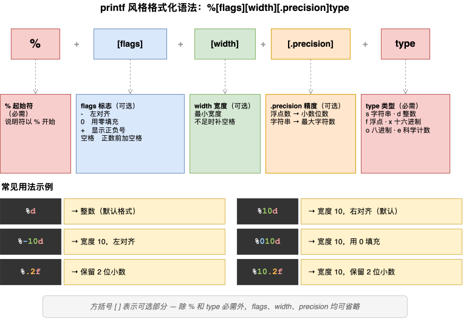
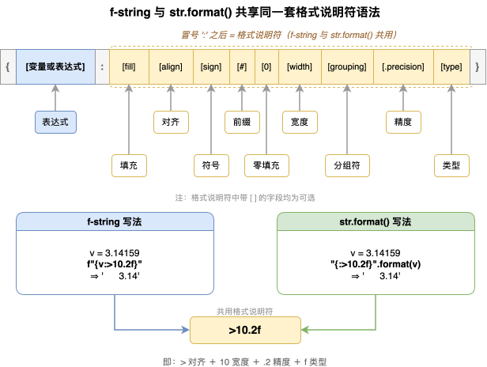
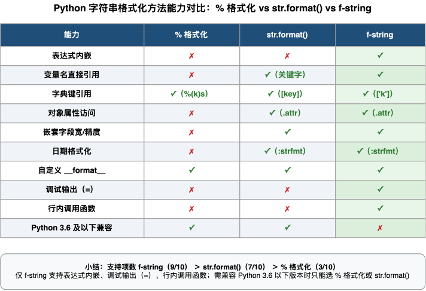
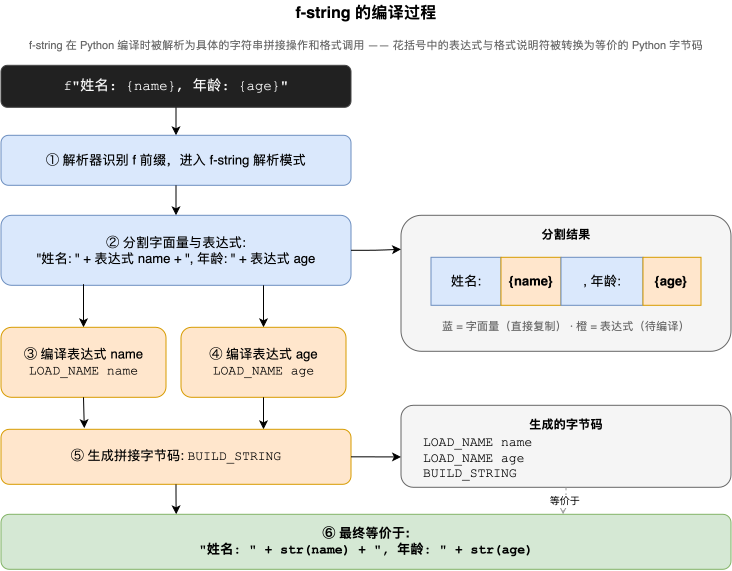
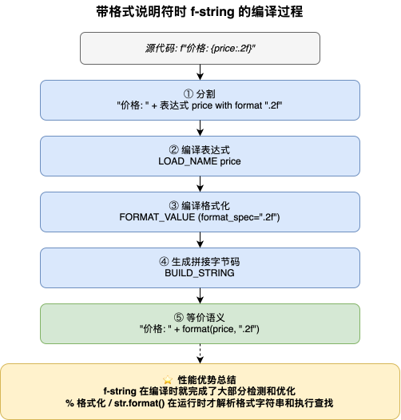
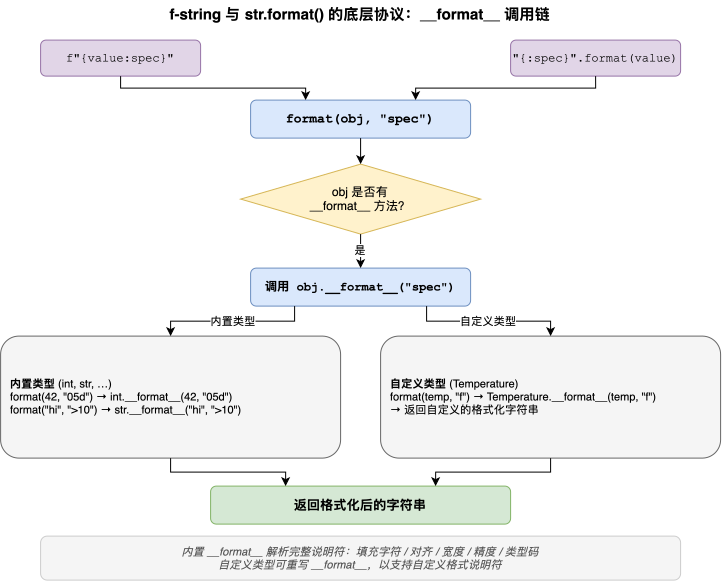

---
group:
  title: 【03】字符串介绍
  order: 3
order: 7
title: f-string 与字符串格式化
nav:
  title: Python基础
  order: 1
---

# f-string 与字符串格式化

## 1. 介绍

### 1.1 什么是字符串格式化

字符串格式化是将变量、表达式或对象的值"嵌入"到字符串模板中，生成最终字符串的过程。无论是输出用户信息、生成报表、拼接日志——都离不开字符串格式化。Python 提供了三种字符串格式化方式，代表了语言演进的三个阶段：

```python
# 方式一：% 旧式格式化（Python 最初的格式化方式）
name = "Alice"
print("姓名: %s, 年龄: %d" % (name, 30))
# 姓名: Alice, 年龄: 30

# 方式二：str.format() 方法（Python 2.6 引入）
print("姓名: {}, 年龄: {}".format("Alice", 30))
# 姓名: Alice, 年龄: 30

# 方式三：f-string（Python 3.6 引入，推荐方式）
age = 30
print(f"姓名: {name}, 年龄: {age}")
# 姓名: Alice, 年龄: 30
```

三种方式的设计目标和使用场景各有侧重：

| 方式 | 引入版本 | 核心机制 | 可读性 | 推荐程度 |
|------|---------|---------|--------|---------|
| `%` 格式化 | Python 1 | C 语言风格的占位符 | 参数多时差 | 仅用于维护旧代码 |
| `str.format()` | Python 2.6 | 花括号 `{}` 占位 + `format()` 方法 | 较好 | 兼容性场景使用 |
| f-string | Python 3.6 | 字符串前缀 `f` + `{}` 内嵌表达式 | 最佳 | 新代码首选 |

### 1.2 最简示例

```python
# % 格式化：占位符 + 元组传参
print("价格: %.2f 元" % 9.999)
# 价格: 9.99 元

# str.format()：花括号占位 + format 方法
print("价格: {:.2f} 元".format(9.999))
# 价格: 9.99 元

# f-string：直接在花括号中写变量和表达式
price = 9.999
print(f"价格: {price:.2f} 元")
# 价格: 9.99 元

# f-string 支持任意表达式
items = [10, 20, 30]
print(f"总数: {len(items)}, 合计: {sum(items)}, 平均: {sum(items)/len(items):.1f}")
# 总数: 3, 合计: 60, 平均: 20.0
```

三种方式覆盖了从简单变量替换到复杂格式控制的全部需求。理解每种方式的语法、格式说明符和适用场景，能让你在任何 Python 版本和项目中都写出清晰、高效的格式化代码。

## 2. 核心内容

### 2.1 `%` 旧式格式化

`%` 格式化是 Python 最早的字符串格式化方式，语法源自 C 语言的 `printf`。虽然在现代 Python 中已被 f-string 取代，但在维护旧代码、阅读第三方库源码时仍会频繁遇到。

#### 2.1.1 基本占位符

`%` 格式化的核心是"占位符"——以 `%` 开头的特殊标记，表示"在这个位置插入一个某种类型的值"：

| 占位符 | 含义 | 示例 |
|--------|------|------|
| `%s` | 字符串（任何类型，自动调用 `str()`） | `"%s" % "hello"` |
| `%d` / `%i` | 整数 | `"%d" % 42` |
| `%f` | 浮点数（默认 6 位小数） | `"%f" % 3.14` |
| `%e` / `%E` | 科学计数法 | `"%e" % 123456` |
| `%x` / `%X` | 十六进制（小写/大写） | `"%x" % 255` |
| `%o` | 八进制 | `"%o" % 255` |
| `%c` | 字符（Unicode 码点转字符） | `"%c" % 65` |
| `%r` | 原始表示（调用 `repr()`） | `"%r" % "hi"` |
| `%a` | ASCII 表示（调用 `ascii()`，非 ASCII 转义） | `"%a" % "中文"` |
| `%%` | 百分号本身 | `"%d%%" % 50` |

```python
# %s — 字符串占位符
print("姓名: %s" % "Alice")
# 姓名: Alice

# %d — 整数占位符
print("年龄: %d" % 30)
# 年龄: 30

# %f — 浮点数占位符
print("Pi: %f" % 3.14159265)
# Pi: 3.141593

# %x / %o — 进制转换
num = 255
print("十六进制: %x" % num)  # ff
print("八进制: %o" % num)    # 377
# 注意：% 格式化不支持 %b（二进制），需用 bin()
print("二进制: %s" % bin(num))  # 0b11111111
```

**注意**：`%s` 是最通用的占位符——它可以接收任何类型，自动调用 `str()` 转换：

```python
print("对象: %s" % [1, 2, 3])   # 对象: [1, 2, 3]
print("对象: %s" % {"a": 1})    # 对象: {'a': 1}
print("对象: %s" % None)        # 对象: None
print("对象: %s" % True)        # 对象: True
```

#### 2.1.2 多参数与元组传参

当字符串中有多个占位符时，`%` 右侧需要传入一个**元组**——即使只有一个参数也要注意元组语法：

```python
name = "Alice"
age = 30
score = 95.5

# 多参数：用元组传入
print("姓名: %s, 年龄: %d, 分数: %.1f" % (name, age, score))
# 姓名: Alice, 年龄: 30, 分数: 95.5
```

**常见陷阱**——单参数元组的括号问题：

```python
# 正常：单个字符串参数不需要元组
print("姓名: %s" % "Alice")

# 但如果参数本身是元组，需要额外括号防歧义
items = (1, 2, 3)
print("元组: %s" % (items,))  # 元组: (1, 2, 3)
# 不加额外括号也可正常工作，但加括号更明确
print("元组: %s" % items)     # 元组: (1, 2, 3)
```

#### 2.1.3 宽度、对齐与精度

`%` 格式化通过在占位符中插入数字来控制宽度、对齐和精度：

```python
# %10d — 宽度 10，右对齐
print("[%10d]" % 42)
# [        42]

# %-10d — 宽度 10，左对齐（- 表示左对齐）
print("[%-10d]" % 42)
# [42        ]

# %010d — 宽度 10，右对齐，用 0 填充
print("[%010d]" % 42)
# [0000000042]

# %.2f — 保留 2 位小数
print("价格: %.2f 元" % 9.999)
# 价格: 9.99 元

# %10.2f — 宽度 10，保留 2 位小数
print("[%10.2f]" % 3.14159)
# [      3.14]
```



#### 2.1.4 格式说明符的字段边界

printf 风格的完整语法（上图省略了 `(key)` 字典键名部分）：

```
%[(key)][flags][width][.precision]type
```

解析器按 `flags → width → .precision → type` 的顺序**逐字符消费**，每个位置只认自己的合法字符——越界字符不会报错，而是被"推入"下一个字段继续解析，这是占位符写错时结果悄悄跑偏的根本原因。各字段的合法取值（边界）：

| 字段 | 合法取值（边界） | 说明 |
|------|------------------|------|
| `(key)` | 字典键名 | 可选，见下节 2.1.5 |
| `flags` | 仅 5 个字符：`-`、`+`、`空格`、`#`、`0` | 可组合、顺序任意；**没有其他字符，不支持自定义填充** |
| `width` | 十进制非负整数，或 `*` | `*` 表示从参数元组动态读取 |
| `.precision` | `.` + 非负整数，或 `.*` | 对 `eE/fF` 是小数位数，对 `gG` 是有效数字位数；对字符串是截断长度 |
| `type` | `d i u o x X e E f F g G c r s a` 之一 | 其余字符直接报 `ValueError` |

flags 5 个字符的精确行为：

```python
print("%+d, %+d" % (42, -42))        # +42, -42  ← + 强制显示正号
print("% d" % 42)                    # ' 42'     ← 空格：正数前预留符号位
print("%#o %#x %#X" % (8, 255, 255)) # 0o10 0xff 0XFF  ← # 添加进制前缀
print("%#e, %.0e" % (1.0, 1.0))      # 1.000000e+00, 1e+00  ← # 强制保留小数点
print("[%10s]" % "hi")               # [        hi]  ← 默认空格右对齐
print("[%010s]" % "hi")              # [        hi]  ← 0 只对数字有效，字符串仍用空格
print("[%-010d]" % 42)               # [42        ]  ← - 与 0 同用时 0 被忽略
```

width / precision 支持用 `*` 从参数动态读取——这也是合法取值的一部分：

```python
print("%*d" % (6, 42))       # '    42'  ← 宽度从元组第一个元素读取
print("%.*f" % (2, 3.14159)) # '3.14'    ← 精度从元组第一个元素读取
print("%.3s" % "abcdefg")    # 'abc'     ← 精度对字符串是截断长度
```

**type 边界陷阱**——为什么 `"%a10s" % 12345` 输出 `1234510s`：

```python
print("%a10s" % 12345)
# 1234510s
```

`a` 不在 flags 的 5 个字符里、也不是数字（width 位置只认数字），于是被解析为 **type**——而 `%a` 恰好是合法类型（Python 3.6+，等价于 `ascii()`）。占位符在 `a` 处提前闭合，剩下的 `10s` 变成**普通字面量**：

```python
print("%a" % "中文")  # '\u4e2d\u6587'  ← %a 调用 ascii()，转义非 ASCII 字符
print("%a" % 12345)   # 12345           ← 整数原样输出
# 因此 "%a10s" % 12345 = ascii(12345) + "10s" = "1234510s"
```

若 type 位置是不认识的字符，则直接报错：

```python
print("%z" % 1)   # ValueError: unsupported format character 'z' (0x7a) at index 1
print("%10" % 1)  # ValueError: incomplete format  ← 只有 width 却没写 type
```

**核心结论**：printf 风格的填充字符只有两种可能——默认空格，或 `0`（且仅数字类型）。想用 `a`、`*` 等任意字符填充，必须改用 `str.format()` / f-string 的格式规格 `[[fill]align][width]`：

```python
print("{:a<10}".format(12345))  # 12345aaaaa ← a 填充左对齐
print("{:a>10}".format(12345))  # aaaaa12345 ← a 填充右对齐
print("{:a^11}".format(12345))  # aaa12345aaa ← a 填充居中
print(f"{12345:*^10}")          # **12345***  ← f-string 同理
```

#### 2.1.5 字典键名引用

`%` 格式化支持通过 `%(key)type` 语法用字典键名引用值，避免位置参数的顺序混乱：

```python
data = {"name": "Bob", "age": 25, "city": "Beijing"}
print("姓名: %(name)s, 年龄: %(age)d, 城市: %(city)s" % data)
# 姓名: Bob, 年龄: 25, 城市: Beijing

# 同一个键可以引用多次
print("%(name)s 来自 %(city)s，%(name)s 很喜欢 %(city)s" % data)
# Bob 来自 Beijing，Bob 很喜欢 Beijing
```

#### 2.1.6 `%` 格式化的常见陷阱

```python
# 陷阱 1: 百分号本身需要用 %% 转义
progress = 85
print("进度: %d%%" % progress)
# 进度: 85%

# 陷阱 2: %s vs %r 的区别
text = "Hello\nWorld"
print("str: %s" % text)   # str: Hello（换行）World
print("repr: %r" % text)  # repr: 'Hello\nWorld'  ← 显示转义符

# 陷阱 3: 参数数量不匹配会报错
# print("%s %s" % ("Alice",))  # TypeError: not enough arguments
```

### 2.2 `str.format()` 方法

`str.format()` 是 Python 2.6 引入的格式化方法，用花括号 `{}` 作为占位符，通过 `format()` 方法传入参数。它解决了 `%` 格式化的参数顺序混乱问题，并提供了更灵活的引用方式。

`format()` 的完整参数签名是 `str.format(*args, **kwargs)`——两种可变参数各对应一种占位符引用方式，也解释了下文 2.2.1 中各写法的来源：

| Python 参数 | 收集结果 | 对应占位符 | JS 类比 |
|------------|---------|-----------|---------|
| `*args` 位置可变参数 | 多余的位置实参收集为**元组** | `{}` 按顺序、`{0}` `{1}` 按索引引用 | rest 参数 `(...args) => ...` 收集为数组 |
| `**kwargs` 关键字可变参数 | 多余的 `key=value` 实参收集为**字典** | `{name}` 按名字引用 | 对象入参 + 形参解构 `({ name }) => ...` |

参数已经在列表/字典中时还支持调用侧解包——形参一侧"收集"、调用一侧"摊开"，与 JS 的 rest/spread 机制完全同构：

```python
args = ["Alice", 30]
data = {"name": "Bob", "city": "Beijing"}
print("{0} 今年 {1} 岁".format(*args))     # Alice 今年 30 岁 ← 列表摊开成位置参数
print("{name} 来自 {city}".format(**data))  # Bob 来自 Beijing ← 字典摊开成关键字参数
```

```javascript
// JS 对照：数组 spread 摊开位置参数；对象只能整体传入、形参处解构
const args = ["Alice", 30];
const data = { name: "Bob", city: "Beijing" };
const positional = (name, age) => `${name} 今年 ${age} 岁`;
const named = ({ name, city }) => `${name} 来自 ${city}`;
console.log(positional(...args));  // Alice 今年 30 岁
console.log(named(data));          // Bob 来自 Beijing
```

注意上面 JS 对照中的**关键不对称**：Python 能用 `**data` 把字典摊平成多个关键字实参，JS 却不能写 `named(...data)`——调用位置的 spread 只接受可迭代对象，普通对象无法展开成多个具名实参，强行展开会抛 `TypeError: Spread syntax requires ...iterable[Symbol.iterator] to be a function`。所以 JS 的惯用对应是"传对象整体 + 形参解构"，它并没有真正的关键字参数机制。

给前端的两个辨别提示（防止类比出偏差）：

- JS 模板字面量 `` `${name}` `` 在**定义处**内联数据，真正的对应物是 f-string（见 2.3 节）；`format()` 则是"模板先行、数据后传"，同一个模板字符串可以复用填充多次；
- Node.js 的 `util.format("%s", x)` 走的是 `%` 占位风格，对应本文 2.1 节的 printf 风格，与 `str.format()` 同名不同物。

#### 2.2.1 基本用法

```python
# 位置参数（按顺序填入花括号）
print("姓名: {}, 年龄: {}".format("Alice", 30))
# 姓名: Alice, 年龄: 30

# 索引引用（可重复使用同一参数）
print("{0} 来自 {1}，{0} 很喜欢 {1}".format("Alice", "Beijing"))
# Alice 来自 Beijing，Alice 很喜欢 Beijing

# 交换顺序
print("{1} {0}".format("hello", "world"))
# world hello

# 关键字参数
print("姓名: {name}, 年龄: {age}".format(name="Bob", age=25))
# 姓名: Bob, 年龄: 25
```

#### 2.2.2 宽度、对齐与填充

`str.format()` 使用冒号 `:` 后的格式说明符控制对齐和填充——语法是 `{:[fill][align][width]}`：

| 对齐符 | 含义 | 示例 |
|--------|------|------|
| `<` | 左对齐（字符串默认） | `"{:<10}"` |
| `>` | 右对齐（数字默认） | `"{:>10}"` |
| `^` | 居中 | `"{:^10}"` |
| `=` | 填充在符号和数字之间（仅数值） | `"{:=10}"` |

```python
# 宽度 10，默认左对齐（字符串）
print("[{:10}]".format("hello"))
# [hello     ]

# 右对齐
print("[{:>10}]".format("hello"))
# [     hello]

# 居中
print("[{:^10}]".format("hello"))
# [  hello   ]

# 自定义填充字符（写在 < > ^ 前面）
print("[{:*^10}]".format("hello"))
# [**hello***]

# 用 0 填充右对齐
print("[{:0>10}]".format(42))
# [0000000042]
```

拆解 `{:*^10}` 为什么输出 `[**hello***]`——三段格式规格各司其职：

| 部分 | 含义 | 边界 |
|------|------|------|
| `*` | fill 填充字符 | 任意单个字符，必须写在 align 前面、由 align"认领" |
| `^` | align 对齐方式 | `<` 左对齐、`>` 右对齐、`^` 居中 |
| `10` | width 最小总宽度 | 不足时由 fill 补齐，超出则原样输出 |

`hello` 自身占 5 格，凑满宽度 10 还差 5 个填充位。居中的分摊规则是**左侧取整除结果，剩余全归右侧**：`5 // 2 = 2`，于是左 2 个 `*`、右 3 个 `*`：

```python
print("[{:*^10}]".format("hello"))  # [**hello***]  ← 补 5 位：左 2 右 3
print("[{:*^11}]".format("hello"))  # [***hello***] ← 补 6 位：均匀 3+3
print("hello".center(10, "*"))     # **hello***    ← str.center 同一分摊规则
```

回看上面代码块中的 `[  hello   ]`——默认空格居中走的是同一分摊：左 2 空格、右 3 空格。

fill 的边界：填充字符不能脱离对齐符单独存在。`{:*10}` 缺少 `^`，解析器无法"认领" `*`，直接报错——printf 风格的 flags 只认 5 个固定字符，而 format 规格的 fill 是任意字符、靠紧跟的 align 识别，这是两种风格的本质区别：

```python
print("{:*10}".format("hello"))
# ValueError: Invalid format specifier '*10' for object of type 'str'
```

#### 2.2.3 精度与类型

```python
# 精度控制
print("{:.2f}".format(3.14159))  # 3.14
print("{:.4f}".format(3.14159))  # 3.1416
print("[{:10.2f}]".format(3.14159))  # [      3.14]

# 有效数字（g 格式）
print("{:.3g}".format(1234567.89))  # 1.23e+06

# 整数进制
print("二进制: {:b}".format(255))   # 11111111
print("八进制: {:o}".format(255))   # 377
print("十六进制: {:x}".format(255))  # ff

# 带前缀（加 # 号）
print("{:#b}".format(42))  # 0b101010
print("{:#o}".format(42))  # 0o52
print("{:#x}".format(42))  # 0x2a

# 千分位
print("{:,}".format(1234567890))      # 1,234,567,890
print("{:,.2f}".format(1234567.891))  # 1,234,567.89

# 百分比
print("{:.1%}".format(0.8525))  # 85.2%
print("{:.0%}".format(0.8525))  # 85%

# 科学计数法
print("{:e}".format(123456.789))   # 1.234568e+05
print("{:.2e}".format(123456.789))  # 1.23e+05
```

#### 2.2.4 访问对象属性和字典键

`str.format()` 支持直接访问对象的属性和字典的键值，通过点号 `.` 和方括号 `[]` 语法：

```python
# 访问对象属性
class Person:
    def __init__(self, name, age):
        self.name = name
        self.age = age

p = Person("Alice", 30)
print("姓名: {0.name}, 年龄: {0.age}".format(p))
# 姓名: Alice, 年龄: 30

# 访问字典键
data = {"name": "Bob", "age": 25}
# 方式 1：用 ** 解包
print("姓名: {name}, 年龄: {age}".format(**data))

# 方式 2：用方括号语法
print("姓名: {0[name]}, 年龄: {0[age]}".format(data))
```

拆解上面代码里三种占位符的取值路径——`{0.name}` 中的 `0` 和 `.name` 各有分工：

| 占位符写法 | `0` 的含义 | 取值路径 | JS 类比 |
|-----------|-----------|---------|--------|
| `{0.name}` | format() 第 0 个位置参数 | 点号取**属性**（走 `getattr`） | `args[0].name` |
| `{0[name]}` | 同上 | 方括号取**字典键**或**列表索引** | `args[0]["name"]` |
| `{name}`（配 `**data`） | 不是索引，是关键字参数名 | `**data` 摊平出的具名参数 | `const { name } = data` 解构后插值变量 |

两种字典方式的本质区别在于**字典是否被"摊开"**：

- 方式 1（`**data`）：字典先摊平成 `name="Bob", age=25` 两个独立的关键字参数，字典本身"不存在了"，占位符直接写参数名——对应 JS 先解构再进模板字面量的直觉：`const { name, age } = data`；
- 方式 2（`{0[name]}`）：字典作为第 0 个位置参数**原封不动**传入，占位符用 `[键名]` 自己进字典取值——对应 JS 的 `data["name"]`。

方括号 `[]` 的行为边界（以下输出均实测）：

```python
data = {"name": "Bob", "first name": "Tom"}
lst = ["a", "b", "c"]

print("{0[name]}".format(data))        # Bob   ← 键名不加引号
print("{0[first name]}".format(data))  # Tom   ← [] 内容原样当作键字符串，连空格都行
print("{0[1]}".format(lst))            # b     ← 纯正整数会被转成列表索引

print("{0['name']}".format(data))      # KeyError: "'name'" ← 引号也算键的一部分！查的是带引号的键
print("{0[-1]}".format(lst))           # TypeError: list indices must be integers or slices, not str ← 负数不被识别为整数索引
print("{0.name}".format(data))         # AttributeError: 'dict' object has no attribute 'name' ← 点号走属性访问，字典没有这个属性
```

两条补充规则：

```python
# 链式取值支持——可一路找到嵌套结构
nested = {"a": {"b": "deep"}}
print("{0[a][b]}".format(nested))  # deep

# 方法调用不支持——占位符内不是任意表达式求值
print("{0.upper()}".format("hi"))  # AttributeError: 'str' object has no attribute 'upper()'
```

这条规则对前端尤其要留意：JS 模板字面量 `${obj.name.toUpperCase()}` 内是**任意表达式**，而 `str.format()` 的 `{...}` 内只支持"参数索引/键名 + 属性/下标"这种受限访问语法——调用、运算、三元都不行，需要计算的场景应该先算好变量再传入（这正是 f-string 的主场，见 2.3 节）。

#### 2.2.5 嵌套字段引用

`str.format()` 支持"嵌套字段"——在格式说明符中引用其他参数的值：

```python
# 宽度由第二个参数决定
print("{0:{1}}".format("hello", 10))
# hello + 右侧 5 个空格（宽度 10；print 时尾随空格不可见）

# 宽度和精度由参数决定
print("{0:{1}.{2}}".format("Hello World", 15, 5))
# Hello + 右侧 10 个空格（先截断再补宽）
```

嵌套字段的**执行顺序是"先内后外"**：解析器先把说明符里的 `{1}`、`{2}` 替换成参数值、拼出一条普通说明符，再对目标值应用——两步走完才产生输出：

```python
# 第一步（内层替换）——拿参数值填进说明符：
#   {0:{1}} 拿参数 1(=10) 填宽度位        → {0:10}
#   {0:{1}.{2}} 拿 15 填宽度、5 填精度   → {0:15.5}
# 第二步（外层应用）——对目标值做普通格式化：
#   "hello" 按 10 应用        → 左对齐，右侧补空格   → 'hello     '
#   "Hello World" 按 15.5 应用 → 先按 .5 截前 5 字符 → "Hello"，再补到 15 宽 → 'Hello          '
```

用 `repr()` 和 `[]` 卡出边界，验证上面两个示例的真实输出：

```python
s1 = "{0:{1}}".format("hello", 10)
s2 = "{0:{1}.{2}}".format("Hello World", 15, 5)
print(repr(s1))         # 'hello     '      ← hello + 5 个尾随空格
print(repr(s2))         # 'Hello          '  ← Hello + 10 个尾随空格
print(f"[{s1}][{s2}]")  # [hello     ][Hello          ]
```

注意字符串的两条默认规则在起作用：**默认左对齐**（所以空格补在右侧）、精度对字符串是**截断**。print 时尾随空格肉眼不可见，看起来"输出只有一个 Hello"，容易误以为格式没生效。

内层字段同样支持关键字参数，并且可以嵌在说明符的**任意位置**：

```python
print(repr("{0:{width}}".format("hi", width=10)))   # 'hi        '  ← 关键字参数做宽度
print(repr("[{0:>{1}}]".format("hi", 8)))           # '[      hi]'  ← 与右对齐符组合
print(repr("{0:{1}.{2}f}".format(3.14159, 10, 2)))  # '      3.14'  ← 宽度、精度全动态（数字）
```

三条边界（均实测）：

```python
# 1. 多传参数不报错——没被引用的参数直接忽略
print(repr("{0:{1}}".format("Hello", 8, 10)))  # 'Hello   '

# 2. 引用越界的参数索引——报 IndexError
print("{0:{2}}".format("Hello", 8))
# IndexError: Replacement index 2 out of range for positional args tuple

# 3. 内层取到的值不是合法说明符——先替换后解析，报错发生在"外层应用"阶段
print("{0:{1}}".format("Hello", "abc"))
# ValueError: Invalid format specifier 'abc' for object of type 'str'
# ↑ "abc" 已被填入宽度位、拼出 {0:abc}，整条说明符才解析失败——反向印证了"先内后外"
```

给前端的对照：JS 模板字面量 `` `${"hello".padEnd(10)}` `` 花括号内本来就是任意表达式，动态宽度直接写方法调用即可；`str.format()` 把模板做成**静态字符串**、数据运行时才传入，格式参数要动态化就必须靠嵌套字段这种间接引用——printf 风格的 `*` 只覆盖宽度/精度（见 2.1.4 节），嵌套字段是它的泛化。同一件事 f-string 一行就能做到：`w, p = 15, 5` 后写 `f"{'Hello':{w}.{p}}"`，输出同样是 `'Hello          '`，见 2.3 节。

### 2.3 f-string 基本用法

f-string（formatted string literal）是 Python 3.6 引入的字符串格式化方式，也是目前**推荐**的格式化方式。它在字符串前加 `f` 前缀，允许在花括号 `{}` 中直接写 Python 表达式，无需额外的方法调用。

#### 2.3.1 变量与表达式

f-string 的核心优势是"所见即所得"——花括号中直接写变量名或任意表达式：

```python
name = "Alice"
age = 30

# 直接嵌入变量
print(f"姓名: {name}, 年龄: {age}")
# 姓名: Alice, 年龄: 30

# 嵌入表达式
print(f"明年 {age + 1} 岁")
# 明年 31 岁

# 嵌入函数调用
print(f"姓名大写: {name.upper()}")
# 姓名大写: ALICE

# 嵌入列表和字典元素
items = [1, 2, 3]
print(f"列表: {items}, 第一个: {items[0]}")
# 列表: [1, 2, 3], 第一个: 1

user = {"name": "Bob", "age": 25}
print(f"用户: {user['name']}, 年龄: {user['age']}")
# 用户: Bob, 年龄: 25
```

#### 2.3.2 引号规则

f-string 中的花括号内可以使用与外层不同的引号类型（Python 3.12 之前必须不同，3.12+ 可相同）：

```python
# 外层双引号，内层单引号
d = {"key": "value"}
print(f"值: {d['key']}")
# 值: value

# 外层单引号，内层双引号
print(f'列表: {", ".join(["a", "b", "c"])}')
# 列表: a, b, c
```

#### 2.3.3 格式说明符

f-string 使用与 `str.format()` 相同的格式说明符语法——冒号 `:` 后跟格式规范：

```python
# 宽度与对齐
text = "hello"
print(f"[{text:10}]")   # [hello     ]
print(f"[{text:>10}]")  # [     hello]
print(f"[{text:^10}]")  # [  hello   ]

# 自定义填充字符
print(f"[{text:*>10}]")  # [*****hello]
print(f"[{text:*<10}]")  # [hello*****]
print(f"[{text:*^10}]")  # [**hello***]

# 数值格式化
pi = 3.14159265
print(f"{pi:.2f}")       # 3.14
print(f"{pi:.4f}")       # 3.1416
print(f"[{pi:10.2f}]")   # [      3.14]

# 整数宽度与填充
num = 42
print(f"{num:05d}")  # 00042
print(f"{num:+d}")   # +42
print(f"{num: d}")   #  42（正数前加空格）
```

#### 2.3.4 完整格式说明符语法

f-string 和 `str.format()` 共享同一套格式说明符语法，完整结构是：



逐位说明：

| 位置 | 符号 | 作用 | 示例 |
|------|------|------|------|
| fill | 任意字符 | 填充字符 | `*`, `-`, `0` |
| align | `<` `>` `^` `=` | 对齐方式 | `:<10`, `:>10`, `:^10` |
| sign | `+` `-` `空格` | 正负号显示 | `:+d`, `:-d`, `: d` |
| `#` | `#` | 进制前缀 | `:#b`, `:#x` |
| `0` | `0` | 数字零填充 | `:05d` |
| width | 数字 | 最小宽度 | `:10d` |
| grouping | `,` `_` | 千分位分隔符 | `:,`, `:_` |
| precision | `.数字` | 小数位数 | `:.2f` |
| type | `s` `d` `f` `e` `g` `b` `o` `x` `X` `%` | 类型码 | `:d`, `:f`, `:x` |

```python
# 各位置的组合示例
num = 255
print(f"十进制: {num:d}")      # 十进制: 255
print(f"十进制补零: {num:08d}")  # 十进制补零: 00000255
print(f"千分位: {num:,}")       # 千分位: 255 (不够千分位不显示)

big = 1234567
print(f"千分位: {big:,}")       # 千分位: 1,234,567
print(f"二进制: {num:b}")       # 二进制: 11111111
print(f"带前缀hex: {num:#x}")   # 带前缀hex: 0xff

val = 3.14159
print(f"科学计数: {val:.2e}")   # 科学计数: 3.14e+00
print(f"百分比: {0.8525:.1%}")  # 百分比: 85.2%
```

先回答一个关键认知：**冒号后面写的不是"传参"，而是一套固定顺序的槽位语法**。解析器从左到右扫过 `:` 后的每个字符，字符落在哪个槽位就执行哪条规则——`{big:,}` 中的 `,` 落在 grouping（分组）槽上，而这个槽位只认两个字符：`,`（千分位）和 `_`（下划线分组）。所以一个逗号就"自带千分位语义"，不需要任何额外声明——正如 `.2` 天生是精度、`0` 天生是零填充标志。

逐行拆解上面的组合示例——每行都只是"几个槽位落位、其他全省略"：

```python
# 说明符        → 落位解读
# {num:d}       → type=d，十进制整数
# {num:08d}     → 0(零填充标志) + 8(宽度) + d(类型)
# {num:,}       → ,(千分位)；255 不足三位，所以看不出效果
# {big:,}       → 同上；1,234,567 分组生效
# {num:b}       → type=b，二进制
# {num:#x}      → #(前缀标志) + x(十六进制) → 0xff
# {val:.2e}     → .2(精度) + e(科学计数类型)
# {0.8525:.1%}  → .1(精度) + %(百分比类型：值 ×100 后再加 %)
```

**`08d` 的正确拆法**：`0` 是独立的标志槽位（不是宽度"08"！），等价于 `fill=0` + 右对齐，实测完全一致：

```python
print(f"{num:08d}")              # 00000255
print(f"{num:0>8d}")             # 00000255 ← 08 就是它的简写
print(f"{num:8d}")               #      255 ← 去掉 0 标志则退回空格右对齐
```

槽位顺序固定，串错位置会被拒；但各槽独立，组合与省略都自由（以下输出均实测）：

```python
# 宽度在分组前是合法顺序（宽度小于内容长度时直接忽略）
print(f"{big:5,d}")             # 1,234,567

# 分组符后不能再落数字——",5" 中的 5 被挤进 type 槽，与 , 冲突
print(f"{big:,5}")              # ValueError: Cannot specify ',' with '5'.

# 千分位不能与进制类型组合
print(f"{big:#,x}")             # ValueError: Cannot specify ',' with 'x'.

# 字符串不支持分组
print(f"{'abc':,}")             # ValueError: Cannot specify ',' with 's'.

# 自由组合：千分位 + 精度 + 类型
print(f"{1234.5678:,.2f}")      # 1,234.57
print(f"{12345.678:,.1%}")      # 1,234,567.8% ← % 类型先 ×100，再对结果应用千分位
print(repr(f"{big:10,}"))       # ' 1,234,567'  ← 宽度 10（默认右对齐空格补位）+ 千分位
print(f"{big:_}")               # 1_234_567     ← 分组槽的另一个字符 _
```

给前端的对照：JS 的千分位靠**方法调用**——`big.toLocaleString('en-US')` 或 `Intl.NumberFormat('en-US').format(big)` 都输出 `1,234,567`；Python 把它做成了模板语法里的一个**槽位符号**。`f"千分位: {big:,}"` 最贴近的 JS 写法就是 `` `千分位: ${big.toLocaleString('en-US')}` ``——前者在模板里声明格式，后者在表达式里调用变换方法。

#### 2.3.5 对齐符详解

四种对齐符的行为和适用类型：

```python
# < 左对齐（字符串默认）
print(f"{'hello':<10}|")   # hello     |
print(f"{42:<10d}|")       # 42        |

# > 右对齐（数值默认）
print(f"{'hello':>10}|")   #      hello|
print(f"{42:>10d}|")       #         42|

# ^ 居中
print(f"{'hello':^10}|")   #   hello   |
print(f"{'hello':*^10}|")  # **hello***|

# = 填充在符号和数字之间（仅数值类型）
print(f"{42:=5d}|")    #    42|
print(f"{-42:=5d}|")   # -  42|
print(f"{42:=+5d}|")   # +  42|
# 注意：= 对齐符不支持字符串类型
```

#### 2.3.6 符号显示

```python
# 默认：正数不显示 +，负数显示 -
print(f"{42:d}")   # 42
print(f"{-42:d}")  # -42

# + ：正数和负数都显示符号
print(f"{42:+d}")   # +42
print(f"{-42:+d}")  # -42

# 空格：正数前加空格，负数前加 -
# 用于对齐正负数
print(f"{42: d}")   #  42
print(f"{-42: d}")  # -42
```

#### 2.3.7 进制转换

f-string 支持所有常用进制转换，`#` 前缀可添加进制标识：

```python
num = 255
print(f"十进制: {num:d}")      # 255
print(f"二进制: {num:b}")      # 11111111
print(f"八进制: {num:o}")      # 377
print(f"小写hex: {num:x}")     # ff
print(f"大写hex: {num:X}")     # FF

# 带前缀
print(f"带前缀: {num:#b}")     # 0b11111111
print(f"带前缀: {num:#o}")     # 0o377
print(f"带前缀: {num:#x}")     # 0xff
# 大写前缀 + 大写字母需要手动
print(f"带前缀: {num:#X}")     # 0XFF
```

#### 2.3.8 千分位与百分比

```python
# 千分位分隔符
big = 1234567890
print(f"{big:,}")      # 1,234,567,890
print(f"{big:_}")      # 1_234_567_890 (下划线也是合法千分位符)

price = 1234567.891
print(f"{price:,.2f}")  # 1,234,567.89
print(f"{price:_.2f}")  # 1_234_567.89

# 百分比（自动乘 100 并加 %）
ratio = 0.8525
print(f"进度: {ratio:.1%}")  # 进度: 85.2%
print(f"进度: {ratio:.0%}")  # 进度: 85%
print(f"进度: {ratio:.2%}")  # 进度: 85.25%
```

#### 2.3.9 调试输出符号 `=`

Python 3.8 引入了 f-string 调试语法 `{var=}`，自动输出变量名和值：

```python
x = 42
y = "Alice"

# {var=} 自动显示 "var = value"
print(f"{x = }")
# x = 42

# 可以加格式说明符
print(f"{x = :05d}")
# x = 00042

# 多变量同时调试
print(f"{x = }, {y = }")
# x = 10, y = 'Alice'

# !r 显示 repr 形式
data = "Hello\nWorld"
print(f"{data = !r}")
# data = 'Hello\nWorld'

# !s 显示 str 形式
print(f"{data = !s}")
# data = Hello（换行）World
```

### 2.4 f-string 高级用法

#### 2.4.1 日期时间格式化

f-string 支持在冒号后使用 `strftime` 格式化日期，通过 `__format__` 协议实现：

```python
import datetime

now = datetime.datetime.now()

# 常用日期格式
print(f"日期: {now:%Y-%m-%d}")      # 2024-01-15
print(f"时间: {now:%H:%M:%S}")       # 14:30:45
print(f"日期时间: {now:%Y-%m-%d %H:%M:%S}")

# 中文日期
print(f"中文: {now:%Y年%m月%d日}")    # 2024年01月15日

# 星期
print(f"星期: {now:%A}")             # Monday
print(f"星期缩写: {now:%a}")         # Mon

# 12小时制
print(f"12小时制: {now:%I:%M:%S %p}")  # 02:30:45 PM

# 时间戳
print(f"时间戳: {now:%s}")           # 1705290645

# 构造特定日期
dt = datetime.datetime(2024, 6, 15, 10, 30)
print(f"自定义: {dt:%Y-%m-%d %H:%M}")
# 自定义: 2024-06-15 10:30
```

常用 `strftime` 格式符速查表：

| 格式符 | 含义 | 示例 |
|--------|------|------|
| `%Y` | 四位年份 | 2024 |
| `%m` | 两位月份 | 01 |
| `%d` | 两位日期 | 15 |
| `%H` | 两位小时（24h） | 14 |
| `%M` | 两位分钟 | 30 |
| `%S` | 两位秒 | 45 |
| `%A` | 星期全名 | Monday |
| `%a` | 星期缩写 | Mon |
| `%I` | 两位小时（12h） | 02 |
| `%p` | AM/PM | PM |
| `%s` | Unix 时间戳 | 1705290645 |

#### 2.4.2 嵌套表达式与动态宽度

f-string 的花括号中可以嵌套任意 Python 表达式——包括在格式说明符中：

```python
# 用变量控制宽度
width = 15
text = "Hello"
print(f"[{text:{width}}]")
# [Hello          ]

# 用表达式动态控制宽度
items = ["Apple", "Banana", "Cherry"]
max_len = max(len(item) for item in items)
for item in items:
    print(f"{item:{max_len}} | {'*' * len(item)}")
# Apple   | *****
# Banana  | ******
# Cherry  | ******

# 动态精度
precision = 3
pi = 3.14159265
print(f"Pi: {pi:.{precision}f}")
# Pi: 3.142

# 条件表达式
score = 85
print(f"结果: {'及格' if score >= 60 else '不及格'}")
# 结果: 及格
```

#### 2.4.3 多行 f-string

f-string 可以跨多行使用，配合三引号字符串生成复杂模板：

```python
name = "Alice"
age = 30
city = "Beijing"

profile = f"""
=== 用户信息 ===
姓名: {name}
年龄: {age}
城市: {city}
"""
print(profile)
# === 用户信息 ===
# 姓名: Alice
# 年龄: 30
# 城市: Beijing
```

#### 2.4.4 自定义 `__format__` 方法

f-string 和 `str.format()` 底层都调用对象的 `__format__` 方法。自定义类可以实现 `__format__` 来支持自定义格式说明符：

```python
class Temperature:
    def __init__(self, celsius):
        self.celsius = celsius

    def __format__(self, format_spec):
        if format_spec == "f":
            return f"{self.celsius * 9 / 5 + 32:.1f}F"
        elif format_spec == "k":
            return f"{self.celsius + 273.15:.1f}K"
        else:
            return f"{self.celsius:.1f}C"

temp = Temperature(25)
print(f"摄氏: {temp}")      # 摄氏: 25.0C
print(f"华氏: {temp:f}")    # 华氏: 77.0F
print(f"开尔文: {temp:k}")  # 开尔文: 298.1K
```

更完整的自定义格式化示例——货币类：

```python
class Money:
    def __init__(self, amount, currency="CNY"):
        self.amount = amount
        self.currency = currency

    def __format__(self, format_spec):
        if format_spec == "cn":
            return f"￥{self.amount:,.2f}"
        elif format_spec == "us":
            return f"${self.amount:,.2f}"
        else:
            return f"{self.currency} {self.amount:,.2f}"

price = Money(1234567.89)
print(f"默认: {price}")     # 默认: CNY 1,234,567.89
print(f"人民币: {price:cn}")  # 人民币: ￥1,234,567.89
print(f"美元: {price:us}")    # 美元: $1,234,567.89
```

#### 2.4.5 `!s` / `!r` / `!a` 转换标志

f-string 花括号中可以使用 `!s`、`!r`、`!a` 转换标志，分别调用 `str()`、`repr()`、`ascii()` 函数：

```python
text = "Hello\nWorld"

# 默认：使用 __format__
print(f"默认: {text}")    # 默认: Hello（换行）World

# !s：强制使用 str()
print(f"!s: {text!s}")    # !s: Hello（换行）World

# !r：强制使用 repr()
print(f"!r: {text!r}")    # !r: 'Hello\nWorld'

# !a：强制使用 ascii()（非 ASCII 字符转义）
cn = "你好"
print(f"!a: {cn!a}")      # !a: '\u4f60\u597d'
```

### 2.5 三种方式对比与最佳实践

#### 2.5.1 可读性对比

**场景：生成用户卡片**

```python
user = {"name": "Alice", "age": 30, "city": "Beijing", "score": 95.5}

# % 方式：参数多时难读
# 需要在字符串和参数列表之间反复对照
report_pct = "姓名: %(name)s, 年龄: %(age)d, 城市: %(city)s, 分数: %(score).1f" % user

# format 方式：清晰但不简洁
# 可以用 ** 解包
report_fmt = "姓名: {name}, 年龄: {age}, 城市: {city}, 分数: {score:.1f}".format(**user)

# f-string 方式：最直接、最简洁
report_f = f"姓名: {user['name']}, 年龄: {user['age']}, 城市: {user['city']}, 分数: {user['score']:.1f}"
```

#### 2.5.2 性能对比

f-string 在运行时性能上通常优于 `%` 格式化和 `str.format()`——因为 f-string在编译时就能解析大部分结构：

```python
import time

n = 10000
text = "Hello"
num = 42

# % 方式
start = time.perf_counter()
for _ in range(n):
    s = "%s %d" % (text, num)
pct_time = time.perf_counter() - start

# format 方式
start = time.perf_counter()
for _ in range(n):
    s = "{} {}".format(text, num)
format_time = time.perf_counter() - start

# f-string 方式
start = time.perf_counter()
for _ in range(n):
    s = f"{text} {num}"
fstring_time = time.perf_counter() - start

print(f"%-style:    {pct_time:.4f}s")
print(f".format(): {format_time:.4f}s")
print(f"f-string:   {fstring_time:.4f}s")
# f-string 通常最快
```

**运行结果**：

```text
%-style:    0.0012s
.format(): 0.0013s
f-string:   0.0010s
```

#### 2.5.3 功能对比一览



#### 2.5.4 三种方式选择指南

| 场景 | 推荐方式 | 原因 |
|------|---------|------|
| 新代码（Python 3.6+） | f-string | 最简洁、最高效、最可读 |
| 需兼容 Python 3.5 及以下 | `str.format()` | 旧版本不支持 f-string |
| 维护旧代码 | `%` 格式化 | 不动旧代码，保持一致性 |
| 需要模板复用（延迟格式化） | `str.format()` | 模板字符串可以存储和重用 |
| 日志中的惰性格式化 | `%` 格式化 | logging 模块用 `%` 延迟格式化避免无谓开销 |

**关于日志格式的特殊说明**：Python 的 `logging` 模块使用 `%` 格式化做惰性求值——`logging.debug("val=%d", x)` 中的格式化只在日志级别满足时才执行，而 f-string 会在调用前就完成格式化，所以日志中推荐用 `%`：

```python
# 推荐：logging 用 % 格式化（惰性求值）
import logging
logging.debug("用户 %s 的分数是 %d", name, score)  # 不满足 DEBUG 级时不格式化

# 不推荐：f-string 在日志中
# logging.debug(f"用户 {name} 的分数是 {score}")  # 无论是否输出都会格式化
```

### 2.6 综合实战

#### 2.6.1 终端表格输出

f-string 在终端表格输出中极为常用——编号补零、左对齐文本、右对齐数字、千分位分隔：

```python
products = [
    ("苹果", 5.50, 100),
    ("香蕉", 3.80, 200),
    ("西瓜", 25.00, 50),
    ("芒果", 12.90, 80),
    ("葡萄", 8.50, 120),
]

print("=" * 55)
print(f"{'商品价格表':^55}")
print("=" * 55)
print(f"{'编号':<6} {'商品名称':<12} {'单价':>10} {'库存':>10}")
print("-" * 55)

total_value = 0
for i, (name, price, stock) in enumerate(products, 1):
    print(f"{i:03d}    {name:<12} {price:>9.2f}元 {stock:>9d}件")
    total_value += price * stock

print("-" * 55)
print(f"{'合计':<6} {'':<12} {'':>10} {total_value:>10.2f}元")
print("=" * 55)
```

**运行结果**：

```text
=======================================================
                       商品价格表
=======================================================
编号     商品名称         单价         库存
-------------------------------------------------------
001    苹果          5.50元       100件
002    香蕉          3.80元       200件
003    西瓜         25.00元        50件
004    芒果         12.90元        80件
005    葡萄          8.50元       120件
-------------------------------------------------------
合计                              4612.00元
=======================================================
```

#### 2.6.2 日志格式化

```python
import datetime

log_entries = [
    ("INFO", "系统启动完成"),
    ("WARNING", "内存使用率超过 80%"),
    ("ERROR", "数据库连接失败"),
    ("DEBUG", "查询参数: table=user, limit=100"),
]

now = datetime.datetime.now()
print("=== 日志输出 ===")
for level, message in log_entries:
    timestamp = now.strftime("%Y-%m-%d %H:%M:%S")
    print(f"[{timestamp}] [{level:>7}] {message}")
```

**运行结果**：

```text
=== 日志输出 ===
[2024-01-15 14:30:45] [   INFO] 系统启动完成
[2024-01-15 14:30:45] [WARNING] 内存使用率超过 80%
[2024-01-15 14:30:45] [  ERROR] 数据库连接失败
[2024-01-15 14:30:45] [  DEBUG] 查询参数: table=user, limit=100
```

#### 2.6.3 进度条

利用 `\r` 回车符和 f-string 的动态宽度格式化实现进度条：

```python
import time

total = 30
for i in range(total + 1):
    progress = i / total
    bar_len = 20
    filled = int(bar_len * progress)
    bar = "=" * filled + "-" * (bar_len - filled)
    percent = progress * 100
    print(f"\r进度: [{bar}] {percent:5.1f}%", end="", flush=True)
    time.sleep(0.02)
print()
```

`{bar}` 动态生成进度条填充，`{percent:5.1f}` 保证百分比始终占 5 字符宽度并保留 1 位小数，`\r` 和 `end=""` 让每次输出覆盖上一行。

#### 2.6.4 数据报表生成器

综合使用 f-string 的宽度对齐、日期格式化、千分位和精度控制生成报表：

```python
import datetime

def generate_sales_report(sales_data, title="销售数据报表"):
    width = 50
    lines = []
    lines.append("=" * width)
    lines.append(f"{title:^{width}}")
    lines.append("=" * width)
    lines.append(f"{'日期':<12} {'客户':<10} {'产品':<10} {'金额':>12}")
    lines.append("-" * width)

    total_amount = 0
    for date, customer, product, amount in sales_data:
        lines.append(f"{date:<12} {customer:<10} {product:<10} {amount:>10.2f}元")
        total_amount += amount

    lines.append("-" * width)
    lines.append(f"{'合计':<34} {total_amount:>10.2f}元")
    lines.append("=" * width)
    return "\n".join(lines)

sales = [
    ("2024-01-15", "张三", "笔记本电脑", 5999.00),
    ("2024-01-15", "李四", "鼠标", 89.90),
    ("2024-01-16", "王五", "键盘", 259.00),
    ("2024-01-16", "赵六", "显示器", 1299.00),
    ("2024-01-17", "张三", "耳机", 499.00),
]

report = generate_sales_report(sales)
print(report)
```

**运行结果**：

```text
==================================================
                  销售数据报表
==================================================
日期           客户         产品         金额
--------------------------------------------------
2024-01-15   张三         笔记本电脑    5999.00元
2024-01-15   李四         鼠标           89.90元
2024-01-16   王五         键盘          259.00元
2024-01-16   赵六         显示器       1299.00元
2024-01-17   张三         耳机          499.00元
--------------------------------------------------
合计                              8145.90元
==================================================
```

## 3. 最佳实践

### 3.1 选择正确的格式化方式

| 需求 | 推荐方式 | 原因 |
|------|---------|------|
| Python 3.6+ 新代码 | f-string | 最简洁高效 |
| 简单变量替换 | f-string | `f"{name}"` 比任何方式都直观 |
| 需要复用模板 | `str.format()` | 模板可存储后复用 |
| 兼容旧版本 | `str.format()` 或 `%` | 根据最低版本选择 |
| 日志输出 | `%` 格式化 | `logging` 支持惰性求值 |
| 复杂表达式 | f-string | 任意 Python 表达式直接内嵌 |
| 日期格式化 | f-string | `f"{now:%Y-%m-%d}"` 最简洁 |
| 进制/千分位 | f-string | 格式说明符最齐全 |

### 3.2 推荐 vs 不推荐写法

```python
# ---- 简单变量替换 ----

# 推荐：f-string 最简洁
name = "Alice"
age = 30
msg = f"姓名: {name}, 年龄: {age}"

# 不推荐：% 格式化在新代码中过时
msg = "姓名: %s, 年龄: %d" % (name, age)

# 不推荐：format 在有 f-string 时显得啰嗦
msg = "姓名: {}, 年龄: {}".format(name, age)

# ---- 表达式内嵌 ----

# 推荐：f-string 直接写表达式
items = [10, 20, 30]
print(f"总数: {len(items)}, 合计: {sum(items)}, 平均: {sum(items)/len(items):.1f}")
# 总数: 3, 合计: 60, 平均: 20.0

# 不推荐：format 需要先算好
total = sum(items)
avg = sum(items) / len(items)
print("总数: {}, 合计: {}, 平均: {:.1f}".format(len(items), total, avg))

# ---- 日期格式化 ----

# 推荐：f-string + strftime
import datetime
now = datetime.datetime.now()
print(f"当前时间: {now:%Y-%m-%d %H:%M:%S}")

# 不推荐：手动拼接
print(f"{now.year}-{now.month:02d}-{now.day:02d} {now.hour:02d}:{now.minute:02d}:{now.second:02d}")

# ---- 宽度对齐 ----

# 推荐：f-string 格式说明符
for item in items_list:
    print(f"{item:<10} | {item_value:>8.2f}")

# 不推荐：手动拼接空格
for item in items_list:
    print(item.ljust(10) + " | " + str(item_value).rjust(8))

# ---- 日志输出 ----

# 推荐：logging 用 % 格式化（惰性求值）
import logging
logging.debug("用户 %s 的操作: %s", username, action)  # 不输出时不格式化

# 不推荐：f-string 在日志中
# logging.debug(f"用户 {username} 的操作: {action}")  # 即使不输出也会先格式化
```

### 3.3 综合推荐 vs 不推荐对照表

| 场景 | 推荐写法 | 不推荐写法 | 原因 |
|------|---------|-----------|------|
| 变量替换 | `f"{name}"` | `"{}".format(name)` | f-string 更简洁 |
| 表达式 | `f"{x + y:.2f}"` | `"{:.2f}".format(x + y)` | f-string 直接展示表达式 |
| 日期 | `f"{now:%Y-%m-%d}"` | `now.strftime("%Y-%m-%d")` | f-string 更可读 |
| 日志 | `log("%s", val)` | `log(f"{val}")` | `%` 支持惰性格式化 |
| 模板复用 | `template.format(**data)` | `f"{data['name']}"` | f-string 无法延迟 |
| 百分比 | `f"{ratio:.1%}"` | `f"{ratio*100:.1f}%"` | `%` 格式符自动处理 |

### 3.4 常见错误与注意事项

**f-string 中的引号冲突（Python 3.11 及以下）**

```python
# 错误（Python 3.11-）：内外引号相同导致语法错误
# d = {"name": "Alice"}
# print(f"Name: {d["name"]}")  # SyntaxError!

# 正确：内外引号不同
d = {"name": "Alice"}
print(f"Name: {d['name']}")   # 双引号外，单引号内
print(f'Name: {d["name"]}')   # 单引号外，双引号内

# Python 3.12+ 支持同类型引号嵌套
```

**`=` 对齐符仅用于数值**

```python
# 错误：字符串使用 = 对齐符
# f"{'hello':*=15}"  # ValueError!

# 正确：字符串居中用 ^
print(f"{'hello':*^15}")
# *****hello*****
```

**`%b` 不是旧式格式化支持的占位符**

```python
# 错误：% 格式化不支持 %b
# print("%b" % 255)  # ValueError!

# 正确：用 bin() 函数 + %s
print("%s" % bin(255))  # 0b11111111

# 或者用 f-string
print(f"{255:b}")  # 11111111
```

**千分位分隔符 `s` 类型不支持**

```python
# 错误：字符串类型不能使用千分位
# print(f"{'hello':,s}")  # ValueError!

# 正确：千分位仅用于数值
print(f"{1234567:,}")  # 1,234,567
```

## 4. 原理

### 4.1 f-string 的编译时解析

f-string 在 Python 编译时被解析为具体的字符串拼接操作和格式调用。当解释器遇到 `f"..."` 前缀时，会将花括号中的表达式和格式说明符转换为等价的 Python 字节码：



带格式说明符时的编译：



这就是 f-string 在性能上优于 `%` 格式化和 `str.format()` 的原因——前者在编译时就完成了大部分检测和优化，而后者在运行时才解析格式字符串和执行查找。

### 4.2 `__format__` 协议

f-string 和 `str.format()` 底层都依赖 `__format__` 协议——内置函数 `format(value, format_spec)` 会调用 `value.__format__(format_spec)`，返回格式化后的字符串。



内置类型的 `__format__` 实现了解析格式说明符的全部逻辑——填充字符、对齐方式、宽度、精度、类型码。自定义类型可以重写 `__format__` 来支持自定义格式说明符。

### 4.3 进制转换的底层机制

f-string 和 `str.format()` 的进制类型码（`b`、`o`、`x`、`X`）在底层调用整数的 `__format__` 方法，通过 `format()` 内置函数实现转换：

```python
# 等价关系
f"{255:b}"              # 等价于 format(255, "b")
f"{255:#x}"            # 等价于 format(255, "#x")
format(255, "b")       # 等价于 bin(255)[2:]  → "11111111"
format(255, "#x")      # 等价于 hex(255)     → "0xff"
format(255, "o")       # 等价于 oct(255)[2:] → "377"
```

`#` 前缀的实现是在结果前添加对应的进制标识符（`0b`、`0o`、`0x`）。

### 4.4 百分比格式化的实现

`%` 类型码底层做了一次"乘 100 + 加 %"的操作：

```python
# 等价关系
f"{0.8525:.2%}"
# 等价于: format(0.8525, ".2%")
# 底层: 0.8525 * 100 = 85.25, 格式化为 ".2f" → "85.25", 加 "%" → "85.25%"
```

精度控制 `.2` 在百分比格式中作用的是"乘 100 后"的数字——即最终显示的小数位数，而不是原始数值的小数位数。

## 5. 总结

本文围绕 Python 字符串的三种格式化方式展开，主要介绍了以下内容：

- **`%` 旧式格式化**：使用 `%s`、`%d`、`%f` 等占位符，支持宽度/对齐/精度控制和字典键名引用 `%(key)s`；不支持表达式内嵌和 `%b` 二进制；新代码中已被 f-string 取代，但维护旧代码和 `logging` 日志中仍在使用
- **`str.format()` 方法**：使用 `{}` 花括号占位，支持位置/索引/关键字参数、对象属性访问、字典键引用、嵌套字段（动态宽度和精度）；兼容性好，在不能使用 f-string 的场景下首推
- **f-string**：Python 3.6 引入的推荐方式，花括号中直接写变量和任意表达式，`f"..."` 前缀；支持所有格式说明符（宽度/对齐/填充/精度/进制/千分位/百分比/日期）；性能最优、可读性最佳
- **格式说明符**：三种方式共享 `{:[fill][align][sign][#][0][width][grouping][.precision][type]}` 格式语法；四种对齐符 `<` `>` `^` `=`；符号显示 `+` `-` 空格；进制 `b` `o` `x` `X` 加 `#` 前缀；千分位 `,` `_`；百分比 `%` 自动乘 100
- **高级用法**：f-string 支持日期时间格式化 `f"{now:%Y-%m-%d}"`、嵌套表达式动态宽度 `f"{text:{width}}"`、调试输出 `{var=}`、`!s`/`!r`/`!a` 转换标志、自定义 `__format__` 方法实现私有格式说明符
- **最佳实践**：新代码首选 f-string；兼容旧版本用 `str.format()`；日志用 `%` 格式化（惰性求值）；注意 f-string 的引号冲突（Python 3.11-）、`=` 对齐符仅用于数值、`%b` 不被旧式格式化支持等常见陷阱
- **底层原理**：f-string 在编译时解析为字节码级拼接操作（性能最优），`%` 和 `str.format()` 在运行时解析；所有方式底层调用 `__format__` 协议，进制/百分比通过 `format()` 内置函数实现
