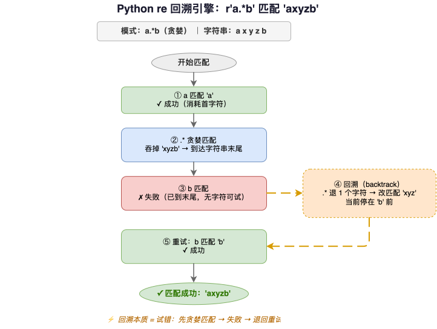
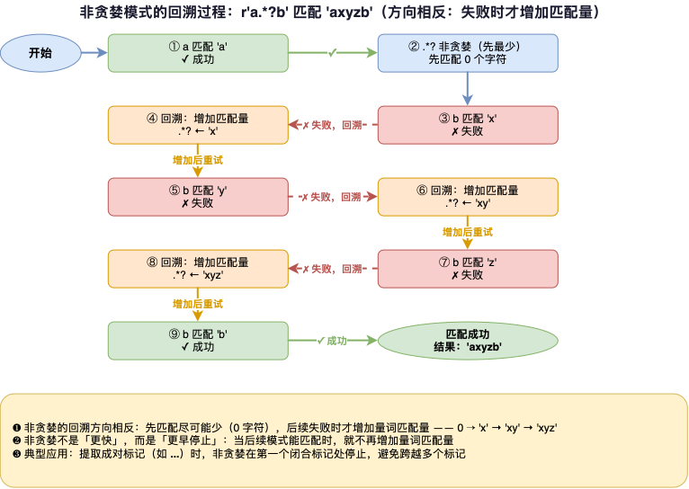
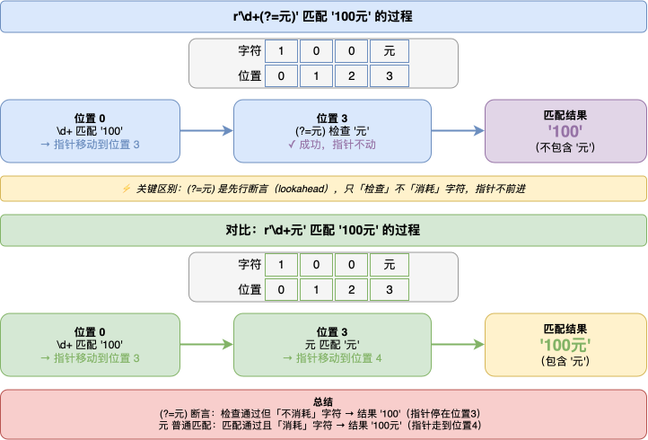

---
group:
  title: 【03】字符串介绍
  order: 3
order: 9
title: 字符串与正则表达式
nav:
  title: Python基础
  order: 1
---

# 字符串与正则表达式

## 1. 介绍

### 1.1 什么是正则表达式

正则表达式（Regular Expression，简称 regex）是一种描述字符串模式的微型语言。它用一套特殊的元字符和语法，精确定义"什么样的字符串符合要求"——比如"以数字开头""包含 @ 符号""恰好 11 位手机号"。Python 通过内置的 `re` 模块提供正则表达式支持。

```python
import re

# 验证手机号格式
phone = "13812345678"
if re.match(r'1[3-9]\d{9}$', phone):
    print("手机号有效")

# 从文本中提取所有邮箱
text = "联系: alice@example.com 或 bob@test.org"
emails = re.findall(r'[\w.]+@[\w.]+\.\w+', text)
print(emails)  # ['alice@example.com', 'bob@test.org']

# 替换敏感词
cleaned = re.sub(r'[垃圾骗局]', lambda m: '*' * len(m.group()), '这个游戏真垃圾')
print(cleaned)  # 这个游戏真**
```

### 1.2 正则表达式解决了什么问题

字符串的 `str.find()`、`str.replace()` 只能处理固定的子串，而正则表达式处理的是"模式"——一类字符串的共同特征。当需求从"找到 hello"变成"找到以 h 开头、以 o 结尾、中间至少一个字母的单词"时，`str` 方法就力不从心了。

| 需求 | `str` 方法 | 正则表达式 |
|------|-----------|-----------|
| 找到 "hello" | `"hello world".find("hello")` | `re.search(r'hello', 'hello world')` |
| 找到任意数字 | 需手动遍历每个字符 | `re.findall(r'\d+', text)` |
| 验证邮箱格式 | 几乎不可能 | `re.match(r'[\w.]+@[\w.]+\.\w+', email)` |
| 替换所有数字 | 需多次 replace | `re.sub(r'\d', 'X', text)` |
| 按多种分隔符分割 | 需多次 split 或循环 | `re.split(r'[,;|]', text)` |

### 1.3 re 模块方法速览

Python `re` 模块提供三组核心函数：

| 函数 | 作用 | 返回值 |
|------|------|--------|
| `re.match` | 从字符串开头匹配 | `Match` 对象或 `None` |
| `re.search` | 在任意位置搜索第一个匹配 | `Match` 对象或 `None` |
| `re.fullmatch` | 要求整个字符串完全匹配 | `Match` 对象或 `None` |
| `re.findall` | 找到所有匹配 | 字符串列表或元组列表 |
| `re.finditer` | 找到所有匹配 | `Match` 对象迭代器 |
| `re.sub` | 替换匹配 | 替换后的字符串 |
| `re.subn` | 替换并计数 | `(替换后字符串, 替换次数)` |
| `re.split` | 按正则分割 | 字符串列表 |
| `re.compile` | 编译正则 | 编译后的 Pattern 对象 |

## 2. 核心内容

### 2.1 匹配与搜索：match / search / fullmatch

#### 2.1.1 `re.match` 从开头匹配

`re.match(pattern, string)` 从字符串**开头**尝试匹配，如果开头不匹配则返回 `None`。返回 `Match` 对象表示匹配成功。

```python
import re

# 开头匹配成功
result = re.match(r'Hello', 'Hello World')
print(result)  # <re.Match object; span=(0, 5), match='Hello'>
print(result.group())  # Hello
print(result.span())    # (0, 5)

# 开头不匹配 → 返回 None
result = re.match(r'World', 'Hello World')
print(result)  # None
```

`match` 只检查开头——即使模式在字符串后面出现了，只要开头不匹配就返回 `None`。

#### 2.1.2 `re.search` 任意位置搜索

`re.search(pattern, string)` 在字符串**任意位置**搜索第一个匹配，找到就返回 `Match` 对象。

```python
# match 找不到（不在开头），search 能找到
result = re.search(r'World', 'Hello World')
print(result)  # <re.Match object; span=(6, 11), match='World'>
print(result.group())  # World
print(result.span())    # (6, 11)

# 找不到时返回 None
result = re.search(r'Python', 'Hello World')
print(result)  # None
```

#### 2.1.3 `re.fullmatch` 完全匹配

`re.fullmatch(pattern, string)` 要求**整个字符串**完全匹配模式，多了或少了都不行。

```python
# 完全匹配
result = re.fullmatch(r'Hello World', 'Hello World')
print(result)  # <re.Match object; span=(0, 11), match='Hello World'>

# 不完全匹配
result = re.fullmatch(r'Hello', 'Hello World')
print(result)  # None
```

#### 2.1.4 三种匹配方式对比

```python
text = "Hello World"

# match: 从开头匹配
print(re.match(r'Hello', text))   # 匹配成功
print(re.match(r'World', text))   # None（不在开头）

# search: 任意位置搜索
print(re.search(r'Hello', text)) # 匹配成功
print(re.search(r'World', text)) # 匹配成功

# fullmatch: 完全匹配
print(re.fullmatch(r'Hello World', text))  # 匹配成功
print(re.fullmatch(r'Hello', text))        # None（不完全匹配）
```

**选择指南**：

| 需求 | 推荐方法 |
|------|---------|
| 验证字符串是否以某模式开头 | `re.match` |
| 验证字符串整体格式（如邮箱、手机号） | `re.fullmatch` |
| 在文本中搜索某个模式 | `re.search` |

#### 2.1.5 Match 对象的常用方法

匹配成功后，`Match` 对象提供了多种方法获取匹配信息：

```python
m = re.search(r'(\w+)@(\w+)\.(\w+)', '联系我: alice@example.com 或 bob@test.org')

print(m.group())      # alice@example.com（整个匹配）
print(m.group(0))     # alice@example.com（同上）
print(m.group(1))     # alice（第 1 组）
print(m.group(2))     # example（第 2 组）
print(m.group(3))     # com（第 3 组）
print(m.groups())     # ('alice', 'example', 'com')
print(m.start())      # 5（匹配起始位置）
print(m.end())        # 22（匹配结束位置）
print(m.span())       # (5, 22)
```

### 2.2 re.findall 与 re.finditer

#### 2.2.1 `re.findall` 找到所有匹配

`re.findall(pattern, string)` 返回所有匹配的列表。无分组时返回匹配的字符串列表，有分组时返回元组列表。

```python
# 无分组：返回匹配的字符串列表
results = re.findall(r'\d+', '电话: 13812345678, 邮编: 200001')
print(results)  # ['13812345678', '200001']

# 两个分组：返回元组列表
results = re.findall(r'(\w+)@(\w+)\.com', 'alice@example.com 和 bob@test.org')
print(results)  # [('alice', 'example'), ('bob', 'test')]
```

**分组对 findall 返回值的影响**：

| 正则中有分组 | 返回值 |
|------------|--------|
| 无分组 | 匹配的完整字符串列表 |
| 1 个分组 | 该组内容的字符串列表 |
| 多个分组 | 各组内容的元组列表 |

#### 2.2.2 `re.finditer` 返回 Match 迭代器

`re.finditer` 返回 `Match` 对象的迭代器，可以获取每次匹配的位置信息：

```python
for m in re.finditer(r'\d+', '价格: 100元, 200元, 350元'):
    print(f"  匹配: '{m.group()}' 位置: {m.span()}")
# 匹配: '100' 位置: (4, 7)
# 匹配: '200' 位置: (10, 13)
# 匹配: '350' 位置: (16, 19)
```

`findall` 拿不到位置信息（只返回字符串），`finditer` 可以拿到完整的 `Match` 对象。

### 2.3 正则元字符与字符类

#### 2.3.1 基本元字符

正则表达式用特殊的元字符描述模式：

```python
# . 匹配任意单个字符（除换行符）
re.findall(r'c.t', 'cat cot cut c t')  # ['cat', 'cot', 'cut', 'c t']

# \d 匹配数字（0-9），\D 匹配非数字
re.findall(r'\d+', 'abc123def456')  # ['123', '456']

# \w 匹配字母数字下划线，\W 匹配非字母数字下划线
re.findall(r'\w+', 'hello_world 123!@#')  # ['hello_world', '123']

# \s 匹配空白字符，\S 匹配非空白
re.findall(r'\S+', 'hello world  python')  # ['hello', 'world', 'python']
```

常用元字符速查表：

| 元字符 | 含义 | 示例 | 匹配 |
|--------|------|------|------|
| `.` | 任意单个字符（除换行） | `c.t` | `cat`、`cot` |
| `\d` | 数字 0-9 | `\d+` | `123` |
| `\D` | 非数字 | `\D+` | `abc` |
| `\w` | 字母数字下划线 | `\w+` | `hello_123` |
| `\W` | 非字母数字下划线 | `\W+` | `!@#` |
| `\s` | 空白字符 | `\s+` | `  \t\n` |
| `\S` | 非空白 | `\S+` | `hello` |
| `\b` | 单词边界 | `\bcat\b` | `cat`（不匹配 `catfish`） |
| `^` | 字符串开头 | `^Hello` | `Hello World` |
| `$` | 字符串结尾 | `World$` | `Hello World` |
| `\` | 转义字符 | `\.` | `.` 字面量 |

#### 2.3.2 字符集合 `[...]`

方括号定义字符集合，匹配集合中的任意一个字符：

```python
# 匹配集合中的任意字符
re.findall(r'[aeiou]', 'Hello World')  # ['e', 'o', 'o']

# 范围匹配
re.findall(r'[0-9]+', 'a1b22c333')  # ['1', '22', '333']
re.findall(r'[a-z]+', 'Hello World')  # ['ello', 'orld']

# 取反：[^...] 匹配不在集合中的字符
re.findall(r'[^aeiou]', 'Hello')  # ['H', 'l', 'l']
```

#### 2.3.3 或运算 `|`

`|` 匹配左边或右边的模式：

```python
re.findall(r'cat|dog', 'I have a cat and a dog')  # ['cat', 'dog']

# 多个选择
re.findall(r'apple|banana|cherry', 'apple pie and banana cake')  # ['apple', 'banana']
```

#### 2.3.4 单词边界 `\b`

`\b` 匹配单词和空格（或字符串首尾）之间的位置，用于精确匹配单词：

```python
# 不加 \b：catfish 和 concatenate 中的 cat 也会匹配
re.findall(r'cat', 'cat catfish concatenate')  # ['cat', 'cat', 'cat']

# 加 \b：只匹配独立的单词 cat
re.findall(r'\bcat\b', 'cat catfish concatenate')  # ['cat']
```

### 2.4 量词

量词控制前一个元素匹配多少次：

#### 2.4.1 基本量词

```python
# * 匹配 0 次或多次
re.findall(r'ab*', 'a ab abb abbb')  # ['a', 'ab', 'abb', 'abbb']

# + 匹配 1 次或多次
re.findall(r'ab+', 'a ab abb abbb')  # ['ab', 'abb', 'abbb']

# ? 匹配 0 次或 1 次
re.findall(r'colou?r', 'color colour')  # ['color', 'colour']
```

#### 2.4.2 精确量词 `{n}`, `{n,}`, `{n,m}`

```python
# {n} 恰好 n 次
re.findall(r'\d{3}', '12 123 1234 12345')  # ['123', '123', '123']

# {n,} 至少 n 次
re.findall(r'\d{2,}', '1 12 123 1234')  # ['12', '123', '1234']

# {n,m} n 到 m 次
re.findall(r'\d{2,4}', '1 12 123 1234 12345')  # ['12', '123', '1234', '1234']
```

#### 2.4.3 量词速查表

| 量词 | 匹配次数 | 等价形式 |
|------|---------|---------|
| `*` | 0 次或多次 | `{0,}` |
| `+` | 1 次或多次 | `{1,}` |
| `?` | 0 次或 1 次 | `{0,1}` |
| `{n}` | 恰好 n 次 | |
| `{n,}` | 至少 n 次 | |
| `{n,m}` | n 到 m 次 | |

### 2.5 分组与断言

#### 2.5.1 捕获组 `(...)`

用圆括号将模式的一部分分组，分组的内容可以被提取和反向引用：

```python
m = re.search(r'(\d{4})-(\d{2})-(\d{2})', '日期: 2024-01-15')
print(m.group(1))  # 2024
print(m.group(2))  # 01
print(m.group(3))  # 15
print(m.groups())   # ('2024', '01', '15')
```

#### 2.5.2 命名分组 `(?P<name>...)`

命名分组用 `(?P<name>...)` 给分组取名字，比数字索引更直观：

```python
m = re.search(r'(?P<year>\d{4})-(?P<month>\d{2})-(?P<day>\d{2})', '2024-01-15')
print(m.group('year'))   # 2024
print(m.group('month'))  # 01
print(m.groupdict())      # {'year': '2024', 'month': '01', 'day': '15'}
```

#### 2.5.3 非捕获组 `(?:...)`

非捕获组用 `(?:...)` 表示只分组不捕获——`findall` 不会返回它的内容：

```python
# 普通分组：findall 返回分组内容
re.findall(r'(\d{4})-(\d{2})-(\d{2})', '2024-01-15')
# [('2024', '01', '15')]

# 非捕获组：findall 返回完整匹配
re.findall(r'(?:\d{4})-(?:\d{2})-(?:\d{2})', '2024-01-15')
# ['2024-01-15']
```

非捕获组的优势——不需要提取内容时，用非捕获组避免 `findall` 返回分组内容，同时性能略优。

#### 2.5.4 反向引用

在正则表达式中用 `\1` 或 `(?P=name)` 引用前面的分组——检查重复内容：

```python
# \1 引用第 1 个分组，找出连续重复的单词
re.findall(r'\b(\w+)\s+\1\b', 'hello hello world world test pass')
# ['hello', 'world']

# 命名反向引用
m = re.search(r'(?P<word>\w+)\s+(?P=word)', 'hello hello world')
print(m.group('word'))  # hello

# 匹配成对的引号
re.findall(r'(["\']).*?\1', "他说\"你好\", 她说'再见'")
# ['"', "'"]
```

#### 2.5.5 零宽断言（Lookaround）

零宽断言检查某个位置前后是否满足条件，但**不消耗字符**——匹配的位置是"边界"而非内容。

| 断言 | 语法 | 含义 |
|------|------|------|
| 正向预查 | `(?=...)` | 后面跟着 X |
| 负向预查 | `(?!...)` | 后面不跟着 X |
| 正向后顾 | `(?<=...)` | 前面是 X |
| 负向后顾 | `(?<!...)` | 前面不是 X |

```python
# 正向预查：提取"元"前面的数字
re.findall(r'\d+(?=元)', '价格: 100元, 200美元, 350元')
# ['100', '350']

# 正向后顾：提取"￥"后面的数字
re.findall(r'(?<=￥)\d+', '￥100, $200, ￥350')
# ['100', '350']
```

**实际应用——URL 解析**：

```python
url_pattern = re.compile(
    r'(?P<protocol>https?)://'
    r'(?P<domain>[\w.]+)'
    r'(?::(?P<port>\d+))?'
    r'(?P<path>/[^\s]*)?'
)

url = 'http://api.test.org:8080/v1/users'
m = url_pattern.search(url)
if m:
    d = m.groupdict()
    print(f"  协议: {d.get('protocol')}")
    print(f"  域名: {d.get('domain')}")
    print(f"  端口: {d.get('port')}")
    print(f"  路径: {d.get('path')}")

# 输出:
#   协议: http
#   域名: api.test.org
#   端口: 8080
#   路径: /v1/users
```

### 2.6 贪婪与非贪婪

#### 2.6.1 贪婪模式（默认）

默认情况下，量词尽可能多地匹配——这就是"贪婪"模式：

```python
text = '<div>内容1</div><div>内容2</div>'

# 贪婪 .* 从第一个 <div> 匹配到最后一个 </div>
greedy = re.findall(r'<div>.*</div>', text)
print(greedy)
# ['<div>内容1</div><div>内容2</div>']  ← 一口气匹配到最后
```

#### 2.6.2 非贪婪模式

在量词后加 `?` 使其变为非贪婪——尽可能少地匹配：

```python
# 非贪婪 .*? 遇到第一个 </div> 就停止
lazy = re.findall(r'<div>.*?</div>', text)
print(lazy)
# ['<div>内容1</div>', '<div>内容2</div>']  ← 每个标签单独匹配
```

三种量词的非贪婪形式：

| 贪婪 | 非贪婪 | 含义 |
|------|--------|------|
| `*` | `*?` | 0 或多次，尽可能少 |
| `+` | `+?` | 1 或多次，尽可能少 |
| `?` | `??` | 0 或 1 次，尽可能少 |

#### 2.6.3 贪婪与非贪婪的典型陷阱

```python
text = '"name":"Alice","age":30,"city":"Beijing"'

# 贪婪：从第一个引号匹配到最后一个引号
re.findall(r'"(.*)"', text)
# ['name":"Alice","age":30,"city":"Beijing']  ← 错误！

# 非贪婪：每个引号对单独匹配
re.findall(r'"(.*?)"', text)
# ['name', 'Alice', 'age', 'city', 'Beijing']  ← 正确
```

**秒记**：提取成对标记的内容时，用 `.*?`（非贪婪）比 `.*`（贪婪）更安全。

### 2.7 re.compile 编译预编译

#### 2.7.1 为什么要编译

`re.compile(pattern)` 将正则表达式编译为 `Pattern` 对象，避免每次调用都重新编译：

```python
# 不编译：每次调用都重新解析正则
re.findall(r'\d+', '电话: 13812345678')
re.findall(r'\d+', '邮编: 200001')

# 编译一次，复用多次
digit_pattern = re.compile(r'\d+')
digit_pattern.findall('电话: 13812345678')
digit_pattern.findall('邮编: 200001')
```

编译后的 `Pattern` 对象拥有与 `re` 模块相同的方法（`match`、`search`、`findall`、`sub`、`split` 等）。

#### 2.7.2 编译标志（Flags）

`re.compile` 的第二个参数可以传标志，控制正则的行为：

```python
# re.IGNORECASE (re.I): 忽略大小写
p = re.compile(r'hello', re.I)
p.search('HELLO')  # 匹配成功
p.search('HeLLo')  # 匹配成功

# re.DOTALL (re.S): 让 . 匹配包括换行符
p = re.compile(r'.+', re.DOTALL)
p.match('line1\nline2').group()  # 'line1\nline2'

# re.MULTILINE (re.M): ^ 和 $ 匹配每一行的首尾
p = re.compile(r'^\w+', re.MULTILINE)
p.findall('line1\nline2\nline3')  # ['line1', 'line2', 'line3']

# re.VERBOSE (re.X): 允许在正则中添加注释和空格
p = re.compile(r"""
    \d{4}      # 年
    -          # 分隔符
    \d{2}      # 月
    -          # 分隔符
    \d{2}      # 日
""", re.VERBOSE)
p.search('2024-01-15').group()  # '2024-01-15'
```

标志速查表：

| 标志 | 缩写 | 作用 |
|------|------|------|
| `re.IGNORECASE` | `re.I` | 忽略大小写 |
| `re.DOTALL` | `re.S` | `.` 匹配包括换行符 |
| `re.MULTILINE` | `re.M` | `^` `$` 匹配每行首尾 |
| `re.VERBOSE` | `re.X` | 允许注释和空格 |

多个标志可以用 `|` 组合：`re.compile(pattern, re.I | re.M)`。

### 2.8 re.sub 替换

#### 2.8.1 基本替换

`re.sub(pattern, repl, string, count=0)` 将匹配替换为 `repl`：

```python
# 替换所有匹配
re.sub(r'\d+', 'N', '电话: 13812345678, 邮编: 200001')
# '电话: N, 邮编: N'

# count 参数：只替换前 N 个
re.sub(r'\d+', 'N', '1-2-3-4-5', count=2)
# 'N-N-3-4-5'

# 替换为空串 = 删除
re.sub(r'[\d,]', '', '1,000,000')
# ''
```

#### 2.8.2 反向引用替换

在替换字符串中用 `\1` 或 `\g<name>` 引用分组：

```python
# \1 \2 引用分组
re.sub(r'(\w+)@(\w+)\.com', r'\2.\1@org.cn', '联系: alice@example.com')
# '联系: example.alice@org.cn'

# 日期格式转换 YYYY-MM-DD → DD/MM/YYYY
re.sub(r'(\d{4})-(\d{2})-(\d{2})', r'\3/\2/\1', '日期: 2024-01-15')
# '日期: 15/01/2024'
```

#### 2.8.3 函数替换

`repl` 可以是一个函数，接收 `Match` 对象，返回替换字符串：

```python
# 敏感词替换为等长星号
def replace_sensitive(match):
    return '*' * len(match.group())

re.sub(r'[垃圾骗局]', replace_sensitive, '这个游戏真垃圾，很骗局')
# '这个游戏真**，很**'

# 数字千分位格式化
def add_commas(match):
    return f'{int(match.group()):,}'

re.sub(r'\d+', add_commas, '价格: 1234567 元, 运费: 89 元')
# '价格: 1,234,567 元, 运费: 89 元'
```

#### 2.8.4 `re.subn` 替换并计数

`re.subn` 与 `re.sub` 用法相同，但额外返回替换次数：

```python
result, count = re.subn(r'\d+', 'N', 'a1b2c3d4')
print(result)  # aNbNcNdN
print(count)   # 4
```

### 2.9 re.split 分割

#### 2.9.1 基本分割

`re.split(pattern, string, maxsplit=0)` 按正则匹配的位置分割字符串：

```python
# 按白色分割
re.split(r'\s+', 'hello   world  python')
# ['hello', 'world', 'python']

# 多种分隔符
re.split(r'[,;|]', 'a,b;c|d')
# ['a', 'b', 'c', 'd']

# maxsplit 参数
re.split(r'[,;]', 'a,b;c,d,e', maxsplit=2)
# ['a', 'b', 'c,d,e']
```

#### 2.9.2 分组对 split 的影响

`re.split` 中如果模式含分组，分隔符也会出现在结果中：

```python
# 无分组：分隔符被丢弃
re.split(r'\s*,\s*', 'a , b , c')
# ['a', 'b', 'c']

# 有分组：分隔符保留在结果中
re.split(r'(\s*,\s*)', 'a , b , c')
# ['a', ' , ', 'b', ' , ', 'c']

# 保留日期中的分隔符
re.split(r'(-)', '2024-01-15')
# ['2024', '-', '01', '-', '15']
```

#### 2.9.3 re.split vs str.split

```python
text = "hello,,world,,,python"

# str.split: 只能按固定字符串分割，产生空串
text.split(',')
# ['hello', '', 'world', '', '', 'python']

# re.split: 用正则 + 匹配连续分隔符，无空串
re.split(r',+', text)
# ['hello', 'world', 'python']
```

`re.split` 支持"一个或多个分隔符"的模式，而 `str.split` 只能按固定字符串分割。

### 2.10 综合实战

#### 2.10.1 邮箱验证与提取

```python
email_pattern = re.compile(
    r'^(?P<local>[\w.]+)@(?P<domain>[\w.]+)$'
)

# 验证
test_emails = ['alice@example.com', 'invalid-email', '@no-local.com', 'no-domain@']
for email in test_emails:
    m = email_pattern.match(email)
    status = f"有效 ({m.group('local')}@{m.group('domain')})" if m else "无效"
    print(f"  {email:<25} → {status}")

# 从文本中提取
text = "联系: alice@example.com 或 bob@test.org, 非邮箱: @invalid"
re.findall(r'[\w.]+@[\w.]+\.\w+', text)
# ['alice@example.com', 'bob@test.org']
```

#### 2.10.2 手机号验证

```python
phone_pattern = re.compile(r'^1[3-9]\d{9}$')

test_phones = ['13812345678', '19987654321', '12345678901', '1381234567']
for phone in test_phones:
    valid = bool(phone_pattern.match(phone))
    print(f"  {phone:<15} {'有效' if valid else '无效'}")
# 13812345678     有效
# 19987654321     有效
# 12345678901     无效
# 1381234567      无效
```

#### 2.10.3 HTML 标签处理

```python
html = '<div class="header"><h1>标题</h1></div><p class="content">正文</p>'

# 提取所有标签名
re.findall(r'</?(\w+)[^>]*>', html)
# ['div', 'h1', 'h1', 'div', 'p', 'p']

# 提取属性键值对
re.findall(r'(\w+)="([^"]*)"', html)
# [('class', 'header'), ('class', 'content')]

# 去除所有标签
re.sub(r'</?[^>]+>', '', html)
# '标题正文'

# 提取特定标签内容（非贪婪）
re.search(r'<h1>(.*?)</h1>', html).group(1)
# '标题'
```

#### 2.10.4 日志解析

```python
log_pattern = re.compile(
    r'\[(?P<date>\d{4}-\d{2}-\d{2})\s+(?P<time>\d{2}:\d{2}:\d{2})\]\s+'
    r'(?P<level>\w+)\s+\|\s+'
    r'(?P<service>\w+)\s+\|\s+'
    r'(?P<message>.*)'
)

line = '[2024-01-15 10:30:45] INFO  | user_service | User login: id=12345'
m = log_pattern.match(line)
print(m.groupdict())
# {'date': '2024-01-15', 'time': '10:30:45', 'level': 'INFO',
#  'service': 'user_service', 'message': 'User login: id=12345'}

# 提取日志中的键值对
re.findall(r'(\w+)=(\S+)', line)
# [('id', '12345')]
```

#### 2.10.5 密码强度检查

```python
def check_password_strength(password):
    """用正则检查密码各项要求"""
    checks = {
        '长度>=8': bool(re.search(r'.{8,}', password)),
        '包含大写': bool(re.search(r'[A-Z]', password)),
        '包含小写': bool(re.search(r'[a-z]', password)),
        '包含数字': bool(re.search(r'\d', password)),
        '包含特殊字符': bool(re.search(r'[!@#$%^&*(),.?":{}|<>]', password)),
    }
    score = sum(checks.values())
    levels = ['极弱', '弱', '一般', '中等', '较强', '强']
    return levels[score], checks

passwords = ['123', 'abc123', 'Abc123!', 'P@ssw0rd!']
for pwd in passwords:
    level, _ = check_password_strength(pwd)
    print(f"  {pwd:<15} → {level}")
# 123              → 弱
# abc123           → 一般
# Abc123!          → 较强
# P@ssw0rd!        → 强
```

## 3. 最佳实践

### 3.1 选择正确的方法

| 需求 | 推荐方法 | 原因 |
|------|---------|------|
| 验证字符串格式 | `re.fullmatch` | 要求整串完全匹配 |
| 从开头匹配 | `re.match` | 只匹配开头 |
| 搜索第一个匹配 | `re.search` | 任意位置 |
| 找到所有匹配 | `re.findall` | 返回列表，简洁 |
| 遍历匹配+位置 | `re.finditer` | 需要 Match 对象 |
| 替换匹配 | `re.sub` | 支持函数/反向引用 |
| 替换并计数 | `re.subn` | 同时知道改了几处 |
| 按正则分割 | `re.split` | 支持多分隔符 |
| 重复使用同一正则 | `re.compile` | 编译一次复用多次 |

### 3.2 推荐 vs 不推荐写法

```python
# ---- 验证格式 ----

# 推荐：fullmatch 验证整体格式
if re.fullmatch(r'1[3-9]\d{9}', phone):
    print("有效")

# 不推荐：match + $ 效果相同但语义不如 fullmatch 直观
if re.match(r'1[3-9]\d{9}$', phone):
    print("有效")

# ---- 提取多个匹配 ----

# 推荐：findall 简洁
emails = re.findall(r'[\w.]+@[\w.]+\.\w+', text)

# 不推荐：手动 find + 循环
pos = 0
emails = []
while True:
    m = re.search(r'[\w.]+@[\w.]+\.\w+', text[pos:])
    if not m:
        break
    emails.append(m.group())
    pos += m.end()

# ---- 重复使用同一正则 ----

# 推荐：compile 编译复用
digit_re = re.compile(r'\d+')
for line in lines:
    digits = digit_re.findall(line)

# 不推荐：每次都重新编译
for line in lines:
    digits = re.findall(r'\d+', line)

# ---- 提取成对标记内容 ----

# 推荐：非贪婪 .*?
re.findall(r'<div>(.*?)</div>', html)

# 不推荐：贪婪 .* 跨越多个标签
re.findall(r'<div>(.*)</div>', html)

# ---- 只分组不分得内容时 ----

# 推荐：非捕获组 (?:...)
re.findall(r'(?:\d{4})-(?:\d{2})', text)  # 返回完整匹配

# 不推荐：普通分组 (...)
re.findall(r'(\d{4})-(\d{2})', text)  # 返回分组元组而非完整匹配
```

### 3.3 综合推荐 vs 不推荐对照表

| 场景 | 推荐写法 | 不推荐写法 | 原因 |
|------|---------|-----------|------|
| 验证手机号 | `re.fullmatch(r'1\d{10}', phone)` | 手动检查 `len(phone) == 11 and phone.isdigit()` | 正则一行搞定 |
| 提取数字 | `re.findall(r'\d+', text)` | 字符遍历 + 累积字符 | 正则简洁 |
| 替换敏感词 | `re.sub(pattern, '***', text)` | 逐个 replace | 正则支持模式 |
| 复杂分割 | `re.split(r'[,;|\s]+', text)` | 多次 `str.split` | 一次分割所有 |
| 重复正则 | `re.compile(pattern)` | 每次调用 `re.search` | 编译复用更快 |
| 复杂正则可读性 | `re.X` 标志 + 注释 | 单行紧凑正则 | 注释更易维护 |

### 3.4 常见错误与注意事项

**`re.match` 不匹配非开头内容**

```python
# 误解：以为 match 会搜索整个字符串
result = re.match(r'World', 'Hello World')
print(result)  # None

# match 只从开头匹配，搜索任意位置用 search
re.search(r'World', 'Hello World')  # 匹配成功
```

**`findall` 的分组陷阱**

```python
# 期望返回完整匹配，但因为有分组返回了分组内容
re.findall(r'(\d{4})-(\d{2})', '2024-01')
# [('2024', '01')]  ← 返回元组而非完整匹配

# 如果不需要分组内容，用非捕获组
re.findall(r'(?:\d{4})-(?:\d{2})', '2024-01')
# ['2024-01']  ← 完整匹配
```

**正则特殊字符需要转义**

```python
# . 在正则中是"任意字符"
re.findall(r'price.txt', 'price.txt priceXtxt')
# ['price.txt', 'priceXtxt']  ← . 匹配了任意字符

# 转义 . 后只匹配字面量
re.findall(r'price\.txt', 'price.txt priceXtxt')
# ['price.txt']  ← 只匹配 . 本身
```

**反斜杠在原始字符串中的处理**

```python
# 正则中的 \b 需要用原始字符串 r''
re.findall(r'\bcat\b', 'cat catfish')  # ['cat']

# 不加 r 前缀，\b 被 Python 先解释为退格符
re.findall('\bcat\b', 'cat catfish')  # []  ← 错误！
```

**贪婪模式导致的过度匹配**

```python
# 贪婪 .* 匹配过多
re.findall(r'"(.*)"', '"a":"b","c":"d"')
# ['a":"b","c":"d']  ← 一口气匹配到最后

# 非贪婪 .*? 正确提取
re.findall(r'"(.*?)"', '"a":"b","c":"d"')
# ['a', 'b', 'c', 'd']
```

## 4. 原理

### 4.1 正则引擎的工作方式

Python 的 `re` 模块使用回溯（backtracking）正则引擎。它从字符串的起始位置开始，逐字符尝试匹配模式。当遇到量词时，引擎优先匹配尽可能多的字符（贪婪），如果后续模式匹配失败，就回退（回溯）减少量词匹配量，再次尝试。



回溯的本质是"试错"——先尝试最贪婪的匹配，失败再退回重来。这导致某些模式下性能很差（回溯爆炸），如 `r'(a+)+b'` 匹配不包含 `b` 的超长字符串。

### 4.2 非贪婪的回溯行为

非贪婪模式的回溯方向相反——先匹配尽可能少的字符，后续模式失败时增加量词匹配量：



非贪婪不是"更快"，而是"更早停止"——当后续模式能匹配时就不再增加量词匹配量。在提取成对标记时，非贪婪能在第一个闭合标记处停止，避免跨越多个标记。

### 4.3 re.compile 的缓存机制

`re` 模块内部维护了一个正则缓存（`_cache`），`re.findall` 等函数调用时会先查缓存。缓存大小有限（默认 512 条），频繁使用不同正则时缓存可能被淘汰。`re.compile` 创建的 `Pattern` 对象不受缓存淘汰影响——它一直持有编译后的结果。

```python
# re.findall 内部流程
def findall(pattern, string):
    compiled = _cache.get(pattern)
    if compiled is None:
        compiled = _compile(pattern)
        _cache[pattern] = compiled
    return compiled.findall(string)

# re.compile 内部流程
pattern_obj = _compile(pattern)  # 编译一次，永久持有
pattern_obj.findall(string)       # 直接调用，无缓存查找
```

当同一个正则被使用多次时，`re.compile` 略快——省去了缓存查找的开销。但性能差异通常不大（缓存命中时仅省一次字典查找），日常代码中编译的主要价值是代码可读性——将正则定义和使用分离。

### 4.4 零宽断言为什么"不消耗字符"

正则引擎维护一个"当前位置指针"。普通匹配（如 `\d+`）会移动这个指针——匹配后指针跳到匹配结束处。零宽断言（如 `(?=...)`）只检查当前指针位置是否满足条件，**不移动指针**——检查完指针仍在原位。



这就是为什么 `(?=元)` 提取的数字不包含"元"——"元"只是当前位置的判断条件，不是匹配内容。

## 5. 总结

本文围绕 Python 字符串与正则表达式展开，主要介绍了以下内容：

- **re 模块核心函数**：`re.match` 从开头匹配、`re.search` 任意位置搜索、`re.fullmatch` 完全匹配；`re.findall` 找到所有匹配（无分组返回字符串列表，有分组返回元组列表）、`re.finditer` 返回 Match 对象迭代器
- **正则元字符**：`.` 任意字符、`\d` 数字、`\w` 字母数字下划线、`\s` 空白、`\b` 单词边界、`^` 开头、`$` 结尾、`[]` 字符集合、`|` 或运算
- **量词**：`*` 0 次或多次、`+` 1 次或多次、`?` 0 次或 1 次、`{n}` 恰好 n 次、`{n,m}` n 到 m 次；量词后加 `?` 变为非贪婪
- **分组与断言**：捕获组 `()` 提取分组内容、命名分组 `(?P<name>)` 用名称引用、非捕获组 `(?:)` 不提取内容、反向引用 `\1` 或 `(?P=name)` 检查重复、零宽断言 `(?=)` `(?!)` `(?<=)` `(?<!)` 检查边界不消耗字符
- **贪婪与非贪婪**：默认贪婪尽可能多匹配，非贪婪 `*?` `+?` `??` 尽可能少匹配；提取成对标记内容用非贪婪
- **re.compile 编译**：编译为 Pattern 对象复用，标志 `re.I` 忽略大小写、`re.S` 点匹配换行、`re.M` 多行模式、`re.X` 允许注释
- **re.sub 替换**：支持反向引用 `\1` 和函数替换；`re.subn` 额外返回替换次数
- **re.split 分割**：按正则分割，分组会保留分隔符在结果中
- **最佳实践**：验证格式用 `fullmatch`、重复正则用 `compile`、提取成对内容用非贪婪、不需分得内容用非捕获组
- **底层原理**：回溯引擎贪婪优先、非贪婪反向回溯；零宽断言不移动位置指针、只做条件检查
