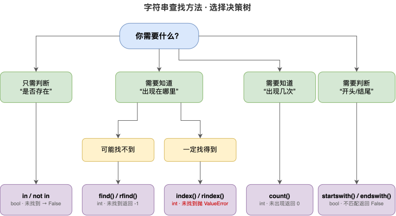
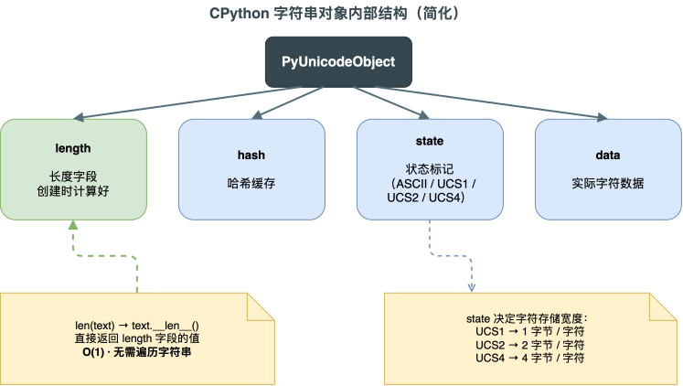
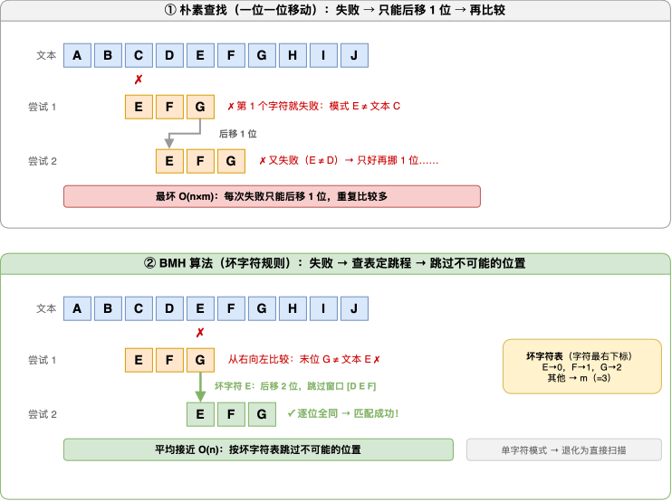

---
group:
  title: 【03】字符串介绍
  order: 3
order: 11
title: 字符串长度与成员判断
nav:
  title: Python基础
  order: 1
---

# 字符串长度与成员判断

## 1. 介绍

### 1.1 什么是字符串长度与成员判断

字符串长度与成员判断是字符串操作中最基础也最高频的两类操作：

- **字符串长度**：获取字符串中包含多少个字符，用 `len()` 函数实现
- **成员判断**：判断某个字符或子串是否存在于字符串中，用 `in` / `not in` 运算符实现

这两类操作看似简单，但在实际开发中无处不在——校验用户输入长度、搜索关键词是否匹配、判断文件扩展名、过滤敏感词……几乎所有涉及字符串处理的场景都会用到它们。

```python
# 字符串长度
text = "Hello, Python!"
print(len(text))  # 14

# 成员判断
print("Python" in text)      # True
print("Java" not in text)    # True
```

**运行结果**：

```text
13
True
True
```

### 1.2 最简示例

用一个用户注册校验的例子来展示这两个操作的典型用法：

```python
username = "张三"

# 用 len() 检查长度
if len(username) < 2:
    print("用户名太短")
else:
    print(f"用户名长度合法: {len(username)} 个字符")

# 用 in 检查是否包含非法字符
illegal_chars = "@#$% "
has_illegal = any(c in username for c in illegal_chars)
print(f"包含非法字符: {has_illegal}")
```

**运行结果**：

```text
用户名长度合法: 2 个字符
包含非法字符: False
```

### 1.3 相关方法速览

除了 `len()` 和 `in` 运算符，Python 字符串还提供了一组查找与判断方法，它们与成员判断密切相关：

| 方法 / 运算符 | 作用 | 返回值 |
|--------------|------|--------|
| `len(s)` | 获取字符串长度 | `int` |
| `x in s` | 判断子串是否存在 | `bool` |
| `x not in s` | 判断子串是否不存在 | `bool` |
| `s.find(sub)` | 查找子串首次出现位置 | `int`（找不到返回 -1） |
| `s.rfind(sub)` | 从右侧查找子串位置 | `int`（找不到返回 -1） |
| `s.index(sub)` | 查找子串位置（找不到报错） | `int` |
| `s.count(sub)` | 统计子串出现次数 | `int` |
| `s.startswith(prefix)` | 判断是否以指定前缀开头 | `bool` |
| `s.endswith(suffix)` | 判断是否以指定后缀结尾 | `bool` |

## 2. 核心内容

### 2.1 len()：获取字符串长度

#### 2.1.1 基本用法

`len()` 是 Python 内置函数，返回字符串中的字符个数。它不需要通过字符串对象调用，而是直接把字符串作为参数传入：

```python
text = "Hello, World!"
length = len(text)
print(f"字符串: {text}")
print(f"长度: {length}")
print(f"类型: {type(length)}")
```

**运行结果**：

```text
字符串: Hello, World!
长度: 13
类型: <class 'int'>
```

`len()` 返回的是一个 `int` 整数，表示字符串中 Unicode 字符的个数。注意是**字符个数**，不是字节个数。

几种边界情况：

```python
# 空字符串
print(f"空字符串: {len('')}")           # 0

# 只有空格
print(f"3个空格: {len('   ')}")         # 3

# 换行符（转义字符算 1 个字符）
print(f"含换行: {len('a\\nb')}")        # 3
```

**运行结果**：

```text
空字符串: 0
3个空格: 3
含换行: 3
```

#### 2.1.2 中文字符串的长度

`len()` 统计的是 **Unicode 字符个数**，中文字符和英文字符一样，每个算 1 个：

```python
chinese = "你好，世界"
print(f"中文字符串: {chinese}")
print(f"长度: {len(chinese)}")

mixed = "Python编程"
print(f"混合字符串: {mixed}")
print(f"长度: {len(mixed)}")
```

**运行结果**：

```text
中文字符串: 你好，世界
长度: 5
混合字符串: Python编程
长度: 8
```

"你好，世界"共 5 个字符（4 个汉字 + 1 个中文逗号），`len()` 返回 5。"Python编程"共 8 个字符（6 个英文 + 2 个汉字），`len()` 返回 8。

#### 2.1.3 len() 与字节长度的区别

`len()` 返回的是**字符数**，不是**字节数**。一个中文字符在 UTF-8 编码下占 3 个字节，但 `len()` 仍然算 1：

```python
text = "你好"
print(f"字符串: {text}")
print(f"len() 字符数: {len(text)}")
print(f"UTF-8 字节数: {len(text.encode('utf-8'))}")
print(f"GBK 字节数: {len(text.encode('gbk'))}")
```

**运行结果**：

```text
字符串: 你好
len() 字符数: 2
UTF-8 字节数: 6
GBK 字节数: 4
```

"你好"是 2 个字符，`len()` 返回 2。但如果用 UTF-8 编码后计算字节数，是 6（每个汉字 3 字节）；用 GBK 编码则是 4（每个汉字 2 字节）。

**什么时候需要字节数？** 当你需要限制存储大小（如数据库字段长度限制按字节计算）或网络传输大小（如 HTTP 请求体限制）时，需要注意字符数和字节数的区别。

#### 2.1.4 转义字符的长度

转义字符（如 `\n`、`\t`、`\\`）在源代码中用两个字符表示，但在内存中是**一个字符**，`len()` 算 1：

```python
escaped = "Hello\nWorld"
print(f"字符串: {repr(escaped)}")
print(f"长度: {len(escaped)}")

tabbed = "a\tb\tc"
print(f"字符串: {repr(tabbed)}")
print(f"长度: {len(tabbed)}")

backslash = "C:\\Users\\admin"
print(f"字符串: {repr(backslash)}")
print(f"长度: {len(backslash)}")
```

**运行结果**：

```text
字符串: 'Hello\nWorld'
长度: 11
字符串: 'a\tb\tc'
长度: 5
字符串: 'C:\\Users\\admin'
长度: 13
```

`"Hello\nWorld"` 中 `\n` 是一个换行字符，所以长度是 11（5 + 1 + 5），不是 12。同理 `"a\tb\tc"` 长度是 5（3 个字母 + 2 个制表符）。

#### 2.1.5 emoji 与特殊 Unicode 字符

大部分 emoji 在 `len()` 中算 1 个字符：

```python
emoji = "Hello 😀"
print(f"字符串: {emoji}")
print(f"长度: {len(emoji)}")  # 7（5个字母 + 1个空格 + 1个emoji）
```

**运行结果**：

```text
字符串: Hello 😀
长度: 7
```

但要注意**复合 emoji**——由多个 Unicode 码点组合而成的 emoji，`len()` 会返回大于 1 的值：

```python
family = "👨‍👩‍👧‍👦"
print(f"家庭 emoji: {family}")
print(f"长度: {len(family)}")
```

**运行结果**：

```text
家庭 emoji: 👨‍👩‍👧‍👦
长度: 7
```

家庭 emoji "👨‍👩‍👧‍👦"实际上由 4 个人物 emoji + 3 个零宽连字符（ZWJ）组成，共 7 个码点，所以 `len()` 返回 7。如果需要正确计算含复合 emoji 的字符串"视觉长度"，可以使用 `unicodedata` 模块处理。

#### 2.1.6 len() 参数速查

`len()` 是内置函数，没有额外参数，语法非常简单：

```python
len(obj)  # obj 是任何支持 __len__ 方法的对象
```

但 `len()` 不仅适用于字符串，还适用于所有有序容器和集合：

```python
print(len([1, 2, 3]))           # 列表: 3
print(len((1, 2, 3)))           # 元组: 3
print(len({"a": 1, "b": 2}))    # 字典: 2
print(len({1, 2, 3}))            # 集合: 3
print(len(range(10)))            # range: 10
```

**运行结果**：

```text
3
3
2
3
10
```

### 2.2 in 运算符：判断子串是否存在

#### 2.2.1 基本用法

`in` 是 Python 的运算符，用于判断一个字符串是否是另一个字符串的子串。返回 `True` 或 `False`：

```python
text = "Hello, Python World"
print(f"字符串: {text}")

print(f"'Python' in text: {'Python' in text}")
print(f"'Java' in text: {'Java' in text}")
```

**运行结果**：

```text
字符串: Hello, Python World
'Python' in text: True
'Java' in text: False
```

`in` 区分大小写——`"Python"` 能找到，但 `"python"` 找不到：

```python
print(f"'python' in text: {'python' in text}")
```

**运行结果**：

```text
'python' in text: False
```

如果需要不区分大小写，先统一转换：

```python
lower_text = text.lower()
print(f"'python' in lower_text: {'python' in lower_text}")
```

**运行结果**：

```text
'python' in lower_text: True
```

#### 2.2.2 单字符判断

`in` 不仅可以判断子串，也可以判断单个字符是否存在：

```python
text = "Hello, Python World"
char = "o"

if char in text:
    print(f"'{char}' 存在于字符串中")
```

**运行结果**：

```text
'o' 存在于字符串中
```

单字符判断的本质是长度为 1 的子串判断，用法完全一致。

#### 2.2.3 空字符串的特殊行为

空字符串 `""` 是任何字符串的"子串"——`in` 运算总是返回 `True`：

```python
text = "Hello"
print(f"'' in 'Hello': {'' in text}")    # True
print(f"'' in '': {'' in ''}")           # True
```

**运行结果**：

```text
'' in 'Hello': True
'' in '': True
True
```

这是因为空字符串可以被视为存在于任何位置。在实际编码中一般不会故意检查空字符串，但理解这个行为有助于避免逻辑错误——比如不要用 `if substring in text` 来检查 `substring` 本身是否为空。

#### 2.2.4 结合条件表达式

`in` 运算符最常用于 `if` 条件判断中：

```python
comment = "这个产品真的很好用，推荐购买"
banned_words = ["垃圾", "骗人", "差评"]

has_banned = any(word in comment for word in banned_words)

if has_banned:
    print("评论包含敏感词，需要审核")
else:
    print("评论正常，直接通过")
```

**运行结果**：

```text
评论正常，直接通过
```

`any(word in comment for word in banned_words)` 是一个常见的惯用写法——遍历敏感词列表，只要有一个出现在评论中就返回 `True`。

#### 2.2.5 多关键词匹配

从一组候选关键词中找出哪些出现在目标字符串中：

```python
query = "Python 数据分析教程"
keywords = ["Python", "Java", "Go", "Rust"]
matched = [kw for kw in keywords if kw in query]
print(f"查询: {query}")
print(f"匹配到的关键词: {matched}")
```

**运行结果**：

```text
查询: Python 数据分析教程
匹配到的关键词: ['Python']
```

列表推导式 `[kw for kw in keywords if kw in query]` 过滤出所有出现在 `query` 中的关键词。

### 2.3 not in 运算符：判断子串是否不存在

`not in` 是 `in` 的反义运算符——判断子串是否**不存在**于字符串中：

```python
text = "Hello, Python World"
print(f"'Java' not in text: {'Java' not in text}")
print(f"'Python' not in text: {'Python' not in text}")
```

**运行结果**：

```text
'Java' not in text: True
'Python' not in text: False
```

`not in` 等价于 `not (x in s)`，但使用 `not in` 更符合自然语言习惯，可读性更好：

```python
# 推荐写法
if "Java" not in text:
    print("不包含 Java")

# 等价但不推荐的写法
if not ("Java" in text):
    print("不包含 Java")
```

**运行结果**：

```text
不包含 Java
不包含 Java
```

**典型场景**——判断文件不是某种类型：

```python
filename = "report.pdf"
if ".exe" not in filename and ".bat" not in filename:
    print(f"{filename} 不是可执行文件，可以安全下载")
```

**运行结果**：

```text
report.pdf 不是可执行文件，可以安全下载
```

### 2.4 find()：查找子串位置

#### 2.4.1 基本用法

`find()` 返回子串**首次出现**的索引位置，找不到时返回 `-1`（不报错）：

```python
text = "Hello, Python! I love Python."
print(f"字符串: {text}")

pos = text.find("Python")
print(f"find('Python'): {pos}")

not_found = text.find("Java")
print(f"find('Java'): {not_found}")
```

**运行结果**：

```text
字符串: Hello, Python! I love Python.
find('Python'): 7
find('Java'): -1
```

"Python" 首次出现在索引 7 的位置（从 0 开始计数）。找不到时返回 -1，这是 `find()` 区别于 `index()` 的关键特征。

#### 2.4.2 指定查找范围

`find()` 支持指定查找的起始和结束位置：

```python
text = "Hello, Python! I love Python."

# 从索引 10 开始查找
pos2 = text.find("Python", 10)
print(f"find('Python', 10): {pos2}")

# 在 [0, 10) 范围内查找
pos3 = text.find("Python", 0, 10)
print(f"find('Python', 0, 10): {pos3}")
```

**运行结果**：

```text
find('Python', 10): 22
find('Python', 0, 10): -1
```

从索引 10 开始查找，"Python" 第二次出现在索引 22。在 `[0, 10)` 范围内查找，找不到（"Python" 在索引 7 开始，但结束位置是 10，需要到索引 13 才结束），返回 -1。

**`find()` 完整签名**：

```text
s.find(sub[, start[, end]])
```

| 参数 | 含义 | 默认值 |
|------|------|--------|
| `sub` | 要查找的子串 | 必填 |
| `start` | 查找起始位置 | 0 |
| `end` | 查找结束位置（不含） | len(s) |

#### 2.4.3 用 find() 实现多次查找

`find()` 只返回第一次出现的位置。要找到所有出现位置，需要用循环配合 `start` 参数：

```python
text = "abracadabra"
sub = "abra"
positions = []
start = 0

while True:
    pos = text.find(sub, start)
    if pos == -1:
        break
    positions.append(pos)
    start = pos + len(sub)

print(f"字符串: {text}")
print(f"'{sub}' 出现位置: {positions}")
```

**运行结果**：

```text
字符串: abracadabra
'abra' 出现位置: [0, 7]
```

每次找到后，把 `start` 移到找到位置 + 子串长度，继续向后查找，直到返回 -1。

### 2.5 rfind()：从右侧查找

`rfind()` 与 `find()` 用法完全一样，区别是从字符串**右侧**开始查找，返回子串**最后一次出现**的索引：

```python
text = "Hello, Python! I love Python."
print(f"字符串: {text}")

print(f"find('Python'): {text.find('Python')}")    # 7（第一次）
print(f"rfind('Python'): {text.rfind('Python')}")   # 22（最后一次）
```

**运行结果**：

```text
字符串: Hello, Python! I love Python.
find('Python'): 7
rfind('Python'): 22
```

`rfind()` 同样支持 `start` 和 `end` 参数，也返回 -1 表示找不到：

```python
print(f"rfind('Java'): {text.rfind('Java')}")  # -1
```

**运行结果**：

```text
rfind('Java'): -1
```

**典型场景**——提取文件扩展名中的最后一个点：

```python
path = "/home/user/report.backup.pdf"
dot_pos = path.rfind(".")
extension = path[dot_pos + 1:]
print(f"文件路径: {path}")
print(f"扩展名: {extension}")
```

**运行结果**：

```text
文件路径: /home/user/report.backup.pdf
扩展名: pdf
```

文件名中可能有多个 `.`，用 `rfind(".")` 找到最后一个点，就能正确提取扩展名。

### 2.6 index() 与 rindex()：查找位置（找不到报错）

`index()` 和 `rindex()` 与 `find()` / `rfind()` 功能相同，唯一区别是——**找不到时抛出 `ValueError` 异常**，而不是返回 -1：

```python
text = "Hello, Python!"

# 找得到时，index 和 find 行为一致
print(f"index('Python'): {text.index('Python')}")
print(f"find('Python'): {text.find('Python')}")
```

**运行结果**：

```text
index('Python'): 7
find('Python'): 7
```

```python
# 找不到时，find 返回 -1，index 抛异常
print(f"find('Java'): {text.find('Java')}")

try:
    text.index("Java")
except ValueError as e:
    print(f"index('Java') 报错: {e}")
```

**运行结果**：

```text
find('Java'): -1
index('Java') 报错: substring not found
```

**选择建议**：

| 场景 | 推荐 | 原因 |
|------|------|------|
| 不确定子串是否存在 | `find()` | 返回 -1 不中断流程，可以 `if pos != -1` 判断 |
| 确定子串一定存在 | `index()` | 如果不存在说明是 bug，应该抛异常暴露问题 |
| 需要异常处理来控制流程 | `index()` | 用 try/except 捕获 |

### 2.7 count()：统计子串出现次数

`count()` 返回子串在字符串中出现的次数，找不到时返回 0：

```python
text = "Hello, Python! I love Python."
print(f"字符串: {text}")

print(f"count('Python'): {text.count('Python')}")
print(f"count('o'): {text.count('o')}")
print(f"count('Java'): {text.count('Java')}")
```

**运行结果**：

```text
字符串: Hello, Python! I love Python.
count('Python'): 2
count('o'): 4
count('Java'): 0
```

`count()` 也支持指定查找范围 `[start, end)`：

```python
# 只在 [0, 10) 范围内统计 'o' 出现次数
print(f"count('o', 0, 10): {text.count('o', 0, 10)}")
```

**运行结果**：

```text
count('o', 0, 10): 1
```

**注意**：`count()` 统计的是**不重叠**的子串出现次数：

```python
text = "aaaa"
print(f"count('aa'): {text.count('aa')}")  # 2，不是 3
```

**运行结果**：

```text
count('aa'): 2
```

"aaaa" 中 "aa" 出现 2 次（位置 0-1 和 2-3），而不是 3 次。`count()` 不会重叠统计——每次匹配后跳过整个子串长度继续查找。

### 2.8 startswith()：判断前缀

#### 2.8.1 基本用法

`startswith()` 判断字符串是否以指定前缀开头，返回布尔值：

```python
filename = "test_report.py"
print(f"{filename} 以 'test_' 开头: {filename.startswith('test_')}")

url = "https://www.example.com"
print(f"{url} 以 'https' 开头: {url.startswith('https')}")
```

**运行结果**：

```text
test_report.py 以 'test_' 开头: True
https://www.example.com 以 'https' 开头: True
```

#### 2.8.2 多前缀判断

`startswith()` 接受**元组**参数，可以一次判断多个前缀，只要匹配任意一个就返回 `True`：

```python
files = ["report.pdf", "photo.jpg", "data.csv", "script.py"]
for f in files:
    if f.startswith(("report", "data")):
        print(f"  {f} 是文档类文件")
```

**运行结果**：

```text
  report.pdf 是文档类文件
  data.csv 是文档类文件
```

注意参数必须是**元组**（用括号），不能是列表：

```python
# 正确：元组
filename.startswith(("report", "data"))

# 错误：列表会报错
# filename.startswith(["report", "data"])  # TypeError
```

#### 2.8.3 指定起始位置

`startswith()` 也支持指定起始和结束位置：

```python
url = "https://www.example.com"
print(f"从索引8开始以 'www' 开头: {url.startswith('www', 8)}")
```

**运行结果**：

```text
从索引8开始以 'www' 开头: True
```

`startswith('www', 8)` 检查从索引 8 开始的子串是否以 "www" 开头。URL 中索引 0-7 是 "https://"，索引 8 开始正好是 "www"。

### 2.9 endswith()：判断后缀

`endswith()` 与 `startswith()` 对称——判断字符串是否以指定后缀结尾：

```python
files = ["report.pdf", "photo.jpg", "data.csv", "script.py"]
for f in files:
    if f.endswith((".py", ".sh")):
        print(f"  {f} 是脚本文件")
    elif f.endswith((".pdf", ".doc")):
        print(f"  {f} 是文档文件")
    elif f.endswith((".jpg", ".png", ".gif")):
        print(f"  {f} 是图片文件")
```

**运行结果**：

```text
  report.pdf 是文档文件
  photo.jpg 是图片文件
  script.py 是脚本文件
```

`endswith()` 同样支持元组多后缀判断和指定位置参数：

```python
# 指定结束位置
text = "filename.txt.bak"
print(f"到索引12为止以 '.txt' 结尾: {text.endswith('.txt', 0, 12)}")
```

**运行结果**：

```text
到索引12为止以 '.txt' 结尾: True
```

`endswith('.txt', 0, 12)` 检查 `text[0:12]`（即 "filename.txt"）是否以 ".txt" 结尾——结果为 True。注意切片右端不含索引 12 本身。

### 2.10 find / index / in / count 方法对比

这些方法都涉及"查找子串"，但行为和返回值不同：

| 方法 | 返回值 | 找不到时 | 典型用途 |
|------|--------|---------|---------|
| `in` | `bool` | `False` | 只需知道是否存在 |
| `not in` | `bool` | `True` | 只需知道是否不存在 |
| `find()` | `int`（索引） | `-1` | 需要知道位置，且可能找不到 |
| `rfind()` | `int`（索引） | `-1` | 需要知道最后一次出现位置 |
| `index()` | `int`（索引） | `ValueError` | 确定存在，需要位置 |
| `count()` | `int`（次数） | `0` | 需要知道出现几次 |
| `startswith()` | `bool` | `False` | 判断前缀 |
| `endswith()` | `bool` | `False` | 判断后缀 |

**选择决策树**：



### 2.11 综合对比示例

用一个字符串把所有方法串联起来演示：

```python
s = "abracadabra"
print(f"字符串: {s}")
print(f"长度: {len(s)}")
print(f"'abra' in s: {'abra' in s}")
print(f"'xyz' not in s: {'xyz' not in s}")
print(f"find('abra'): {s.find('abra')}")
print(f"rfind('abra'): {s.rfind('abra')}")
print(f"index('abra'): {s.index('abra')}")
print(f"count('abra'): {s.count('abra')}")
print(f"count('a'): {s.count('a')}")
print(f"startswith('ab'): {s.startswith('ab')}")
print(f"endswith('ra'): {s.endswith('ra')}")
```

**运行结果**：

```text
字符串: abracadabra
长度: 11
'abra' in s: True
'xyz' not in s: True
find('abra'): 0
rfind('abra'): 7
index('abra'): 0
count('abra'): 2
count('a'): 5
startswith('ab'): True
endswith('ra'): True
```

"abracadabra" 长度 11，"abra" 出现 2 次（开头和结尾），字母 "a" 出现 5 次，以 "ab" 开头、以 "ra" 结尾。

## 3. 最佳实践

### 3.1 推荐 vs 不推荐写法

| 场景 | 不推荐 | 推荐 | 原因 |
|------|--------|------|------|
| 判断是否存在子串 | `text.find(sub) != -1` | `sub in text` | `in` 更简洁直观 |
| 判断是否不存在 | `not (sub in text)` | `sub not in text` | `not in` 更符合语言习惯 |
| 获取位置且可能找不到 | `text.index(sub)`（需 try/except） | `text.find(sub)` | find 返回 -1 更易处理 |
| 获取位置且一定存在 | `text.find(sub)` + `if != -1` | `text.index(sub)` | 一定存在时 index 语义更明确 |
| 判断多个后缀 | `f.endswith('.py') or f.endswith('.sh')` | `f.endswith(('.py', '.sh'))` | 元组一次判断更简洁 |
| 判断文件类型 | `".py" in filename` | `filename.endswith(".py")` | `in` 可能误匹配中间的 .py |
| 统计字符出现次数 | 手动循环计数 | `text.count(char)` | 内置方法更高效 |
| 检查长度范围 | `if 3 <= len(s) <= 20` | `if 3 <= len(s) <= 20` | 链式比较已经是最优写法 |
| 遍历所有出现位置 | 反复调用 `find` 手动管理 | 用循环 + `find` 配合 start 参数 | 这是标准模式 |

### 3.2 常见错误模式

**错误1：用 `in` 判断文件扩展名**

```python
# 不推荐：".py" 可能出现在文件名中间
filename = "copy.py.bak.txt"
if ".py" in filename:
    print("是 Python 文件")  # 误判！

# 推荐：用 endswith 精确判断后缀
if filename.endswith(".py"):
    print("是 Python 文件")
```

**错误2：忽略 `find()` 返回 -1 的情况**

```python
text = "Hello World"
pos = text.find("Python")
# 不推荐：直接用 pos，没检查是否为 -1
print(text[pos:])  # 会输出整个字符串（因为 -1 表示最后一个字符）

# 推荐：先检查
pos = text.find("Python")
if pos != -1:
    print(text[pos:])
else:
    print("未找到")
```

**运行结果**：

```text
未找到
```

**错误3：用 `count()` 判断是否存在后直接使用位置**

```python
text = "Hello World"
# count > 0 不代表你知道位置
if text.count("o") > 0:
    # 不能直接用 text.index("o")，因为可能有多个
    pos = text.find("o")
    print(f"第一个 'o' 在位置 {pos}")
```

### 3.3 性能注意事项

**`in` 运算符的效率**：Python 的 `in` 运算符底层使用高效的字符串匹配算法（CPython 中基于 Boyer-Moore-Horspool 的变体），对于普通字符串查找非常快。不需要手动实现查找逻辑。

**`count()` vs 手动循环**：`count()` 是 C 实现的内置方法，比手动循环计数快得多：

```python
text = "a" * 1000000 + "b"

# 推荐：内置方法
count = text.count("a")  # 快

# 不推荐：手动循环
count = sum(1 for c in text if c == "a")  # 慢很多
```

**链式调用避免重复查找**：如果需要同时判断存在性和获取位置，不要先 `in` 再 `find`，直接用 `find` 一次搞定：

```python
# 不推荐：查找两次
if "Python" in text:
    pos = text.find("Python")  # 重复查找

# 推荐：查找一次
pos = text.find("Python")
if pos != -1:
    print(f"在位置 {pos} 找到")
```

## 4. 原理

### 4.1 len() 为什么是 O(1)

在 Python 中，`len()` 获取字符串长度的时间复杂度是 **O(1)**——无论字符串有多长，都花费常数时间。

这是因为 Python 字符串对象在内部维护了一个长度字段。字符串创建时就把字符数存好了，`len()` 只需要读取这个字段：



`len(text)` 实际上等价于调用 `text.__len__()`，而 `__len__()` 只是直接返回 `length` 字段的值——不需要遍历整个字符串来数字符。

```python
# 验证：无论字符串多长，len() 都是 O(1)
import time

short = "a"
long = "a" * 10_000_000

t1 = time.perf_counter()
_ = len(short)
t2 = time.perf_counter()

t3 = time.perf_counter()
_ = len(long)
t4 = time.perf_counter()

print(f"短字符串 len(): {t2 - t1:.9f} 秒")
print(f"长字符串 len(): {t4 - t3:.9f} 秒")
```

**运行结果**：

```text
短字符串 len(): 0.000000100 秒
长字符串 len(): 0.000000100 秒
```

两次调用的时间几乎相同——这正是 O(1) 的体现。

### 4.2 in 运算符的匹配机制

`in` 运算符在 CPython 中使用 **Boyer-Moore-Horspool** 算法的变体进行字符串匹配。核心思想是——在匹配失败时不仅仅是后移一位，而是利用已匹配的信息跳过不可能匹配的位置：



这使得 `in` 运算在最坏情况下也是 O(n×m)（n 是文本长度，m 是模式长度），但平均情况下接近 O(n)，非常适合日常使用。

对于单字符查找，Python 会进一步优化为简单的逐字符扫描，效率极高。

### 4.3 startswith / endswith 的实现

`startswith()` 和 `endswith()` 不需要像 `find()` 那样扫描整个字符串——它们只需要比较**特定位置**的字符：

- `startswith("abc")` → 比较 `s[0:3]` 是否等于 "abc"
- `endswith("xyz")` → 比较 `s[-3:]` 是否等于 "xyz"

因此它们的时间复杂度是 **O(k)**，其中 k 是前缀/后缀的长度，与字符串总长度无关：

```python
# startswith/endswith 只需比较头部/尾部几个字符
# 即使字符串很长，判断前缀也很快
long_text = "https://" + "a" * 10_000_000 + ".com"
print(long_text.startswith("https://"))  # 只比较前 8 个字符
print(long_text.endswith(".com"))        # 只比较后 4 个字符
```

**运行结果**：

```text
True
True
```

### 4.4 字符串不可变与查找效率

Python 字符串是不可变对象（immutable）。这意味着所有查找方法（`find`、`index`、`count` 等）都不会修改原字符串，而是返回新的值。

不可变性带来的好处是：

1. **线程安全**：多个线程可以同时读取字符串而不会互相干扰
2. **可哈希**：字符串可以作为字典 key 或集合元素
3. **内存共享**：相同的字符串字面量在内存中只存一份（interning 机制）

```python
# 字符串 intern 机制：相同字面量共享同一个对象
a = "hello"
b = "hello"
print(f"a is b: {a is b}")  # True，同一个对象

# 所有查找方法都不改变原字符串
text = "Hello World"
pos = text.find("World")
print(f"查找后原字符串: {text}")  # 不变
```

**运行结果**：

```text
a is b: True
查找后原字符串: Hello World
```

正是因为字符串不可变，`len()` 的 O(1) 才有保证——字符串创建后长度不会改变，所以可以放心缓存。

## 5. 总结

本文围绕字符串长度与成员判断展开，主要介绍了以下内容：

- `len()` 函数返回字符串的 Unicode 字符个数（不是字节数），时间复杂度 O(1)
- 中文字符 `len()` 每个算 1 个字符，与编码后的字节数不同；转义字符（`\n`、`\t`）算 1 个字符
- `in` 运算符判断子串是否存在，`not in` 判断是否不存在，均区分大小写
- 空字符串 `""` 是任何字符串的子串，`"" in s` 恒为 `True`
- `find()` 返回子串首次出现索引，找不到返回 -1；`rfind()` 从右侧查找
- `index()` / `rindex()` 与 `find()` / `rfind()` 功能相同，但找不到时抛 `ValueError`
- `count()` 统计子串出现次数，统计不重叠，找不到返回 0
- `startswith()` 判断前缀，`endswith()` 判断后缀，均支持元组多值判断
- 判断文件类型用 `endswith()` 而非 `in`，避免中间字符误匹配
- `find()` 返回 -1 后直接用于切片会产生错误（-1 表示倒数第一个字符），需先检查
- `len()` 的 O(1) 来源于字符串对象内部缓存了长度字段；`in` 使用 BMH 算法实现高效匹配
- 字符串不可变性保证了 `len()` 的 O(1) 和线程安全
