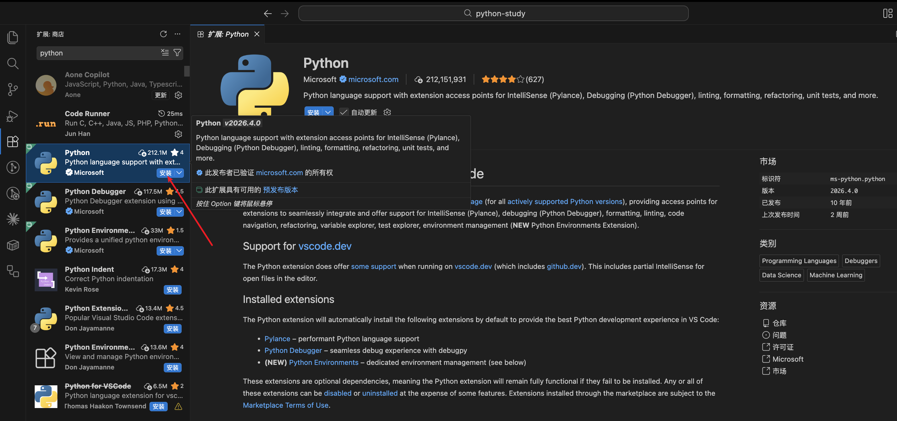
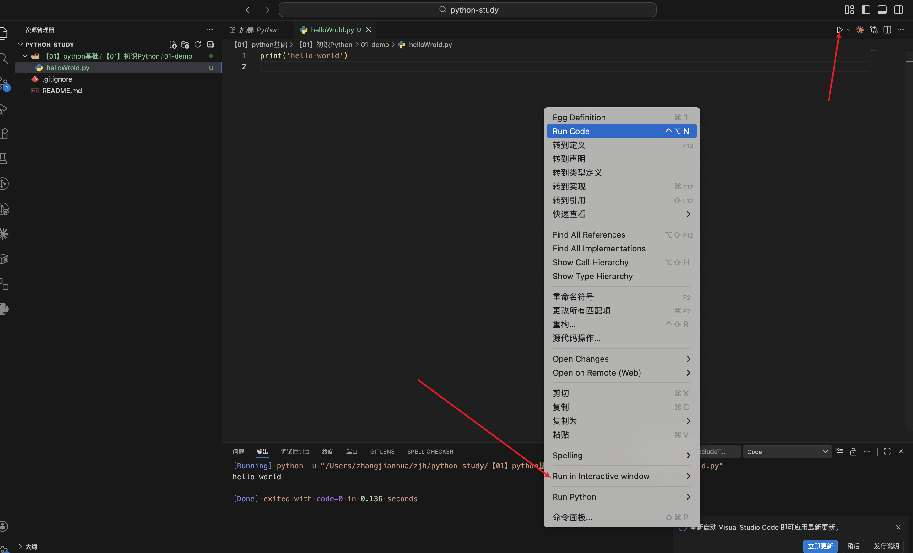

## 1、介绍

Python 是一种简单易学、功能强大的编程语言。它的设计强调代码可读性，语法简洁，非常适合编程初学者。Python 支持多种编程范式（面向对象、函数式等），并拥有庞大的标准库和第三方生态，广泛应用于 Web 开发、数据分析、人工智能、自动化脚本等领域。

Python 的主要特点可以概括为以下几点：

1. **简单易学**  
   语法清晰、接近自然语言，对初学者非常友好，代码可读性高。
2. **解释型语言**  
   无需编译，逐行执行，便于快速开发和调试。
3. **动态类型**  
   变量不需要声明类型，赋值时自动确定，使用灵活。
4. **高级语言**  
   自动管理内存（垃圾回收），无需关心底层细节如指针、内存分配。
5. **面向对象**  
   支持类、继承、多态等面向对象特性，同时也支持过程式和函数式编程。
6. **跨平台**  
   可在 Windows、macOS、Linux 等多个操作系统上运行，无需修改代码。
7. **丰富的标准库和第三方库**  
   内置大量模块（如文件处理、网络、正则表达式），并通过 PyPI 拥有海量第三方库（如 NumPy、Django、TensorFlow）。
8. **可扩展性与可嵌入性**  
   可使用 C/C++ 编写性能关键模块，也可将 Python 嵌入到其他程序中作为脚本语言。
9. **强制缩进**  
   用缩进（而不是花括号）表示代码块，强制统一风格，提升代码整洁度。
10. **开源免费**  
    基于 OSI 认可的开源协议，可以自由使用、分发和修改。

这些特点使 Python 成为从自动化脚本到人工智能等众多领域的首选语言之一。

## 2、Python 安装

Python 可应用于多个平台，如 Windows、Linux 和 MacOS。无论使用哪个系统，最安全、最可靠的方式都是从 Python 官方网站下载安装程序。  
官网地址：[www.python.org/downloads/](https://www.python.org/downloads/)

### 2.1、Windows 系统安装指南

1. **下载安装包**  
   访问官网，点击下载最新版本的 Windows 安装程序（例如 `python-3.x.x.exe`，64位或32位根据系统选择）。
2. **运行安装程序**  
   双击下载的 `.exe` 文件。  
   **关键步骤**：在安装界面底部，**务必勾选** `Add Python to PATH`（将 Python 添加到环境变量），否则后续无法在命令行直接使用 `python` 命令。  
   然后点击 `Install Now`（默认安装路径）或 `Customize installation`（自定义路径）。
3. **等待安装完成**  
   安装进度条走完后，会看到 `Setup was successful` 提示，点击 `Close` 关闭。
4. **验证安装**  
   打开命令提示符（Win+R 输入 `cmd` 回车），输入：

```plain
python --version
```

如果显示类似 `Python 3.12.2` 的版本号，说明安装成功。  
再输入：

```plain
pip --version
```

检查包管理工具 pip 是否正常。

5. **可选：安装后使用交互环境**  
   命令行输入 `python` 即可进入 `>>>` 交互式环境，输入 `exit()` 退出。

> **注意**：如果忘记勾选 PATH，可以重新运行安装程序选择 `Modify` 并勾选 PATH，或手动添加环境变量。

### 2.2、Mac 系统安装指南

#### 方法一：官方安装包（推荐新手）

1. 访问官网下载 macOS 安装程序（`.pkg` 文件）。
2. 双击打开，按提示点击“继续”，同意软件许可协议。
3. 选择安装位置（默认即可），点击“安装”，输入系统密码。
4. 安装完成后，打开终端（Terminal），输入：

```bash
python3 --version
```

（注意 macOS 上 Python 2 已废弃，官方安装包会同时安装 `python3` 命令）

5. 如果需要使用 `pip`，输入 `pip3 --version`。

#### 方法二：使用 Homebrew（更灵活）

如果已安装 [Homebrew](https://brew.sh/)，可直接执行：

```bash
brew install python
```

这会安装最新版 Python，并自动关联 `python3` 和 `pip3`。

> **说明**：macOS 系统自带的 Python 2.x 已不再维护，**不要卸载系统自带版本**，使用 `python3` 命令即可。

### 2.3、Linux 系统安装指南

绝大多数 Linux 发行版已经预装了 Python（通常是 Python 3），但版本可能较旧。建议通过包管理器安装或更新到最新稳定版。

#### Ubuntu / Debian 系列

1. 更新软件源：

```bash
sudo apt update
sudo apt upgrade -y
```

2. 安装 Python 3：

```bash
sudo apt install python3 python3-pip -y
```

3. 验证：

```bash
python3 --version
pip3 --version
```

4. 可选：设置 `python` 命令指向 `python3`（不推荐修改系统默认，但可用 `alias python=python3` 临时生效）。

#### CentOS / RHEL / Fedora

- 对于 CentOS 8+ / RHEL 9+ / Fedora：

```bash
sudo dnf install python3 python3-pip -y
```

- 对于 CentOS 7 / RHEL 7（默认 Python 2.7）：

```bash
sudo yum install python3 python3-pip -y
```

#### 从源码编译安装（高级，不推荐新手）

如需特定版本或自定义路径，可从官网下载源码包编译，但通常包管理器足够日常使用。

> **注意**：Linux 下不要卸载系统自带的 Python（例如 `/usr/bin/python3`），因为很多系统工具依赖它。请使用 `python3` 命令或通过虚拟环境管理不同版本。

## 3、如何彻底卸载 Python

卸载 Python 的干净程度取决于你的安装方式。以下分别介绍三个平台的彻底移除方法。

### 3.1、Windows 完全卸载

1. **通过控制面板卸载**  
   打开“设置” → “应用” → “应用和功能”（或“程序和功能”），找到 Python（例如 `Python 3.x.x (64-bit)`），点击“卸载”。
2. **手动删除残留目录**（安装时默认路径）
   - `C:\Users\你的用户名\AppData\Local\Programs\Python`
   - `C:\Program Files\Python`
   - `C:\Program Files (x86)\Python`  
     以及 `C:\Users\你的用户名\AppData\Local\pip`（pip 缓存）
3. **删除环境变量中的 Python 条目**  
   右键“此电脑” → “属性” → “高级系统设置” → “环境变量”，在系统变量和用户变量的 `Path` 变量中，删除所有包含 Python 的路径（如 `C:\Python3x\Scripts` 等）。
4. **删除开始菜单快捷方式**（如有）  
   在 `C:\ProgramData\Microsoft\Windows\Start Menu\Programs` 中删除 Python 相关文件夹。
5. **可选：使用第三方卸载工具**（如 Geek Uninstaller）扫描残留。

### 3.2、Mac 完全卸载

#### 如果使用官方 .pkg 安装的 Python 3

1. 删除主要目录：

```bash
sudo rm -rf /Library/Frameworks/Python.framework/Versions/3.x
```

（将 `3.x` 替换为你的版本号，如 `3.12`）

2. 删除 `/Applications/Python 3.x` 目录：

```bash
sudo rm -rf "/Applications/Python 3.x/"
```

3. 删除 `/usr/local/bin` 中的符号链接：

```bash
ls -l /usr/local/bin | grep Python
```

然后手动删除链接，例如：

```bash
sudo rm /usr/local/bin/python3 /usr/local/bin/pip3
```

4. 删除系统 PATH 中的残留（一般不需要，除非你修改过 shell 配置文件）。检查 `~/.bash_profile`、`~/.zshrc` 等文件中是否有自定义的 Python 路径，移除即可。

#### 如果使用 Homebrew 安装的 Python

直接执行：

```bash
brew uninstall python
```

这会自动移除 Homebrew 安装的 Python 及其依赖。如需清理所有残留：

```bash
brew cleanup
```

> **警告**：macOS 系统自带的 Python 2.7（位于 `/usr/bin/python`）**绝对不要删除**，否则系统可能无法正常工作。

### 3.3、Linux 完全卸载

**原则**：只卸载你手动安装的 Python 版本，不要动系统自带的 Python 包。

#### 如果是通过包管理器安装的（如 apt / dnf / yum）

- Ubuntu/Debian：

```bash
sudo apt remove --purge python3 python3-pip -y
sudo apt autoremove -y
```

- CentOS/RHEL 7 使用 yum：

```bash
sudo yum remove python3 python3-pip -y
```

- Fedora / CentOS 8+ 使用 dnf：

```bash
sudo dnf remove python3 python3-pip -y
```

#### 如果是从源码编译安装的

1. 删除安装目录（通常为 `/usr/local/lib/python3.x` 和 `/usr/local/bin` 中的相关可执行文件）：

```bash
sudo rm -rf /usr/local/lib/python3.x
sudo rm -f /usr/local/bin/python3 /usr/local/bin/pip3
```

2. 删除 `/usr/local/bin` 中其他以 `python` 或 `pip` 开头的符号链接（谨慎操作，确认是自己安装的）。

#### 清理残留配置和缓存

- 用户级 pip 缓存：`~/.cache/pip`
- 全局 pip 配置：`/etc/pip.conf`
- 虚拟环境目录（如有）：自行删除对应项目下的 `venv` 或 `.env` 文件夹。

> **最后提示**：卸载前建议先用 `which python3` 和 `python3 --version` 确认你将要卸载的 Python 位置和版本，避免误删系统依赖。\*\*\*\*

## 4、编辑器

### 4.1、PyCarm

PyCarm社区版和商业版，学习的话用社区版就行，免费。下载地址：[https://www.jetbrains.com/pycharm/](https://www.jetbrains.com/pycharm/)。

PyCharm Professional 是收费的，PyCharm Community Edition 是免费的。

### 4.2、VSCode

vscode的下载地址为：[https://code.visualstudio.com/](https://code.visualstudio.com/)

使用vscode的时候需要安装插件。



然后就可以直接写python相关的内容，然后点击对应的三角标识运行python代码。


