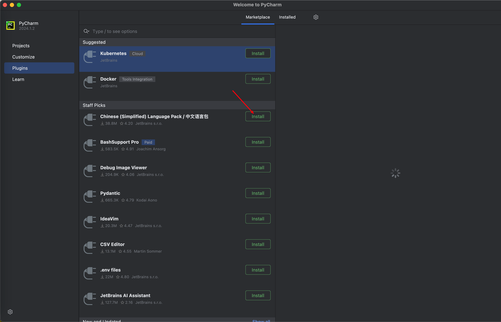
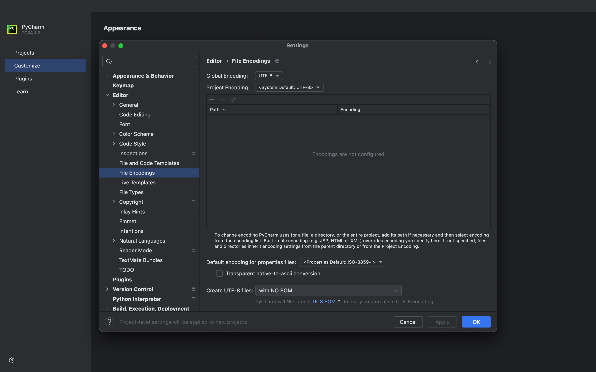
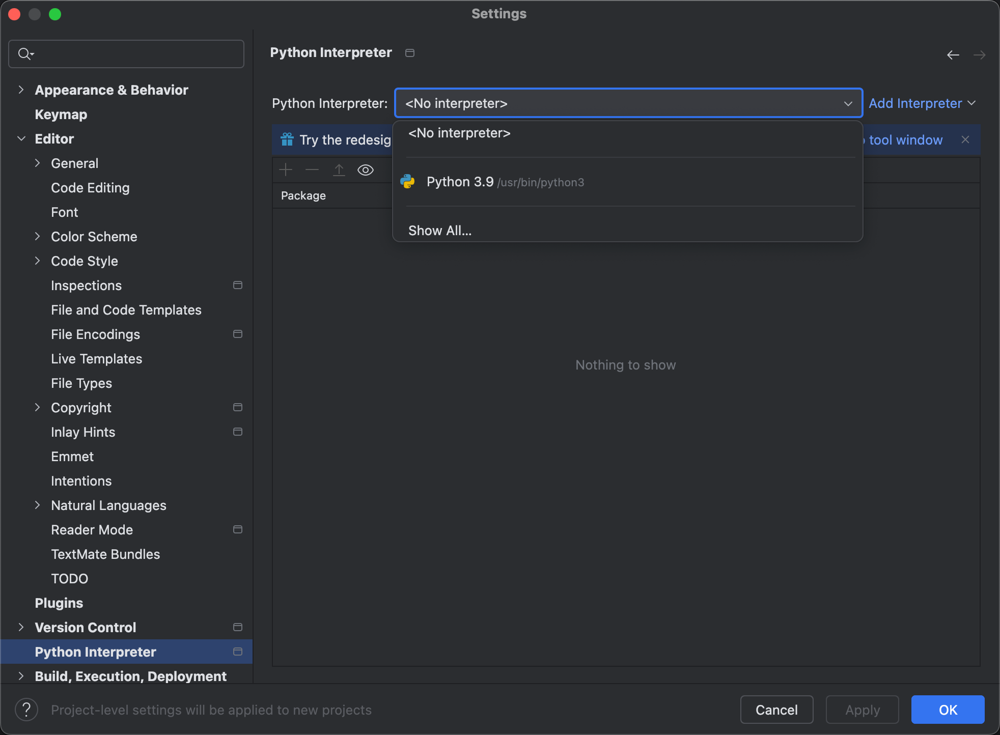
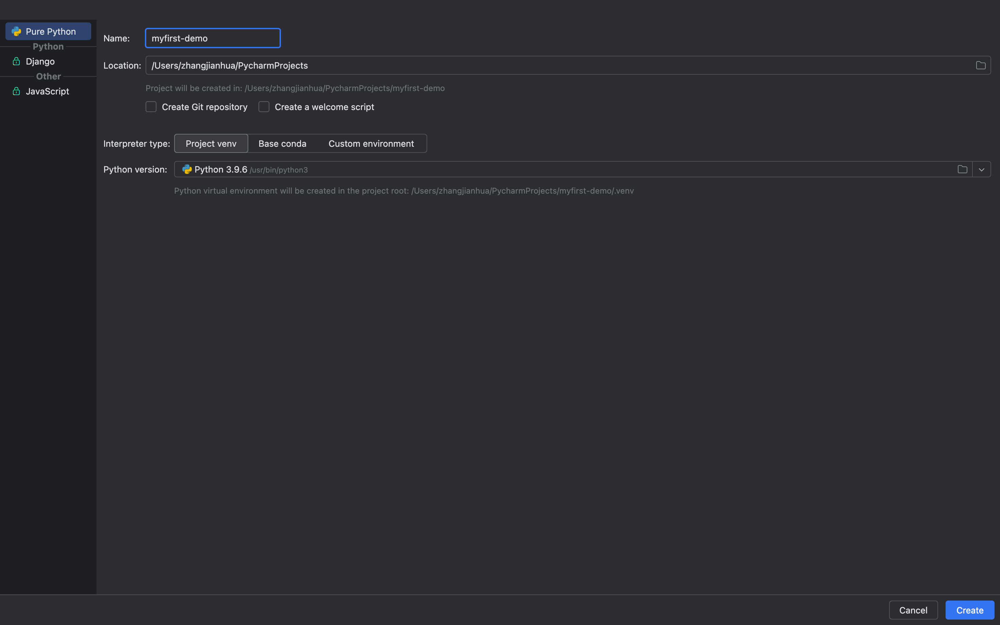
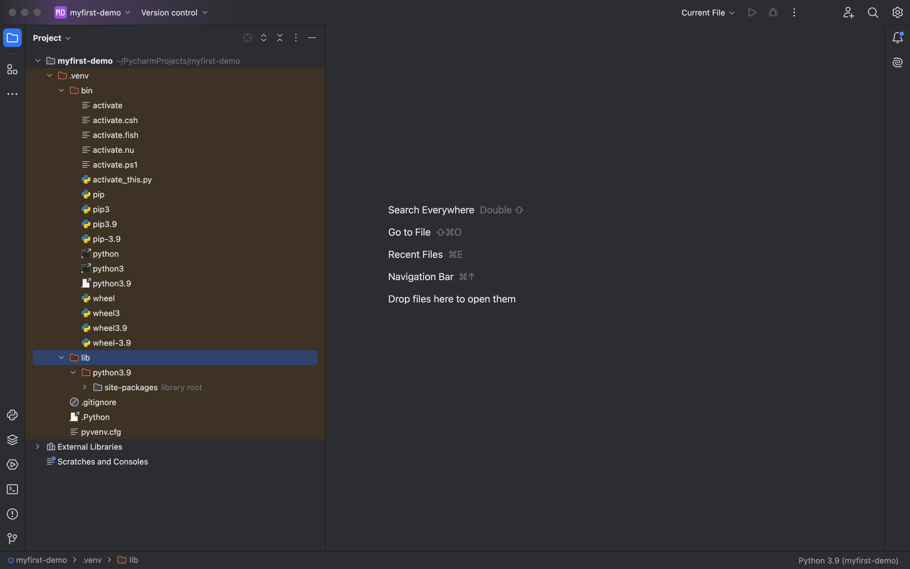
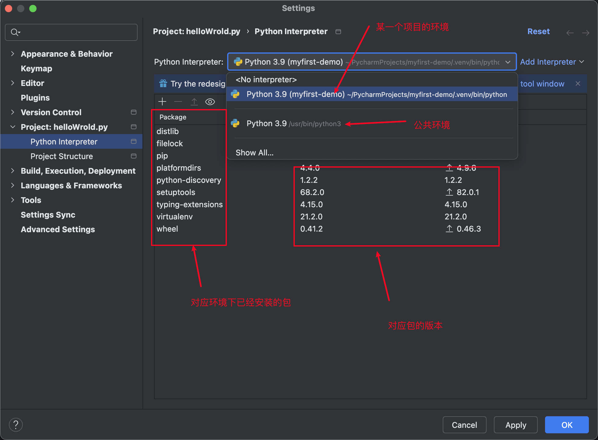

## 1. 介绍

PyCharm 是 JetBrains 旗下专门为 Python 开发者打造的 IDE，能帮助用户更高效地编写、调试和管理代码。从 2025.1 版本开始，PyCharm 已经合并了 Community 和 Professional 版本，核心功能免费提供，Pro 订阅则开放 AI 补全、远程开发等更高级的特性。

---

## 2. 安装与初始设置

### 2.1 安装

- 访问官网：打开 PyCharm 官网 [jetbrains.com/pycharm/](https://www.jetbrains.com/pycharm/)。
- 选择版本：目前 PyCharm 已合并为统一产品，安装后自动获得 30 天的 Pro 试用期，之后核心功能依然免费，用户可以按需选择是否续订 Pro 订阅。
- 运行安装程序：
  - **Windows**：运行 `.exe` 文件，建议勾选 “Add launchers dir to the PATH” 和 “Add 'Open Folder as Project'”。
  - **macOS**：将 `.dmg` 中的 PyCharm 图标拖入 Applications 文件夹。
  - **Linux**：解压 `.tar.gz` 到安装目录，通过 `bin/pycharm.sh` 启动。

### 2.2 首次启动与基础设置

首次打开时，建议按以下步骤配置：

- **中文界面**：进入 `File → Settings → Plugins`，搜索 “Chinese (Simplified) Language Pack” 并安装，界面就会变成简体中文。

- **文件编码**：建议统一使用 UTF-8，在 `Editor → File Encodings` 中将 `Global Encoding`、`Project Encoding` 和 `Default encoding for properties files` 都设置为 `UTF-8`。

- **Python 解释器路径**：首次打开项目时，若系统已有 Python，PyCharm 通常能自动检测；如果没有，可以点击 `Add Interpreter` 手动指定 `python.exe` 路径。

---

## 3. 项目与环境配置

### 3.1 创建新项目

1. 新建项目：在欢迎界面点击 `新建项目`，或者通过 `File → New Project`。
2. 选择项目类型：初学者建议选择 `Pure Python`，它会创建一个空项目。
3. 指定项目位置：在 `Location` 字段设置项目存放的目录，项目名称会自动从文件夹名派生。

4. 配置解释器：建议为每个项目创建独立的虚拟环境（venv），这能避免不同项目间的依赖冲突。
   - **创建新虚拟环境**：在项目创建对话框中选择 `Virtualenv`，从列表中选择基础解释器（即本机已安装的 Python 版本），PyCharm 会自动在项目目录下创建独立的 `venv` 文件夹。
   - **使用现有解释器**：如果已经配置过，可以在 `Custom environment` 中选择 `Select existing`，再指向已有的 Python 可执行文件。
5. 完成创建：点击 `Create`，如果当前已有打开的项目，PyCharm 会询问是在当前窗口关闭并打开新项目，还是在新窗口中打开。

### 3.2 虚拟环境详解

- **为什么要用虚拟环境**：虚拟环境可以将项目的依赖项和 Python 解释器隔离开，让每个项目独立管理自己的依赖，避免版本冲突。

- **如何创建虚拟环境**：
  - 进入 `Settings → Project → Python Interpreter`。
  - 指定基础解释器（即本机已安装的 Python 路径），再设置新环境的存放位置（通常放在项目根目录下）。
  - 如果希望新环境继承全局解释器中已安装的包，可以勾选 `Inherit global site-packages`，一般不建议勾选，以保持环境干净。

- **管理虚拟环境**：在 `Python Interpreter` 界面，可以方便地查看当前环境已安装的包，并通过 `+` 号安装新的包，或点击 `-` 号卸载不再需要的包。

